# Setup


R Version for citation is: R version 3.5.1 (2018-07-02).

## Loading data

```r
# original data
full.data <- read.csv("data/recursion_full.csv", na.strings = c("", " ", "NA", "NA "))
```

Reasons for exclusion and their numbers

```r
full.data %>% dplyr::filter(ExclusionGroup != "include") %>% dplyr::distinct(LadlabID, 
    .keep_all = TRUE) %>% dplyr::group_by(ExclusionGroup) %>% dplyr::summarize(countN = dplyr::n_distinct(LadlabID)) %>% 
    kable()
```


ExclusionGroup         countN
--------------------  -------
age                         5
dnf infinity                4
dnf WCN                     6
experimenter error          3
L1 not english              4
parent interference         1
pilot order                 3


RMS original code for checking who failed practice - do not need to run. EVAL set to FALSE

```r
# check how many failed both practice trials
x <- full.data %>% filter(Task == "WCN" & (TaskItem == 1 | TaskItem == 5)) %>% group_by(LadlabID) %>% 
    summarise(sum = sum(Accuracy)) %>% filter(sum != 3)

# just hardcoding kids because it's easier than going back to the full data frame
# These kids got 1 right, 5 wrong:
one.corr <- as.vector(c("013316-BO", "033616-JM", "030316-ED", "030817-ZI", "031516-A", 
    "033316-JH", "033316-RC", "040317-AL", "040317-SL", "041316-AR", "041316-NC", 
    "041316-VN", "063416-MC"))

five.corr <- as.vector("050617-Z1")

zero.corr <- as.vector(c("030316-AD", "040616-K"))
```

Exclude those who failed the practice trials on What Comes Next Task

```r
# final decision: remove kids who fail 1 trial out of 3 trials, with no
# additional information about whether E reran the failed trial. Removing 8 kids
# in total

# added 033516-ML on 3018-09-03 to the exclusion list. kid had NA data for wcn
# practice trials and 0 correct on test. assume kid failed wcn.

full.data %<>% mutate(ExclusionGroup = ifelse(LadlabID == "033616-JM" | LadlabID == 
    "030316-AD" | LadlabID == "031516-A" | LadlabID == "041316-AR" | LadlabID == 
    "041316-VN" | LadlabID == "033316-RC" | LadlabID == "013316-BO" | LadlabID == 
    "041316-NC" | LadlabID == "033516-ML", "fail wcn", levels(ExclusionGroup)[ExclusionGroup]), 
    ExclusionGroup = as.factor(ExclusionGroup))

# check. good full.data %>% filter(LadlabID == '033616-JM')
```

Let's remove anyone who should not be included in the final dataset.

```r
full.data %<>% dplyr::filter(ExclusionGroup == "include")
```


Now, add in the Productivity classification, IHC, and FHC from PC, JC, and RMS coding


```r
# productivity, fhc, ihc coding from pc, jc, and rms
hc.data <- read.csv("data/HC-datawide-forcoding - hc.datawide.csv") %>% dplyr::select(LadlabID, 
    prod_tomerge, ihc_tomerge, fhc_tomerge, dce, why_productive, sup.times)

full.data <- dplyr::left_join(full.data, hc.data, by = "LadlabID")

full.data %<>% dplyr::rename(Productivity = prod_tomerge, IHC = ihc_tomerge, FHC = fhc_tomerge, 
    DCE = dce) %>% dplyr::mutate(Productivity = factor(Productivity, levels = c("nonprod", 
    "prod"), labels = c("Nonproductive", "Productive")), IHC = ifelse(IHC > 100, 
    100, IHC), FHC = ifelse(FHC > 100, 100, FHC)) %>% mutate(Productivity.tertiary = ifelse(IHC >= 
    99, "Productive (IHC ≥ 99)", ifelse(Productivity == "Productive", "Productive (IHC < 99)", 
    "Nonproductive")))


# do a quick check to make sure we have the same SIDs in each
unique.full <- as.vector(unique(full.data$LadlabID))
unique.hc <- as.vector(unique(hc.data$LadlabID))

tmp <- hc.data %>% dplyr::filter(LadlabID %!in% unique.full)

# good to go - the only kids who are not included in full data are the ones who
# we excluded
```

Add in coding for reminder prompts and recovery from reminders

```r
reminders.data <- read.csv("data/sara-HC-datawide-forcoding - hc.datawide.csv") %>% 
    dplyr::select(LadlabID, reminders.total, reminders.recovered)
full.data <- dplyr::left_join(full.data, reminders.data, by = "LadlabID")
```

## Post-exclusion summary
Number of kids by age group and average age

```r
full.data %>% dplyr::group_by(AgeGroup) %>% dplyr::summarize(sumAge = n_distinct(LadlabID)) %>% 
    kable()
```


AgeGroup    sumAge
---------  -------
4-4.5y          35
4.5-5y          31
5-5.5y          32
5.5-6y          29

```r
full.data %>% dplyr::distinct(LadlabID, .keep_all = TRUE) %>% dplyr::summarize(minAge = min(Age), 
    maxAge = max(Age), meanAge = mean(Age), sdAge = sd(Age)) %>% kable(digits = 3)
```


 minAge   maxAge   meanAge   sdAge
-------  -------  --------  ------
      4     5.99     4.975   0.573

Number of kids who were classified as decade productive & nonproductive

```r
full.data %>% dplyr::distinct(LadlabID, Productivity, Age) %>% dplyr::group_by(Productivity) %>% 
    dplyr::summarise(n = n(), meanage = mean(Age, na.rm = TRUE), sdage = sd(Age, 
        na.rm = TRUE), minage = min(Age, na.rm = TRUE), maxage = max(Age, na.rm = TRUE)) %>% 
    kable(digits = 3)
```


Productivity      n   meanage   sdage   minage   maxage
--------------  ---  --------  ------  -------  -------
Nonproductive    54     4.585   0.408     4.00     5.61
Productive       73     5.262   0.505     4.18     5.99

Number of kids for the 3-way productivity classification

```r
full.data %>% dplyr::distinct(LadlabID, Productivity.tertiary, Age) %>% dplyr::group_by(Productivity.tertiary) %>% 
    dplyr::summarise(n = n(), meanage = mean(Age, na.rm = TRUE), sdage = sd(Age, 
        na.rm = TRUE), minage = min(Age, na.rm = TRUE), maxage = max(Age, na.rm = TRUE)) %>% 
    kable(digits = 3)
```


Productivity.tertiary     n   meanage   sdage   minage   maxage
----------------------  ---  --------  ------  -------  -------
Nonproductive            54     4.585   0.408     4.00     5.61
Productive (IHC < 99)    41     5.221   0.482     4.25     5.99
Productive (IHC ≥ 99)    32     5.316   0.536     4.18     5.99

Reasons for productivity classification

```r
full.data %>% dplyr::distinct(LadlabID, Productivity.tertiary, why_productive) %>% 
    dplyr::group_by(Productivity.tertiary, why_productive) %>% tally() %>% spread(Productivity.tertiary, 
    n)
```

```
## # A tibble: 7 x 4
##   why_productive          Nonproductive `Productive (IHC… `Productive (IHC…
##   <fct>                           <int>             <int>             <int>
## 1 count at least two dec…            NA                32                NA
## 2 count to 99 on their o…            NA                 9                32
## 3 more than 3 errors bef…             1                NA                NA
## 4 multiple errors before…             5                NA                NA
## 5 no improvement from dce            11                NA                NA
## 6 not enough improvement…             6                NA                NA
## 7 stopped mid decade                 31                NA                NA
```


Just for reference, this is the number of kids who switched classifications from PC, JC, RMS recode

```r
full.data %>% dplyr::filter(TaskType == "productivity") %>% droplevels() %>% dplyr::distinct(LadlabID, 
    Response, Productivity) %>% dplyr::mutate(Response = factor(Response, levels = c("nonprod", 
    "prod"), labels = c("Nonproductive", "Productive"))) %>% dplyr::mutate(changed_classification = ifelse((is.na(Response) & 
    Productivity == "Nonproductive"), "NA_toNonprod", ifelse((is.na(Response) & Productivity == 
    "Productive"), "NA_toProd", ifelse((Response == "Nonproductive" & Productivity == 
    "Productive"), "Nonprod_toProd", ifelse((Response == "Productive" & Productivity == 
    "Nonproductive"), "Prod_toNonprod", "no_change"))))) %>% dplyr::group_by(changed_classification) %>% 
    dplyr::summarise(n = n())
```

```
## # A tibble: 4 x 2
##   changed_classification     n
##   <chr>                  <int>
## 1 NA_toNonprod              40
## 2 NA_toProd                  1
## 3 no_change                 85
## 4 Nonprod_toProd             1
```

## Calculate Productivity gradient

```r
full.data %<>% mutate(delta.hc = FHC - IHC, prod.gradient = case_when(IHC >= 99 ~ 
    1, IHC < 99 & FHC >= 100 ~ 1, IHC < 99 & FHC < 100 ~ delta.hc/(99 - IHC)))
```

***
# Highest Count Descriptives

## Summary descriptives 
Average of IHC, DCE, and FHC for all kids

```r
full.data %>% dplyr::distinct(LadlabID, IHC, DCE, FHC, delta.hc, prod.gradient, sup.times) %>% 
    dplyr::summarise_at(c("IHC", "DCE", "FHC", "delta.hc", "prod.gradient", "sup.times"), 
        list(~mean(., na.rm = T), ~sd(., na.rm = T), ~median(., na.rm = T), ~min(., 
            na.rm = T), ~max(., na.rm = T), ~sum(!is.na(.)))) %>% gather(stat, val) %>% 
    separate(stat, into = c("var", "stat"), sep = "_") %>% spread(stat, val) %>% 
    dplyr::select(var, n = sum, mean, sd, median, min, max) %>% kable(digits = 3)
```


var                n     mean       sd   median   min   max
--------------  ----  -------  -------  -------  ----  ----
DCE               54   43.815   17.017       39    19    99
delta.hc         127   19.921   24.717        6     0    86
FHC              127   68.913   35.709       99     5   100
IHC              127   48.992   33.881       39     5   100
prod.gradient    127    0.599    0.451        1     0     1
sup.times         52    2.635    1.704        2     1     7

Similar data by decade productivity

```r
full.data %>% dplyr::distinct(LadlabID, Productivity, IHC, DCE, FHC, delta.hc, prod.gradient, 
    sup.times) %>% group_by(Productivity) %>% dplyr::summarise_at(c("IHC", "DCE", 
    "FHC", "delta.hc", "prod.gradient", "sup.times"), list(~mean(., na.rm = T), ~sd(., 
    na.rm = T), ~median(., na.rm = T), ~min(., na.rm = T), ~max(., na.rm = T), ~sum(!is.na(.)))) %>% 
    gather(stat, val, -Productivity) %>% separate(stat, into = c("var", "stat"), 
    sep = "_") %>% spread(stat, val) %>% dplyr::select(Productivity, var, n = sum, 
    mean, sd, median, min, max) %>% kable(digits = 3)
```


Productivity    var               n     mean       sd   median      min   max
--------------  --------------  ---  -------  -------  -------  -------  ----
Nonproductive   DCE              19   30.579    8.342       29   19.000    49
Nonproductive   delta.hc         54    9.074   15.475        0    0.000    86
Nonproductive   FHC              54   30.704   17.754       29    5.000   100
Nonproductive   IHC              54   21.630   14.234       15    5.000    77
Nonproductive   prod.gradient    54    0.108    0.180        0    0.000     1
Nonproductive   sup.times        20    1.350    0.587        1    1.000     3
Productive      DCE              35   51.000   16.234       49   29.000    99
Productive      delta.hc         73   27.945   27.190       31    0.000    78
Productive      FHC              73   97.178    9.719      100   49.000   100
Productive      IHC              73   69.233   29.712       65   14.000   100
Productive      prod.gradient    73    0.963    0.130        1    0.286     1
Productive      sup.times        32    3.438    1.684        3    1.000     7

Again by 3-way decade productivity

```r
full.data %>% dplyr::distinct(LadlabID, Productivity.tertiary, IHC, DCE, FHC, delta.hc, 
    prod.gradient, sup.times) %>% group_by(Productivity.tertiary) %>% dplyr::summarise_at(c("IHC", 
    "DCE", "FHC", "delta.hc", "prod.gradient", "sup.times"), list(~mean(., na.rm = T), 
    ~sd(., na.rm = T), ~median(., na.rm = T), ~min(., na.rm = T), ~max(., na.rm = T), 
    ~sum(!is.na(.)))) %>% gather(stat, val, -Productivity.tertiary) %>% separate(stat, 
    into = c("var", "stat"), sep = "_") %>% spread(stat, val) %>% dplyr::select(Productivity.tertiary, 
    var, n = sum, mean, median, sd, min, max) %>% kable(digits = 3)
```


Productivity.tertiary   var               n     mean   median       sd      min    max
----------------------  --------------  ---  -------  -------  -------  -------  -----
Nonproductive           DCE              19   30.579       29    8.342   19.000     49
Nonproductive           delta.hc         54    9.074        0   15.475    0.000     86
Nonproductive           FHC              54   30.704       29   17.754    5.000    100
Nonproductive           IHC              54   21.630       15   14.234    5.000     77
Nonproductive           prod.gradient    54    0.108        0    0.180    0.000      1
Nonproductive           sup.times        20    1.350        1    0.587    1.000      3
Productive (IHC < 99)   DCE              34   49.588       49   14.130   29.000     89
Productive (IHC < 99)   delta.hc         41   49.756       51   14.778   20.000     78
Productive (IHC < 99)   FHC              41   95.000      100   12.606   49.000    100
Productive (IHC < 99)   IHC              41   45.244       49   15.603   14.000     79
Productive (IHC < 99)   prod.gradient    41    0.934        1    0.168    0.286      1
Productive (IHC < 99)   sup.times        32    3.438        3    1.684    1.000      7
Productive (IHC ≥ 99)   DCE               1   99.000       99       NA   99.000     99
Productive (IHC ≥ 99)   delta.hc         32    0.000        0    0.000    0.000      0
Productive (IHC ≥ 99)   FHC              32   99.969      100    0.177   99.000    100
Productive (IHC ≥ 99)   IHC              32   99.969      100    0.177   99.000    100
Productive (IHC ≥ 99)   prod.gradient    32    1.000        1    0.000    1.000      1
Productive (IHC ≥ 99)   sup.times         0      NaN       NA       NA      Inf   -Inf

## Histogram

### Fig 1

Plotting distribution of IHC, as a function of productivity (~ junyi's graph)

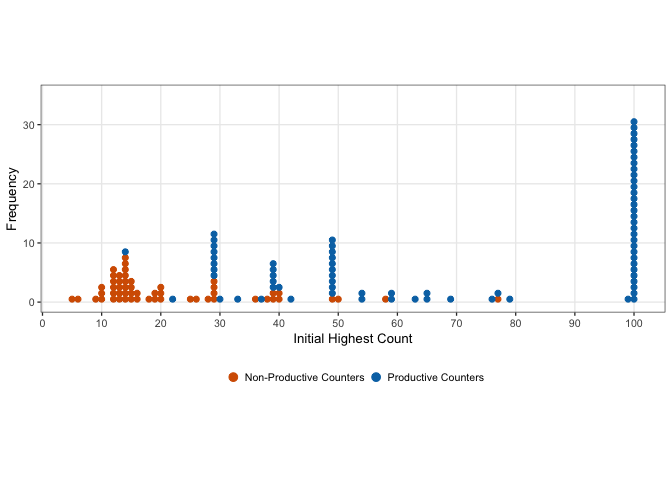<!-- -->

```
## Saving 7 x 5 in image
```

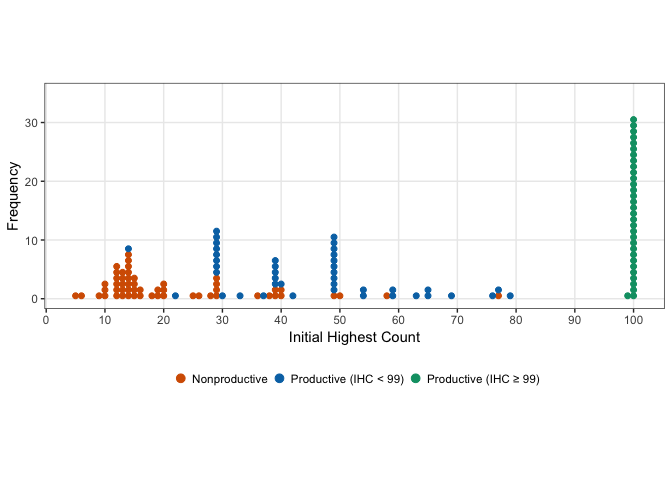<!-- -->

```
## Saving 7 x 5 in image
```

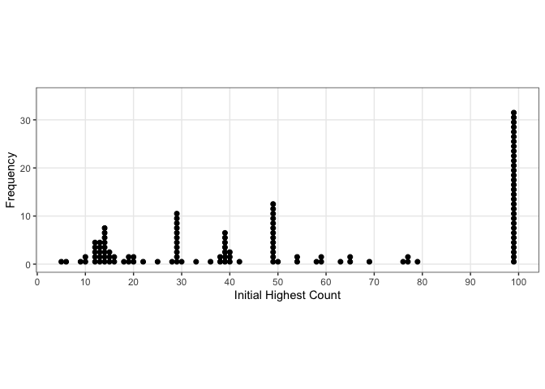<!-- -->

```
## Saving 7 x 5 in image
```

### by age
Plotting productivity as a function of age in months

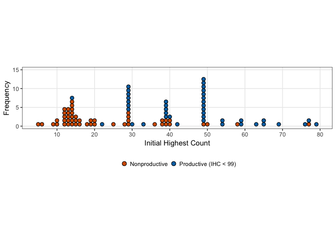<!-- -->

```
## Saving 7 x 5 in image
```

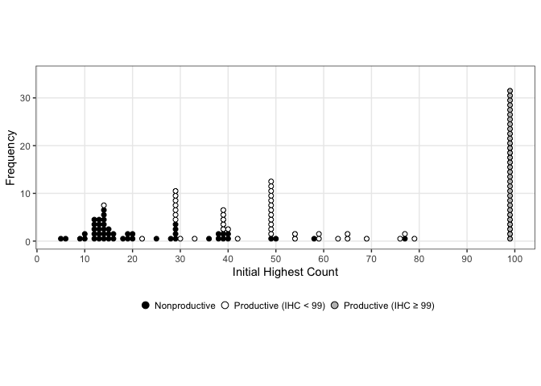<!-- -->

## Distance between IHC and FHC

Restructure data to plot distance between IHC, DCE, and FHC

```r
hc.dev.data <- full.data %>% dplyr::select(LadlabID, Age, Productivity, IHC, DCE, 
    FHC, prod.gradient) %>% gather(hcprogression, hc, IHC:FHC) %>% mutate(hcprogression = factor(hcprogression, 
    levels = c("IHC", "DCE", "FHC"))) %>% dplyr::rename(`Highest Count Coding` = hcprogression)

hc.dev.prod <- subset(hc.dev.data, Productivity == "Productive")
hc.dev.nonprod <- subset(hc.dev.data, Productivity == "Nonproductive")
```

### Fig 3a/b
Separate graphs for productivity groups, sorted by ascending IHC. One participant was coded as non-productive despite having an FHC of 100 because they made more than 3 errors.
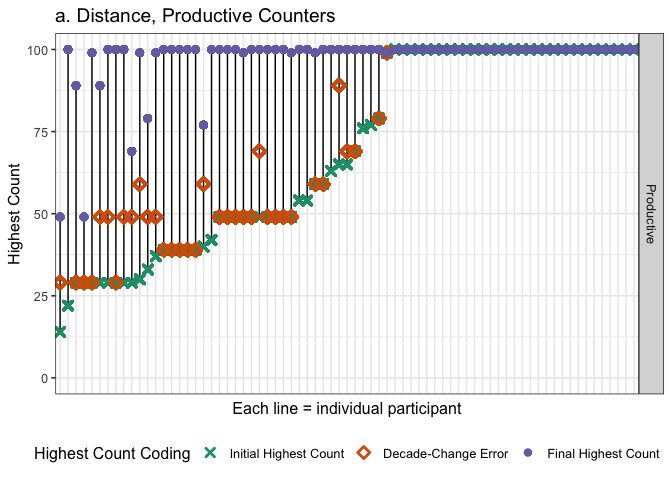<!-- -->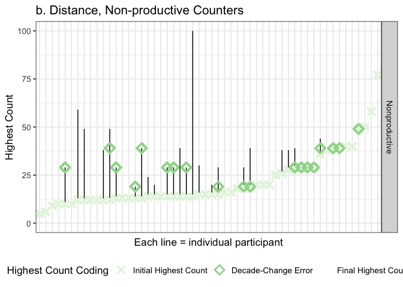<!-- -->

Number of kids who counted to 99+ spontaneously on IHC plus those whose FHC = 99+ without prompting

```r
# full.data %>% filter(IHC > 98) %>% distinct(LadlabID, IHC, FHC,
# HCReceivedSupport) %>% count() #n=33 but some kids made errors past IHC but < 3
# so need to account for that
full.data %>% filter(FHC > 98 & (is.na(HCReceivedSupport) | HCReceivedSupport != 
    1)) %>% distinct(LadlabID, IHC, FHC, HCReceivedSupport) %>% count()  #n =43
```

```
## # A tibble: 1 x 1
##       n
##   <int>
## 1    42
```

## Decade prompts

Check coding sheet against 'supported.times' coding. Print conflicts. Use "sup.times" instead.
- 030116-PW & 041416-BF: Experimenter should not have provided prompts, multiple errors before first DCE
- 063416-MC: Experimenter's prompts are 100 and 110, should not count.

```r
full.data %>% filter(TaskItem == "times") %>% distinct(LadlabID, HCReceivedSupport, 
    TaskItem, Response, sup.times, Productivity) %>% mutate(Response = as.integer(levels(Response)[Response])) %>% 
    filter(is.na(sup.times) & !is.na(Response) | is.na(Response) & !is.na(sup.times) | 
        sup.times > Response | sup.times < Response) %>% kable()
```


LadlabID    HCReceivedSupport   TaskItem    Response   sup.times  Productivity  
----------  ------------------  ---------  ---------  ----------  --------------
030116-PW   1                   times              6          NA  Nonproductive 
041416-BF   0                   times              2          NA  Nonproductive 
062416-MC   0                   times              2          NA  Productive    

Average number of decade prompts provided. Productive counters first. Analyze from raw data:

```r
full.data %>% distinct(LadlabID, sup.times, Productivity.tertiary) %>% group_by(Productivity.tertiary) %>% 
    summarise(n = n(), n.sup = sum(sup.times > 0, na.rm = TRUE), mean = mean(sup.times, 
        na.rm = TRUE), sd = sd(sup.times, na.rm = TRUE), min = min(sup.times, na.rm = TRUE), 
        max = max(sup.times, na.rm = TRUE)) %>% kable(digits = 3)
```


Productivity.tertiary     n   n.sup    mean      sd   min    max
----------------------  ---  ------  ------  ------  ----  -----
Nonproductive            54      20   1.350   0.587     1      3
Productive (IHC < 99)    41      32   3.438   1.684     1      7
Productive (IHC ≥ 99)    32       0     NaN     NaN   Inf   -Inf

```r
# assume 0 = NA error in supported.times coding, should only count to 90 but one
# kid got prompted with 100 and 110 and times should be 0
```

## Reminder prompts
How many kids have coded data for receiving reminders?

```r
full.data %>% dplyr::select(LadlabID, Productivity, reminders.total, reminders.recovered) %>% 
    unique() %>% na.omit() %>% summarise(Ncoded = n(), total.min = min(reminders.total), 
    total.max = max(reminders.total), total.mean = mean(reminders.total), total.median = median(reminders.total))
```

```
##   Ncoded total.min total.max total.mean total.median
## 1     84         0         5    1.27381            1
```

How often did kids miss a reminder? Remember that the experiment ended when kids failed to recover from a reminder, unless that failure occured at a decade transition in which case the experimenter would provide a decade prompt and continue the experiment. 

```r
full.data %>% dplyr::select(LadlabID, Productivity, reminders.total, reminders.recovered) %>% 
    unique() %>% na.omit() %>% mutate(missed = reminders.total - reminders.recovered) %>% 
    summarise(Ncoded = n(), missed.min = min(missed), missed.max = max(missed), missed.mean = mean(missed), 
        missed.median = median(missed)) %>% kable(digits = 3)
```


 Ncoded   missed.min   missed.max   missed.mean   missed.median
-------  -----------  -----------  ------------  --------------
     84            0            1         0.179               0

```r
# look at proportion of kids who failed to recover from reminders.
full.data %>% dplyr::select(LadlabID, Productivity, reminders.total, reminders.recovered) %>% 
    unique() %>% na.omit() %>% mutate(missed = reminders.total - reminders.recovered) %>% 
    group_by(reminders.total) %>% summarise(Nkids = n(), N.kids.missed = sum(missed), 
    Perc.kids.missed = sum(missed)/n()) %>% kable(digits = 3)
```


 reminders.total   Nkids   N.kids.missed   Perc.kids.missed
----------------  ------  --------------  -----------------
               0      25               0              0.000
               1      31              11              0.355
               2      16               3              0.188
               3       7               0              0.000
               4       2               0              0.000
               5       3               1              0.333


# What Comes Next Descriptives

First check if Accuracy column in full.data is coded correctly. Good to go.

```r
wcn.data <- full.data %>% filter(Task == "WCN")

wcn.data %<>% mutate(Response_num = as.numeric(as.character(Response)), TaskItem_num = as.numeric(as.character(TaskItem)), 
    Accuracy_check = ifelse(Response_num == (TaskItem_num + 1), 1, 0), Accuracy_valid = ifelse(Accuracy == 
        Accuracy_check, TRUE, FALSE))

validate <- function() {
    validation <- wcn.data %>% filter(Accuracy_valid == FALSE)
    if (length(validation$LadlabID) > 0) {
        print("WARNING: CHECK CODING")
    } else {
        print("All coding correct")
    }
}

validate()
```

```
## [1] "All coding correct"
```

Add overall accuracy to the dataframe.

```r
wcn.accuracy <- wcn.data %>% filter(TaskType != "practice") %>% filter(TaskType == 
    "immediate") %>% group_by(LadlabID) %>% mutate(wcnscore = sum(Accuracy, na.rm = TRUE)) %>% 
    dplyr::select(LadlabID, wcnscore) %>% unique()

wcn.data <- left_join(wcn.data, wcn.accuracy, by = "LadlabID")
```

Immediate vs. Momentum trials: Children were provided with momentum trials if they got wrong on immediate trials. Check %trials where immediate = wrong, momentum = right

```r
wcn.wide <- wcn.data %>%
  filter(TaskType != "practice") %>%
  filter(TaskItem != 3) %>% # a trial on 3 for momentum that doesn't exist for immediate
  droplevels()%>%
  dplyr::select(LadlabID, Age, AgeGroup, TaskType, TaskItem, Accuracy, Productivity, prod.gradient) %>%
  spread(TaskType, Accuracy)

# data check: some kids got 1 for immediate but 0 for momentum or 1 for immediate and 1 for momentum (N = 5).Keeping them. 
## for reference, pulling out these kids below
full.data %>%
  filter(Task == "WCN", 
         TaskType == "momentum" | TaskType == "immediate")%>%
  dplyr::select(LadlabID, Age, AgeGroup, TaskType, TaskItem, Accuracy) %>%
  spread(TaskType, Accuracy)%>%
  mutate(issue_immediate1Momentum0 = ifelse(immediate == 1 & momentum == 0, TRUE, FALSE), 
         issue_immediate1Momentum1 = ifelse(immediate == 1 & momentum == 1, TRUE, FALSE))%>%
  filter(issue_immediate1Momentum0 == TRUE | 
           issue_immediate1Momentum1 == TRUE)
```

```
##    LadlabID  Age AgeGroup TaskItem immediate momentum
## 1 011216-WB 4.44   4-4.5y       59         1        1
## 2 012316-BO 4.46   4-4.5y       29         1        1
## 3 022616-AG 4.32   4-4.5y       37         1        1
## 4 031616-RP 4.84   4.5-5y       23         1        1
## 5 041316-CC 4.36   4-4.5y       62         1        0
## 6 111117-VK 5.87   5.5-6y       29         1        1
##   issue_immediate1Momentum0 issue_immediate1Momentum1
## 1                     FALSE                      TRUE
## 2                     FALSE                      TRUE
## 3                     FALSE                      TRUE
## 4                     FALSE                      TRUE
## 5                      TRUE                     FALSE
## 6                     FALSE                      TRUE
```

```r
# how many kids show improved performance
xtabs(~immediate + momentum, data = wcn.wide, na.action = na.pass, exclude = NULL)
```

```
##          momentum
## immediate   0   1 <NA>
##      0    289 183   15
##      1      1   5  522
##      <NA>   1   0    0
```

```r
# 191 / 1048 trials = ~ 18%. NOTE % not by kids but by trials.
```

## Percent Correct on WCN 

```r
wcn.data %>% dplyr::distinct(LadlabID, wcnscore) %>% dplyr::summarise(n = n(), avg.wcn = mean(wcnscore)/8, 
    sd.wcn = sd(wcnscore)/8) %>% kable(digits = 3)
```


   n   avg.wcn   sd.wcn
----  --------  -------
 127      0.52    0.348

```r
# Productivity
wcn.data %>% dplyr::distinct(LadlabID, Productivity, wcnscore) %>% group_by(Productivity) %>% 
    dplyr::summarise(n = n(), avg.wcn = mean(wcnscore)/8, sd.wcn = sd(wcnscore)/8) %>% 
    kable(digits = 3)
```


Productivity      n   avg.wcn   sd.wcn
--------------  ---  --------  -------
Nonproductive    54     0.259    0.257
Productive       73     0.712    0.274

```r
# Productivity 3-ways
wcn.data %>% dplyr::distinct(LadlabID, Productivity.tertiary, wcnscore) %>% group_by(Productivity.tertiary) %>% 
    dplyr::summarise(n = n(), avg.wcn = mean(wcnscore)/8, sd.wcn = sd(wcnscore)/8) %>% 
    kable(digits = 3)
```


Productivity.tertiary     n   avg.wcn   sd.wcn
----------------------  ---  --------  -------
Nonproductive            54     0.259    0.257
Productive (IHC < 99)    41     0.561    0.255
Productive (IHC ≥ 99)    32     0.906    0.145

T-test

```r
wcn.data %>% dplyr::distinct(LadlabID, Productivity, wcnscore) %>% t.test(wcnscore ~ 
    Productivity, data = .)
```

```
## 
## 	Welch Two Sample t-test
## 
## data:  wcnscore by Productivity
## t = -9.5558, df = 118.12, p-value = 2.245e-16
## alternative hypothesis: true difference in means is not equal to 0
## 95 percent confidence interval:
##  -4.375677 -2.873435
## sample estimates:
## mean in group Nonproductive    mean in group Productive 
##                    2.074074                    5.698630
```


Plotting %corr on WCN as function of productivity

```r
wcn.data %>% dplyr::filter(TaskType == "immediate") %>% dplyr::group_by(LadlabID, 
    Productivity, prod.gradient) %>% dplyr::summarize(avg.wcn = mean(Accuracy, na.rm = TRUE), 
    sd.wcn = sd(Accuracy, na.rm = TRUE)) %>% ggplot(aes(x = Productivity, y = avg.wcn, 
    fill = factor(Productivity))) + stat_summary(fun.y = mean, position = position_dodge(width = 0.95), 
    geom = "bar", alpha = 0.8, colour = "black") + geom_violin(alpha = 0.3) + stat_summary(fun.data = mean_se, 
    geom = "errorbar", position = position_dodge(width = 0.9), width = 0.3) + # scale_fill_discrete(name = 'Productivity') +
scale_fill_manual(name = "Productivity", values = mypalette, guide = "none") + scale_colour_brewer(palette = "Greys") + 
    ylab("Proportion Correct") + xlab("Productivity") + theme_bw(base_size = 13) + 
    theme(legend.position = "none", panel.grid.major = element_blank(), panel.grid.minor = element_blank()) + 
    theme(text = element_text(size = 13)) + ylim(0, 1)
```

<!-- -->

```r
ggsave("graphs/wcn-percentcorr.png")
```

```
## Saving 7 x 5 in image
```

### Fig 3
Jess graph

```r
fig3.data <- wcn.data %>%
  filter(TaskType == "immediate")%>%
  mutate(TaskItem_type= ifelse(mod(TaskItem_num,10)==9, "Decade transition", "Mid-decade")) %>%
  mutate(TaskItem_type_ordered = ordered(TaskItem_type, levels=c("Mid-decade", "Decade transition")))

fig3.data %>%
  group_by(TaskItem_type_ordered, TaskItem, Productivity.tertiary)%>%
   summarise(mean = mean(Accuracy, na.rm = TRUE), 
            n = n(), 
            sd = sd(Accuracy, na.rm = TRUE), 
            se = sd/sqrt(n)) %>%
  ggplot(aes(x = factor(TaskItem), y = mean, colour = Productivity.tertiary, group= Productivity.tertiary)) +
  geom_point(size = 3.5) + 
  geom_line(size = .7) +
  geom_errorbar(aes(ymin = mean - se, ymax = mean + se), 
                width = 0, size = .5) +
  facet_grid(~TaskItem_type_ordered, scales = "free_x") +#, space = "free_x") +
  theme_bw(base_size = 13) + 
  scale_colour_manual(values = mypalette) +
  theme(legend.position = "right", legend.title = element_blank()) +
  labs(x = "Task item", y = "Mean performance") +
  theme(axis.text.x = element_text(angle = 45, hjust = 1))
```

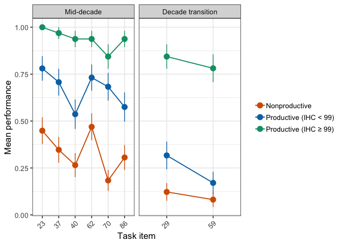<!-- -->

```r
        #, strip.text=element_text(margin=margin(t=5, b=5, l=30, r=30)))
ggsave('graphs/wcn-trial-accuracy.png',
       width=7, height=4)
```

Get summary statistics by productivity and item type

Productivity.tertiary     mean      sd    n
----------------------  ------  ------  ---
Nonproductive            0.259   0.257   54
Productive (IHC < 99)    0.562   0.254   41
Productive (IHC ≥ 99)    0.906   0.145   32


Productivity.tertiary   TaskItem_type         mean      sd    n
----------------------  ------------------  ------  ------  ---
Nonproductive           Decade transition    0.102   0.225   54
Nonproductive           Mid-decade           0.312   0.321   54
Productive (IHC < 99)   Decade transition    0.244   0.356   41
Productive (IHC < 99)   Mid-decade           0.669   0.278   41
Productive (IHC ≥ 99)   Decade transition    0.812   0.354   32
Productive (IHC ≥ 99)   Mid-decade           0.938   0.118   32

## Item magnitude
### Remove IHC=99

Build dataframe and mean-center IHC and age, and use weighted effect coding for Productivity.

```r
# Only for productive IHC < 99 and nonproductive
fig3.modelA.df <- fig3.data %>% filter(Productivity.tertiary != "Productive (IHC ≥ 99)") %>% 
    dplyr::select(c(LadlabID, IHC, Age, Productivity.tertiary, TaskItem_num, TaskItem_type, 
        Accuracy)) %>% mutate(Productivity.tertiary = as.factor(Productivity.tertiary), 
    IHC = as.integer(IHC), LadlabID = as.factor(LadlabID), TaskItem_type = as.factor(TaskItem_type)) %>% 
    mutate(IHC.c = as.vector(scale(IHC, center = TRUE, scale = TRUE)), age.c = as.vector(scale(Age, 
        center = TRUE, scale = TRUE)))
# weighted effect coding
wec <- mean(as.numeric(fig3.modelA.df$Productivity.tertiary) - 1)
contrasts(fig3.modelA.df$Productivity.tertiary) <- c(-wec, 1 - wec)
wec <- mean(as.numeric(fig3.modelA.df$TaskItem_type) - 1)
contrasts(fig3.modelA.df$TaskItem_type) <- c(-wec, 1 - wec)
# structure
str(fig3.modelA.df)
```

```
## 'data.frame':	760 obs. of  9 variables:
##  $ LadlabID             : Factor w/ 95 levels "010516-K4","011216-KD1",..: 1 1 1 1 1 1 1 1 2 2 ...
##  $ IHC                  : int  13 13 13 13 13 13 13 13 5 5 ...
##  $ Age                  : num  4.17 4.17 4.17 4.17 4.17 4.17 4.17 4.17 4 4 ...
##  $ Productivity.tertiary: Factor w/ 2 levels "Nonproductive",..: 1 1 1 1 1 1 1 1 1 1 ...
##   ..- attr(*, "contrasts")= num [1:2, 1] -0.432 0.568
##   .. ..- attr(*, "dimnames")=List of 2
##   .. .. ..$ : chr  "Nonproductive" "Productive (IHC < 99)"
##   .. .. ..$ : NULL
##  $ TaskItem_num         : num  23 40 62 70 37 29 86 59 23 40 ...
##  $ TaskItem_type        : Factor w/ 2 levels "Decade transition",..: 2 2 2 2 2 1 2 1 2 2 ...
##   ..- attr(*, "contrasts")= num [1:2, 1] -0.75 0.25
##   .. ..- attr(*, "dimnames")=List of 2
##   .. .. ..$ : chr  "Decade transition" "Mid-decade"
##   .. .. ..$ : NULL
##  $ Accuracy             : int  0 0 0 0 0 0 0 0 0 0 ...
##  $ IHC.c                : num  -1 -1 -1 -1 -1 ...
##  $ age.c                : num  -1.28 -1.28 -1.28 -1.28 -1.28 ...
```

#### Productivity effect

```r
fig3.modelA.ihc <- glmer(Accuracy ~ IHC.c + age.c + (1 | TaskItem_num) + (1 | LadlabID), 
    family = "binomial", data = fig3.modelA.df)
fig3.modelA.prod <- glmer(Accuracy ~ Productivity.tertiary + IHC.c + age.c + (1 | 
    TaskItem_num) + (1 | LadlabID), family = "binomial", data = fig3.modelA.df)
# LRT tests for productivity effect vs. base
anova(fig3.modelA.ihc, fig3.modelA.prod, test = "LRT")
```

```
## Data: fig3.modelA.df
## Models:
## fig3.modelA.ihc: Accuracy ~ IHC.c + age.c + (1 | TaskItem_num) + (1 | LadlabID)
## fig3.modelA.prod: Accuracy ~ Productivity.tertiary + IHC.c + age.c + (1 | TaskItem_num) + 
## fig3.modelA.prod:     (1 | LadlabID)
##                  Df    AIC    BIC  logLik deviance Chisq Chi Df Pr(>Chisq)
## fig3.modelA.ihc   5 796.80 819.96 -393.40   786.80                        
## fig3.modelA.prod  6 795.23 823.02 -391.61   783.23 3.575      1    0.05866
##                   
## fig3.modelA.ihc   
## fig3.modelA.prod .
## ---
## Signif. codes:  0 '***' 0.001 '**' 0.01 '*' 0.05 '.' 0.1 ' ' 1
```


#### Item type (mid or cross decade)

```r
fig3.modelA.main <- glmer(Accuracy ~ Productivity.tertiary + TaskItem_type + IHC.c + 
    age.c + (1 | TaskItem_num) + (1 | LadlabID), family = "binomial", data = fig3.modelA.df)
# LRT test for itemtype main effect
anova(fig3.modelA.main, fig3.modelA.prod, test = "LRT")
```

```
## Data: fig3.modelA.df
## Models:
## fig3.modelA.prod: Accuracy ~ Productivity.tertiary + IHC.c + age.c + (1 | TaskItem_num) + 
## fig3.modelA.prod:     (1 | LadlabID)
## fig3.modelA.main: Accuracy ~ Productivity.tertiary + TaskItem_type + IHC.c + age.c + 
## fig3.modelA.main:     (1 | TaskItem_num) + (1 | LadlabID)
##                  Df    AIC    BIC  logLik deviance  Chisq Chi Df
## fig3.modelA.prod  6 795.23 823.02 -391.61   783.23              
## fig3.modelA.main  7 785.18 817.61 -385.59   771.18 12.047      1
##                  Pr(>Chisq)    
## fig3.modelA.prod               
## fig3.modelA.main  0.0005188 ***
## ---
## Signif. codes:  0 '***' 0.001 '**' 0.01 '*' 0.05 '.' 0.1 ' ' 1
```

Test of interaction (n.s.): Regression testing for interaction of productivity and decade/non-decade item type on WCN accuracy

```r
fig3.modelA.full <- glmer(Accuracy ~ Productivity.tertiary + TaskItem_type + Productivity.tertiary:TaskItem_type + 
    IHC.c + age.c + (1 | TaskItem_num) + (1 | LadlabID), family = "binomial", data = fig3.modelA.df)
# LRT test for interaction effect
anova(fig3.modelA.full, fig3.modelA.main, test = "LRT")
```

```
## Data: fig3.modelA.df
## Models:
## fig3.modelA.main: Accuracy ~ Productivity.tertiary + TaskItem_type + IHC.c + age.c + 
## fig3.modelA.main:     (1 | TaskItem_num) + (1 | LadlabID)
## fig3.modelA.full: Accuracy ~ Productivity.tertiary + TaskItem_type + Productivity.tertiary:TaskItem_type + 
## fig3.modelA.full:     IHC.c + age.c + (1 | TaskItem_num) + (1 | LadlabID)
##                  Df    AIC    BIC  logLik deviance  Chisq Chi Df
## fig3.modelA.main  7 785.18 817.61 -385.59   771.18              
## fig3.modelA.full  8 785.84 822.89 -384.92   769.84 1.3447      1
##                  Pr(>Chisq)
## fig3.modelA.main           
## fig3.modelA.full     0.2462
```

```r
# summary(fig3.modelA.full)
```

Test of main effects:

```r
drop1(fig3.modelA.main, test = "Chisq")
```

```
## Single term deletions
## 
## Model:
## Accuracy ~ Productivity.tertiary + TaskItem_type + IHC.c + age.c + 
##     (1 | TaskItem_num) + (1 | LadlabID)
##                       Df    AIC     LRT   Pr(Chi)    
## <none>                   785.18                      
## Productivity.tertiary  1 786.75  3.5702 0.0588238 .  
## TaskItem_type          1 795.23 12.0468 0.0005188 ***
## IHC.c                  1 798.67 15.4893 8.297e-05 ***
## age.c                  1 783.24  0.0601 0.8063686    
## ---
## Signif. codes:  0 '***' 0.001 '**' 0.01 '*' 0.05 '.' 0.1 ' ' 1
```

Final model

```r
summary(fig3.modelA.main)
```

```
## Generalized linear mixed model fit by maximum likelihood (Laplace
##   Approximation) [glmerMod]
##  Family: binomial  ( logit )
## Formula: 
## Accuracy ~ Productivity.tertiary + TaskItem_type + IHC.c + age.c +  
##     (1 | TaskItem_num) + (1 | LadlabID)
##    Data: fig3.modelA.df
## 
##      AIC      BIC   logLik deviance df.resid 
##    785.2    817.6   -385.6    771.2      752 
## 
## Scaled residuals: 
##     Min      1Q  Median      3Q     Max 
## -2.8589 -0.5048 -0.2495  0.5341  7.3634 
## 
## Random effects:
##  Groups       Name        Variance Std.Dev.
##  LadlabID     (Intercept) 1.4904   1.2208  
##  TaskItem_num (Intercept) 0.1903   0.4362  
## Number of obs: 759, groups:  LadlabID, 95; TaskItem_num, 8
## 
## Fixed effects:
##                        Estimate Std. Error z value Pr(>|z|)    
## (Intercept)            -0.78978    0.22756  -3.471 0.000519 ***
## Productivity.tertiary1  0.82131    0.43439   1.891 0.058662 .  
## TaskItem_type1          2.22877    0.45068   4.945 7.60e-07 ***
## IHC.c                   0.86805    0.21846   3.973 7.08e-05 ***
## age.c                   0.05159    0.21033   0.245 0.806246    
## ---
## Signif. codes:  0 '***' 0.001 '**' 0.01 '*' 0.05 '.' 0.1 ' ' 1
## 
## Correlation of Fixed Effects:
##             (Intr) Prdc.1 TskI_1 IHC.c 
## Prdctvty.t1 -0.038                     
## TskItm_typ1 -0.087  0.034              
## IHC.c       -0.058 -0.371  0.074       
## age.c       -0.004 -0.364  0.005 -0.334
```

```r
plot_model(fig3.modelA.full, type = "est", transform = NULL, show.intercept = T, 
    show.p = T, show.values = T, title = "What Comes Next Accuracy")
```

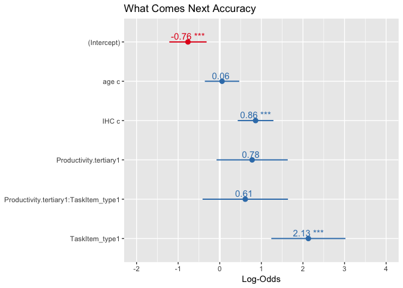<!-- -->

```r
plot_model(fig3.modelA.full, type = "est", show.intercept = T, show.p = T, show.values = T, 
    title = "What Comes Next Accuracy")
```

<!-- -->

Excluding IHC>=99, report averages by each factor

```r
# means by item type
fig3.df %>% filter(Productivity.tertiary != "Productive (IHC ≥ 99)") %>% group_by(LadlabID, 
    TaskItem_type) %>% summarise(score = mean(Accuracy, na.rm = T)) %>% ungroup() %>% 
    group_by(TaskItem_type) %>% summarise(mean = mean(score, na.rm = T), sd = sd(score, 
    na.rm = T), n = n()) %>% kable(digits = 3)
```


TaskItem_type         mean      sd    n
------------------  ------  ------  ---
Decade transition    0.163   0.296   95
Mid-decade           0.466   0.350   95

```r
# means by productivity
fig3.df %>% filter(Productivity.tertiary != "Productive (IHC ≥ 99)") %>% group_by(LadlabID, 
    Productivity.tertiary) %>% summarise(score = mean(Accuracy, na.rm = T)) %>% ungroup() %>% 
    group_by(Productivity.tertiary) %>% summarise(mean = mean(score, na.rm = T), 
    sd = sd(score, na.rm = T), n = n()) %>% kable(digits = 3)
```


Productivity.tertiary     mean      sd    n
----------------------  ------  ------  ---
Nonproductive            0.259   0.257   54
Productive (IHC < 99)    0.562   0.254   41


### Remove nonproductive
Compare both productive groups

Build dataframe and mean-center IHC, FHC and age.

```r
fig3.modelB.df <- fig3.data %>% filter(Productivity.tertiary != "Nonproductive") %>% 
    dplyr::select(c(LadlabID, IHC, Age, Productivity.tertiary, TaskItem_num, TaskItem_type, 
        Accuracy)) %>% mutate(Productivity.tertiary = as.factor(Productivity.tertiary), 
    IHC = as.integer(IHC), LadlabID = as.factor(LadlabID), TaskItem_type = as.factor(TaskItem_type)) %>% 
    mutate(IHC.c = as.vector(scale(IHC, center = TRUE, scale = TRUE)), age.c = as.vector(scale(Age, 
        center = TRUE, scale = TRUE)))
# weighted effects coding
wec <- mean(as.numeric(fig3.modelB.df$Productivity.tertiary) - 1)
contrasts(fig3.modelB.df$Productivity.tertiary) <- c(-wec, 1 - wec)
wec <- mean(as.numeric(fig3.modelB.df$TaskItem_type) - 1)
contrasts(fig3.modelB.df$TaskItem_type) <- c(-wec, 1 - wec)
str(fig3.modelB.df)
```

```
## 'data.frame':	584 obs. of  9 variables:
##  $ LadlabID             : Factor w/ 73 levels "010916-D5","012016-AD",..: 1 1 1 1 1 1 1 1 2 2 ...
##  $ IHC                  : int  100 100 100 100 100 100 100 100 29 29 ...
##  $ Age                  : num  4.78 4.78 4.78 4.78 4.78 4.78 4.78 4.78 4.41 4.41 ...
##  $ Productivity.tertiary: Factor w/ 2 levels "Productive (IHC < 99)",..: 2 2 2 2 2 2 2 2 1 1 ...
##   ..- attr(*, "contrasts")= num [1:2, 1] -0.438 0.562
##   .. ..- attr(*, "dimnames")=List of 2
##   .. .. ..$ : chr  "Productive (IHC < 99)" "Productive (IHC ≥ 99)"
##   .. .. ..$ : NULL
##  $ TaskItem_num         : num  23 40 62 70 37 29 86 59 23 40 ...
##  $ TaskItem_type        : Factor w/ 2 levels "Decade transition",..: 2 2 2 2 2 1 2 1 2 2 ...
##   ..- attr(*, "contrasts")= num [1:2, 1] -0.75 0.25
##   .. ..- attr(*, "dimnames")=List of 2
##   .. .. ..$ : chr  "Decade transition" "Mid-decade"
##   .. .. ..$ : NULL
##  $ Accuracy             : int  1 1 1 1 1 1 1 1 0 0 ...
##  $ IHC.c                : num  1.04 1.04 1.04 1.04 1.04 ...
##  $ age.c                : num  -0.961 -0.961 -0.961 -0.961 -0.961 ...
```

Regression testing for interaction of productivity and decade/non-decade item type on WCN accuracy

```r
## WCN model looking at interaction between productivity and decade/non-decade
## item accuracy
fig3.modelB.base <- glmer(Accuracy ~ age.c + (1 | TaskItem_num) + (1 | LadlabID), 
    family = "binomial", data = fig3.modelB.df)
fig3.modelB.ihc <- glmer(Accuracy ~ IHC.c + age.c + (1 | TaskItem_num) + (1 | LadlabID), 
    family = "binomial", data = fig3.modelB.df)
fig3.modelB.prod <- glmer(Accuracy ~ Productivity.tertiary + IHC.c + age.c + (1 | 
    TaskItem_num) + (1 | LadlabID), family = "binomial", data = fig3.modelB.df)
fig3.modelB.itemtype <- glmer(Accuracy ~ TaskItem_type + IHC.c + age.c + (1 | TaskItem_num) + 
    (1 | LadlabID), family = "binomial", data = fig3.modelB.df)
fig3.modelB.main <- glmer(Accuracy ~ Productivity.tertiary + TaskItem_type + IHC.c + 
    age.c + (1 | TaskItem_num) + (1 | LadlabID), family = "binomial", data = fig3.modelB.df)
fig3.modelB.full <- glmer(Accuracy ~ Productivity.tertiary + TaskItem_type + Productivity.tertiary:TaskItem_type + 
    IHC.c + age.c + (1 | TaskItem_num) + (1 | LadlabID), family = "binomial", data = fig3.modelB.df)

# LRT test for interaction effect
anova(fig3.modelB.full, fig3.modelB.main, test = "LRT")
```

```
## Data: fig3.modelB.df
## Models:
## fig3.modelB.main: Accuracy ~ Productivity.tertiary + TaskItem_type + IHC.c + age.c + 
## fig3.modelB.main:     (1 | TaskItem_num) + (1 | LadlabID)
## fig3.modelB.full: Accuracy ~ Productivity.tertiary + TaskItem_type + Productivity.tertiary:TaskItem_type + 
## fig3.modelB.full:     IHC.c + age.c + (1 | TaskItem_num) + (1 | LadlabID)
##                  Df    AIC    BIC  logLik deviance  Chisq Chi Df
## fig3.modelB.main  7 529.14 559.72 -257.57   515.14              
## fig3.modelB.full  8 528.58 563.52 -256.29   512.58 2.5631      1
##                  Pr(>Chisq)
## fig3.modelB.main           
## fig3.modelB.full     0.1094
```

Main effect model

```r
# LRT tests for main effects
drop1(fig3.modelB.main, test = "Chisq")
```

```
## Single term deletions
## 
## Model:
## Accuracy ~ Productivity.tertiary + TaskItem_type + IHC.c + age.c + 
##     (1 | TaskItem_num) + (1 | LadlabID)
##                       Df    AIC     LRT  Pr(Chi)    
## <none>                   529.14                     
## Productivity.tertiary  1 531.63  4.4885 0.034124 *  
## TaskItem_type          1 539.66 12.5183 0.000403 ***
## IHC.c                  1 528.10  0.9553 0.328383    
## age.c                  1 528.42  1.2753 0.258781    
## ---
## Signif. codes:  0 '***' 0.001 '**' 0.01 '*' 0.05 '.' 0.1 ' ' 1
```

```r
# summary of final model
summary(fig3.modelB.main)
```

```
## Generalized linear mixed model fit by maximum likelihood (Laplace
##   Approximation) [glmerMod]
##  Family: binomial  ( logit )
## Formula: 
## Accuracy ~ Productivity.tertiary + TaskItem_type + IHC.c + age.c +  
##     (1 | TaskItem_num) + (1 | LadlabID)
##    Data: fig3.modelB.df
## 
##      AIC      BIC   logLik deviance df.resid 
##    529.1    559.7   -257.6    515.1      576 
## 
## Scaled residuals: 
##     Min      1Q  Median      3Q     Max 
## -5.0869 -0.3663  0.1842  0.4655  2.0476 
## 
## Random effects:
##  Groups       Name        Variance Std.Dev.
##  LadlabID     (Intercept) 1.4452   1.2022  
##  TaskItem_num (Intercept) 0.1116   0.3341  
## Number of obs: 583, groups:  LadlabID, 73; TaskItem_num, 8
## 
## Fixed effects:
##                        Estimate Std. Error z value Pr(>|z|)    
## (Intercept)              1.5807     0.2498   6.327 2.49e-10 ***
## Productivity.tertiary1   2.0008     0.9480   2.111   0.0348 *  
## TaskItem_type1           2.1135     0.3982   5.308 1.11e-07 ***
## IHC.c                    0.4474     0.4567   0.980   0.3272    
## age.c                    0.2272     0.2008   1.132   0.2578    
## ---
## Signif. codes:  0 '***' 0.001 '**' 0.01 '*' 0.05 '.' 0.1 ' ' 1
## 
## Correlation of Fixed Effects:
##             (Intr) Prdc.1 TskI_1 IHC.c 
## Prdctvty.t1  0.149                     
## TskItm_typ1  0.187  0.079              
## IHC.c        0.013 -0.878  0.029       
## age.c        0.049  0.192  0.033 -0.227
```

### All kids
Analyses including all participants

```r
fig3.modelC.df <- fig3.data %>% dplyr::select(c(LadlabID, IHC, FHC, Age, Productivity, 
    TaskItem_num, TaskItem_type, Accuracy)) %>% mutate(Productivity = as.factor(Productivity), 
    IHC = as.integer(IHC), LadlabID = as.factor(LadlabID), TaskItem_type = as.factor(TaskItem_type)) %>% 
    mutate(IHC.c = as.vector(scale(IHC, center = TRUE, scale = TRUE)), age.c = as.vector(scale(Age, 
        center = TRUE, scale = TRUE)))
# weighted effects coding
wec <- mean(as.numeric(fig3.modelC.df$Productivity) - 1)
contrasts(fig3.modelC.df$Productivity) <- c(-wec, 1 - wec)
wec <- mean(as.numeric(fig3.modelC.df$TaskItem_type) - 1)
contrasts(fig3.modelC.df$TaskItem_type) <- c(-wec, 1 - wec)

## regressions
fig3.modelC.noint <- glmer(Accuracy ~ Productivity + TaskItem_type + IHC.c + age.c + 
    (1 | TaskItem_num) + (1 | LadlabID), family = "binomial", data = fig3.modelC.df)
# LRT tests
drop1(fig3.modelC.noint, test = "Chisq")
```

```
## Single term deletions
## 
## Model:
## Accuracy ~ Productivity + TaskItem_type + IHC.c + age.c + (1 | 
##     TaskItem_num) + (1 | LadlabID)
##               Df    AIC    LRT   Pr(Chi)    
## <none>           925.47                     
## Productivity   1 926.62  3.150 0.0759384 .  
## TaskItem_type  1 934.55 11.080 0.0008728 ***
## IHC.c          1 979.17 55.704 8.426e-14 ***
## age.c          1 923.57  0.104 0.7470330    
## ---
## Signif. codes:  0 '***' 0.001 '**' 0.01 '*' 0.05 '.' 0.1 ' ' 1
```

```r
# Test for interaction
fig3.modelC.full <- glmer(Accuracy ~ Productivity + TaskItem_type + Productivity:TaskItem_type + 
    IHC.c + age.c + (1 | TaskItem_num) + (1 | LadlabID), family = "binomial", data = fig3.modelC.df)
anova(fig3.modelC.full, fig3.modelC.noint, test = "LRT")
```

```
## Data: fig3.modelC.df
## Models:
## fig3.modelC.noint: Accuracy ~ Productivity + TaskItem_type + IHC.c + age.c + (1 | 
## fig3.modelC.noint:     TaskItem_num) + (1 | LadlabID)
## fig3.modelC.full: Accuracy ~ Productivity + TaskItem_type + Productivity:TaskItem_type + 
## fig3.modelC.full:     IHC.c + age.c + (1 | TaskItem_num) + (1 | LadlabID)
##                   Df    AIC    BIC  logLik deviance  Chisq Chi Df
## fig3.modelC.noint  7 925.47 959.93 -455.73   911.47              
## fig3.modelC.full   8 927.12 966.50 -455.56   911.12 0.3442      1
##                   Pr(>Chisq)
## fig3.modelC.noint           
## fig3.modelC.full      0.5574
```


## Within / Outside IHC
Add whether the Task Item was within or outside of the kid's initial highest count.

```r
# first, get initial highest count for each kiddo Make a lookup table with SID
# and initial highest count
lookup <- full.data %>% distinct(LadlabID, IHC)

wcn.data %<>% dplyr::mutate(TaskItem = as.numeric(as.character(TaskItem)))

# This is a function that, for each trial, checks the number queried. If number
# queried is above the child's initial highest count, marks that trial as beyond
# count range.
determine_count_range <- function(df) {
    tmp <- df
    for (row in 1:nrow(tmp)) {
        sub = as.character(tmp[row, "LadlabID"])
        count_range = as.numeric(as.character(subset(lookup, LadlabID == sub)$IHC))
        tmp[row, "IHC"] = as.numeric(as.character(count_range))
        if (tmp[row, "TaskItem"] > count_range) {
            tmp[row, "WithinOutsideIHC"] = "outside"
        } else {
            tmp[row, "WithinOutsideIHC"] = "within"
        }
    }
    return(tmp)
}

# Run for wcn
wcn.data <- determine_count_range(wcn.data)
```


WCN accuracy, within and outside of IHC, by various contrasts

```r
wcn.data %>% dplyr::filter(TaskType == "immediate") %>% dplyr::group_by(LadlabID, 
    WithinOutsideIHC) %>% dplyr::summarize(score = mean(Accuracy, na.rm = T)) %>% 
    ungroup() %>% group_by(WithinOutsideIHC) %>% dplyr::summarize(mean = mean(score, 
    na.rm = TRUE), sd = sd(score, na.rm = TRUE), n = n()) %>% kable(digits = 2)
```


WithinOutsideIHC    mean     sd    n
-----------------  -----  -----  ---
outside             0.39   0.32   95
within              0.68   0.32   88

```r
# 2-way productivity, all kids
wcn.data %>% dplyr::filter(TaskType == "immediate") %>% dplyr::group_by(LadlabID, 
    Productivity, WithinOutsideIHC) %>% dplyr::summarize(score = mean(Accuracy, na.rm = T)) %>% 
    ungroup() %>% group_by(Productivity, WithinOutsideIHC) %>% dplyr::summarize(mean = mean(score, 
    na.rm = TRUE), sd = sd(score, na.rm = TRUE), n = n()) %>% kable(digits = 2)
```


Productivity    WithinOutsideIHC    mean     sd    n
--------------  -----------------  -----  -----  ---
Nonproductive   outside             0.25   0.25   54
Nonproductive   within              0.57   0.34   17
Productive      outside             0.58   0.31   41
Productive      within              0.70   0.31   71

```r
# three-way
wcn.data %>% dplyr::filter(TaskType == "immediate") %>% dplyr::group_by(LadlabID, 
    Productivity.tertiary, WithinOutsideIHC) %>% dplyr::summarize(score = mean(Accuracy, 
    na.rm = T)) %>% ungroup() %>% group_by(Productivity.tertiary, WithinOutsideIHC) %>% 
    dplyr::summarize(mean = mean(score, na.rm = TRUE), sd = sd(score, na.rm = TRUE), 
        n = n()) %>% kable(digits = 2)
```


Productivity.tertiary   WithinOutsideIHC    mean     sd    n
----------------------  -----------------  -----  -----  ---
Nonproductive           outside             0.25   0.25   54
Nonproductive           within              0.57   0.34   17
Productive (IHC < 99)   outside             0.58   0.31   41
Productive (IHC < 99)   within              0.54   0.32   39
Productive (IHC ≥ 99)   within              0.91   0.15   32


Plotting WCN as within vs. beyond by productivity 

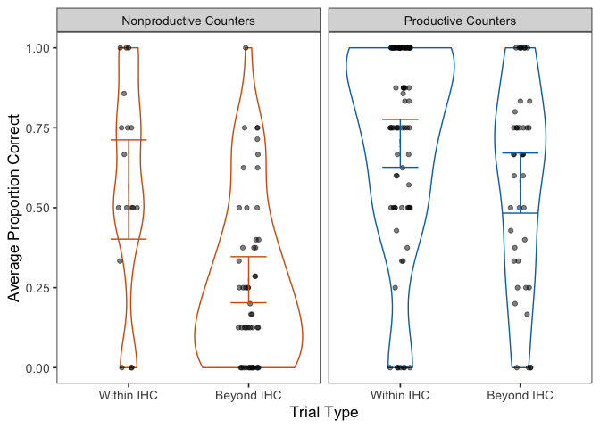<!-- -->

Same graph but three-way productvity grouping
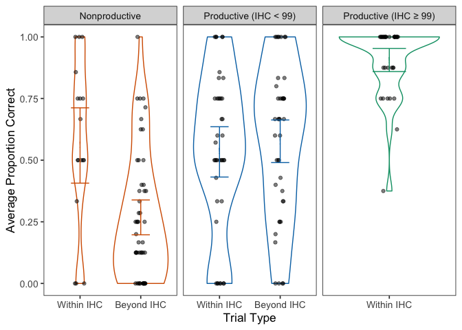<!-- -->

### Fig 4
Try without violins

```r
## HM? 
wcn.data %>%
  mutate(WithinOutsideIHC = factor(WithinOutsideIHC, levels = c("within", "outside"), 
                                   labels = c("Within IHC", "Beyond IHC")))%>%
  dplyr::filter(TaskType == "immediate") %>%
  dplyr::group_by(Productivity.tertiary, WithinOutsideIHC, LadlabID, prod.gradient) %>%
  dplyr::summarize(meansubj = mean(Accuracy, na.rm = TRUE)) %>%
  ggplot(aes(x=WithinOutsideIHC, y=meansubj)) +
  stat_summary(aes(color=Productivity.tertiary),
               fun.data = mean_cl_boot, geom="errorbar",
               width = 0.3)+
  stat_summary(aes(color=Productivity.tertiary), fill="white",
               fun.y = mean,
#               position = position_dodge(width=0.8), 
               geom="point", shape=33, size=3) +
  stat_summary(fun.y="mean", geom="line", aes(color=Productivity.tertiary,
                                              group=factor(Productivity.tertiary))) +
      scale_colour_manual(values=prod.pal, name="Productivity") + 
  scale_fill_brewer(guide=FALSE) +
  scale_y_continuous(limits=c(0,1)) +
  labs(y="Average Proportion Correct", x="Trial Type") +
  theme_bw(base_size = 13) +
  theme(panel.grid.major = element_blank(), 
        panel.grid.minor = element_blank())
```

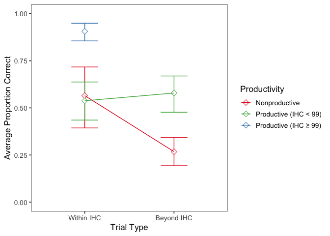<!-- -->

```r
ggsave('graphs/wcn-within-beyond-final.png', width=6, height=4)
```

### Remove IHC=99


```
## 'data.frame':	760 obs. of  7 variables:
##  $ LadlabID        : Factor w/ 95 levels "010516-K4","011216-KD1",..: 1 1 1 1 1 1 1 1 2 2 ...
##  $ TaskItem_num    : num  23 40 62 70 37 29 86 59 23 40 ...
##  $ age.c           : num  -1.28 -1.28 -1.28 -1.28 -1.28 ...
##  $ IHC.c           : num  -1 -1 -1 -1 -1 ...
##  $ Productivity    : Factor w/ 2 levels "Nonproductive",..: 1 1 1 1 1 1 1 1 1 1 ...
##   ..- attr(*, "contrasts")= num [1:2, 1] -0.432 0.568
##   .. ..- attr(*, "dimnames")=List of 2
##   .. .. ..$ : chr  "Nonproductive" "Productive"
##   .. .. ..$ : NULL
##  $ WithinOutsideIHC: Factor w/ 2 levels "outside","within": 1 1 1 1 1 1 1 1 1 1 ...
##   ..- attr(*, "contrasts")= num [1:2, 1] -0.261 0.739
##   .. ..- attr(*, "dimnames")=List of 2
##   .. .. ..$ : chr  "outside" "within"
##   .. .. ..$ : NULL
##  $ Accuracy        : int  0 0 0 0 0 0 0 0 0 0 ...
```

Construct models and compare

```r
## WCN model looking at interaction between productivity and trial type in WCN
## task
wcn.model2.base <- glmer(Accuracy ~ age.c + (1 | TaskItem_num) + (1 | LadlabID), 
    family = "binomial", data = wcn_model.df2)
wcn.model2.ihc <- glmer(Accuracy ~ IHC.c + age.c + (1 | TaskItem_num) + (1 | LadlabID), 
    family = "binomial", data = wcn_model.df2)
wcn.model2.noint <- glmer(Accuracy ~ Productivity + WithinOutsideIHC + IHC.c + age.c + 
    (1 | TaskItem_num) + (1 | LadlabID), family = "binomial", data = wcn_model.df2)
wcn.model2.int <- glmer(Accuracy ~ Productivity + WithinOutsideIHC + Productivity:WithinOutsideIHC + 
    IHC.c + age.c + (1 | TaskItem_num) + (1 | LadlabID), family = "binomial", data = wcn_model.df2)
# comparison against base models
anova(wcn.model2.int, wcn.model2.noint, wcn.model2.ihc, wcn.model2.base, test = "LRT")
```

```
## Data: wcn_model.df2
## Models:
## wcn.model2.base: Accuracy ~ age.c + (1 | TaskItem_num) + (1 | LadlabID)
## wcn.model2.ihc: Accuracy ~ IHC.c + age.c + (1 | TaskItem_num) + (1 | LadlabID)
## wcn.model2.noint: Accuracy ~ Productivity + WithinOutsideIHC + IHC.c + age.c + 
## wcn.model2.noint:     (1 | TaskItem_num) + (1 | LadlabID)
## wcn.model2.int: Accuracy ~ Productivity + WithinOutsideIHC + Productivity:WithinOutsideIHC + 
## wcn.model2.int:     IHC.c + age.c + (1 | TaskItem_num) + (1 | LadlabID)
##                  Df    AIC    BIC  logLik deviance   Chisq Chi Df
## wcn.model2.base   4 819.55 838.08 -405.78   811.55               
## wcn.model2.ihc    5 796.80 819.96 -393.40   786.80 24.7485      1
## wcn.model2.noint  7 796.97 829.40 -391.49   782.97  3.8288      2
## wcn.model2.int    8 794.06 831.12 -389.03   778.06  4.9104      1
##                  Pr(>Chisq)    
## wcn.model2.base                
## wcn.model2.ihc    6.532e-07 ***
## wcn.model2.noint     0.1474    
## wcn.model2.int       0.0267 *  
## ---
## Signif. codes:  0 '***' 0.001 '**' 0.01 '*' 0.05 '.' 0.1 ' ' 1
```

Interaction was significant, let's view the full model

```r
# summary of final model
summary(wcn.model2.int)
```

```
## Generalized linear mixed model fit by maximum likelihood (Laplace
##   Approximation) [glmerMod]
##  Family: binomial  ( logit )
## Formula: 
## Accuracy ~ Productivity + WithinOutsideIHC + Productivity:WithinOutsideIHC +  
##     IHC.c + age.c + (1 | TaskItem_num) + (1 | LadlabID)
##    Data: wcn_model.df2
## 
##      AIC      BIC   logLik deviance df.resid 
##    794.1    831.1   -389.0    778.1      751 
## 
## Scaled residuals: 
##     Min      1Q  Median      3Q     Max 
## -3.3290 -0.4909 -0.2409  0.5270  7.2996 
## 
## Random effects:
##  Groups       Name        Variance Std.Dev.
##  LadlabID     (Intercept) 1.404    1.185   
##  TaskItem_num (Intercept) 1.098    1.048   
## Number of obs: 759, groups:  LadlabID, 95; TaskItem_num, 8
## 
## Fixed effects:
##                                 Estimate Std. Error z value Pr(>|z|)    
## (Intercept)                     -0.68623    0.40758  -1.684  0.09225 .  
## Productivity1                    0.84880    0.42672   1.989  0.04669 *  
## WithinOutsideIHC1                0.15074    0.36760   0.410  0.68177    
## IHC.c                            0.84211    0.23506   3.583  0.00034 ***
## age.c                            0.05688    0.20629   0.276  0.78274    
## Productivity1:WithinOutsideIHC1 -1.17474    0.52972  -2.218  0.02658 *  
## ---
## Signif. codes:  0 '***' 0.001 '**' 0.01 '*' 0.05 '.' 0.1 ' ' 1
## 
## Correlation of Fixed Effects:
##             (Intr) Prdct1 WOIHC1 IHC.c  age.c 
## Productvty1 -0.020                            
## WthnOtsIHC1  0.050 -0.014                     
## IHC.c       -0.046 -0.333 -0.405              
## age.c        0.000 -0.361  0.008 -0.307       
## Prd1:WOIHC1 -0.105 -0.026 -0.393  0.124 -0.014
```

### Analysis full sample

Analysis of WCN accuracy by productivity and trial type. First construct the dataframe, again centering all variables:

```r
wcn_model.df <- wcn.data %>% filter(TaskType == "immediate") %>% mutate(IHC = as.integer(IHC), 
    LadlabID = factor(LadlabID), WithinOutsideIHC = factor(WithinOutsideIHC)) %>% 
    mutate(IHC.c = as.vector(scale(IHC, center = TRUE, scale = TRUE)), age.c = as.vector(scale(Age, 
        center = TRUE, scale = TRUE))) %>% dplyr::select(LadlabID, TaskItem_num, 
    age.c, IHC.c, Productivity, WithinOutsideIHC, Accuracy)
# weighted effect coding
wec <- mean(as.numeric(wcn_model.df$Productivity) - 1)
contrasts(wcn_model.df$Productivity) <- c(-wec, 1 - wec)
wec <- mean(as.numeric(wcn_model.df$WithinOutsideIHC) - 1)
contrasts(wcn_model.df$WithinOutsideIHC) <- c(-wec, 1 - wec)
# structure
str(wcn_model.df)
```

```
## 'data.frame':	1016 obs. of  7 variables:
##  $ LadlabID        : Factor w/ 127 levels "010516-K4","010916-D5",..: 1 1 1 1 1 1 1 1 2 2 ...
##  $ TaskItem_num    : num  23 40 62 70 37 29 86 59 23 40 ...
##  $ age.c           : num  -1.41 -1.41 -1.41 -1.41 -1.41 ...
##  $ IHC.c           : num  -1.07 -1.07 -1.07 -1.07 -1.07 ...
##  $ Productivity    : Factor w/ 2 levels "Nonproductive",..: 1 1 1 1 1 1 1 1 2 2 ...
##   ..- attr(*, "contrasts")= num [1:2, 1] -0.575 0.425
##   .. ..- attr(*, "dimnames")=List of 2
##   .. .. ..$ : chr  "Nonproductive" "Productive"
##   .. .. ..$ : NULL
##  $ WithinOutsideIHC: Factor w/ 2 levels "outside","within": 1 1 1 1 1 1 1 1 2 2 ...
##   ..- attr(*, "contrasts")= num [1:2, 1] -0.447 0.553
##   .. ..- attr(*, "dimnames")=List of 2
##   .. .. ..$ : chr  "outside" "within"
##   .. .. ..$ : NULL
##  $ Accuracy        : int  0 0 0 0 0 0 0 0 1 1 ...
```

Construct models.

```r
## WCN model looking at interaction between productivity and trial type in WCN
## task
wcn.model.base <- glmer(Accuracy ~ age.c + (1 | TaskItem_num) + (1 | LadlabID), family = "binomial", 
    data = wcn_model.df)
wcn.model.ihc <- glmer(Accuracy ~ IHC.c + age.c + (1 | TaskItem_num) + (1 | LadlabID), 
    family = "binomial", data = wcn_model.df)
wcn.model.noint <- glmer(Accuracy ~ Productivity + WithinOutsideIHC + IHC.c + age.c + 
    (1 | TaskItem_num) + (1 | LadlabID), family = "binomial", data = wcn_model.df)
wcn.model.int <- glmer(Accuracy ~ Productivity + WithinOutsideIHC + Productivity:WithinOutsideIHC + 
    IHC.c + age.c + (1 | TaskItem_num) + (1 | LadlabID), family = "binomial", data = wcn_model.df)
```

Model comparisons

```r
# compare against base models
anova(wcn.model.int, wcn.model.noint, wcn.model.ihc, wcn.model.base, test = "LRT")
```

```
## Data: wcn_model.df
## Models:
## wcn.model.base: Accuracy ~ age.c + (1 | TaskItem_num) + (1 | LadlabID)
## wcn.model.ihc: Accuracy ~ IHC.c + age.c + (1 | TaskItem_num) + (1 | LadlabID)
## wcn.model.noint: Accuracy ~ Productivity + WithinOutsideIHC + IHC.c + age.c + 
## wcn.model.noint:     (1 | TaskItem_num) + (1 | LadlabID)
## wcn.model.int: Accuracy ~ Productivity + WithinOutsideIHC + Productivity:WithinOutsideIHC + 
## wcn.model.int:     IHC.c + age.c + (1 | TaskItem_num) + (1 | LadlabID)
##                 Df     AIC     BIC  logLik deviance   Chisq Chi Df
## wcn.model.base   4 1020.75 1040.44 -506.37  1012.75               
## wcn.model.ihc    5  935.73  960.35 -462.87   925.73 87.0151      1
## wcn.model.noint  7  935.85  970.31 -460.92   921.85  3.8830      2
## wcn.model.int    8  933.72  973.10 -458.86   917.72  4.1336      1
##                 Pr(>Chisq)    
## wcn.model.base                
## wcn.model.ihc      < 2e-16 ***
## wcn.model.noint    0.14349    
## wcn.model.int      0.04204 *  
## ---
## Signif. codes:  0 '***' 0.001 '**' 0.01 '*' 0.05 '.' 0.1 ' ' 1
```

Interaction is significant:

```r
summary(wcn.model.int)
```

```
## Generalized linear mixed model fit by maximum likelihood (Laplace
##   Approximation) [glmerMod]
##  Family: binomial  ( logit )
## Formula: 
## Accuracy ~ Productivity + WithinOutsideIHC + Productivity:WithinOutsideIHC +  
##     IHC.c + age.c + (1 | TaskItem_num) + (1 | LadlabID)
##    Data: wcn_model.df
## 
##      AIC      BIC   logLik deviance df.resid 
##    933.7    973.1   -458.9    917.7     1007 
## 
## Scaled residuals: 
##     Min      1Q  Median      3Q     Max 
## -4.2567 -0.4244  0.1006  0.4231  7.1765 
## 
## Random effects:
##  Groups       Name        Variance Std.Dev.
##  LadlabID     (Intercept) 1.533    1.238   
##  TaskItem_num (Intercept) 1.021    1.010   
## Number of obs: 1015, groups:  LadlabID, 127; TaskItem_num, 8
## 
## Fixed effects:
##                                 Estimate Std. Error z value Pr(>|z|)    
## (Intercept)                      0.35527    0.39262   0.905   0.3655    
## Productivity1                    0.55913    0.43422   1.288   0.1979    
## WithinOutsideIHC1               -0.14197    0.32692  -0.434   0.6641    
## IHC.c                            1.84258    0.26447   6.967 3.23e-12 ***
## age.c                            0.05034    0.18794   0.268   0.7888    
## Productivity1:WithinOutsideIHC1 -1.05467    0.51934  -2.031   0.0423 *  
## ---
## Signif. codes:  0 '***' 0.001 '**' 0.01 '*' 0.05 '.' 0.1 ' ' 1
## 
## Correlation of Fixed Effects:
##             (Intr) Prdct1 WOIHC1 IHC.c  age.c 
## Productvty1 -0.061                            
## WthnOtsIHC1  0.026 -0.086                     
## IHC.c        0.063 -0.371 -0.463              
## age.c       -0.013 -0.355 -0.024 -0.166       
## Prd1:WOIHC1 -0.172  0.242 -0.187 -0.082  0.036
```

### Remove non-productive

We can only compare accuracy for within-IHC trials:

```
## 'data.frame':	405 obs. of  6 variables:
##  $ LadlabID             : Factor w/ 71 levels "010916-D5","012016-AD",..: 1 1 1 1 1 1 1 1 2 2 ...
##  $ TaskItem_num         : num  23 40 62 70 37 29 86 59 23 29 ...
##  $ age.c                : num  -1.04 -1.04 -1.04 -1.04 -1.04 ...
##  $ IHC.c                : num  0.71 0.71 0.71 0.71 0.71 ...
##  $ Productivity.tertiary: Factor w/ 2 levels "Productive (IHC < 99)",..: 2 2 2 2 2 2 2 2 1 1 ...
##   ..- attr(*, "contrasts")= num [1:2, 1] -0.632 0.368
##   .. ..- attr(*, "dimnames")=List of 2
##   .. .. ..$ : chr  "Productive (IHC < 99)" "Productive (IHC ≥ 99)"
##   .. .. ..$ : NULL
##  $ Accuracy             : int  1 1 1 1 1 1 1 1 0 0 ...
```

Construct models and compare

```r
## WCN model looking at interaction between productivity and trial type in WCN
## task
wcn.model3.base <- glmer(Accuracy ~ age.c + (1 | TaskItem_num) + (1 | LadlabID), 
    family = "binomial", data = wcn_model.df3)
wcn.model3.ihc <- glmer(Accuracy ~ IHC.c + age.c + (1 | TaskItem_num) + (1 | LadlabID), 
    family = "binomial", data = wcn_model.df3)
wcn.model3.prod <- glmer(Accuracy ~ Productivity.tertiary + IHC.c + age.c + (1 | 
    TaskItem_num) + (1 | LadlabID), family = "binomial", data = wcn_model.df3)
# compare
anova(wcn.model3.prod, wcn.model3.ihc, wcn.model3.base, test = "LRT")
```

```
## Data: wcn_model.df3
## Models:
## wcn.model3.base: Accuracy ~ age.c + (1 | TaskItem_num) + (1 | LadlabID)
## wcn.model3.ihc: Accuracy ~ IHC.c + age.c + (1 | TaskItem_num) + (1 | LadlabID)
## wcn.model3.prod: Accuracy ~ Productivity.tertiary + IHC.c + age.c + (1 | TaskItem_num) + 
## wcn.model3.prod:     (1 | LadlabID)
##                 Df    AIC    BIC  logLik deviance   Chisq Chi Df
## wcn.model3.base  4 374.06 390.07 -183.03   366.06               
## wcn.model3.ihc   5 336.53 356.55 -163.27   326.53 39.5224      1
## wcn.model3.prod  6 337.26 361.29 -162.63   325.26  1.2687      1
##                 Pr(>Chisq)    
## wcn.model3.base               
## wcn.model3.ihc   3.243e-10 ***
## wcn.model3.prod       0.26    
## ---
## Signif. codes:  0 '***' 0.001 '**' 0.01 '*' 0.05 '.' 0.1 ' ' 1
```
Final model: IHC only

```r
summary(wcn.model3.ihc)
```

```
## Generalized linear mixed model fit by maximum likelihood (Laplace
##   Approximation) [glmerMod]
##  Family: binomial  ( logit )
## Formula: Accuracy ~ IHC.c + age.c + (1 | TaskItem_num) + (1 | LadlabID)
##    Data: wcn_model.df3
## 
##      AIC      BIC   logLik deviance df.resid 
##    336.5    356.6   -163.3    326.5      400 
## 
## Scaled residuals: 
##     Min      1Q  Median      3Q     Max 
## -3.8736  0.0839  0.2183  0.3824  1.7693 
## 
## Random effects:
##  Groups       Name        Variance Std.Dev.
##  LadlabID     (Intercept) 1.546    1.244   
##  TaskItem_num (Intercept) 1.011    1.006   
## Number of obs: 405, groups:  LadlabID, 71; TaskItem_num, 8
## 
## Fixed effects:
##             Estimate Std. Error z value Pr(>|z|)    
## (Intercept)  2.06115    0.46501   4.433 9.31e-06 ***
## IHC.c        1.43877    0.25823   5.572 2.52e-08 ***
## age.c        0.01892    0.22801   0.083    0.934    
## ---
## Signif. codes:  0 '***' 0.001 '**' 0.01 '*' 0.05 '.' 0.1 ' ' 1
## 
## Correlation of Fixed Effects:
##       (Intr) IHC.c 
## IHC.c  0.318       
## age.c  0.022 -0.044
```


# Infinity Descriptives

## Counts
Number of kids in each infinity category

```
## # A tibble: 8 x 3
## # Groups:   Productivity [2]
##   Productivity  Category             n
##   <fct>         <chr>            <int>
## 1 Nonproductive A Non-knower        36
## 2 Nonproductive B Endless-only       1
## 3 Nonproductive C Successor-only    14
## 4 Nonproductive D Full-knower        3
## 5 Productive    A Non-knower        26
## 6 Productive    B Endless-only      10
## 7 Productive    C Successor-only    17
## 8 Productive    D Full-knower       20
```

```
##                EndlessKnower
## SuccessorKnower  0  1
##               0 62 11
##               1 31 23
```

Successor knowledge by productivity

```
##    
##     Nonproductive Productive
##   0            37         36
##   1            17         37
```

```
## 
## 	Pearson's Chi-squared test with Yates' continuity correction
## 
## data:  table(classification.data$SuccessorKnower, classification.data$Productivity)
## X-squared = 3.9306, df = 1, p-value = 0.04741
```

Endless knowledge by productivity

```
##    
##     Nonproductive Productive
##   0            50         43
##   1             4         30
```

```
## 
## 	Pearson's Chi-squared test with Yates' continuity correction
## 
## data:  table(classification.data$EndlessKnower, classification.data$Productivity)
## X-squared = 16.292, df = 1, p-value = 5.431e-05
```

Infinity knowledge by productivity

```
##    
##     Nonproductive Productive
##   0            51         53
##   1             3         20
```

```
## 
## 	Pearson's Chi-squared test with Yates' continuity correction
## 
## data:  table(classification.data$InfinityKnower, classification.data$Productivity)
## X-squared = 8.5662, df = 1, p-value = 0.003425
```

## Age
Average age of kids for Endless and Successor Knowers

 SuccessorKnower   meanAge   sdAge   meanAgeMonths   sdAgeMonths
----------------  --------  ------  --------------  ------------
               0     4.892   0.579          63.602         7.532
               1     5.086   0.551          66.112         7.167


 EndlessKnower   meanAge   sdAge   meanAgeMonths   sdAgeMonths
--------------  --------  ------  --------------  ------------
             0     4.867   0.558          63.265         7.249
             1     5.270   0.516          68.510         6.704


InfinityKnower    meanAge   sdAge   meanAgeMonths   sdAgeMonths
---------------  --------  ------  --------------  ------------
0                   4.898   0.567          63.674         7.367
1                   5.321   0.476          69.171         6.192

## HC
Infinity in relation to highest count

```
## # A tibble: 2 x 3
##   EndlessKnower mean_IHC mean_FHC
##           <int>    <dbl>    <dbl>
## 1             0     41.3     60.6
## 2             1     70.1     91.8
```

```
## # A tibble: 2 x 3
##   SuccessorKnower mean_IHC mean_FHC
##             <int>    <dbl>    <dbl>
## 1               0     45.9     64.1
## 2               1     53.1     75.4
```

```
## # A tibble: 2 x 3
##   InfinityKnower mean_IHC mean_FHC
##   <fct>             <dbl>    <dbl>
## 1 0                  44.9     64.1
## 2 1                  67.7     90.9
```

## WCN 
Infinity in relation to WCN

```
## Joining, by = "LadlabID"
```

```
## # A tibble: 2 x 3
##   EndlessKnower mean_contig_nn median_contig_nn
##           <int>          <dbl>            <dbl>
## 1             0           3.56                3
## 2             1           5.79                6
```

```
## Joining, by = "LadlabID"
```

```
## # A tibble: 2 x 3
##   SuccessorKnower mean_contig_nn median_contig_nn
##             <int>          <dbl>            <dbl>
## 1               0           3.88                4
## 2               1           4.54                5
```

```
## Joining, by = "LadlabID"
```

```
## # A tibble: 2 x 3
##   InfinityKnower mean_contig_nn median_contig_nn
##   <fct>                   <dbl>            <dbl>
## 1 0                        3.79                4
## 2 1                        5.83                6
```

# Productivity gradient

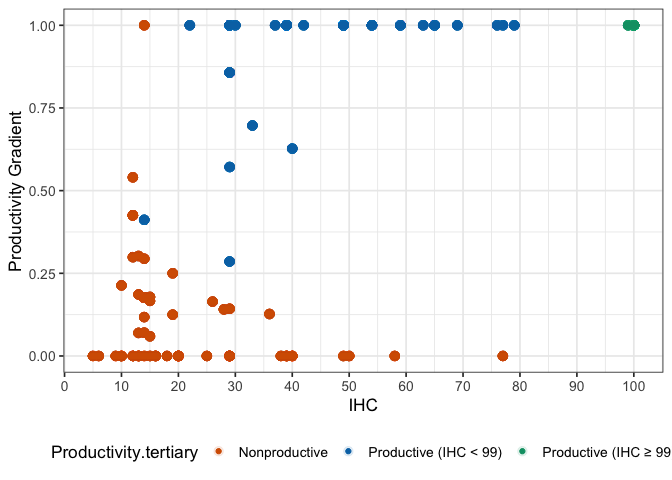<!-- -->

## Correlation between productivity gradient and IHC/FHC

```
## 
## 	Pearson's product-moment correlation
## 
## data:  ms.cor$IHC and ms.cor$prod.gradient
## t = 10.796, df = 125, p-value < 2.2e-16
## alternative hypothesis: true correlation is not equal to 0
## 95 percent confidence interval:
##  0.5920725 0.7750573
## sample estimates:
##      cor 
## 0.694637
```

```
## 
## 	Pearson's product-moment correlation
## 
## data:  ms.cor$FHC and ms.cor$prod.gradient
## t = 43.055, df = 125, p-value < 2.2e-16
## alternative hypothesis: true correlation is not equal to 0
## 95 percent confidence interval:
##  0.9546617 0.9773165
## sample estimates:
##       cor 
## 0.9678992
```

## Correlation between Productivity classification and Prod.gradient

```
## 
## 	Pearson's product-moment correlation
## 
## data:  ms.cor$Productivity and ms.cor$prod.gradient
## t = 31.141, df = 125, p-value < 2.2e-16
## alternative hypothesis: true correlation is not equal to 0
## 95 percent confidence interval:
##  0.9173851 0.9582688
## sample estimates:
##       cor 
## 0.9411788
```


***

# Infinity Regression Analyses

## Setup
Counting, Productivity, and Infinity Battery
To identify whether there is connection between counting experience and Infinity Task performance, we will conduct three initial analyses, predicting Infinity Task performance from either (1) Initial Highest Count, (3) Productivity for Decade Rule (defined above), or (3) performance on the Next Number task. 

glm(inf.0/1 ~ (predictor) + age, family = binomial).

---
First, we need to make a model data frame that readily has all of this information


```r
# model base each participant only needs one row here, because we only need to
# know whether they are a Successor Knower or Endless Knower
model.df <- full.data %>% dplyr::distinct(LadlabID, Age, AgeGroup, Gender, SuccessorKnower, 
    EndlessKnower, InfinityKnower, IHC, Productivity, Productivity.tertiary, prod.gradient)
model.df <- right_join(model.df, wcn.accuracy, by = "LadlabID") %>% mutate(SuccessorKnower = factor(SuccessorKnower, 
    levels = c(0, 1)), EndlessKnower = factor(EndlessKnower, levels = c(0, 1)), IHC = as.integer(IHC), 
    LadlabID = factor(LadlabID))
```

## Regression with All subjects
### prep

```r
# scale and center for model fit
distinct_model.df <- model.df %>% mutate(IHC.c = as.vector(scale(IHC, center = TRUE, 
    scale = TRUE)), Age.c = as.vector(scale(Age, center = TRUE, scale = TRUE)), prod.gradient.c = as.vector(scale(prod.gradient, 
    center = TRUE, scale = TRUE)), wcnscore.c = as.vector(scale(wcnscore, center = TRUE, 
    scale = TRUE)))
# weighted effect coding for productivity
wec <- mean(as.numeric(distinct_model.df$Productivity) - 1)
contrasts(distinct_model.df$Productivity) <- c(-wec, 1 - wec)
# structure
str(distinct_model.df)
```

```
## 'data.frame':	127 obs. of  16 variables:
##  $ LadlabID             : Factor w/ 127 levels "010516-K4","010916-D5",..: 1 2 3 4 5 6 7 8 9 10 ...
##  $ Age                  : num  4.17 4.78 4 4.44 4.12 4.41 4.75 4.46 5.42 4.25 ...
##  $ AgeGroup             : Factor w/ 6 levels "4-4.5y","4.5-5y",..: 1 2 1 1 1 1 2 1 3 1 ...
##  $ Gender               : Factor w/ 5 levels "f","F","m","M",..: 1 3 1 3 1 1 1 1 2 1 ...
##  $ SuccessorKnower      : Factor w/ 2 levels "0","1": 1 2 2 1 1 1 1 2 1 2 ...
##  $ EndlessKnower        : Factor w/ 2 levels "0","1": 1 1 1 2 1 1 1 1 1 1 ...
##  $ InfinityKnower       : Factor w/ 2 levels "0","1": 1 1 1 1 1 1 1 1 1 1 ...
##  $ IHC                  : int  13 100 5 15 39 29 26 20 39 29 ...
##  $ Productivity         : Factor w/ 2 levels "Nonproductive",..: 1 2 1 1 1 2 1 1 2 2 ...
##   ..- attr(*, "contrasts")= num [1:2, 1] -0.575 0.425
##   .. ..- attr(*, "dimnames")=List of 2
##   .. .. ..$ : chr  "Nonproductive" "Productive"
##   .. .. ..$ : NULL
##  $ Productivity.tertiary: chr  "Nonproductive" "Productive (IHC ≥ 99)" "Nonproductive" "Nonproductive" ...
##  $ prod.gradient        : num  0.186 1 0 0.179 0 ...
##  $ wcnscore             : int  0 8 0 1 2 0 6 1 8 3 ...
##  $ IHC.c                : num  -1.062 1.505 -1.298 -1.003 -0.295 ...
##  $ Age.c                : num  -1.403 -0.339 -1.699 -0.932 -1.49 ...
##  $ prod.gradient.c      : num  -0.917 0.888 -1.329 -0.933 -1.329 ...
##  $ wcnscore.c           : num  -1.493 1.38 -1.493 -1.134 -0.775 ...
```
### Successor models

```r
###MODEL BUILDING AND COMPARISONS###
#base model for successor knower
base.successor <- glm(SuccessorKnower ~ Age.c, family = "binomial", 
                        data = distinct_model.df)

##IHC model##
model.ihc.successor <- glm(SuccessorKnower ~ IHC.c + Age.c, family = "binomial", 
                             data = distinct_model.df)
##WCN Model##
model.nn.successor <- glm(SuccessorKnower ~ wcnscore.c + Age.c, family = "binomial", 
                            data = distinct_model.df)
##Productivity model##
model.prod.successor <- glm(SuccessorKnower ~ Productivity + Age.c, family = "binomial",
                              data = distinct_model.df)

##EXPLORATORY## - GAIN SCORE
model.gain.successor <- glm(SuccessorKnower ~ prod.gradient.c + Age.c, family = "binomial",
                              data = distinct_model.df)

##Regression table for Successor Knower Models (Table )
mtable.sf.knowers <- mtable('Base' = base.successor,
            'IHC' = model.ihc.successor,
            'NN' = model.nn.successor,
            'Productivity' = model.prod.successor,
            'Prod. gain' = model.gain.successor,
            #summary.stats = c('R-squared','F','p','N'))
            summary.stats = c('Nagelkerke R-sq.','Log-likelihood','AIC','N'))
mtable.sf.knowers
```

```
## 
## Calls:
## Base: glm(formula = SuccessorKnower ~ Age.c, family = "binomial", data = distinct_model.df)
## IHC: glm(formula = SuccessorKnower ~ IHC.c + Age.c, family = "binomial", 
##     data = distinct_model.df)
## NN: glm(formula = SuccessorKnower ~ wcnscore.c + Age.c, family = "binomial", 
##     data = distinct_model.df)
## Productivity: glm(formula = SuccessorKnower ~ Productivity + Age.c, family = "binomial", 
##     data = distinct_model.df)
## Prod. gain: glm(formula = SuccessorKnower ~ prod.gradient.c + Age.c, family = "binomial", 
##     data = distinct_model.df)
## 
## ============================================================================
##                       Base      IHC        NN     Productivity  Prod. gain  
## ----------------------------------------------------------------------------
##   (Intercept)        -0.310    -0.310    -0.310      -0.316       -0.314    
##                      (0.182)   (0.182)   (0.182)     (0.184)      (0.183)   
##   Age.c               0.344     0.318     0.296       0.172        0.205    
##                      (0.184)   (0.216)   (0.209)     (0.225)      (0.230)   
##   IHC.c                         0.050                                       
##                                (0.214)                                      
##   wcnscore.c                              0.102                             
##                                          (0.208)                            
##   Productivity: 1                                     0.604                 
##                                                      (0.456)                
##   prod.gradient.c                                                  0.233    
##                                                                   (0.231)   
## ----------------------------------------------------------------------------
##   Nagelkerke R-sq.    0.037     0.038     0.040       0.055        0.048    
##   Log-likelihood    -84.818   -84.792   -84.699     -83.935      -84.304    
##   AIC               173.637   175.583   175.399     173.870      174.608    
##   N                 127       127       127         127          127        
## ============================================================================
```

```r
write.mtable(mtable.sf.knowers, file="graphs/table3-all.txt")
```

#### Model comparisons

Comparing models with a single predictor against base model, we find that none of the predictors are significant in accounting for successor knowledge after controlling for age and IHC.

```r
# base v. IHC
anova(base.successor, model.ihc.successor, test = "LRT")  #IHC n.s.
```

```
## Analysis of Deviance Table
## 
## Model 1: SuccessorKnower ~ Age.c
## Model 2: SuccessorKnower ~ IHC.c + Age.c
##   Resid. Df Resid. Dev Df Deviance Pr(>Chi)
## 1       125     169.64                     
## 2       124     169.58  1 0.053266   0.8175
```

```r
# wcn v. base
anova(base.successor, model.nn.successor, test = "LRT")  #NN n.s.
```

```
## Analysis of Deviance Table
## 
## Model 1: SuccessorKnower ~ Age.c
## Model 2: SuccessorKnower ~ wcnscore.c + Age.c
##   Resid. Df Resid. Dev Df Deviance Pr(>Chi)
## 1       125     169.64                     
## 2       124     169.40  1  0.23788   0.6257
```

```r
# Productivity v. base
anova(base.successor, model.prod.successor, test = "LRT")  # n.s.
```

```
## Analysis of Deviance Table
## 
## Model 1: SuccessorKnower ~ Age.c
## Model 2: SuccessorKnower ~ Productivity + Age.c
##   Resid. Df Resid. Dev Df Deviance Pr(>Chi)
## 1       125     169.64                     
## 2       124     167.87  1   1.7662   0.1839
```

```r
## Exploratory vs. base
anova(base.successor, model.gain.successor, test = "LRT")  # n.s.
```

```
## Analysis of Deviance Table
## 
## Model 1: SuccessorKnower ~ Age.c
## Model 2: SuccessorKnower ~ prod.gradient.c + Age.c
##   Resid. Df Resid. Dev Df Deviance Pr(>Chi)
## 1       125     169.64                     
## 2       124     168.61  1   1.0286   0.3105
```

#### Visualize

Visualize relationship between IHC and SuccessorKnowledge, by productivity

```r
distinct_model.df %>% ggplot(data = ., mapping = aes(x = IHC, y = SuccessorKnower, 
    color = Productivity, group = Productivity)) + geom_point(alpha = 0.2, size = 2) + 
    geom_smooth(method = "glm", method.args = list(family = "binomial"), alpha = 0.2, 
        aes(fill = Productivity)) + scale_color_manual(values = mypalette, name = "Productivity") + 
    scale_fill_manual(values = mypalette, name = "Productivity")
```

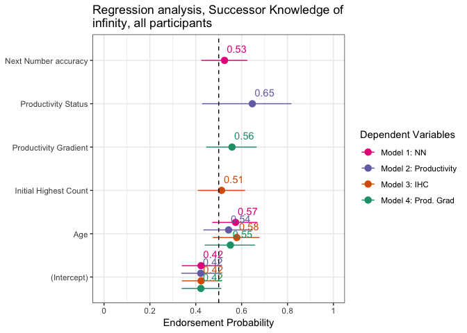<!-- -->

### Endless models

```r
# Base model
base.endless <- glm(EndlessKnower ~ Age.c, family = "binomial", data = distinct_model.df)

### IHC MODEL###
model.ihc.endless <- glm(EndlessKnower ~ IHC.c + Age.c, family = "binomial", data = distinct_model.df)

### NN MODEL###
model.nn.endless <- glm(EndlessKnower ~ wcnscore.c + Age.c, family = "binomial", 
    data = distinct_model.df)

### PRODUCTIVITY MODEL###
model.prod.endless <- glm(EndlessKnower ~ Productivity + Age.c, family = "binomial", 
    data = distinct_model.df)

## EXPLORATORY## - GAIN SCORE
model.gain.endless <- glm(EndlessKnower ~ prod.gradient.c + Age.c, family = "binomial", 
    data = distinct_model.df)

## Regression table for Endless Models
mtable.endless.knowers <- mtable(Base = base.endless, IHC = model.ihc.endless, NN = model.nn.endless, 
    Productivity = model.prod.endless, `Prod. gradient` = model.gain.endless, summary.stats = c("Nagelkerke R-sq.", 
        "Log-likelihood", "AIC", "F", "p", "N"))

mtable.endless.knowers
```

```
## 
## Calls:
## Base: glm(formula = EndlessKnower ~ Age.c, family = "binomial", data = distinct_model.df)
## IHC: glm(formula = EndlessKnower ~ IHC.c + Age.c, family = "binomial", 
##     data = distinct_model.df)
## NN: glm(formula = EndlessKnower ~ wcnscore.c + Age.c, family = "binomial", 
##     data = distinct_model.df)
## Productivity: glm(formula = EndlessKnower ~ Productivity + Age.c, family = "binomial", 
##     data = distinct_model.df)
## Prod. gradient: glm(formula = EndlessKnower ~ prod.gradient.c + Age.c, family = "binomial", 
##     data = distinct_model.df)
## 
## ======================================================================================
##                        Base        IHC          NN      Productivity  Prod. gradient  
## --------------------------------------------------------------------------------------
##   (Intercept)        -1.131***   -1.213***   -1.242***    -1.297***      -1.317***    
##                      (0.223)     (0.238)     (0.244)      (0.262)        (0.267)      
##   Age.c               0.754***    0.430       0.464        0.341          0.286       
##                      (0.223)     (0.251)     (0.246)      (0.260)        (0.269)      
##   IHC.c                           0.691**                                             
##                                  (0.242)                                              
##   wcnscore.c                                  0.736**                                 
##                                              (0.268)                                  
##   Productivity: 1                                          1.780**                    
##                                                           (0.639)                     
##   prod.gradient.c                                                         0.961**     
##                                                                          (0.334)      
## --------------------------------------------------------------------------------------
##   Nagelkerke R-sq.    0.139       0.222       0.222        0.231          0.240       
##   Log-likelihood    -67.410     -63.286     -63.267      -62.820        -62.350       
##   AIC               138.821     132.573     132.534      131.639        130.701       
##   p                   0.000       0.000       0.000        0.000          0.000       
##   N                 127         127         127          127            127           
## ======================================================================================
```

```r
write.mtable(mtable.endless.knowers, file = "graphs/table3-all.txt")
```

#### Model comparisons
Unlike for successor knowledge, here we find that every predictor is significant addition to the base model.

```r
# base v. IHC
anova(base.endless, model.ihc.endless, test = "LRT")
```

```
## Analysis of Deviance Table
## 
## Model 1: EndlessKnower ~ Age.c
## Model 2: EndlessKnower ~ IHC.c + Age.c
##   Resid. Df Resid. Dev Df Deviance Pr(>Chi)   
## 1       125     134.82                        
## 2       124     126.57  1   8.2479  0.00408 **
## ---
## Signif. codes:  0 '***' 0.001 '**' 0.01 '*' 0.05 '.' 0.1 ' ' 1
```

```r
# base v. wcn accuracy
anova(model.nn.endless, base.endless, test = "LRT")
```

```
## Analysis of Deviance Table
## 
## Model 1: EndlessKnower ~ wcnscore.c + Age.c
## Model 2: EndlessKnower ~ Age.c
##   Resid. Df Resid. Dev Df Deviance Pr(>Chi)   
## 1       124     126.53                        
## 2       125     134.82 -1  -8.2868 0.003994 **
## ---
## Signif. codes:  0 '***' 0.001 '**' 0.01 '*' 0.05 '.' 0.1 ' ' 1
```

```r
# base v. productivity
anova(model.prod.endless, base.endless, test = "LRT")
```

```
## Analysis of Deviance Table
## 
## Model 1: EndlessKnower ~ Productivity + Age.c
## Model 2: EndlessKnower ~ Age.c
##   Resid. Df Resid. Dev Df Deviance Pr(>Chi)   
## 1       124     125.64                        
## 2       125     134.82 -1  -9.1814 0.002445 **
## ---
## Signif. codes:  0 '***' 0.001 '**' 0.01 '*' 0.05 '.' 0.1 ' ' 1
```

```r
## Exploratory base v. productivity gradient
anova(base.endless, model.gain.endless, test = "LRT")
```

```
## Analysis of Deviance Table
## 
## Model 1: EndlessKnower ~ Age.c
## Model 2: EndlessKnower ~ prod.gradient.c + Age.c
##   Resid. Df Resid. Dev Df Deviance Pr(>Chi)   
## 1       125     134.82                        
## 2       124     124.70  1    10.12 0.001467 **
## ---
## Signif. codes:  0 '***' 0.001 '**' 0.01 '*' 0.05 '.' 0.1 ' ' 1
```

#### 2-factors
Combining these factors don't explain additional variance over single-factor models.

```r
model.prod.nn.endless <- glm(EndlessKnower ~ Productivity + wcnscore.c + Age.c, family = "binomial", 
    data = distinct_model.df)
drop1(model.prod.nn.endless, test = "Chisq")
```

```
## Single term deletions
## 
## Model:
## EndlessKnower ~ Productivity + wcnscore.c + Age.c
##              Df Deviance    AIC    LRT Pr(>Chi)  
## <none>            123.06 131.06                  
## Productivity  1   126.53 132.53 3.4705  0.06247 .
## wcnscore.c    1   125.64 131.64 2.5758  0.10851  
## Age.c         1   124.15 130.15 1.0842  0.29776  
## ---
## Signif. codes:  0 '***' 0.001 '**' 0.01 '*' 0.05 '.' 0.1 ' ' 1
```

```r
# prod + ihc
model.prod.ihc.endless <- glm(EndlessKnower ~ Productivity + IHC.c + Age.c, family = "binomial", 
    data = distinct_model.df)
drop1(model.prod.ihc.endless, test = "Chisq")
```

```
## Single term deletions
## 
## Model:
## EndlessKnower ~ Productivity + IHC.c + Age.c
##              Df Deviance    AIC    LRT Pr(>Chi)  
## <none>            123.30 131.30                  
## Productivity  1   126.57 132.57 3.2712   0.0705 .
## IHC.c         1   125.64 131.64 2.3378   0.1263  
## Age.c         1   124.38 130.38 1.0758   0.2996  
## ---
## Signif. codes:  0 '***' 0.001 '**' 0.01 '*' 0.05 '.' 0.1 ' ' 1
```

```r
# nn + ihc
model.nn.ihc.endless <- glm(EndlessKnower ~ wcnscore.c + IHC.c + Age.c, family = "binomial", 
    data = distinct_model.df)
drop1(model.nn.ihc.endless, test = "Chisq")
```

```
## Single term deletions
## 
## Model:
## EndlessKnower ~ wcnscore.c + IHC.c + Age.c
##            Df Deviance    AIC    LRT Pr(>Chi)
## <none>          125.17 133.17                
## wcnscore.c  1   126.57 132.57 1.4070   0.2356
## IHC.c       1   126.53 132.53 1.3682   0.2421
## Age.c       1   127.71 133.71 2.5408   0.1109
```

```r
# all 3
large.endless.full <- glm(EndlessKnower ~ Productivity + wcnscore.c + IHC.c + Age.c, 
    family = "binomial", data = distinct_model.df)
summary(large.endless.full)
```

```
## 
## Call:
## glm(formula = EndlessKnower ~ Productivity + wcnscore.c + IHC.c + 
##     Age.c, family = "binomial", data = distinct_model.df)
## 
## Deviance Residuals: 
##     Min       1Q   Median       3Q      Max  
## -1.3610  -0.8426  -0.3979   1.0294   2.4441  
## 
## Coefficients:
##               Estimate Std. Error z value Pr(>|z|)    
## (Intercept)    -1.3246     0.2669  -4.962 6.98e-07 ***
## Productivity1   1.1535     0.7375   1.564    0.118    
## wcnscore.c      0.3157     0.3756   0.840    0.401    
## IHC.c           0.2401     0.3498   0.686    0.492    
## Age.c           0.2591     0.2664   0.972    0.331    
## ---
## Signif. codes:  0 '***' 0.001 '**' 0.01 '*' 0.05 '.' 0.1 ' ' 1
## 
## (Dispersion parameter for binomial family taken to be 1)
## 
##     Null deviance: 147.57  on 126  degrees of freedom
## Residual deviance: 122.59  on 122  degrees of freedom
## AIC: 132.59
## 
## Number of Fisher Scoring iterations: 5
```


#### Visualize

Regressions, simple models

```r
plot_models(model.nn.endless, model.prod.endless, model.ihc.endless, model.gain.endless, 
    transform = "plogis", show.values = T, show.p = T, colors = "Dark2", show.intercept = T, 
    spacing = 0.7, m.labels = c("Model 1: NN", "Model 2: Productivity", "Model 3: IHC", 
        "Model 4: Prod. Grad"), show.legend = T, title = "Regression analysis, Endless Knowledge, all participants", 
    axis.labels = c(Age.c = "Age", wcnscore.c = "Next Number accuracy", IHC.c = "Initial Highest Count", 
        Productivity1 = "Productivity Status", prod.gradient.c = "Productivity Gradient"), 
    axis.title = "Endorsement Probability", axis.lim = c(0, 1)) + theme_bw() + ggplot2::geom_hline(yintercept = 0.5, 
    linetype = "dashed")
```

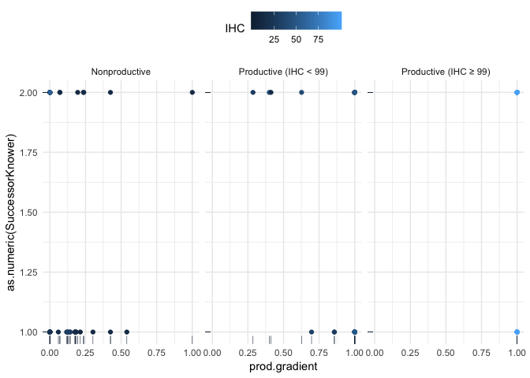<!-- -->

```r
ggsave("graphs/reg-endless.png", height = 7, width = 7)

# twofactors
plot_models(model.prod.nn.endless, model.prod.ihc.endless, model.nn.ihc.endless, 
    transform = "plogis", show.values = T, show.p = T, grid = T, colors = "Dark2", 
    show.intercept = T, spacing = 0.7, m.labels = c("Model 1: Prod+NN", "Model 2: Prod+IHC", 
        "Model 3: NN+IHC"), show.legend = F, title = "Regression analysis, Endless Knowledge, all participants", 
    axis.labels = c(Age.c = "Age", wcnscore.c = "Next Number accuracy", IHC.c = "Initial Highest Count", 
        Productivity1 = "Productivity Status", prod.gradient.c = "Productivity Gradient"), 
    axis.title = "Endorsement Probability", axis.lim = c(0, 1)) + theme_bw() + ggplot2::geom_hline(yintercept = 0.5, 
    linetype = "dashed")
```

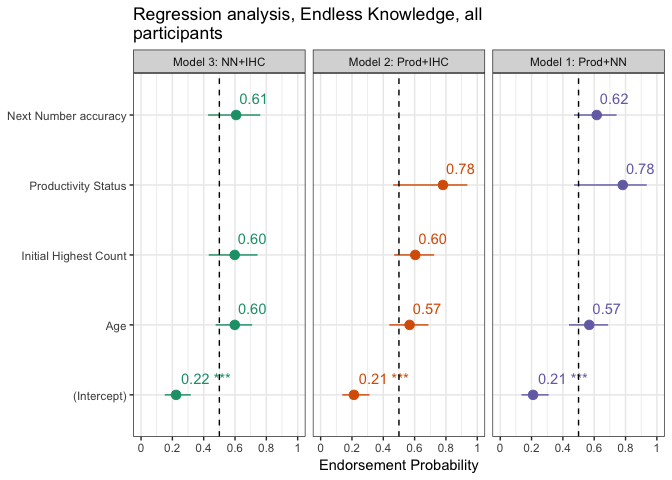<!-- -->

```r
# graph
plot_model(large.endless.full, transform = "plogis", show.values = T, show.p = T, 
    colors = "Dark2", show.intercept = T, spacing = 0.7, title = "Regression analysis, Endless Knowledge, all participants", 
    axis.labels = c(Age.c = "Age", wcnscore.c = "Next Number accuracy", IHC.c = "Initial Highest Count", 
        Productivity1 = "Productivity Status", prod.gradient.c = "Productivity Gradient"), 
    axis.title = "Endorsement Probability", axis.lim = c(0, 1)) + theme_bw() + ggplot2::geom_hline(yintercept = 0.5, 
    linetype = "dashed")
```

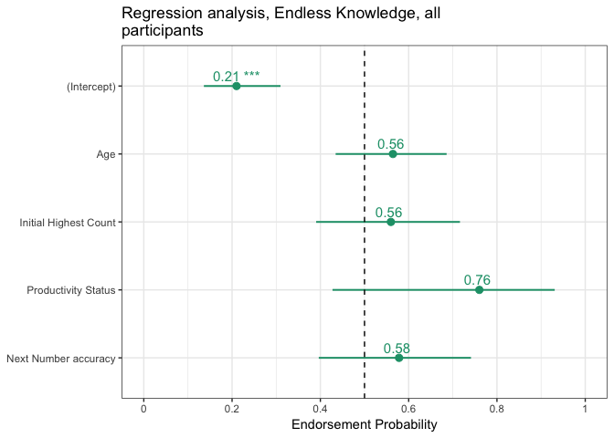<!-- -->

```r
ggsave("graphs/reg-large.png", height = 7, width = 7)
```

Visualize relationship between IHC and SuccessorKnowledge, by productivity

```r
distinct_model.df %>% ggplot(data = ., mapping = aes(x = IHC, y = EndlessKnower, 
    color = Productivity, group = Productivity)) + geom_point(alpha = 0.2, size = 2) + 
    geom_smooth(method = "glm", method.args = list(family = "binomial"), alpha = 0.2, 
        aes(fill = Productivity)) + scale_color_manual(values = mypalette, name = "Productivity") + 
    scale_fill_manual(values = mypalette, name = "Productivity")
```

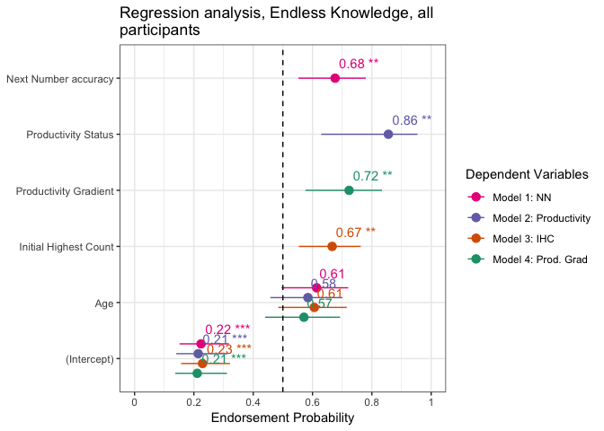<!-- -->


### Full Infinity Knowledge models

```r
###MODEL BUILDING AND COMPARISONS###
#base model for successor knower
base.infinity <- glm(InfinityKnower ~ Age.c, family = "binomial", 
                        data = distinct_model.df)

##IHC model
model.ihc.infinity <- glm(InfinityKnower ~ IHC.c + Age.c, family = "binomial", 
                             data = distinct_model.df)
##Highest NN Model
model.nn.infinity <- glm(InfinityKnower ~ wcnscore.c + Age.c, family = "binomial", 
                            data = distinct_model.df)
##Productivity model
model.prod.infinity <- glm(InfinityKnower ~ Productivity + Age.c, family = "binomial",
                              data = distinct_model.df)

##Gain Score model
model.gain.infinity <- glm(InfinityKnower ~ prod.gradient.c + Age.c, family = "binomial",
                              data = distinct_model.df)

##Regression table for Infinity Knower Models (Table 4)
mtable.inf.knowers <- mtable('Base' = base.infinity,
            'IHC' = model.ihc.infinity,
            'NN' = model.nn.infinity,
            'Prod. Group' = model.prod.infinity,
            'Prod. Gain' = model.gain.infinity,
            #summary.stats = c('R-squared','F','p','N'))
            summary.stats = c('Nagelkerke R-sq.','Log-likelihood','AIC','N'))
mtable.inf.knowers
```

```
## 
## Calls:
## Base: glm(formula = InfinityKnower ~ Age.c, family = "binomial", data = distinct_model.df)
## IHC: glm(formula = InfinityKnower ~ IHC.c + Age.c, family = "binomial", 
##     data = distinct_model.df)
## NN: glm(formula = InfinityKnower ~ wcnscore.c + Age.c, family = "binomial", 
##     data = distinct_model.df)
## Prod. Group: glm(formula = InfinityKnower ~ Productivity + Age.c, family = "binomial", 
##     data = distinct_model.df)
## Prod. Gain: glm(formula = InfinityKnower ~ prod.gradient.c + Age.c, family = "binomial", 
##     data = distinct_model.df)
## 
## =================================================================================
##                        Base        IHC          NN      Prod. Group  Prod. Gain  
## ---------------------------------------------------------------------------------
##   (Intercept)        -1.701***   -1.741***   -1.802***   -1.814***    -1.810***  
##                      (0.270)     (0.278)     (0.293)     (0.302)      (0.301)    
##   Age.c               0.793**     0.592*      0.547       0.493        0.478     
##                      (0.260)     (0.290)     (0.284)     (0.300)      (0.309)    
##   IHC.c                           0.405                                          
##                                  (0.274)                                         
##   wcnscore.c                                  0.610*                             
##                                              (0.308)                             
##   Productivity: 1                                         1.292                  
##                                                          (0.734)                 
##   prod.gradient.c                                                      0.642     
##                                                                       (0.371)    
## ---------------------------------------------------------------------------------
##   Nagelkerke R-sq.    0.131       0.156       0.180       0.172        0.171     
##   Log-likelihood    -54.780     -53.703     -52.661     -53.029      -53.077     
##   AIC               113.559     113.406     111.323     112.058      112.154     
##   N                 127         127         127         127          127         
## =================================================================================
```

```r
# save as txt
write.mtable(mtable.inf.knowers, file="graphs/table4-all.txt")
```

#### Model comparisons

```r
# base v. IHC
anova(base.infinity, model.ihc.infinity, test = "LRT")  #n.s.
```

```
## Analysis of Deviance Table
## 
## Model 1: InfinityKnower ~ Age.c
## Model 2: InfinityKnower ~ IHC.c + Age.c
##   Resid. Df Resid. Dev Df Deviance Pr(>Chi)
## 1       125     109.56                     
## 2       124     107.41  1   2.1539   0.1422
```

```r
# base v. highest contiguous
anova(base.infinity, model.nn.infinity, test = "LRT")  # significant.
```

```
## Analysis of Deviance Table
## 
## Model 1: InfinityKnower ~ Age.c
## Model 2: InfinityKnower ~ wcnscore.c + Age.c
##   Resid. Df Resid. Dev Df Deviance Pr(>Chi)  
## 1       125     109.56                       
## 2       124     105.32  1   4.2367  0.03956 *
## ---
## Signif. codes:  0 '***' 0.001 '**' 0.01 '*' 0.05 '.' 0.1 ' ' 1
```

```r
# base v. productivity
anova(base.infinity, model.prod.infinity, test = "LRT")  #n.s. 
```

```
## Analysis of Deviance Table
## 
## Model 1: InfinityKnower ~ Age.c
## Model 2: InfinityKnower ~ Productivity + Age.c
##   Resid. Df Resid. Dev Df Deviance Pr(>Chi)  
## 1       125     109.56                       
## 2       124     106.06  1   3.5018   0.0613 .
## ---
## Signif. codes:  0 '***' 0.001 '**' 0.01 '*' 0.05 '.' 0.1 ' ' 1
```

```r
# base v. productivity gradient
anova(base.infinity, model.gain.infinity, test = "LRT")  #n.s.
```

```
## Analysis of Deviance Table
## 
## Model 1: InfinityKnower ~ Age.c
## Model 2: InfinityKnower ~ prod.gradient.c + Age.c
##   Resid. Df Resid. Dev Df Deviance Pr(>Chi)  
## 1       125     109.56                       
## 2       124     106.15  1   3.4049    0.065 .
## ---
## Signif. codes:  0 '***' 0.001 '**' 0.01 '*' 0.05 '.' 0.1 ' ' 1
```

#### Visualize

```r
plot_models(model.nn.infinity, model.prod.infinity, model.ihc.infinity, model.gain.infinity, 
    transform = "plogis", show.values = T, show.p = T, colors = "Dark2", show.intercept = T, 
    spacing = 0.7, m.labels = c("Model 1: NN", "Model 2: Productivity", "Model 3: IHC", 
        "Model 4: Prod. Grad"), show.legend = T, title = "Regression analysis, Infinity Knowledge, all participants", 
    axis.labels = c(Age.c = "Age", wcnscore.c = "Next Number accuracy", IHC.c = "Initial Highest Count", 
        Productivity1 = "Productivity Status", prod.gradient.c = "Productivity Gradient"), 
    axis.title = "Endorsement Probability", axis.lim = c(0, 1)) + theme_bw() + ggplot2::geom_hline(yintercept = 0.5, 
    linetype = "dashed")
```

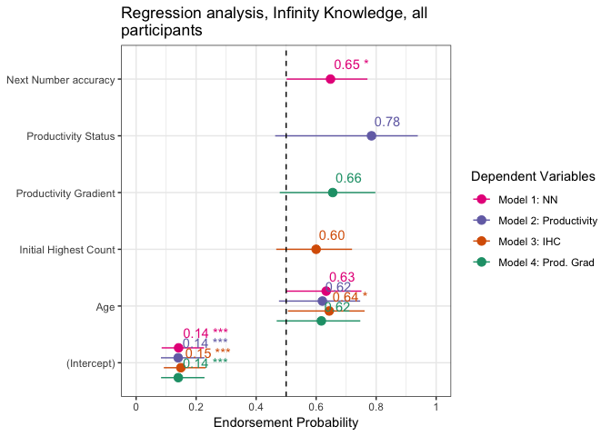<!-- -->

```r
ggsave("graphs/reg-infinity.png", height = 7, width = 7)
```


### Graph maximal models

```r
large.successor.full.grad <- glm(SuccessorKnower ~ prod.gradient.c + wcnscore.c + 
    IHC.c + Age.c, family = "binomial", data = distinct_model.df)
large.endless.full.grad <- glm(EndlessKnower ~ prod.gradient.c + wcnscore.c + IHC.c + 
    Age.c, family = "binomial", data = distinct_model.df)
large.inf.full.grad <- glm(InfinityKnower ~ prod.gradient.c + wcnscore.c + IHC.c + 
    Age.c, family = "binomial", data = distinct_model.df)

# plot all 3 together
plot_models(large.successor.full.grad, large.endless.full.grad, large.inf.full.grad, 
    transform = "plogis", show.values = TRUE, show.p = T, grid = T, colors = "bw", 
    show.intercept = T, m.labels = c(SuccessorKnower = "Succesor: Can always +1", 
        EndlessKnower = "Endless: Numbers go forever", InfinityKnower = "Full Infinity knowledge"), 
    show.legend = F, title = "Regression analysis, all participants", axis.labels = c(Age.c = "Age", 
        wcnscore.c = "Next Number accuracy", IHC.c = "Initial Highest Count", Productivity1 = "Productivity Status", 
        prod.gradient.c = "Productivity Gradient"), axis.title = "Endorsement Probability") + 
    theme_bw() + ggplot2::geom_hline(yintercept = 0.5, linetype = "dashed")
```

## Correlations between variables
### LM predicting IHC from NN accuracy and age

```r
lm3 <- lm(IHC ~ wcnscore + Age.c, data = distinct_model.df)
summary(lm3)
```

```
## 
## Call:
## lm(formula = IHC ~ wcnscore + Age.c, data = distinct_model.df)
## 
## Residuals:
##     Min      1Q  Median      3Q     Max 
## -48.269 -12.362   2.255  13.624  58.685 
## 
## Coefficients:
##             Estimate Std. Error t value Pr(>|t|)    
## (Intercept)  14.3437     3.5898   3.996  0.00011 ***
## wcnscore      8.3340     0.7453  11.182  < 2e-16 ***
## Age.c         6.8249     2.0753   3.289  0.00131 ** 
## ---
## Signif. codes:  0 '***' 0.001 '**' 0.01 '*' 0.05 '.' 0.1 ' ' 1
## 
## Residual standard error: 20.43 on 124 degrees of freedom
## Multiple R-squared:  0.6423,	Adjusted R-squared:  0.6365 
## F-statistic: 111.3 on 2 and 124 DF,  p-value: < 2.2e-16
```


## Regressions no ihc=99

### prep

```r
distinct_model.df2 <- model.df %>% filter(Productivity.tertiary != "Productive (IHC ≥ 99)") %>% 
    mutate(IHC.c = as.vector(scale(IHC, center = TRUE, scale = TRUE)), Age.c = as.vector(scale(Age, 
        center = TRUE, scale = TRUE)), prod.gradient.c = as.vector(scale(prod.gradient, 
        center = TRUE, scale = TRUE)), wcnscore.c = as.vector(scale(wcnscore, center = TRUE, 
        scale = TRUE)))
# weighted effect coding for productivity
wec <- mean(as.numeric(distinct_model.df2$Productivity) - 1)
contrasts(distinct_model.df2$Productivity) <- c(-wec, 1 - wec)
str(distinct_model.df2)
```

```
## 'data.frame':	95 obs. of  16 variables:
##  $ LadlabID             : Factor w/ 127 levels "010516-K4","010916-D5",..: 1 3 4 5 6 7 8 9 10 11 ...
##  $ Age                  : num  4.17 4 4.44 4.12 4.41 4.75 4.46 5.42 4.25 4.6 ...
##  $ AgeGroup             : Factor w/ 6 levels "4-4.5y","4.5-5y",..: 1 1 1 1 1 2 1 3 1 2 ...
##  $ Gender               : Factor w/ 5 levels "f","F","m","M",..: 1 1 3 1 1 1 1 2 1 3 ...
##  $ SuccessorKnower      : Factor w/ 2 levels "0","1": 1 2 1 1 1 1 2 1 2 2 ...
##  $ EndlessKnower        : Factor w/ 2 levels "0","1": 1 1 2 1 1 1 1 1 1 1 ...
##  $ InfinityKnower       : Factor w/ 2 levels "0","1": 1 1 1 1 1 1 1 1 1 1 ...
##  $ IHC                  : int  13 5 15 39 29 26 20 39 29 13 ...
##  $ Productivity         : Factor w/ 2 levels "Nonproductive",..: 1 1 1 1 2 1 1 2 2 1 ...
##   ..- attr(*, "contrasts")= num [1:2, 1] -0.432 0.568
##   .. ..- attr(*, "dimnames")=List of 2
##   .. .. ..$ : chr  "Nonproductive" "Productive"
##   .. .. ..$ : NULL
##  $ Productivity.tertiary: chr  "Nonproductive" "Nonproductive" "Nonproductive" "Nonproductive" ...
##  $ prod.gradient        : num  0.186 0 0.179 0 0.857 ...
##  $ wcnscore             : int  0 0 1 2 0 6 1 8 3 0 ...
##  $ IHC.c                : num  -0.997 -1.421 -0.891 0.38 -0.149 ...
##  $ Age.c                : num  -1.274 -1.588 -0.775 -1.367 -0.831 ...
##  $ prod.gradient.c      : num  -0.623 -1.04 -0.64 -1.04 0.879 ...
##  $ wcnscore.c           : num  -1.318 -1.318 -0.895 -0.472 -1.318 ...
```

### Successor models

```r
###MODEL BUILDING AND COMPARISONS###
#base model for successor knower
base.successor2 <- glm(SuccessorKnower ~ Age.c, family = "binomial", 
                        data = distinct_model.df2)

##IHC model##
model.ihc.successor2 <- glm(SuccessorKnower ~ IHC.c + Age.c, family = "binomial", 
                             data = distinct_model.df2)
##NN Model##
model.nn.successor2 <- glm(SuccessorKnower ~ wcnscore.c + Age.c, family = "binomial", 
                            data = distinct_model.df2)
##Productivity model##
model.prod.successor2 <- glm(SuccessorKnower ~ Productivity + Age.c, family = "binomial",
                              data = distinct_model.df2)

##EXPLORATORY## - GAIN SCORE
model.gain.successor2 <- glm(SuccessorKnower ~ prod.gradient.c + Age.c, family = "binomial",
                              data = distinct_model.df2)

##Regression table for Successor Knower Models (Table 2)
mtable.sf.knowers2 <- mtable('Base' = base.successor2,
            'IHC' = model.ihc.successor2,
            'NN' = model.nn.successor2,
            'Productivity' = model.prod.successor2,
            'Prod. gain' = model.gain.successor2,
            #summary.stats = c('R-squared','F','p','N'))
            summary.stats = c('Nagelkerke R-sq.','Log-likelihood','AIC','N'))
mtable.sf.knowers2
```

```
## 
## Calls:
## Base: glm(formula = SuccessorKnower ~ Age.c, family = "binomial", data = distinct_model.df2)
## IHC: glm(formula = SuccessorKnower ~ IHC.c + Age.c, family = "binomial", 
##     data = distinct_model.df2)
## NN: glm(formula = SuccessorKnower ~ wcnscore.c + Age.c, family = "binomial", 
##     data = distinct_model.df2)
## Productivity: glm(formula = SuccessorKnower ~ Productivity + Age.c, family = "binomial", 
##     data = distinct_model.df2)
## Prod. gain: glm(formula = SuccessorKnower ~ prod.gradient.c + Age.c, family = "binomial", 
##     data = distinct_model.df2)
## 
## ============================================================================
##                       Base      IHC        NN     Productivity  Prod. gain  
## ----------------------------------------------------------------------------
##   (Intercept)        -0.504*   -0.531*   -0.507*     -0.507*      -0.505*   
##                      (0.214)   (0.221)   (0.215)     (0.215)      (0.214)   
##   Age.c               0.295     0.638*    0.372       0.169        0.224    
##                      (0.215)   (0.283)   (0.239)     (0.263)      (0.270)   
##   IHC.c                        -0.579*                                      
##                                (0.295)                                      
##   wcnscore.c                             -0.182                             
##                                          (0.240)                            
##   Productivity: 1                                     0.435                 
##                                                      (0.526)                
##   prod.gradient.c                                                  0.116    
##                                                                   (0.269)   
## ----------------------------------------------------------------------------
##   Nagelkerke R-sq.    0.027     0.086     0.035       0.037        0.030    
##   Log-likelihood    -62.082   -59.941   -61.792     -61.740      -61.989    
##   AIC               128.163   125.881   129.583     129.480      129.979    
##   N                  95        95        95          95           95        
## ============================================================================
```

```r
write.mtable(mtable.sf.knowers2, file="graphs/table2.txt")
```

#### Model comparisons
Looks like only IHC is a significant predictor. 

```r
# base v. IHC
anova(base.successor2, model.ihc.successor2, test = "LRT")  #IHC significant
```

```
## Analysis of Deviance Table
## 
## Model 1: SuccessorKnower ~ Age.c
## Model 2: SuccessorKnower ~ IHC.c + Age.c
##   Resid. Df Resid. Dev Df Deviance Pr(>Chi)  
## 1        93     124.16                       
## 2        92     119.88  1   4.2821  0.03852 *
## ---
## Signif. codes:  0 '***' 0.001 '**' 0.01 '*' 0.05 '.' 0.1 ' ' 1
```

```r
# NN v. base
anova(base.successor2, model.nn.successor2, test = "LRT")  #NN not significant
```

```
## Analysis of Deviance Table
## 
## Model 1: SuccessorKnower ~ Age.c
## Model 2: SuccessorKnower ~ wcnscore.c + Age.c
##   Resid. Df Resid. Dev Df Deviance Pr(>Chi)
## 1        93     124.16                     
## 2        92     123.58  1     0.58   0.4463
```

```r
# Productivity v. base
anova(base.successor2, model.prod.successor2, test = "LRT")  # n.s.
```

```
## Analysis of Deviance Table
## 
## Model 1: SuccessorKnower ~ Age.c
## Model 2: SuccessorKnower ~ Productivity + Age.c
##   Resid. Df Resid. Dev Df Deviance Pr(>Chi)
## 1        93     124.16                     
## 2        92     123.48  1  0.68363   0.4083
```

```r
## Exploratory vs. base
anova(base.successor2, model.gain.successor2, test = "LRT")  # n.s.
```

```
## Analysis of Deviance Table
## 
## Model 1: SuccessorKnower ~ Age.c
## Model 2: SuccessorKnower ~ prod.gradient.c + Age.c
##   Resid. Df Resid. Dev Df Deviance Pr(>Chi)
## 1        93     124.16                     
## 2        92     123.98  1  0.18418   0.6678
```

#### best model

```r
summary(model.ihc.successor2)
```

```
## 
## Call:
## glm(formula = SuccessorKnower ~ IHC.c + Age.c, family = "binomial", 
##     data = distinct_model.df2)
## 
## Deviance Residuals: 
##     Min       1Q   Median       3Q      Max  
## -1.4924  -0.9741  -0.7624   1.2503   1.7527  
## 
## Coefficients:
##             Estimate Std. Error z value Pr(>|z|)  
## (Intercept)  -0.5311     0.2207  -2.407   0.0161 *
## IHC.c        -0.5793     0.2948  -1.965   0.0495 *
## Age.c         0.6376     0.2829   2.254   0.0242 *
## ---
## Signif. codes:  0 '***' 0.001 '**' 0.01 '*' 0.05 '.' 0.1 ' ' 1
## 
## (Dispersion parameter for binomial family taken to be 1)
## 
##     Null deviance: 126.07  on 94  degrees of freedom
## Residual deviance: 119.88  on 92  degrees of freedom
## AIC: 125.88
## 
## Number of Fisher Scoring iterations: 4
```

```r
plot_model(model.ihc.successor2, type = "pred")
```

```
## $IHC.c
```

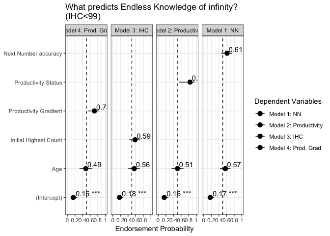<!-- -->

```
## 
## $Age.c
```

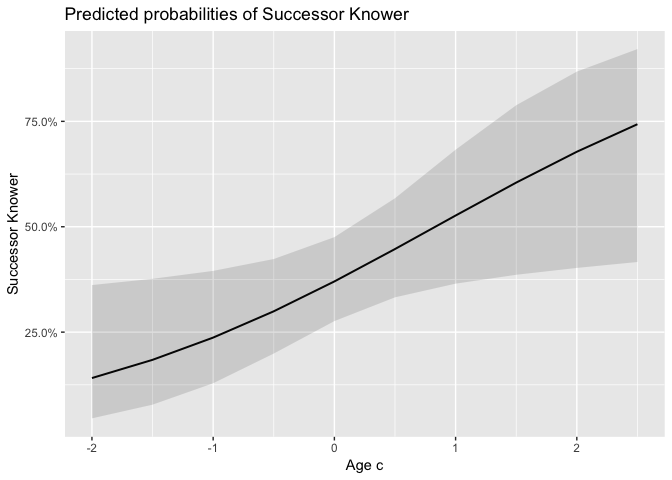<!-- -->

### Endless Models

```r
# Base model
base.endless2 <- glm(EndlessKnower ~ Age.c, family = "binomial", data = distinct_model.df2)

### IHC MODEL###
model.ihc.endless2 <- glm(EndlessKnower ~ IHC.c + Age.c, family = "binomial", data = distinct_model.df2)

### WCN MODEL###
model.nn.endless2 <- glm(EndlessKnower ~ wcnscore.c + Age.c, family = "binomial", 
    data = distinct_model.df2)

### PRODUCTIVITY MODEL###
model.prod.endless2 <- glm(EndlessKnower ~ Productivity + Age.c, family = "binomial", 
    data = distinct_model.df2)

## EXPLORATORY## - GAIN SCORE
model.gain.endless2 <- glm(EndlessKnower ~ prod.gradient.c + Age.c, family = "binomial", 
    data = distinct_model.df2)

## Regression table for Endless Models
mtable.endless.knowers2 <- mtable(Base = base.endless2, IHC = model.ihc.endless2, 
    NN = model.nn.endless2, Productivity = model.prod.endless2, `Prod. gradient` = model.gain.endless2, 
    summary.stats = c("Nagelkerke R-sq.", "Log-likelihood", "AIC", "F", "p", "N"))

mtable.endless.knowers2
```

```
## 
## Calls:
## Base: glm(formula = EndlessKnower ~ Age.c, family = "binomial", data = distinct_model.df2)
## IHC: glm(formula = EndlessKnower ~ IHC.c + Age.c, family = "binomial", 
##     data = distinct_model.df2)
## NN: glm(formula = EndlessKnower ~ wcnscore.c + Age.c, family = "binomial", 
##     data = distinct_model.df2)
## Productivity: glm(formula = EndlessKnower ~ Productivity + Age.c, family = "binomial", 
##     data = distinct_model.df2)
## Prod. gradient: glm(formula = EndlessKnower ~ prod.gradient.c + Age.c, family = "binomial", 
##     data = distinct_model.df2)
## 
## ======================================================================================
##                        Base        IHC          NN      Productivity  Prod. gradient  
## --------------------------------------------------------------------------------------
##   (Intercept)        -1.602***   -1.631***   -1.674***    -1.767***      -1.795***    
##                      (0.286)     (0.292)     (0.303)      (0.329)        (0.336)      
##   Age.c               0.501       0.297       0.308        0.040         -0.059       
##                      (0.271)     (0.325)     (0.297)      (0.334)        (0.360)      
##   IHC.c                           0.362                                               
##                                  (0.314)                                              
##   wcnscore.c                                  0.510                                   
##                                              (0.310)                                  
##   Productivity: 1                                          1.711*                     
##                                                           (0.731)                     
##   prod.gradient.c                                                         0.965*      
##                                                                          (0.396)      
## --------------------------------------------------------------------------------------
##   Nagelkerke R-sq.    0.059       0.081       0.106        0.157          0.170       
##   Log-likelihood    -42.880     -42.229     -41.473      -39.862        -39.434       
##   AIC                89.760      90.458      88.945       85.724         84.869       
##   p                   0.061       0.091       0.043        0.008          0.006       
##   N                  95          95          95           95             95           
## ======================================================================================
```

```r
write.mtable(mtable.endless.knowers2, file = "graphs/table3.txt")
```

#### Model comparisons
Only productivity (& productivity gain) is significant

```r
# base v. IHC
anova(base.endless2, model.ihc.endless2, test = "LRT")  #IHC not significant
```

```
## Analysis of Deviance Table
## 
## Model 1: EndlessKnower ~ Age.c
## Model 2: EndlessKnower ~ IHC.c + Age.c
##   Resid. Df Resid. Dev Df Deviance Pr(>Chi)
## 1        93     85.760                     
## 2        92     84.458  1   1.3023   0.2538
```

```r
# base v. highest contiguous
anova(model.nn.endless2, base.endless2, test = "LRT")  #not significant
```

```
## Analysis of Deviance Table
## 
## Model 1: EndlessKnower ~ wcnscore.c + Age.c
## Model 2: EndlessKnower ~ Age.c
##   Resid. Df Resid. Dev Df Deviance Pr(>Chi)  
## 1        92     82.945                       
## 2        93     85.760 -1   -2.815  0.09338 .
## ---
## Signif. codes:  0 '***' 0.001 '**' 0.01 '*' 0.05 '.' 0.1 ' ' 1
```

```r
# base v. productivity
anova(model.prod.endless2, base.endless2, test = "LRT")  #Prod significant
```

```
## Analysis of Deviance Table
## 
## Model 1: EndlessKnower ~ Productivity + Age.c
## Model 2: EndlessKnower ~ Age.c
##   Resid. Df Resid. Dev Df Deviance Pr(>Chi)  
## 1        92     79.724                       
## 2        93     85.760 -1  -6.0366  0.01401 *
## ---
## Signif. codes:  0 '***' 0.001 '**' 0.01 '*' 0.05 '.' 0.1 ' ' 1
```

```r
## Exploratory base v. productivity gradient
anova(base.endless2, model.gain.endless2, test = "LRT")  # prod. gradient significant
```

```
## Analysis of Deviance Table
## 
## Model 1: EndlessKnower ~ Age.c
## Model 2: EndlessKnower ~ prod.gradient.c + Age.c
##   Resid. Df Resid. Dev Df Deviance Pr(>Chi)   
## 1        93     85.760                        
## 2        92     78.869  1   6.8917  0.00866 **
## ---
## Signif. codes:  0 '***' 0.001 '**' 0.01 '*' 0.05 '.' 0.1 ' ' 1
```


### Full Infinity Knowledge models

```r
###MODEL BUILDING AND COMPARISONS###
#base model for successor knower
base.infinity2 <- glm(InfinityKnower ~ Age.c, family = "binomial", 
                        data = distinct_model.df2)

##IHC model
model.ihc.infinity2 <- glm(InfinityKnower ~ IHC.c + Age.c, family = "binomial", 
                             data = distinct_model.df2)
##Highest NN Model
model.nn.infinity2 <- glm(InfinityKnower ~ wcnscore.c + Age.c, family = "binomial", 
                            data = distinct_model.df2)
##Productivity model
model.prod.infinity2 <- glm(InfinityKnower ~ Productivity + Age.c, family = "binomial",
                              data = distinct_model.df2)

##Gain Score model
model.gain.infinity2 <- glm(InfinityKnower ~ prod.gradient.c + Age.c, family = "binomial",
                              data = distinct_model.df2)

##Regression table for Infinity Knower Models (Table 4)
mtable.inf.knowers2 <- mtable('Base' = base.infinity2,
            'IHC' = model.ihc.infinity2,
            'NN' = model.nn.infinity2,
            'Prod. Group' = model.prod.infinity2,
            'Prod. Gain' = model.gain.infinity2,
            #summary.stats = c('R-squared','F','p','N'))
            summary.stats = c('Nagelkerke R-sq.','Log-likelihood','AIC','N'))
mtable.inf.knowers2
```

```
## 
## Calls:
## Base: glm(formula = InfinityKnower ~ Age.c, family = "binomial", data = distinct_model.df2)
## IHC: glm(formula = InfinityKnower ~ IHC.c + Age.c, family = "binomial", 
##     data = distinct_model.df2)
## NN: glm(formula = InfinityKnower ~ wcnscore.c + Age.c, family = "binomial", 
##     data = distinct_model.df2)
## Prod. Group: glm(formula = InfinityKnower ~ Productivity + Age.c, family = "binomial", 
##     data = distinct_model.df2)
## Prod. Gain: glm(formula = InfinityKnower ~ prod.gradient.c + Age.c, family = "binomial", 
##     data = distinct_model.df2)
## 
## =================================================================================
##                        Base        IHC          NN      Prod. Group  Prod. Gain  
## ---------------------------------------------------------------------------------
##   (Intercept)        -2.055***   -2.057***   -2.095***   -2.170***    -2.164***  
##                      (0.341)     (0.342)     (0.353)     (0.378)      (0.375)    
##   Age.c               0.572       0.532       0.440       0.223        0.195     
##                      (0.314)     (0.378)     (0.342)     (0.380)      (0.401)    
##   IHC.c                           0.071                                          
##                                  (0.371)                                         
##   wcnscore.c                                  0.345                              
##                                              (0.352)                             
##   Productivity: 1                                         1.305                  
##                                                          (0.830)                 
##   prod.gradient.c                                                      0.657     
##                                                                       (0.432)    
## ---------------------------------------------------------------------------------
##   Nagelkerke R-sq.    0.067       0.068       0.086       0.117        0.115     
##   Log-likelihood    -34.311     -34.293     -33.823     -32.990      -33.048     
##   AIC                72.623      74.586      73.645      71.980       72.097     
##   N                  95          95          95          95           95         
## =================================================================================
```

```r
# save as txt
write.mtable(mtable.inf.knowers2, file="graphs/table4.txt")
```

#### Model comparisons
No variable is predictive. 

```r
# base v. IHC
anova(base.infinity2, model.ihc.infinity2, test = "LRT")  #n.s.
```

```
## Analysis of Deviance Table
## 
## Model 1: InfinityKnower ~ Age.c
## Model 2: InfinityKnower ~ IHC.c + Age.c
##   Resid. Df Resid. Dev Df Deviance Pr(>Chi)
## 1        93     68.623                     
## 2        92     68.586  1 0.036597   0.8483
```

```r
# base v. highest contiguous
anova(base.infinity2, model.nn.infinity2, test = "LRT")  # n.s.
```

```
## Analysis of Deviance Table
## 
## Model 1: InfinityKnower ~ Age.c
## Model 2: InfinityKnower ~ wcnscore.c + Age.c
##   Resid. Df Resid. Dev Df Deviance Pr(>Chi)
## 1        93     68.623                     
## 2        92     67.645  1   0.9775   0.3228
```

```r
# base v. productivity
anova(base.infinity2, model.prod.infinity2, test = "LRT")  #n.s. 
```

```
## Analysis of Deviance Table
## 
## Model 1: InfinityKnower ~ Age.c
## Model 2: InfinityKnower ~ Productivity + Age.c
##   Resid. Df Resid. Dev Df Deviance Pr(>Chi)
## 1        93     68.623                     
## 2        92     65.980  1   2.6427    0.104
```

```r
# base v. productivity gradient
anova(base.infinity2, model.gain.infinity2, test = "LRT")  #n.s.
```

```
## Analysis of Deviance Table
## 
## Model 1: InfinityKnower ~ Age.c
## Model 2: InfinityKnower ~ prod.gradient.c + Age.c
##   Resid. Df Resid. Dev Df Deviance Pr(>Chi)
## 1        93     68.623                     
## 2        92     66.097  1   2.5264    0.112
```

### Visualizations

```r
large.endless.full2 <- glm(EndlessKnower ~ Productivity + wcnscore.c + IHC.c + Age.c, 
    family = "binomial", data = distinct_model.df2)
large.successor.full2 <- glm(SuccessorKnower ~ Productivity + wcnscore.c + IHC.c + 
    Age.c, family = "binomial", data = distinct_model.df2)
large.inf.full2 <- glm(InfinityKnower ~ Productivity + wcnscore.c + IHC.c + Age.c, 
    family = "binomial", data = distinct_model.df2)
# plot all 3 together
plot_models(large.successor.full2, large.endless.full2, large.inf.full2, transform = "plogis", 
    show.values = TRUE, show.p = T, grid = T, colors = "bw", show.intercept = T, 
    m.labels = c(SuccessorKnower = "Succesor: Can always +1", EndlessKnower = "Endless: Numbers go forever", 
        InfinityKnower = "Full Infinity knowledge"), show.legend = F, title = "Regression analysis, exclude IHC ≥ 99", 
    axis.labels = c(Age.c = "Age", wcnscore.c = "Next Number accuracy", IHC.c = "Initial Highest Count", 
        Productivity1 = "Productivity Status"), axis.title = "Endorsement Probability") + 
    theme_bw() + ggplot2::geom_hline(yintercept = 0.5, linetype = "dashed")
```

## Regressions productive kids only

### prep

```r
distinct_model.df3 <- model.df %>% filter(Productivity.tertiary != "Nonproductive") %>% 
    mutate(Productivity.tertiary = factor(Productivity.tertiary), IHC.c = as.vector(scale(IHC, 
        center = TRUE, scale = TRUE)), Age.c = as.vector(scale(Age, center = TRUE, 
        scale = TRUE)), prod.gradient.c = as.vector(scale(prod.gradient, center = TRUE, 
        scale = TRUE)), wcnscore.c = as.vector(scale(wcnscore, center = TRUE, scale = TRUE)))
# weighted effect coding for productivity
wec <- mean(as.numeric(distinct_model.df3$Productivity.tertiary) - 1)
contrasts(distinct_model.df3$Productivity.tertiary) <- c(-wec, 1 - wec)
```

### Successor models

```r
###MODEL BUILDING AND COMPARISONS###
#base model for successor knower
base.successor3 <- glm(SuccessorKnower ~ Age.c, family = "binomial", 
                        data = distinct_model.df3)

##IHC model##
model.ihc.successor3 <- glm(SuccessorKnower ~ IHC.c + Age.c, family = "binomial", 
                             data = distinct_model.df3)
##NN Model##
model.nn.successor3 <- glm(SuccessorKnower ~ wcnscore.c + Age.c, family = "binomial", 
                            data = distinct_model.df3)
##Productivity model##
model.prod.successor3 <- glm(SuccessorKnower ~ Productivity.tertiary + Age.c, family = "binomial",
                              data = distinct_model.df3)

##EXPLORATORY## - GAIN SCORE
model.gain.successor3 <- glm(SuccessorKnower ~ prod.gradient.c + Age.c, family = "binomial",
                              data = distinct_model.df3)

##Regression table for Successor Knower Models (Table 3)
mtable.sf.knowers3 <- mtable('Base' = base.successor3,
            'IHC' = model.ihc.successor3,
            'NN' = model.nn.successor3,
            'Productivity' = model.prod.successor3,
            'Prod. gain' = model.gain.successor3,
            #summary.stats = c('R-squared','F','p','N'))
            summary.stats = c('Nagelkerke R-sq.','Log-likelihood','AIC','N'))
mtable.sf.knowers3
```

```
## 
## Calls:
## Base: glm(formula = SuccessorKnower ~ Age.c, family = "binomial", data = distinct_model.df3)
## IHC: glm(formula = SuccessorKnower ~ IHC.c + Age.c, family = "binomial", 
##     data = distinct_model.df3)
## NN: glm(formula = SuccessorKnower ~ wcnscore.c + Age.c, family = "binomial", 
##     data = distinct_model.df3)
## Productivity: glm(formula = SuccessorKnower ~ Productivity.tertiary + Age.c, 
##     family = "binomial", data = distinct_model.df3)
## Prod. gain: glm(formula = SuccessorKnower ~ prod.gradient.c + Age.c, family = "binomial", 
##     data = distinct_model.df3)
## 
## ====================================================================================
##                               Base      IHC        NN     Productivity  Prod. gain  
## ------------------------------------------------------------------------------------
##   (Intercept)                 0.027     0.027     0.027       0.028        0.042    
##                              (0.234)   (0.234)   (0.235)     (0.235)      (0.240)   
##   Age.c                       0.059     0.069     0.036       0.041        0.158    
##                              (0.236)   (0.239)   (0.241)     (0.238)      (0.249)   
##   IHC.c                                -0.056                                       
##                                        (0.239)                                      
##   wcnscore.c                                      0.124                             
##                                                  (0.241)                            
##   Productivity.tertiary: 1                                    0.390                 
##                                                              (0.476)                
##   prod.gradient.c                                                         -0.421    
##                                                                           (0.317)   
## ------------------------------------------------------------------------------------
##   Nagelkerke R-sq.            0.001     0.002     0.006       0.013        0.043    
##   Log-likelihood            -50.561   -50.534   -50.428     -50.224      -49.408    
##   AIC                       105.123   107.068   106.856     106.448      104.815    
##   N                          73        73        73          73           73        
## ====================================================================================
```

```r
write.mtable(mtable.sf.knowers3, file="graphs/table2-prodonly.txt")
```

#### Model comparisons
Productivity gradient marginally significant, in negative direction.

```r
# base v. IHC
anova(base.successor3, model.ihc.successor3, test = "LRT")  #n.s.
```

```
## Analysis of Deviance Table
## 
## Model 1: SuccessorKnower ~ Age.c
## Model 2: SuccessorKnower ~ IHC.c + Age.c
##   Resid. Df Resid. Dev Df Deviance Pr(>Chi)
## 1        71     101.12                     
## 2        70     101.07  1  0.05408   0.8161
```

```r
# NN v. base
anova(base.successor3, model.nn.successor3, test = "LRT")  #n.s.
```

```
## Analysis of Deviance Table
## 
## Model 1: SuccessorKnower ~ Age.c
## Model 2: SuccessorKnower ~ wcnscore.c + Age.c
##   Resid. Df Resid. Dev Df Deviance Pr(>Chi)
## 1        71     101.12                     
## 2        70     100.86  1  0.26686   0.6054
```

```r
# Productivity v. base
anova(base.successor3, model.prod.successor3, test = "LRT")  # n.s.
```

```
## Analysis of Deviance Table
## 
## Model 1: SuccessorKnower ~ Age.c
## Model 2: SuccessorKnower ~ Productivity.tertiary + Age.c
##   Resid. Df Resid. Dev Df Deviance Pr(>Chi)
## 1        71     101.12                     
## 2        70     100.45  1  0.67451   0.4115
```

```r
## Exploratory vs. base
anova(base.successor3, model.gain.successor3, test = "LRT")  # n.s.
```

```
## Analysis of Deviance Table
## 
## Model 1: SuccessorKnower ~ Age.c
## Model 2: SuccessorKnower ~ prod.gradient.c + Age.c
##   Resid. Df Resid. Dev Df Deviance Pr(>Chi)
## 1        71    101.123                     
## 2        70     98.815  1   2.3071   0.1288
```


### Endless Models

```r
# Base model
base.endless3 <- glm(EndlessKnower ~ Age.c, family = "binomial", data = distinct_model.df3)

### IHC MODEL###
model.ihc.endless3 <- glm(EndlessKnower ~ IHC.c + Age.c, family = "binomial", data = distinct_model.df3)

### WCN MODEL###
model.nn.endless3 <- glm(EndlessKnower ~ wcnscore.c + Age.c, family = "binomial", 
    data = distinct_model.df3)

### PRODUCTIVITY MODEL###
model.prod.endless3 <- glm(EndlessKnower ~ Productivity.tertiary + Age.c, family = "binomial", 
    data = distinct_model.df3)

## EXPLORATORY## - GAIN SCORE
model.gain.endless3 <- glm(EndlessKnower ~ prod.gradient.c + Age.c, family = "binomial", 
    data = distinct_model.df3)

## Regression table for Endless Models
mtable.endless.knowers3 <- mtable(Base = base.endless3, IHC = model.ihc.endless3, 
    NN = model.nn.endless3, Productivity = model.prod.endless3, `Prod. gradient` = model.gain.endless3, 
    summary.stats = c("Nagelkerke R-sq.", "Log-likelihood", "AIC", "F", "p", "N"))

mtable.endless.knowers3
```

```
## 
## Calls:
## Base: glm(formula = EndlessKnower ~ Age.c, family = "binomial", data = distinct_model.df3)
## IHC: glm(formula = EndlessKnower ~ IHC.c + Age.c, family = "binomial", 
##     data = distinct_model.df3)
## NN: glm(formula = EndlessKnower ~ wcnscore.c + Age.c, family = "binomial", 
##     data = distinct_model.df3)
## Productivity: glm(formula = EndlessKnower ~ Productivity.tertiary + Age.c, 
##     family = "binomial", data = distinct_model.df3)
## Prod. gradient: glm(formula = EndlessKnower ~ prod.gradient.c + Age.c, family = "binomial", 
##     data = distinct_model.df3)
## 
## ========================================================================================
##                               Base      IHC        NN     Productivity  Prod. gradient  
## ----------------------------------------------------------------------------------------
##   (Intercept)                -0.365    -0.378    -0.397      -0.379         -0.394      
##                              (0.240)   (0.244)   (0.249)     (0.245)        (0.248)     
##   Age.c                       0.227     0.170     0.147       0.193          0.152      
##                              (0.245)   (0.249)   (0.253)     (0.249)        (0.254)     
##   IHC.c                                 0.381                                           
##                                        (0.251)                                          
##   wcnscore.c                                      0.526                                 
##                                                  (0.275)                                
##   Productivity.tertiary: 1                                    0.863                     
##                                                              (0.491)                    
##   prod.gradient.c                                                            0.418      
##                                                                             (0.383)     
## ----------------------------------------------------------------------------------------
##   Nagelkerke R-sq.            0.016     0.058     0.088       0.072          0.046      
##   Log-likelihood            -48.997   -47.817   -46.981     -47.424        -48.156      
##   AIC                       101.994   101.634    99.962     100.848        102.313      
##   p                           0.349     0.198     0.086       0.134          0.278      
##   N                          73        73        73          73             73          
## ========================================================================================
```

```r
write.mtable(mtable.endless.knowers3, file = "graphs/table3-prodonly.txt")
```

#### Model comparisons
WCN is significant.

```r
# base v. IHC
anova(base.endless3, model.ihc.endless3, test = "LRT")
```

```
## Analysis of Deviance Table
## 
## Model 1: EndlessKnower ~ Age.c
## Model 2: EndlessKnower ~ IHC.c + Age.c
##   Resid. Df Resid. Dev Df Deviance Pr(>Chi)
## 1        71     97.994                     
## 2        70     95.634  1   2.3598   0.1245
```

```r
# base v. highest contiguous
anova(model.nn.endless3, base.endless3, test = "LRT")
```

```
## Analysis of Deviance Table
## 
## Model 1: EndlessKnower ~ wcnscore.c + Age.c
## Model 2: EndlessKnower ~ Age.c
##   Resid. Df Resid. Dev Df Deviance Pr(>Chi)  
## 1        70     93.962                       
## 2        71     97.994 -1  -4.0326  0.04463 *
## ---
## Signif. codes:  0 '***' 0.001 '**' 0.01 '*' 0.05 '.' 0.1 ' ' 1
```

```r
# base v. productivity
anova(model.prod.endless3, base.endless3, test = "LRT")
```

```
## Analysis of Deviance Table
## 
## Model 1: EndlessKnower ~ Productivity.tertiary + Age.c
## Model 2: EndlessKnower ~ Age.c
##   Resid. Df Resid. Dev Df Deviance Pr(>Chi)  
## 1        70     94.848                       
## 2        71     97.994 -1  -3.1462  0.07611 .
## ---
## Signif. codes:  0 '***' 0.001 '**' 0.01 '*' 0.05 '.' 0.1 ' ' 1
```

```r
## Exploratory base v. productivity gradient
anova(base.endless3, model.gain.endless3, test = "LRT")
```

```
## Analysis of Deviance Table
## 
## Model 1: EndlessKnower ~ Age.c
## Model 2: EndlessKnower ~ prod.gradient.c + Age.c
##   Resid. Df Resid. Dev Df Deviance Pr(>Chi)
## 1        71     97.994                     
## 2        70     96.313  1   1.6814   0.1947
```

Final model

```r
summary(model.nn.endless3)
```

```
## 
## Call:
## glm(formula = EndlessKnower ~ wcnscore.c + Age.c, family = "binomial", 
##     data = distinct_model.df3)
## 
## Deviance Residuals: 
##     Min       1Q   Median       3Q      Max  
## -1.3371  -1.0648  -0.6822   1.1485   1.7596  
## 
## Coefficients:
##             Estimate Std. Error z value Pr(>|z|)  
## (Intercept)  -0.3965     0.2487  -1.594   0.1108  
## wcnscore.c    0.5262     0.2750   1.913   0.0557 .
## Age.c         0.1469     0.2526   0.582   0.5609  
## ---
## Signif. codes:  0 '***' 0.001 '**' 0.01 '*' 0.05 '.' 0.1 ' ' 1
## 
## (Dispersion parameter for binomial family taken to be 1)
## 
##     Null deviance: 98.872  on 72  degrees of freedom
## Residual deviance: 93.962  on 70  degrees of freedom
## AIC: 99.962
## 
## Number of Fisher Scoring iterations: 4
```


### Full Infinity Knowledge models

```r
###MODEL BUILDING AND COMPARISONS###
#base model for successor knower
base.infinity3 <- glm(InfinityKnower ~ Age.c, family = "binomial", 
                        data = distinct_model.df3)

##IHC model
model.ihc.infinity3 <- glm(InfinityKnower ~ IHC.c + Age.c, family = "binomial", 
                             data = distinct_model.df3)
##Highest NN Model
model.nn.infinity3 <- glm(InfinityKnower ~ wcnscore.c + Age.c, family = "binomial", 
                            data = distinct_model.df3)
##Productivity model
model.prod.infinity3 <- glm(InfinityKnower ~ Productivity.tertiary + Age.c, family = "binomial",
                              data = distinct_model.df3)

##Gain Score model
model.gain.infinity3 <- glm(InfinityKnower ~ prod.gradient.c + Age.c, family = "binomial",
                              data = distinct_model.df3)

##Regression table for Infinity Knower Models (Table 4)
mtable.inf.knowers3 <- mtable('Base' = base.infinity3,
            'IHC' = model.ihc.infinity3,
            'NN' = model.nn.infinity3,
            'Prod. Group' = model.prod.infinity3,
            'Prod. Gain' = model.gain.infinity3,
            #summary.stats = c('R-squared','F','p','N'))
            summary.stats = c('Nagelkerke R-sq.','Log-likelihood','AIC','N'))
mtable.inf.knowers3
```

```
## 
## Calls:
## Base: glm(formula = InfinityKnower ~ Age.c, family = "binomial", data = distinct_model.df3)
## IHC: glm(formula = InfinityKnower ~ IHC.c + Age.c, family = "binomial", 
##     data = distinct_model.df3)
## NN: glm(formula = InfinityKnower ~ wcnscore.c + Age.c, family = "binomial", 
##     data = distinct_model.df3)
## Prod. Group: glm(formula = InfinityKnower ~ Productivity.tertiary + Age.c, 
##     family = "binomial", data = distinct_model.df3)
## Prod. Gain: glm(formula = InfinityKnower ~ prod.gradient.c + Age.c, family = "binomial", 
##     data = distinct_model.df3)
## 
## =========================================================================================
##                                Base        IHC          NN      Prod. Group  Prod. Gain  
## -----------------------------------------------------------------------------------------
##   (Intercept)                -0.998***   -1.003***   -1.049***   -1.015***    -1.007***  
##                              (0.268)     (0.269)     (0.281)     (0.272)      (0.271)    
##   Age.c                       0.323       0.296       0.253       0.295        0.287     
##                              (0.280)     (0.282)     (0.283)     (0.279)      (0.287)    
##   IHC.c                                   0.158                                          
##                                          (0.276)                                         
##   wcnscore.c                                          0.474                              
##                                                      (0.315)                             
##   Productivity.tertiary: 1                                        0.572                  
##                                                                  (0.536)                 
##   prod.gradient.c                                                              0.181     
##                                                                               (0.365)    
## -----------------------------------------------------------------------------------------
##   Nagelkerke R-sq.            0.028       0.034       0.076       0.050        0.033     
##   Log-likelihood            -42.163     -41.999     -40.905     -41.590      -42.021     
##   AIC                        88.326      89.997      87.810      89.180       90.043     
##   N                          73          73          73          73           73         
## =========================================================================================
```

```r
# save as txt
write.mtable(mtable.inf.knowers3, file="graphs/table4-prodonly.txt")
```

#### Model comparisons
No variable is predictive. 

```r
# base v. IHC
anova(base.infinity3, model.ihc.infinity3, test = "LRT")  #n.s.
```

```
## Analysis of Deviance Table
## 
## Model 1: InfinityKnower ~ Age.c
## Model 2: InfinityKnower ~ IHC.c + Age.c
##   Resid. Df Resid. Dev Df Deviance Pr(>Chi)
## 1        71     84.326                     
## 2        70     83.997  1  0.32886   0.5663
```

```r
# base v. highest contiguous
anova(base.infinity3, model.nn.infinity3, test = "LRT")  # n.s.
```

```
## Analysis of Deviance Table
## 
## Model 1: InfinityKnower ~ Age.c
## Model 2: InfinityKnower ~ wcnscore.c + Age.c
##   Resid. Df Resid. Dev Df Deviance Pr(>Chi)
## 1        71     84.326                     
## 2        70     81.810  1   2.5163   0.1127
```

```r
# base v. productivity
anova(base.infinity3, model.prod.infinity3, test = "LRT")  #n.s. 
```

```
## Analysis of Deviance Table
## 
## Model 1: InfinityKnower ~ Age.c
## Model 2: InfinityKnower ~ Productivity.tertiary + Age.c
##   Resid. Df Resid. Dev Df Deviance Pr(>Chi)
## 1        71     84.326                     
## 2        70     83.180  1   1.1464   0.2843
```

```r
# base v. productivity gradient
anova(base.infinity3, model.gain.infinity3, test = "LRT")  #n.s.
```

```
## Analysis of Deviance Table
## 
## Model 1: InfinityKnower ~ Age.c
## Model 2: InfinityKnower ~ prod.gradient.c + Age.c
##   Resid. Df Resid. Dev Df Deviance Pr(>Chi)
## 1        71     84.326                     
## 2        70     84.043  1  0.28333   0.5945
```
