# Setup


R Version for citation is: R version 3.5.1 (2018-07-02).

## Loading data

```r
# original data
full.data <- read.csv("data/recursion_full.csv", na.strings = c("", " ", "NA", "NA "))
```


RMS original code for checking who failed practice - do not need to run. EVAL set to FALSE

```r
# check how many failed both practice trials
x <- full.data %>% filter(Task == "WCN" & (TaskItem == 1 | TaskItem == 5)) %>% group_by(LadlabID) %>% 
    summarise(sum = sum(Accuracy)) %>% filter(sum != 3)

# just hardcoding kids because it's easier than going back to the full data frame
# These kids got 1 right, 5 wrong:
one.corr <- as.vector(c("013316-BO", "033616-JM", "030316-ED", "030817-ZI", "031516-A", 
    "033316-JH", "033316-RC", "040317-AL", "040317-SL", "041316-AR", "041316-NC", 
    "041316-VN", "063416-MC"))

five.corr <- as.vector("050617-Z1")

zero.corr <- as.vector(c("030316-AD", "040616-K"))
```

Exclude those who failed the practice trials on What Comes Next Task

```r
# final decision: remove kids who fail 1 trial out of 3 trials, with no
# additional information about whether E reran the failed trial. Removing 8 kids
# in total

# added 033516-ML on 3018-09-03 to the exclusion list. kid had NA data for wcn
# practice trials and 0 correct on test. assume kid failed wcn.

full.data %<>% mutate(ExclusionGroup = ifelse(LadlabID == "022616-JM" | LadlabID == 
    "030216-AD" | LadlabID == "031516-A" | LadlabID == "041316-AR" | LadlabID == 
    "041316-VN" | LadlabID == "032216-RC" | LadlabID == "012316-BO" | LadlabID == 
    "041316-NC" | LadlabID == "022516-ML", "fail wcn", levels(ExclusionGroup)[ExclusionGroup]), 
    ExclusionGroup = as.factor(ExclusionGroup))

# check. good full.data %>% filter(LadlabID == '033616-JM')
```


Reasons for exclusion and their numbers

```r
full.data %>% dplyr::filter(ExclusionGroup != "include") %>% dplyr::distinct(LadlabID, 
    .keep_all = TRUE) %>% dplyr::group_by(ExclusionGroup) %>% dplyr::summarize(countN = dplyr::n_distinct(LadlabID)) %>% 
    kable()
```


ExclusionGroup         countN
--------------------  -------
age                         5
dnf infinity                4
dnf WCN                     6
experimenter error          3
fail wcn                    9
L1 not english              4
parent interference         1
pilot order                 3

Let's remove anyone who should not be included in the final dataset.

```r
full.data %<>% dplyr::filter(ExclusionGroup == "include")
```


Now, add in the Productivity classification, IHC, and FHC from PC, JC, and RMS coding


```r
# productivity, fhc, ihc coding from pc, jc, and rms
hc.data <- read.csv("data/HC-datawide-forcoding - hc.datawide.csv") %>% dplyr::select(LadlabID, 
    prod_tomerge, ihc_final, fhc_final, dce, why_productive, suptimes.final = suptimes_final)

full.data <- dplyr::left_join(full.data, hc.data, by = "LadlabID")

full.data %<>% dplyr::rename(Productivity = prod_tomerge, IHC = ihc_final, FHC = fhc_final, 
    DCE = dce) %>% dplyr::mutate(Productivity = factor(Productivity, levels = c("nonprod", 
    "prod"), labels = c("Nonproductive", "Productive")), IHC = ifelse(IHC > 99, 99, 
    IHC), FHC = ifelse(FHC > 99, 99, FHC)) %>% mutate(Productivity.tertiary = ifelse(IHC >= 
    99, "Productive (IHC ≥ 99)", ifelse(Productivity == "Productive", "Productive (IHC < 99)", 
    "Nonproductive")))


# do a quick check to make sure we have the same SIDs in each
unique.full <- as.vector(unique(full.data$LadlabID))
unique.hc <- as.vector(unique(hc.data$LadlabID))

tmp <- hc.data %>% dplyr::filter(LadlabID %!in% unique.full)

# good to go - the only kids who are not included in full data are the ones who
# we excluded
```

Add in coding for reminder prompts and recovery from reminders

```r
reminders.data <- read.csv("data/sara-HC-datawide-forcoding - hc.datawide.csv") %>% 
    dplyr::select(LadlabID, reminders.total, reminders.recovered)
full.data <- dplyr::left_join(full.data, reminders.data, by = "LadlabID")
```

## Post-exclusion summary
Number of kids by age group and average age

```r
full.data %>% dplyr::group_by(AgeGroup) %>% dplyr::summarize(sumAge = n_distinct(LadlabID)) %>% 
    kable()
```


AgeGroup    sumAge
---------  -------
4-4.5y          32
4.5-5y          29
5-5.5y          32
5.5-6y          29

```r
full.data %>% dplyr::distinct(LadlabID, .keep_all = TRUE) %>% dplyr::summarize(minAge = min(Age), 
    maxAge = max(Age), meanAge = mean(Age), sdAge = sd(Age)) %>% kable(digits = 3)
```


 minAge   maxAge   meanAge   sdAge
-------  -------  --------  ------
      4     5.99     4.998   0.571

Number of kids who were classified as decade productive & nonproductive

```r
full.data %>% dplyr::distinct(LadlabID, Productivity, Age) %>% dplyr::group_by(Productivity) %>% 
    dplyr::summarise(n = n(), meanage = mean(Age, na.rm = TRUE), sdage = sd(Age, 
        na.rm = TRUE), minage = min(Age, na.rm = TRUE), maxage = max(Age, na.rm = TRUE)) %>% 
    kable(digits = 3)
```


Productivity      n   meanage   sdage   minage   maxage
--------------  ---  --------  ------  -------  -------
Nonproductive    49     4.604   0.419     4.00     5.61
Productive       73     5.262   0.505     4.18     5.99

Number of kids for the 3-way productivity classification

```r
full.data %>% dplyr::distinct(LadlabID, Productivity.tertiary, Age) %>% dplyr::group_by(Productivity.tertiary) %>% 
    dplyr::summarise(n = n(), meanage = mean(Age, na.rm = TRUE), sdage = sd(Age, 
        na.rm = TRUE), minage = min(Age, na.rm = TRUE), maxage = max(Age, na.rm = TRUE)) %>% 
    kable(digits = 3)
```


Productivity.tertiary     n   meanage   sdage   minage   maxage
----------------------  ---  --------  ------  -------  -------
Nonproductive            49     4.604   0.419     4.00     5.61
Productive (IHC < 99)    41     5.221   0.482     4.25     5.99
Productive (IHC ≥ 99)    32     5.316   0.536     4.18     5.99

Reasons for productivity classification

```r
full.data %>% dplyr::distinct(LadlabID, Productivity.tertiary, why_productive) %>% 
    dplyr::group_by(Productivity.tertiary, why_productive) %>% tally() %>% spread(Productivity.tertiary, 
    n)
```

```
## # A tibble: 7 x 4
##   why_productive          Nonproductive `Productive (IHC… `Productive (IHC…
##   <fct>                           <int>             <int>             <int>
## 1 count at least two dec…             1                32                NA
## 2 count to 99 on their o…            NA                 9                32
## 3 more than 3 errors bef…             1                NA                NA
## 4 multiple errors before…             5                NA                NA
## 5 no improvement from dce            12                NA                NA
## 6 not enough improvement…             5                NA                NA
## 7 stopped mid decade                 25                NA                NA
```


Just for reference, this is the number of kids who switched classifications from PC, JC, RMS recode

```r
full.data %>% dplyr::filter(TaskType == "productivity") %>% droplevels() %>% dplyr::distinct(LadlabID, 
    Response, Productivity) %>% dplyr::mutate(Response = factor(Response, levels = c("nonprod", 
    "prod"), labels = c("Nonproductive", "Productive"))) %>% dplyr::mutate(changed_classification = ifelse((is.na(Response) & 
    Productivity == "Nonproductive"), "NA_toNonprod", ifelse((is.na(Response) & Productivity == 
    "Productive"), "NA_toProd", ifelse((Response == "Nonproductive" & Productivity == 
    "Productive"), "Nonprod_toProd", ifelse((Response == "Productive" & Productivity == 
    "Nonproductive"), "Prod_toNonprod", "no_change"))))) %>% dplyr::group_by(changed_classification) %>% 
    dplyr::summarise(n = n())
```

```
## # A tibble: 4 x 2
##   changed_classification     n
##   <chr>                  <int>
## 1 NA_toNonprod              35
## 2 NA_toProd                  1
## 3 no_change                 85
## 4 Nonprod_toProd             1
```

## Calculate Productivity gradient

```r
full.data %<>% mutate(delta.hc = FHC - IHC, prod.gradient = case_when(IHC >= 99 ~ 
    1, IHC < 99 & FHC >= 100 ~ 1, IHC < 99 & FHC < 100 ~ delta.hc/(99 - IHC)))
```

***
# Highest Count Descriptives

## Summary descriptives 
Average of IHC, DCE, and FHC for all kids

```r
full.data %>% dplyr::distinct(LadlabID, IHC, DCE, FHC, delta.hc, prod.gradient, suptimes.final) %>% 
    dplyr::summarise_at(c("IHC", "DCE", "FHC", "delta.hc", "prod.gradient", "suptimes.final"), 
        list(~mean(., na.rm = T), ~sd(., na.rm = T), ~median(., na.rm = T), ~min(., 
            na.rm = T), ~max(., na.rm = T), ~sum(!is.na(.)))) %>% gather(stat, val) %>% 
    separate(stat, into = c("var", "stat"), sep = "_") %>% spread(stat, val) %>% 
    dplyr::select(var, n = sum, mean, sd, median, min, max) %>% kable(digits = 3)
```


var                 n     mean       sd   median   min   max
---------------  ----  -------  -------  -------  ----  ----
DCE                53   41.642   15.585       39    19    89
delta.hc          122   19.992   24.440        7     0    85
FHC               122   70.516   34.362       99     5    99
IHC               122   50.525   33.298       40     5    99
prod.gradient     122    0.620    0.447        1     0     1
suptimes.final     47    2.766    1.735        3     1     7

Similar data by decade productivity

```r
full.data %>% dplyr::distinct(LadlabID, Productivity, IHC, DCE, FHC, delta.hc, prod.gradient, 
    suptimes.final) %>% group_by(Productivity) %>% dplyr::summarise_at(c("IHC", "DCE", 
    "FHC", "delta.hc", "prod.gradient", "suptimes.final"), list(~mean(., na.rm = T), 
    ~sd(., na.rm = T), ~median(., na.rm = T), ~min(., na.rm = T), ~max(., na.rm = T), 
    ~sum(!is.na(.)))) %>% gather(stat, val, -Productivity) %>% separate(stat, into = c("var", 
    "stat"), sep = "_") %>% spread(stat, val) %>% dplyr::select(Productivity, var, 
    n = sum, mean, sd, median, min, max) %>% kable(digits = 3)
```


Productivity    var                n     mean       sd   median      min   max
--------------  ---------------  ---  -------  -------  -------  -------  ----
Nonproductive   DCE               19   30.579    8.342       29   19.000    49
Nonproductive   delta.hc          49    9.367   15.689        0    0.000    85
Nonproductive   FHC               49   32.000   17.623       29    5.000    99
Nonproductive   IHC               49   22.633   14.864       15    5.000    77
Nonproductive   prod.gradient     49    0.111    0.183        0    0.000     1
Nonproductive   suptimes.final    15    1.200    0.414        1    1.000     2
Productive      DCE               34   47.824   15.328       49   29.000    89
Productive      delta.hc          73   27.123   26.671       23    0.000    77
Productive      FHC               73   96.370    9.486       99   49.000    99
Productive      IHC               73   69.247   28.831       65   14.000    99
Productive      prod.gradient     73    0.961    0.138        1    0.286     1
Productive      suptimes.final    32    3.500    1.626        3    1.000     7

Again by 3-way decade productivity

```r
full.data %>% dplyr::distinct(LadlabID, Productivity.tertiary, IHC, DCE, FHC, delta.hc, 
    prod.gradient, suptimes.final) %>% group_by(Productivity.tertiary) %>% dplyr::summarise_at(c("IHC", 
    "DCE", "FHC", "delta.hc", "prod.gradient", "suptimes.final"), list(~mean(., na.rm = T), 
    ~sd(., na.rm = T), ~median(., na.rm = T), ~min(., na.rm = T), ~max(., na.rm = T), 
    ~sum(!is.na(.)))) %>% gather(stat, val, -Productivity.tertiary) %>% separate(stat, 
    into = c("var", "stat"), sep = "_") %>% spread(stat, val) %>% dplyr::select(Productivity.tertiary, 
    var, n = sum, mean, median, sd, min, max) %>% kable(digits = 3)
```


Productivity.tertiary   var                n     mean   median       sd      min    max
----------------------  ---------------  ---  -------  -------  -------  -------  -----
Nonproductive           DCE               19   30.579       29    8.342   19.000     49
Nonproductive           delta.hc          49    9.367        0   15.689    0.000     85
Nonproductive           FHC               49   32.000       29   17.623    5.000     99
Nonproductive           IHC               49   22.633       15   14.864    5.000     77
Nonproductive           prod.gradient     49    0.111        0    0.183    0.000      1
Nonproductive           suptimes.final    15    1.200        1    0.414    1.000      2
Productive (IHC < 99)   DCE               34   47.824       49   15.328   29.000     89
Productive (IHC < 99)   delta.hc          41   48.293       50   15.248   20.000     77
Productive (IHC < 99)   FHC               41   94.317       99   12.334   49.000     99
Productive (IHC < 99)   IHC               41   46.024       49   15.337   14.000     79
Productive (IHC < 99)   prod.gradient     41    0.930        1    0.179    0.286      1
Productive (IHC < 99)   suptimes.final    32    3.500        3    1.626    1.000      7
Productive (IHC ≥ 99)   DCE                0      NaN       NA       NA      Inf   -Inf
Productive (IHC ≥ 99)   delta.hc          32    0.000        0    0.000    0.000      0
Productive (IHC ≥ 99)   FHC               32   99.000       99    0.000   99.000     99
Productive (IHC ≥ 99)   IHC               32   99.000       99    0.000   99.000     99
Productive (IHC ≥ 99)   prod.gradient     32    1.000        1    0.000    1.000      1
Productive (IHC ≥ 99)   suptimes.final     0      NaN       NA       NA      Inf   -Inf

## Histogram

### Fig 1

Plotting distribution of IHC, as a function of productivity (~ junyi's graph)

<!-- -->

```
## Saving 7 x 5 in image
```

<!-- -->

```
## Saving 7 x 5 in image
```

<!-- -->

```
## Saving 7 x 5 in image
```

### by age
Plotting productivity as a function of age in months

<!-- -->

```
## Saving 7 x 5 in image
```

<!-- -->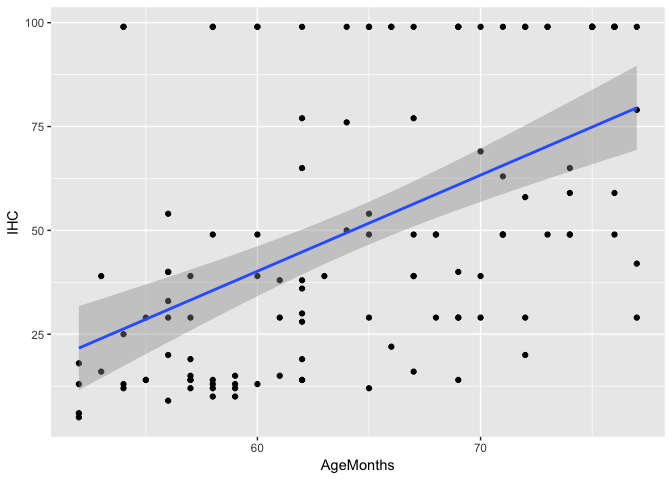<!-- -->

## Distance between IHC and FHC

Restructure data to plot distance between IHC, DCE, and FHC

```r
hc.dev.data <- full.data %>% dplyr::select(LadlabID, Age, Productivity, IHC, DCE, 
    FHC, prod.gradient) %>% gather(hcprogression, hc, IHC:FHC) %>% mutate(hcprogression = factor(hcprogression, 
    levels = c("IHC", "DCE", "FHC"))) %>% dplyr::rename(`Highest Count Coding` = hcprogression)

hc.dev.prod <- subset(hc.dev.data, Productivity == "Productive")
hc.dev.nonprod <- subset(hc.dev.data, Productivity == "Nonproductive")
```

### Fig 2a/b
Separate graphs for productivity groups, sorted by ascending IHC. One participant was coded as non-productive despite having an FHC of 100 because they made more than 3 errors.
<!-- --><!-- -->

### Fig 2a/b all errors
First we load the data with errors and prompts marked


Next plot graph for productive kids

```r
hc.recoded %>% filter(prod_tomerge=="prod") %>%
  mutate(LadlabID = fct_reorder(LadlabID, fhc, min)) %>%
  mutate(LadlabID = fct_reorder(LadlabID, dce, min)) %>%
  mutate(LadlabID = fct_reorder(LadlabID, ihc, min)) %>%
  ggplot(aes(x=LadlabID)) +
  geom_linerange(aes(ymin=ihc, ymax=fhc), color="black", size=.5) +
  geom_linerange(aes(ymin=error.start-.5, ymax=error.end+.5), 
                 color="#D95F02", size=1) +
  geom_point(aes(y=error.start, color="Error - uncorrected", shape="Error - uncorrected"), size=2) +
  geom_point(aes(y=decadesprompted, color="Error - got Decade Prompt", shape="Error - got Decade Prompt"), size=3) +
  geom_point(aes(y=fhc, color="Final Highest Count", shape="Final Highest Count"), size=2) +
  geom_point(aes(y=ihc, color="Initial Highest Count", shape="Initial Highest Count"), size=2) +
  #  geom_point(aes(y=dce, color="#D95F02", shape="6"), size=2.5) +
  scale_y_continuous(breaks=seq(0,100,20), lim=c(0,100)) +
  scale_color_manual(name = "Highest Count Coding",
                     breaks = c("Final Highest Count", "Error - got Decade Prompt", "Error - uncorrected", "Initial Highest Count"),
                     values = c("Final Highest Count"="#7570B3", "Error - got Decade Prompt"="#D95F02", "Error - uncorrected"="#D95F02", "Initial Highest Count"="#1B9E77"),
                     guide = "legend") +
  scale_shape_manual(name = "Highest Count Coding",
                     breaks = c("Final Highest Count", "Error - got Decade Prompt", "Error - uncorrected", "Initial Highest Count"),
                     values = c("Final Highest Count"=16, "Error - got Decade Prompt"=17, "Error - uncorrected"=16, "Initial Highest Count"=16),
                     guide = "legend") +
  labs(title="a. Distance, Productive Counters",
       x = "Each line = individual participant",
       y="Highest Count",
       colour="Highest Count Coding",
       shape="Highest Count Coding") +
  theme_bw(base_size = 12) + 
  theme(legend.position="right", 
        axis.text.x=element_blank(),
        axis.ticks.x=element_blank(),
        panel.grid.major.x=element_blank()) +
  theme_bw(base_size = 12) + 
  theme(legend.position="right", 
        #axis.text.x = element_text(angle = 370, hjust = 1),
        axis.text.x=element_blank(),
        axis.ticks.x=element_blank(),
        panel.grid.major.x=element_blank())
```

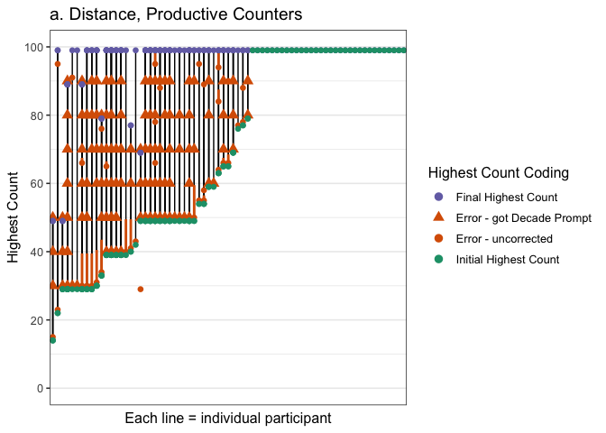<!-- -->

```r
ggsave('graphs/distance-prod-sorted-allprompts.png', width=10, height=4)
```

Then plot graph for non-productive kids

```r
hc.recoded %>% filter(prod_tomerge=="nonprod") %>%
  mutate(LadlabID = fct_reorder(LadlabID, fhc, min)) %>%
  mutate(LadlabID = fct_reorder(LadlabID, dce, min)) %>%
  mutate(LadlabID = fct_reorder(LadlabID, ihc, min)) %>%
  ggplot(aes(x=LadlabID)) +
  geom_linerange(aes(ymin=ihc, ymax=fhc), color="black", size=.5) +
  geom_linerange(aes(ymin=error.start-.5, ymax=error.end+.5), 
                 color="#D95F02", size=1) +
  geom_point(aes(y=error.start, color="Error - uncorrected", shape="Error - uncorrected"), size=2) +
  geom_point(aes(y=decadesprompted, color="Error - got Decade Prompt", shape="Error - got Decade Prompt"), size=3) +
  geom_point(aes(y=fhc, color="Final Highest Count", shape="Final Highest Count"), size=2) +
  geom_point(aes(y=ihc, color="Initial Highest Count", shape="Initial Highest Count"), size=2) +
  #  geom_point(aes(y=dce, color="#D95F02", shape="6"), size=2.5) +
  scale_y_continuous(breaks=seq(0,100,20), lim=c(0,100)) +
  scale_color_manual(name = "Highest Count Coding",
                     breaks = c("Final Highest Count", "Error - got Decade Prompt", "Error - uncorrected", "Initial Highest Count"),
                     values = c("Final Highest Count"="#7570B3", "Error - got Decade Prompt"="#D95F02", "Error - uncorrected"="#D95F02", "Initial Highest Count"="#1B9E77"),
                     guide = "legend") +
  scale_shape_manual(name = "Highest Count Coding",
                     breaks = c("Final Highest Count", "Error - got Decade Prompt", "Error - uncorrected", "Initial Highest Count"),
                     values = c("Final Highest Count"=16, "Error - got Decade Prompt"=17, "Error - uncorrected"=16, "Initial Highest Count"=16),
                     guide = "legend") +
  labs(title="b. Distance, Non-Productive Counters",
       x = "Each line = individual participant",
       y="Highest Count",
       colour="Highest Count Coding",
       shape="Highest Count Coding") +
  theme_bw(base_size = 12) + 
  theme(legend.position="right", 
        axis.text.x=element_blank(),
        axis.ticks.x=element_blank(),
        panel.grid.major.x=element_blank()) +
  theme_bw(base_size = 12) + 
  theme(legend.position="right", 
        #axis.text.x = element_text(angle = 370, hjust = 1),
        axis.text.x=element_blank(),
        axis.ticks.x=element_blank(),
        panel.grid.major.x=element_blank())
```

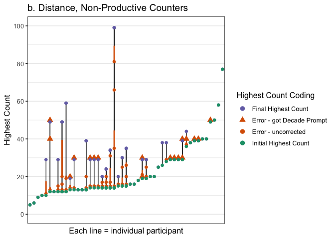<!-- -->

```r
ggsave('graphs/distance-nonprod-sorted-allprompts.png', width=10, height=4)
```

Number of kids who counted to 99+ spontaneously on IHC plus those whose FHC = 99+ without prompting

```r
# full.data %>% filter(IHC > 98) %>% distinct(LadlabID, IHC, FHC,
# HCReceivedSupport) %>% count() #n=33 but some kids made errors past IHC but < 3
# so need to account for that
full.data %>% filter(FHC > 98 & (is.na(HCReceivedSupport) | HCReceivedSupport != 
    1)) %>% distinct(LadlabID, IHC, FHC, HCReceivedSupport) %>% count()  #n =43
```

```
## # A tibble: 1 x 1
##       n
##   <int>
## 1    42
```

## Decade prompts

Check coding sheet against 'supported.times' coding. Print conflicts. Use "suptimes.final" instead.
- 030116-PW & 041416-BF: Experimenter should not have provided prompts, multiple errors before first DCE
- 063416-MC: Experimenter's prompts are 100 and 110, should not count.

```r
full.data %>% filter(TaskItem == "times") %>% distinct(LadlabID, HCReceivedSupport, 
    TaskItem, Response, suptimes.final, Productivity) %>% mutate(Response = as.integer(levels(Response)[Response])) %>% 
    filter(is.na(suptimes.final) & !is.na(Response) | is.na(Response) & !is.na(suptimes.final) | 
        suptimes.final > Response | suptimes.final < Response) %>% kable()
```


LadlabID    HCReceivedSupport   TaskItem    Response   suptimes.final  Productivity  
----------  ------------------  ---------  ---------  ---------------  --------------
030116-BK   1                   times              1               NA  Nonproductive 
030116-PW   1                   times              6               NA  Nonproductive 
031616-RP   1                   times              2               NA  Nonproductive 
040317-AL   0                   times              1               NA  Nonproductive 
040616-K    1                   times              3               NA  Nonproductive 
041416-BF   0                   times              2               NA  Nonproductive 
041416-LR   1                   times              2                1  Nonproductive 
062416-MC   0                   times              2               NA  Productive    
062916-TG   1                   times              1                3  Productive    
071416-BH   1                   times              1               NA  Nonproductive 

Average number of decade prompts provided. Productive counters first. Analyze from raw data:

```r
full.data %>% distinct(LadlabID, suptimes.final, Productivity.tertiary) %>% group_by(Productivity.tertiary) %>% 
    summarise(n = n(), n.sup = sum(suptimes.final > 0, na.rm = TRUE), mean = mean(suptimes.final, 
        na.rm = TRUE), sd = sd(suptimes.final, na.rm = TRUE), min = min(suptimes.final, 
        na.rm = TRUE), max = max(suptimes.final, na.rm = TRUE)) %>% kable(digits = 3)
```


Productivity.tertiary     n   n.sup   mean      sd   min    max
----------------------  ---  ------  -----  ------  ----  -----
Nonproductive            49      15    1.2   0.414     1      2
Productive (IHC < 99)    41      32    3.5   1.626     1      7
Productive (IHC ≥ 99)    32       0    NaN     NaN   Inf   -Inf

```r
# assume 0 = NA error in supported.times coding, should only count to 90 but one
# kid got prompted with 100 and 110 and times should be 0
```

## Reminder prompts
How many kids have coded data for receiving reminders?

```r
full.data %>% dplyr::select(LadlabID, Productivity, reminders.total, reminders.recovered) %>% 
    unique() %>% na.omit() %>% summarise(Ncoded = n(), total.min = min(reminders.total), 
    total.max = max(reminders.total), total.mean = mean(reminders.total), total.median = median(reminders.total))
```

```
##   Ncoded total.min total.max total.mean total.median
## 1     84         0         5    1.27381            1
```

How often did kids miss a reminder? Remember that the experiment ended when kids failed to recover from a reminder, unless that failure occured at a decade transition in which case the experimenter would provide a decade prompt and continue the experiment. 

```r
full.data %>% dplyr::select(LadlabID, Productivity, reminders.total, reminders.recovered) %>% 
    unique() %>% na.omit() %>% mutate(missed = reminders.total - reminders.recovered) %>% 
    summarise(Ncoded = n(), missed.min = min(missed), missed.max = max(missed), missed.mean = mean(missed), 
        missed.median = median(missed)) %>% kable(digits = 3)
```


 Ncoded   missed.min   missed.max   missed.mean   missed.median
-------  -----------  -----------  ------------  --------------
     84            0            1         0.179               0

```r
# look at proportion of kids who failed to recover from reminders.
full.data %>% dplyr::select(LadlabID, Productivity, reminders.total, reminders.recovered) %>% 
    unique() %>% na.omit() %>% mutate(missed = reminders.total - reminders.recovered) %>% 
    group_by(reminders.total) %>% summarise(Nkids = n(), N.kids.missed = sum(missed), 
    Perc.kids.missed = sum(missed)/n()) %>% kable(digits = 3)
```


 reminders.total   Nkids   N.kids.missed   Perc.kids.missed
----------------  ------  --------------  -----------------
               0      25               0              0.000
               1      31              11              0.355
               2      16               3              0.188
               3       7               0              0.000
               4       2               0              0.000
               5       3               1              0.333


# What Comes Next Descriptives

First check if Accuracy column in full.data is coded correctly. Good to go.

```r
wcn.data <- full.data %>% filter(Task == "WCN")

wcn.data %<>% mutate(Response_num = as.numeric(as.character(Response)), TaskItem_num = as.numeric(as.character(TaskItem)), 
    Accuracy_check = ifelse(Response_num == (TaskItem_num + 1), 1, 0), Accuracy_valid = ifelse(Accuracy == 
        Accuracy_check, TRUE, FALSE))

validate <- function() {
    validation <- wcn.data %>% filter(Accuracy_valid == FALSE)
    if (length(validation$LadlabID) > 0) {
        print("WARNING: CHECK CODING")
    } else {
        print("All coding correct")
    }
}

validate()
```

```
## [1] "All coding correct"
```

Add overall accuracy to the dataframe.

```r
wcn.accuracy <- wcn.data %>% filter(TaskType != "practice") %>% filter(TaskType == 
    "immediate") %>% group_by(LadlabID) %>% mutate(wcnscore = sum(Accuracy, na.rm = TRUE)) %>% 
    dplyr::select(LadlabID, wcnscore) %>% unique()

wcn.data <- left_join(wcn.data, wcn.accuracy, by = "LadlabID")
```

Immediate vs. Momentum trials: Children were provided with momentum trials if they got wrong on immediate trials. Check %trials where immediate = wrong, momentum = right

```r
wcn.wide <- wcn.data %>%
  filter(TaskType != "practice") %>%
  filter(TaskItem != 3) %>% # a trial on 3 for momentum that doesn't exist for immediate
  droplevels()%>%
  dplyr::select(LadlabID, Age, AgeGroup, TaskType, TaskItem, Accuracy, Productivity, prod.gradient) %>%
  spread(TaskType, Accuracy)

# data check: some kids got 1 for immediate but 0 for momentum or 1 for immediate and 1 for momentum (N = 5).Keeping them. 
## for reference, pulling out these kids below
full.data %>%
  filter(Task == "WCN", 
         TaskType == "momentum" | TaskType == "immediate")%>%
  dplyr::select(LadlabID, Age, AgeGroup, TaskType, TaskItem, Accuracy) %>%
  spread(TaskType, Accuracy)%>%
  mutate(issue_immediate1Momentum0 = ifelse(immediate == 1 & momentum == 0, TRUE, FALSE), 
         issue_immediate1Momentum1 = ifelse(immediate == 1 & momentum == 1, TRUE, FALSE))%>%
  filter(issue_immediate1Momentum0 == TRUE | 
           issue_immediate1Momentum1 == TRUE)
```

```
##    LadlabID  Age AgeGroup TaskItem immediate momentum
## 1 011216-WB 4.44   4-4.5y       59         1        1
## 2 022616-AG 4.32   4-4.5y       37         1        1
## 3 031616-RP 4.84   4.5-5y       23         1        1
## 4 041316-CC 4.36   4-4.5y       62         1        0
## 5 111117-VK 5.87   5.5-6y       29         1        1
##   issue_immediate1Momentum0 issue_immediate1Momentum1
## 1                     FALSE                      TRUE
## 2                     FALSE                      TRUE
## 3                     FALSE                      TRUE
## 4                      TRUE                     FALSE
## 5                     FALSE                      TRUE
```

```r
# how many kids show improved performance
xtabs(~immediate + momentum, data = wcn.wide, na.action = na.pass, exclude = NULL)
```

```
##          momentum
## immediate   0   1 <NA>
##      0    263 174   13
##      1      1   4  520
##      <NA>   1   0    0
```

```r
# 191 / 1048 trials = ~ 18%. NOTE % not by kids but by trials.
```

## Percent Correct on WCN 

```r
wcn.data %>% dplyr::distinct(LadlabID, wcnscore) %>% dplyr::summarise(n = n(), avg.wcn = mean(wcnscore)/8, 
    sd.wcn = sd(wcnscore)/8) %>% kable(digits = 3)
```


   n   avg.wcn   sd.wcn
----  --------  -------
 122     0.538    0.342

```r
# Productivity
wcn.data %>% dplyr::distinct(LadlabID, Productivity, wcnscore) %>% group_by(Productivity) %>% 
    dplyr::summarise(n = n(), avg.wcn = mean(wcnscore)/8, sd.wcn = sd(wcnscore)/8) %>% 
    kable(digits = 3)
```


Productivity      n   avg.wcn   sd.wcn
--------------  ---  --------  -------
Nonproductive    49     0.278    0.261
Productive       73     0.712    0.274

```r
# Productivity 3-ways
wcn.data %>% dplyr::distinct(LadlabID, Productivity.tertiary, wcnscore) %>% group_by(Productivity.tertiary) %>% 
    dplyr::summarise(n = n(), avg.wcn = mean(wcnscore)/8, sd.wcn = sd(wcnscore)/8) %>% 
    kable(digits = 3)
```


Productivity.tertiary     n   avg.wcn   sd.wcn
----------------------  ---  --------  -------
Nonproductive            49     0.278    0.261
Productive (IHC < 99)    41     0.561    0.255
Productive (IHC ≥ 99)    32     0.906    0.145

T-test

```r
wcn.data %>% dplyr::distinct(LadlabID, Productivity, wcnscore) %>% t.test(wcnscore ~ 
    Productivity, data = .)
```

```
## 
## 	Welch Two Sample t-test
## 
## data:  wcnscore by Productivity
## t = -8.8423, df = 106.51, p-value = 2.173e-14
## alternative hypothesis: true difference in means is not equal to 0
## 95 percent confidence interval:
##  -4.253060 -2.695221
## sample estimates:
## mean in group Nonproductive    mean in group Productive 
##                     2.22449                     5.69863
```


Plotting %corr on WCN as function of productivity

```r
wcn.data %>% dplyr::filter(TaskType == "immediate") %>% dplyr::group_by(LadlabID, 
    Productivity, prod.gradient) %>% dplyr::summarize(avg.wcn = mean(Accuracy, na.rm = TRUE), 
    sd.wcn = sd(Accuracy, na.rm = TRUE)) %>% ggplot(aes(x = Productivity, y = avg.wcn, 
    fill = factor(Productivity))) + stat_summary(fun.y = mean, position = position_dodge(width = 0.95), 
    geom = "bar", alpha = 0.8, colour = "black") + geom_violin(alpha = 0.3) + stat_summary(fun.data = mean_se, 
    geom = "errorbar", position = position_dodge(width = 0.9), width = 0.3) + # scale_fill_discrete(name = 'Productivity') +
scale_fill_manual(name = "Productivity", values = mypalette, guide = "none") + scale_colour_brewer(palette = "Greys") + 
    ylab("Proportion Correct") + xlab("Productivity") + theme_bw(base_size = 13) + 
    theme(legend.position = "none", panel.grid.major = element_blank(), panel.grid.minor = element_blank()) + 
    theme(text = element_text(size = 13)) + ylim(0, 1)
```

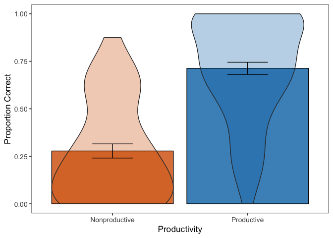<!-- -->

```r
ggsave("graphs/wcn-percentcorr.png")
```

```
## Saving 7 x 5 in image
```

### Fig 3
Jess graph

```r
fig3.data <- wcn.data %>%
  filter(TaskType == "immediate")%>%
  mutate(TaskItem_type= ifelse(mod(TaskItem_num,10)==9, "Decade transition", "Mid-decade")) %>%
  mutate(TaskItem_type_ordered = ordered(TaskItem_type, levels=c("Mid-decade", "Decade transition")))

fig3.data %>%
  group_by(TaskItem_type_ordered, TaskItem, Productivity.tertiary)%>%
   summarise(mean = mean(Accuracy, na.rm = TRUE), 
            n = n(), 
            sd = sd(Accuracy, na.rm = TRUE), 
            se = sd/sqrt(n)) %>%
  ggplot(aes(x = factor(TaskItem), y = mean, colour = Productivity.tertiary, group= Productivity.tertiary)) +
  geom_point(size = 3.5) + 
  geom_line(size = .7) +
  geom_errorbar(aes(ymin = mean - se, ymax = mean + se), 
                width = 0, size = .5) +
  facet_grid(~TaskItem_type_ordered, scales = "free_x") +#, space = "free_x") +
  theme_bw(base_size = 13) + 
  scale_colour_manual(values = mypalette) +
  theme(legend.position = "right", legend.title = element_blank()) +
  labs(x = "Task item", y = "Mean performance") +
  theme(axis.text.x = element_text(angle = 45, hjust = 1))
```

<!-- -->

```r
        #, strip.text=element_text(margin=margin(t=5, b=5, l=30, r=30)))
ggsave('graphs/wcn-trial-accuracy.png',
       width=7, height=4)
```

Get summary statistics by productivity and item type

Productivity.tertiary     mean      sd    n
----------------------  ------  ------  ---
Nonproductive            0.278   0.261   49
Productive (IHC < 99)    0.562   0.254   41
Productive (IHC ≥ 99)    0.906   0.145   32


Productivity.tertiary   TaskItem_type         mean      sd    n
----------------------  ------------------  ------  ------  ---
Nonproductive           Decade transition    0.102   0.228   49
Nonproductive           Mid-decade           0.337   0.324   49
Productive (IHC < 99)   Decade transition    0.244   0.356   41
Productive (IHC < 99)   Mid-decade           0.669   0.278   41
Productive (IHC ≥ 99)   Decade transition    0.812   0.354   32
Productive (IHC ≥ 99)   Mid-decade           0.938   0.118   32

## Item magnitude
### Remove IHC=99

Build dataframe and mean-center IHC and age, and use weighted effect coding for Productivity.

```r
# Only for productive IHC < 99 and nonproductive
fig3.modelA.df <- fig3.data %>% filter(Productivity.tertiary != "Productive (IHC ≥ 99)") %>% 
    dplyr::select(c(LadlabID, IHC, Age, Productivity.tertiary, TaskItem_num, TaskItem_type, 
        Accuracy)) %>% mutate(Productivity.tertiary = as.factor(Productivity.tertiary), 
    IHC = as.integer(IHC), LadlabID = as.factor(LadlabID), TaskItem_type = as.factor(TaskItem_type)) %>% 
    mutate(IHC.c = as.vector(scale(IHC, center = TRUE, scale = TRUE)), age.c = as.vector(scale(Age, 
        center = TRUE, scale = TRUE)))
# weighted effect coding
wec <- mean(as.numeric(fig3.modelA.df$Productivity.tertiary) - 1)
contrasts(fig3.modelA.df$Productivity.tertiary) <- c(-wec, 1 - wec)
wec <- mean(as.numeric(fig3.modelA.df$TaskItem_type) - 1)
contrasts(fig3.modelA.df$TaskItem_type) <- c(-wec, 1 - wec)
# structure
str(fig3.modelA.df)
```

```
## 'data.frame':	720 obs. of  9 variables:
##  $ LadlabID             : Factor w/ 90 levels "010516-K4","011216-KD1",..: 1 1 1 1 1 1 1 1 2 2 ...
##  $ IHC                  : int  13 13 13 13 13 13 13 13 5 5 ...
##  $ Age                  : num  4.17 4.17 4.17 4.17 4.17 4.17 4.17 4.17 4 4 ...
##  $ Productivity.tertiary: Factor w/ 2 levels "Nonproductive",..: 1 1 1 1 1 1 1 1 1 1 ...
##   ..- attr(*, "contrasts")= num [1:2, 1] -0.456 0.544
##   .. ..- attr(*, "dimnames")=List of 2
##   .. .. ..$ : chr  "Nonproductive" "Productive (IHC < 99)"
##   .. .. ..$ : NULL
##  $ TaskItem_num         : num  23 40 62 70 37 29 86 59 23 40 ...
##  $ TaskItem_type        : Factor w/ 2 levels "Decade transition",..: 2 2 2 2 2 1 2 1 2 2 ...
##   ..- attr(*, "contrasts")= num [1:2, 1] -0.75 0.25
##   .. ..- attr(*, "dimnames")=List of 2
##   .. .. ..$ : chr  "Decade transition" "Mid-decade"
##   .. .. ..$ : NULL
##  $ Accuracy             : int  0 0 0 0 0 0 0 0 0 0 ...
##  $ IHC.c                : num  -1.07 -1.07 -1.07 -1.07 -1.07 ...
##  $ age.c                : num  -1.32 -1.32 -1.32 -1.32 -1.32 ...
```

#### Productivity effect

```r
fig3.modelA.ihc <- glmer(Accuracy ~ IHC.c + age.c + (1 | TaskItem_num) + (1 | LadlabID), 
    family = "binomial", data = fig3.modelA.df)
fig3.modelA.prod <- glmer(Accuracy ~ Productivity.tertiary + IHC.c + age.c + (1 | 
    TaskItem_num) + (1 | LadlabID), family = "binomial", data = fig3.modelA.df)
# LRT tests for productivity effect vs. base
anova(fig3.modelA.ihc, fig3.modelA.prod, test = "LRT")
```

```
## Data: fig3.modelA.df
## Models:
## fig3.modelA.ihc: Accuracy ~ IHC.c + age.c + (1 | TaskItem_num) + (1 | LadlabID)
## fig3.modelA.prod: Accuracy ~ Productivity.tertiary + IHC.c + age.c + (1 | TaskItem_num) + 
## fig3.modelA.prod:     (1 | LadlabID)
##                  Df    AIC    BIC  logLik deviance  Chisq Chi Df
## fig3.modelA.ihc   5 770.86 793.75 -380.43   760.86              
## fig3.modelA.prod  6 769.81 797.27 -378.90   757.81 3.0564      1
##                  Pr(>Chisq)  
## fig3.modelA.ihc              
## fig3.modelA.prod    0.08042 .
## ---
## Signif. codes:  0 '***' 0.001 '**' 0.01 '*' 0.05 '.' 0.1 ' ' 1
```


#### Item type (mid or cross decade)

```r
fig3.modelA.main <- glmer(Accuracy ~ Productivity.tertiary + TaskItem_type + IHC.c + 
    age.c + (1 | TaskItem_num) + (1 | LadlabID), family = "binomial", data = fig3.modelA.df)
# LRT test for itemtype main effect
anova(fig3.modelA.main, fig3.modelA.prod, test = "LRT")
```

```
## Data: fig3.modelA.df
## Models:
## fig3.modelA.prod: Accuracy ~ Productivity.tertiary + IHC.c + age.c + (1 | TaskItem_num) + 
## fig3.modelA.prod:     (1 | LadlabID)
## fig3.modelA.main: Accuracy ~ Productivity.tertiary + TaskItem_type + IHC.c + age.c + 
## fig3.modelA.main:     (1 | TaskItem_num) + (1 | LadlabID)
##                  Df    AIC    BIC  logLik deviance  Chisq Chi Df
## fig3.modelA.prod  6 769.81 797.27 -378.90   757.81              
## fig3.modelA.main  7 759.24 791.28 -372.62   745.24 12.568      1
##                  Pr(>Chisq)    
## fig3.modelA.prod               
## fig3.modelA.main  0.0003924 ***
## ---
## Signif. codes:  0 '***' 0.001 '**' 0.01 '*' 0.05 '.' 0.1 ' ' 1
```

Test of interaction (n.s.): Regression testing for interaction of productivity and decade/non-decade item type on WCN accuracy

```r
fig3.modelA.full <- glmer(Accuracy ~ Productivity.tertiary + TaskItem_type + Productivity.tertiary:TaskItem_type + 
    IHC.c + age.c + (1 | TaskItem_num) + (1 | LadlabID), family = "binomial", data = fig3.modelA.df)
# LRT test for interaction effect
anova(fig3.modelA.full, fig3.modelA.main, test = "LRT")
```

```
## Data: fig3.modelA.df
## Models:
## fig3.modelA.main: Accuracy ~ Productivity.tertiary + TaskItem_type + IHC.c + age.c + 
## fig3.modelA.main:     (1 | TaskItem_num) + (1 | LadlabID)
## fig3.modelA.full: Accuracy ~ Productivity.tertiary + TaskItem_type + Productivity.tertiary:TaskItem_type + 
## fig3.modelA.full:     IHC.c + age.c + (1 | TaskItem_num) + (1 | LadlabID)
##                  Df    AIC    BIC  logLik deviance  Chisq Chi Df
## fig3.modelA.main  7 759.24 791.28 -372.62   745.24              
## fig3.modelA.full  8 760.57 797.19 -372.28   744.57 0.6726      1
##                  Pr(>Chisq)
## fig3.modelA.main           
## fig3.modelA.full     0.4121
```

```r
# summary(fig3.modelA.full)
```

Confidence intervals

```r
# confint(fig3.modelA.full)
```

Final model

```r
summary(fig3.modelA.main)
```

```
## Generalized linear mixed model fit by maximum likelihood (Laplace
##   Approximation) [glmerMod]
##  Family: binomial  ( logit )
## Formula: 
## Accuracy ~ Productivity.tertiary + TaskItem_type + IHC.c + age.c +  
##     (1 | TaskItem_num) + (1 | LadlabID)
##    Data: fig3.modelA.df
## 
##      AIC      BIC   logLik deviance df.resid 
##    759.2    791.3   -372.6    745.2      712 
## 
## Scaled residuals: 
##     Min      1Q  Median      3Q     Max 
## -2.8183 -0.5236 -0.2426  0.5521  7.2255 
## 
## Random effects:
##  Groups       Name        Variance Std.Dev.
##  LadlabID     (Intercept) 1.469    1.2119  
##  TaskItem_num (Intercept) 0.180    0.4242  
## Number of obs: 719, groups:  LadlabID, 90; TaskItem_num, 8
## 
## Fixed effects:
##                        Estimate Std. Error z value Pr(>|z|)    
## (Intercept)            -0.66764    0.22541  -2.962 0.003058 ** 
## Productivity.tertiary1  0.76203    0.43597   1.748 0.080483 .  
## TaskItem_type1          2.28289    0.44522   5.128 2.93e-07 ***
## IHC.c                   0.85049    0.22123   3.844 0.000121 ***
## age.c                   0.01663    0.21087   0.079 0.937140    
## ---
## Signif. codes:  0 '***' 0.001 '**' 0.01 '*' 0.05 '.' 0.1 ' ' 1
## 
## Correlation of Fixed Effects:
##             (Intr) Prdc.1 TskI_1 IHC.c 
## Prdctvty.t1 -0.033                     
## TskItm_typ1 -0.084  0.034              
## IHC.c       -0.054 -0.377  0.076       
## age.c        0.002 -0.354  0.003 -0.331
```

```r
plot_model(fig3.modelA.full, type = "est", transform = NULL, show.intercept = T, 
    show.p = T, show.values = T, title = "What Comes Next Accuracy")
```

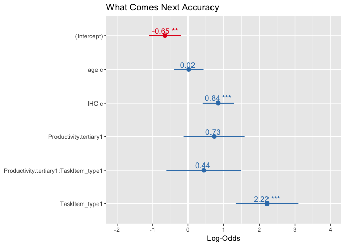<!-- -->

```r
plot_model(fig3.modelA.full, type = "est", show.intercept = T, show.p = T, show.values = T, 
    title = "What Comes Next Accuracy")
```

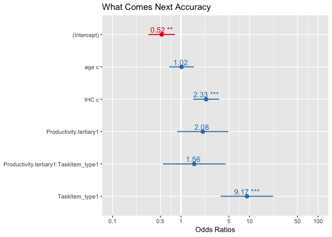<!-- -->

Excluding IHC>=99, report averages by each factor

```r
# means by item type
fig3.df %>% filter(Productivity.tertiary != "Productive (IHC ≥ 99)") %>% group_by(LadlabID, 
    TaskItem_type) %>% summarise(score = mean(Accuracy, na.rm = T)) %>% ungroup() %>% 
    group_by(TaskItem_type) %>% summarise(mean = mean(score, na.rm = T), sd = sd(score, 
    na.rm = T), n = n()) %>% kable(digits = 3)
```


TaskItem_type         mean      sd    n
------------------  ------  ------  ---
Decade transition    0.167   0.300   90
Mid-decade           0.488   0.345   90

```r
# means by productivity
fig3.df %>% filter(Productivity.tertiary != "Productive (IHC ≥ 99)") %>% group_by(LadlabID, 
    Productivity.tertiary) %>% summarise(score = mean(Accuracy, na.rm = T)) %>% ungroup() %>% 
    group_by(Productivity.tertiary) %>% summarise(mean = mean(score, na.rm = T), 
    sd = sd(score, na.rm = T), n = n()) %>% kable(digits = 3)
```


Productivity.tertiary     mean      sd    n
----------------------  ------  ------  ---
Nonproductive            0.278   0.261   49
Productive (IHC < 99)    0.562   0.254   41


### Remove nonproductive
Compare both productive groups

Build dataframe and mean-center IHC, FHC and age.

```r
fig3.modelB.df <- fig3.data %>% filter(Productivity.tertiary != "Nonproductive") %>% 
    dplyr::select(c(LadlabID, IHC, Age, Productivity.tertiary, TaskItem_num, TaskItem_type, 
        Accuracy)) %>% mutate(Productivity.tertiary = as.factor(Productivity.tertiary), 
    IHC = as.integer(IHC), LadlabID = as.factor(LadlabID), TaskItem_type = as.factor(TaskItem_type)) %>% 
    mutate(IHC.c = as.vector(scale(IHC, center = TRUE, scale = TRUE)), age.c = as.vector(scale(Age, 
        center = TRUE, scale = TRUE)))
# weighted effects coding
wec <- mean(as.numeric(fig3.modelB.df$Productivity.tertiary) - 1)
contrasts(fig3.modelB.df$Productivity.tertiary) <- c(-wec, 1 - wec)
wec <- mean(as.numeric(fig3.modelB.df$TaskItem_type) - 1)
contrasts(fig3.modelB.df$TaskItem_type) <- c(-wec, 1 - wec)
str(fig3.modelB.df)
```

```
## 'data.frame':	584 obs. of  9 variables:
##  $ LadlabID             : Factor w/ 73 levels "010916-D5","012016-AD",..: 1 1 1 1 1 1 1 1 2 2 ...
##  $ IHC                  : int  99 99 99 99 99 99 99 99 29 29 ...
##  $ Age                  : num  4.78 4.78 4.78 4.78 4.78 4.78 4.78 4.78 4.41 4.41 ...
##  $ Productivity.tertiary: Factor w/ 2 levels "Productive (IHC < 99)",..: 2 2 2 2 2 2 2 2 1 1 ...
##   ..- attr(*, "contrasts")= num [1:2, 1] -0.438 0.562
##   .. ..- attr(*, "dimnames")=List of 2
##   .. .. ..$ : chr  "Productive (IHC < 99)" "Productive (IHC ≥ 99)"
##   .. .. ..$ : NULL
##  $ TaskItem_num         : num  23 40 62 70 37 29 86 59 23 40 ...
##  $ TaskItem_type        : Factor w/ 2 levels "Decade transition",..: 2 2 2 2 2 1 2 1 2 2 ...
##   ..- attr(*, "contrasts")= num [1:2, 1] -0.75 0.25
##   .. ..- attr(*, "dimnames")=List of 2
##   .. .. ..$ : chr  "Decade transition" "Mid-decade"
##   .. .. ..$ : NULL
##  $ Accuracy             : int  1 1 1 1 1 1 1 1 0 0 ...
##  $ IHC.c                : num  1.04 1.04 1.04 1.04 1.04 ...
##  $ age.c                : num  -0.961 -0.961 -0.961 -0.961 -0.961 ...
```

Regression testing for interaction of productivity and decade/non-decade item type on WCN accuracy

```r
## WCN model looking at interaction between productivity and decade/non-decade
## item accuracy
fig3.modelB.base <- glmer(Accuracy ~ age.c + (1 | TaskItem_num) + (1 | LadlabID), 
    family = "binomial", data = fig3.modelB.df)
fig3.modelB.ihc <- glmer(Accuracy ~ IHC.c + age.c + (1 | TaskItem_num) + (1 | LadlabID), 
    family = "binomial", data = fig3.modelB.df)
fig3.modelB.prod <- glmer(Accuracy ~ Productivity.tertiary + IHC.c + age.c + (1 | 
    TaskItem_num) + (1 | LadlabID), family = "binomial", data = fig3.modelB.df)
fig3.modelB.itemtype <- glmer(Accuracy ~ TaskItem_type + IHC.c + age.c + (1 | TaskItem_num) + 
    (1 | LadlabID), family = "binomial", data = fig3.modelB.df)
fig3.modelB.main <- glmer(Accuracy ~ Productivity.tertiary + TaskItem_type + IHC.c + 
    age.c + (1 | TaskItem_num) + (1 | LadlabID), family = "binomial", data = fig3.modelB.df)
fig3.modelB.full <- glmer(Accuracy ~ Productivity.tertiary + TaskItem_type + Productivity.tertiary:TaskItem_type + 
    IHC.c + age.c + (1 | TaskItem_num) + (1 | LadlabID), family = "binomial", data = fig3.modelB.df)

# LRT test for interaction effect
anova(fig3.modelB.full, fig3.modelB.main, test = "LRT")
```

```
## Data: fig3.modelB.df
## Models:
## fig3.modelB.main: Accuracy ~ Productivity.tertiary + TaskItem_type + IHC.c + age.c + 
## fig3.modelB.main:     (1 | TaskItem_num) + (1 | LadlabID)
## fig3.modelB.full: Accuracy ~ Productivity.tertiary + TaskItem_type + Productivity.tertiary:TaskItem_type + 
## fig3.modelB.full:     IHC.c + age.c + (1 | TaskItem_num) + (1 | LadlabID)
##                  Df    AIC    BIC  logLik deviance Chisq Chi Df Pr(>Chisq)
## fig3.modelB.main  7 529.59 560.17 -257.80   515.59                        
## fig3.modelB.full  8 529.05 564.00 -256.53   513.05 2.539      1     0.1111
```

Main effect model

```r
# LRT tests for main effects
drop1(fig3.modelB.main, test = "Chisq")
```

```
## Single term deletions
## 
## Model:
## Accuracy ~ Productivity.tertiary + TaskItem_type + IHC.c + age.c + 
##     (1 | TaskItem_num) + (1 | LadlabID)
##                       Df    AIC     LRT   Pr(Chi)    
## <none>                   529.59                      
## Productivity.tertiary  1 533.28  5.6855 0.0171053 *  
## TaskItem_type          1 540.12 12.5249 0.0004016 ***
## IHC.c                  1 528.10  0.5060 0.4768936    
## age.c                  1 529.01  1.4198 0.2334342    
## ---
## Signif. codes:  0 '***' 0.001 '**' 0.01 '*' 0.05 '.' 0.1 ' ' 1
```

```r
# summary of final model
summary(fig3.modelB.main)
```

```
## Generalized linear mixed model fit by maximum likelihood (Laplace
##   Approximation) [glmerMod]
##  Family: binomial  ( logit )
## Formula: 
## Accuracy ~ Productivity.tertiary + TaskItem_type + IHC.c + age.c +  
##     (1 | TaskItem_num) + (1 | LadlabID)
##    Data: fig3.modelB.df
## 
##      AIC      BIC   logLik deviance df.resid 
##    529.6    560.2   -257.8    515.6      576 
## 
## Scaled residuals: 
##     Min      1Q  Median      3Q     Max 
## -5.1074 -0.3699  0.1842  0.4625  2.0067 
## 
## Random effects:
##  Groups       Name        Variance Std.Dev.
##  LadlabID     (Intercept) 1.4672   1.2113  
##  TaskItem_num (Intercept) 0.1115   0.3339  
## Number of obs: 583, groups:  LadlabID, 73; TaskItem_num, 8
## 
## Fixed effects:
##                        Estimate Std. Error z value Pr(>|z|)    
## (Intercept)              1.5838     0.2506   6.319 2.63e-10 ***
## Productivity.tertiary1   2.2392     0.9416   2.378   0.0174 *  
## TaskItem_type1           2.1140     0.3981   5.310 1.10e-07 ***
## IHC.c                    0.3221     0.4523   0.712   0.4764    
## age.c                    0.2407     0.2015   1.194   0.2323    
## ---
## Signif. codes:  0 '***' 0.001 '**' 0.01 '*' 0.05 '.' 0.1 ' ' 1
## 
## Correlation of Fixed Effects:
##             (Intr) Prdc.1 TskI_1 IHC.c 
## Prdctvty.t1  0.157                     
## TskItm_typ1  0.187  0.087              
## IHC.c        0.007 -0.875  0.021       
## age.c        0.051  0.188  0.035 -0.223
```

### All kids
Analyses including all participants

```r
fig3.modelC.df <- fig3.data %>% dplyr::select(c(LadlabID, IHC, FHC, Age, Productivity, 
    TaskItem_num, TaskItem_type, Accuracy)) %>% mutate(Productivity = as.factor(Productivity), 
    IHC = as.integer(IHC), LadlabID = as.factor(LadlabID), TaskItem_type = as.factor(TaskItem_type)) %>% 
    mutate(IHC.c = as.vector(scale(IHC, center = TRUE, scale = TRUE)), age.c = as.vector(scale(Age, 
        center = TRUE, scale = TRUE)))
# weighted effects coding
wec <- mean(as.numeric(fig3.modelC.df$Productivity) - 1)
contrasts(fig3.modelC.df$Productivity) <- c(-wec, 1 - wec)
wec <- mean(as.numeric(fig3.modelC.df$TaskItem_type) - 1)
contrasts(fig3.modelC.df$TaskItem_type) <- c(-wec, 1 - wec)

## regressions
fig3.modelC.noint <- glmer(Accuracy ~ Productivity + TaskItem_type + IHC.c + age.c + 
    (1 | TaskItem_num) + (1 | LadlabID), family = "binomial", data = fig3.modelC.df)
# LRT tests
drop1(fig3.modelC.noint, test = "Chisq")
```

```
## Single term deletions
## 
## Model:
## Accuracy ~ Productivity + TaskItem_type + IHC.c + age.c + (1 | 
##     TaskItem_num) + (1 | LadlabID)
##               Df    AIC    LRT   Pr(Chi)    
## <none>           900.24                     
## Productivity   1 900.67  2.434 0.1187499    
## TaskItem_type  1 909.65 11.414 0.0007288 ***
## IHC.c          1 953.06 54.819 1.321e-13 ***
## age.c          1 898.26  0.019 0.8913532    
## ---
## Signif. codes:  0 '***' 0.001 '**' 0.01 '*' 0.05 '.' 0.1 ' ' 1
```

```r
# Test for interaction
fig3.modelC.full <- glmer(Accuracy ~ Productivity + TaskItem_type + Productivity:TaskItem_type + 
    IHC.c + age.c + (1 | TaskItem_num) + (1 | LadlabID), family = "binomial", data = fig3.modelC.df)
anova(fig3.modelC.full, fig3.modelC.noint, test = "LRT")
```

```
## Data: fig3.modelC.df
## Models:
## fig3.modelC.noint: Accuracy ~ Productivity + TaskItem_type + IHC.c + age.c + (1 | 
## fig3.modelC.noint:     TaskItem_num) + (1 | LadlabID)
## fig3.modelC.full: Accuracy ~ Productivity + TaskItem_type + Productivity:TaskItem_type + 
## fig3.modelC.full:     IHC.c + age.c + (1 | TaskItem_num) + (1 | LadlabID)
##                   Df    AIC    BIC  logLik deviance  Chisq Chi Df
## fig3.modelC.noint  7 900.24 934.42 -443.12   886.24              
## fig3.modelC.full   8 902.19 941.25 -443.10   886.19 0.0467      1
##                   Pr(>Chisq)
## fig3.modelC.noint           
## fig3.modelC.full      0.8289
```


## Within / Outside IHC
Add whether the Task Item was within or outside of the kid's initial highest count.

```r
# first, get initial highest count for each kiddo Make a lookup table with SID
# and initial highest count
lookup <- full.data %>% distinct(LadlabID, IHC)

wcn.data %<>% dplyr::mutate(TaskItem = as.numeric(as.character(TaskItem)))

# This is a function that, for each trial, checks the number queried. If number
# queried is above the child's initial highest count, marks that trial as beyond
# count range.
determine_count_range <- function(df) {
    tmp <- df
    for (row in 1:nrow(tmp)) {
        sub = as.character(tmp[row, "LadlabID"])
        count_range = as.numeric(as.character(subset(lookup, LadlabID == sub)$IHC))
        tmp[row, "IHC"] = as.numeric(as.character(count_range))
        if (tmp[row, "TaskItem"] > count_range) {
            tmp[row, "WithinOutsideIHC"] = "outside"
        } else {
            tmp[row, "WithinOutsideIHC"] = "within"
        }
    }
    return(tmp)
}

# Run for wcn
wcn.data <- determine_count_range(wcn.data)
```


WCN accuracy, within and outside of IHC, by various contrasts

```r
wcn.data %>% dplyr::filter(TaskType == "immediate") %>% dplyr::group_by(LadlabID, 
    WithinOutsideIHC) %>% dplyr::summarize(score = mean(Accuracy, na.rm = T)) %>% 
    ungroup() %>% group_by(WithinOutsideIHC) %>% dplyr::summarize(mean = mean(score, 
    na.rm = TRUE), sd = sd(score, na.rm = TRUE), n = n()) %>% kable(digits = 2)
```


WithinOutsideIHC    mean     sd    n
-----------------  -----  -----  ---
outside             0.41   0.32   90
within              0.67   0.32   88

```r
# 2-way productivity, all kids
wcn.data %>% dplyr::filter(TaskType == "immediate") %>% dplyr::group_by(LadlabID, 
    Productivity, WithinOutsideIHC) %>% dplyr::summarize(score = mean(Accuracy, na.rm = T)) %>% 
    ungroup() %>% group_by(Productivity, WithinOutsideIHC) %>% dplyr::summarize(mean = mean(score, 
    na.rm = TRUE), sd = sd(score, na.rm = TRUE), n = n()) %>% kable(digits = 2)
```


Productivity    WithinOutsideIHC    mean     sd    n
--------------  -----------------  -----  -----  ---
Nonproductive   outside             0.27   0.26   49
Nonproductive   within              0.55   0.32   17
Productive      outside             0.58   0.31   41
Productive      within              0.70   0.31   71

```r
# three-way
wcn.data %>% dplyr::filter(TaskType == "immediate") %>% dplyr::group_by(LadlabID, 
    Productivity.tertiary, WithinOutsideIHC) %>% dplyr::summarize(score = mean(Accuracy, 
    na.rm = T)) %>% ungroup() %>% group_by(Productivity.tertiary, WithinOutsideIHC) %>% 
    dplyr::summarize(mean = mean(score, na.rm = TRUE), sd = sd(score, na.rm = TRUE), 
        n = n()) %>% kable(digits = 2)
```


Productivity.tertiary   WithinOutsideIHC    mean     sd    n
----------------------  -----------------  -----  -----  ---
Nonproductive           outside             0.27   0.26   49
Nonproductive           within              0.55   0.32   17
Productive (IHC < 99)   outside             0.58   0.31   41
Productive (IHC < 99)   within              0.53   0.31   39
Productive (IHC ≥ 99)   within              0.91   0.15   32


Plotting WCN as within vs. beyond by productivity 

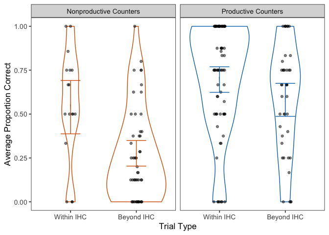<!-- -->

Same graph but three-way productvity grouping
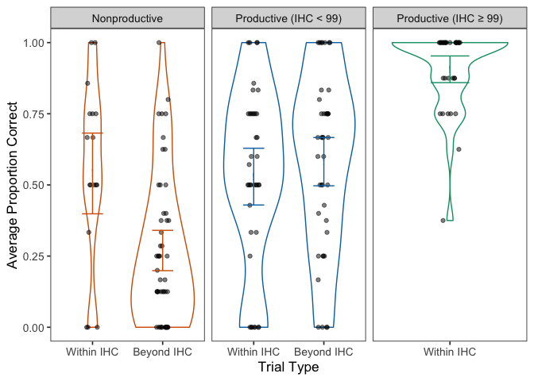<!-- -->

### Fig 4
Try without violins

```r
## HM? 
wcn.data %>%
  mutate(WithinOutsideIHC = factor(WithinOutsideIHC, levels = c("within", "outside"), 
                                   labels = c("Within IHC", "Beyond IHC")))%>%
  dplyr::filter(TaskType == "immediate") %>%
  dplyr::group_by(Productivity.tertiary, WithinOutsideIHC, LadlabID, prod.gradient) %>%
  dplyr::summarize(meansubj = mean(Accuracy, na.rm = TRUE)) %>%
  ggplot(aes(x=WithinOutsideIHC, y=meansubj)) +
  stat_summary(aes(color=Productivity.tertiary),
               fun.data = mean_cl_boot, geom="errorbar",
               width = 0.3)+
  stat_summary(aes(color=Productivity.tertiary), fill="white",
               fun.y = mean,
#               position = position_dodge(width=0.8), 
               geom="point", shape=23, size=3) +
  stat_summary(fun.y="mean", geom="line", aes(color=Productivity.tertiary,
                                              group=factor(Productivity.tertiary))) +
      scale_colour_manual(values=prod.pal, name="Productivity") + 
  scale_fill_brewer(guide=FALSE) +
  scale_y_continuous(limits=c(0,1)) +
  labs(y="Average Proportion Correct", x="Trial Type") +
  theme_bw(base_size = 13) +
  theme(panel.grid.major = element_blank(), 
        panel.grid.minor = element_blank())
```

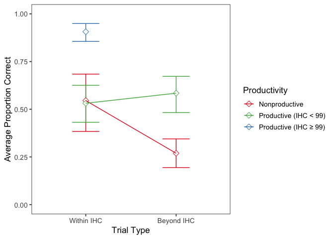<!-- -->

```r
ggsave('graphs/wcn-within-beyond-final.png', width=6, height=4)
```

### Remove IHC=99


```
## 'data.frame':	720 obs. of  7 variables:
##  $ LadlabID        : Factor w/ 90 levels "010516-K4","011216-KD1",..: 1 1 1 1 1 1 1 1 2 2 ...
##  $ TaskItem_num    : num  23 40 62 70 37 29 86 59 23 40 ...
##  $ age.c           : num  -1.32 -1.32 -1.32 -1.32 -1.32 ...
##  $ IHC.c           : num  -1.07 -1.07 -1.07 -1.07 -1.07 ...
##  $ Productivity    : Factor w/ 2 levels "Nonproductive",..: 1 1 1 1 1 1 1 1 1 1 ...
##   ..- attr(*, "contrasts")= num [1:2, 1] -0.456 0.544
##   .. ..- attr(*, "dimnames")=List of 2
##   .. .. ..$ : chr  "Nonproductive" "Productive"
##   .. .. ..$ : NULL
##  $ WithinOutsideIHC: Factor w/ 2 levels "outside","within": 1 1 1 1 1 1 1 1 1 1 ...
##   ..- attr(*, "contrasts")= num [1:2, 1] -0.282 0.718
##   .. ..- attr(*, "dimnames")=List of 2
##   .. .. ..$ : chr  "outside" "within"
##   .. .. ..$ : NULL
##  $ Accuracy        : int  0 0 0 0 0 0 0 0 0 0 ...
```

Construct models and compare

```r
## WCN model looking at interaction between productivity and trial type in WCN
## task
wcn.model2.base <- glmer(Accuracy ~ age.c + (1 | TaskItem_num) + (1 | LadlabID), 
    family = "binomial", data = wcn_model.df2)
wcn.model2.ihc <- glmer(Accuracy ~ IHC.c + age.c + (1 | TaskItem_num) + (1 | LadlabID), 
    family = "binomial", data = wcn_model.df2)
wcn.model2.noint <- glmer(Accuracy ~ Productivity + WithinOutsideIHC + IHC.c + age.c + 
    (1 | TaskItem_num) + (1 | LadlabID), family = "binomial", data = wcn_model.df2)
wcn.model2.int <- glmer(Accuracy ~ Productivity + WithinOutsideIHC + Productivity:WithinOutsideIHC + 
    IHC.c + age.c + (1 | TaskItem_num) + (1 | LadlabID), family = "binomial", data = wcn_model.df2)
# comparison against base models
anova(wcn.model2.int, wcn.model2.noint, wcn.model2.ihc, wcn.model2.base, test = "LRT")
```

```
## Data: wcn_model.df2
## Models:
## wcn.model2.base: Accuracy ~ age.c + (1 | TaskItem_num) + (1 | LadlabID)
## wcn.model2.ihc: Accuracy ~ IHC.c + age.c + (1 | TaskItem_num) + (1 | LadlabID)
## wcn.model2.noint: Accuracy ~ Productivity + WithinOutsideIHC + IHC.c + age.c + 
## wcn.model2.noint:     (1 | TaskItem_num) + (1 | LadlabID)
## wcn.model2.int: Accuracy ~ Productivity + WithinOutsideIHC + Productivity:WithinOutsideIHC + 
## wcn.model2.int:     IHC.c + age.c + (1 | TaskItem_num) + (1 | LadlabID)
##                  Df    AIC    BIC  logLik deviance   Chisq Chi Df
## wcn.model2.base   4 792.03 810.34 -392.01   784.03               
## wcn.model2.ihc    5 770.86 793.75 -380.43   760.86 23.1658      1
## wcn.model2.noint  7 771.01 803.06 -378.51   757.01  3.8485      2
## wcn.model2.int    8 768.02 804.64 -376.01   752.02  4.9987      1
##                  Pr(>Chisq)    
## wcn.model2.base                
## wcn.model2.ihc    1.486e-06 ***
## wcn.model2.noint    0.14598    
## wcn.model2.int      0.02537 *  
## ---
## Signif. codes:  0 '***' 0.001 '**' 0.01 '*' 0.05 '.' 0.1 ' ' 1
```

Interaction was significant, let's view the full model

```r
# summary of final model
summary(wcn.model2.int)
```

```
## Generalized linear mixed model fit by maximum likelihood (Laplace
##   Approximation) [glmerMod]
##  Family: binomial  ( logit )
## Formula: 
## Accuracy ~ Productivity + WithinOutsideIHC + Productivity:WithinOutsideIHC +  
##     IHC.c + age.c + (1 | TaskItem_num) + (1 | LadlabID)
##    Data: wcn_model.df2
## 
##      AIC      BIC   logLik deviance df.resid 
##    768.0    804.6   -376.0    752.0      711 
## 
## Scaled residuals: 
##     Min      1Q  Median      3Q     Max 
## -3.3740 -0.4979 -0.2438  0.5407  7.2694 
## 
## Random effects:
##  Groups       Name        Variance Std.Dev.
##  LadlabID     (Intercept) 1.385    1.177   
##  TaskItem_num (Intercept) 1.146    1.071   
## Number of obs: 719, groups:  LadlabID, 90; TaskItem_num, 8
## 
## Fixed effects:
##                                 Estimate Std. Error z value Pr(>|z|)    
## (Intercept)                     -0.56526    0.41527  -1.361 0.173458    
## Productivity1                    0.78342    0.42843   1.829 0.067463 .  
## WithinOutsideIHC1               -0.01814    0.36574  -0.050 0.960437    
## IHC.c                            0.86114    0.23915   3.601 0.000317 ***
## age.c                            0.02308    0.20699   0.111 0.911221    
## Productivity1:WithinOutsideIHC1 -1.17151    0.52405  -2.236 0.025384 *  
## ---
## Signif. codes:  0 '***' 0.001 '**' 0.01 '*' 0.05 '.' 0.1 ' ' 1
## 
## Correlation of Fixed Effects:
##             (Intr) Prdct1 WOIHC1 IHC.c  age.c 
## Productvty1 -0.018                            
## WthnOtsIHC1  0.045 -0.018                     
## IHC.c       -0.043 -0.336 -0.414              
## age.c        0.003 -0.352  0.009 -0.305       
## Prd1:WOIHC1 -0.102 -0.017 -0.347  0.121 -0.017
```

Confidence intervals

```r
tidy(wcn.model2.int, conf.int = TRUE, exponentiate = F, effects = "fixed")
```

```
## # A tibble: 6 x 8
##   effect term       estimate std.error statistic p.value conf.low conf.high
##   <chr>  <chr>         <dbl>     <dbl>     <dbl>   <dbl>    <dbl>     <dbl>
## 1 fixed  (Intercep…  -0.565      0.415   -1.36   1.73e-1  -1.38       0.249
## 2 fixed  Productiv…   0.783      0.428    1.83   6.75e-2  -0.0563     1.62 
## 3 fixed  WithinOut…  -0.0181     0.366   -0.0496 9.60e-1  -0.735      0.699
## 4 fixed  IHC.c        0.861      0.239    3.60   3.17e-4   0.392      1.33 
## 5 fixed  age.c        0.0231     0.207    0.111  9.11e-1  -0.383      0.429
## 6 fixed  Productiv…  -1.17       0.524   -2.24   2.54e-2  -2.20      -0.144
```


Planned contrasts, t-test

```r
# within
wcn_model.df2 %>% group_by(LadlabID, Productivity, WithinOutsideIHC) %>% summarise(score = mean(Accuracy, 
    na.rm = T)) %>% filter(WithinOutsideIHC == "within") %>% t.test(score ~ Productivity, 
    data = .)
```

```
## 
## 	Welch Two Sample t-test
## 
## data:  score by Productivity
## t = 0.154, df = 30.073, p-value = 0.8786
## alternative hypothesis: true difference in means is not equal to 0
## 95 percent confidence interval:
##  -0.1733447  0.2016216
## sample estimates:
## mean in group Nonproductive    mean in group Productive 
##                   0.5455182                   0.5313797
```

```r
# outside
wcn_model.df2 %>% group_by(LadlabID, Productivity, WithinOutsideIHC) %>% summarise(score = mean(Accuracy, 
    na.rm = T)) %>% filter(WithinOutsideIHC == "outside") %>% t.test(score ~ Productivity, 
    data = .)
```

```
## 
## 	Welch Two Sample t-test
## 
## data:  score by Productivity
## t = -5.1629, df = 79.118, p-value = 1.768e-06
## alternative hypothesis: true difference in means is not equal to 0
## 95 percent confidence interval:
##  -0.4360898 -0.1934073
## sample estimates:
## mean in group Nonproductive    mean in group Productive 
##                   0.2694849                   0.5842334
```


### Remove non-productive

We can only compare accuracy for within-IHC trials:

```
## 'data.frame':	408 obs. of  6 variables:
##  $ LadlabID             : Factor w/ 71 levels "010916-D5","012016-AD",..: 1 1 1 1 1 1 1 1 2 2 ...
##  $ TaskItem_num         : num  23 40 62 70 37 29 86 59 23 29 ...
##  $ age.c                : num  -1.04 -1.04 -1.04 -1.04 -1.04 ...
##  $ IHC.c                : num  0.716 0.716 0.716 0.716 0.716 ...
##  $ Productivity.tertiary: Factor w/ 2 levels "Productive (IHC < 99)",..: 2 2 2 2 2 2 2 2 1 1 ...
##   ..- attr(*, "contrasts")= num [1:2, 1] -0.627 0.373
##   .. ..- attr(*, "dimnames")=List of 2
##   .. .. ..$ : chr  "Productive (IHC < 99)" "Productive (IHC ≥ 99)"
##   .. .. ..$ : NULL
##  $ Accuracy             : int  1 1 1 1 1 1 1 1 0 0 ...
```

Construct models and compare

```r
## WCN model looking at interaction between productivity and trial type in WCN
## task
wcn.model3.base <- glmer(Accuracy ~ age.c + (1 | TaskItem_num) + (1 | LadlabID), 
    family = "binomial", data = wcn_model.df3)
wcn.model3.ihc <- glmer(Accuracy ~ IHC.c + age.c + (1 | TaskItem_num) + (1 | LadlabID), 
    family = "binomial", data = wcn_model.df3)
wcn.model3.prod <- glmer(Accuracy ~ Productivity.tertiary + IHC.c + age.c + (1 | 
    TaskItem_num) + (1 | LadlabID), family = "binomial", data = wcn_model.df3)
# compare
anova(wcn.model3.prod, wcn.model3.ihc, wcn.model3.base, test = "LRT")
```

```
## Data: wcn_model.df3
## Models:
## wcn.model3.base: Accuracy ~ age.c + (1 | TaskItem_num) + (1 | LadlabID)
## wcn.model3.ihc: Accuracy ~ IHC.c + age.c + (1 | TaskItem_num) + (1 | LadlabID)
## wcn.model3.prod: Accuracy ~ Productivity.tertiary + IHC.c + age.c + (1 | TaskItem_num) + 
## wcn.model3.prod:     (1 | LadlabID)
##                 Df    AIC    BIC  logLik deviance   Chisq Chi Df
## wcn.model3.base  4 379.79 395.84 -185.90   371.79               
## wcn.model3.ihc   5 341.08 361.14 -165.54   331.08 40.7132      1
## wcn.model3.prod  6 341.53 365.60 -164.77   329.53  1.5486      1
##                 Pr(>Chisq)    
## wcn.model3.base               
## wcn.model3.ihc   1.763e-10 ***
## wcn.model3.prod     0.2133    
## ---
## Signif. codes:  0 '***' 0.001 '**' 0.01 '*' 0.05 '.' 0.1 ' ' 1
```
Final model: IHC only

```r
summary(wcn.model3.ihc)
```

```
## Generalized linear mixed model fit by maximum likelihood (Laplace
##   Approximation) [glmerMod]
##  Family: binomial  ( logit )
## Formula: Accuracy ~ IHC.c + age.c + (1 | TaskItem_num) + (1 | LadlabID)
##    Data: wcn_model.df3
## 
##      AIC      BIC   logLik deviance df.resid 
##    341.1    361.1   -165.5    331.1      403 
## 
## Scaled residuals: 
##     Min      1Q  Median      3Q     Max 
## -3.8565  0.0814  0.2082  0.3807  1.7836 
## 
## Random effects:
##  Groups       Name        Variance Std.Dev.
##  LadlabID     (Intercept) 1.568    1.252   
##  TaskItem_num (Intercept) 1.028    1.014   
## Number of obs: 408, groups:  LadlabID, 71; TaskItem_num, 8
## 
## Fixed effects:
##             Estimate Std. Error z value Pr(>|z|)    
## (Intercept)   2.0243     0.4652   4.352 1.35e-05 ***
## IHC.c         1.4672     0.2579   5.689 1.28e-08 ***
## age.c         0.0462     0.2278   0.203    0.839    
## ---
## Signif. codes:  0 '***' 0.001 '**' 0.01 '*' 0.05 '.' 0.1 ' ' 1
## 
## Correlation of Fixed Effects:
##       (Intr) IHC.c 
## IHC.c  0.309       
## age.c  0.033 -0.027
```


# Infinity Descriptives

## Counts
Number of kids in each infinity category

```
## # A tibble: 8 x 3
## # Groups:   Productivity [2]
##   Productivity  Category             n
##   <fct>         <chr>            <int>
## 1 Nonproductive A Non-knower        33
## 2 Nonproductive B Endless-only       1
## 3 Nonproductive C Successor-only    12
## 4 Nonproductive D Full-knower        3
## 5 Productive    A Non-knower        26
## 6 Productive    B Endless-only      10
## 7 Productive    C Successor-only    17
## 8 Productive    D Full-knower       20
```

Number of kids for each 0/1 classification

```r
classification.data <- full.data %>% dplyr::distinct(LadlabID, EndlessKnower, SuccessorKnower, 
    InfinityKnower, NonKnower, Productivity, Productivity.tertiary)
# Cross tab
xtabs(~SuccessorKnower + EndlessKnower, classification.data)
```

```
##                EndlessKnower
## SuccessorKnower  0  1
##               0 59 11
##               1 29 23
```

Successor knowledge by productivity

```
##    
##     Nonproductive Productive
##   0            34         36
##   1            15         37
```

```
## 
## 	Pearson's Chi-squared test with Yates' continuity correction
## 
## data:  table(classification.data$SuccessorKnower, classification.data$Productivity)
## X-squared = 4.0446, df = 1, p-value = 0.04431
```

```
##    
##     Nonproductive Productive (IHC < 99) Productive (IHC ≥ 99)
##   0            34                    22                    14
##   1            15                    19                    18
```

Endless knowledge by productivity

```
##    
##     Nonproductive Productive
##   0            45         43
##   1             4         30
```

```
## 
## 	Pearson's Chi-squared test with Yates' continuity correction
## 
## data:  table(classification.data$EndlessKnower, classification.data$Productivity)
## X-squared = 14.223, df = 1, p-value = 0.0001624
```

```
##    
##     Nonproductive Productive (IHC < 99) Productive (IHC ≥ 99)
##   0            45                    28                    15
##   1             4                    13                    17
```

Infinity knowledge by productivity

```
##                  
##                   Nonproductive Productive
##   None or partial            46         53
##   Full Infinity               3         20
```

```
## 
## 	Pearson's Chi-squared test with Yates' continuity correction
## 
## data:  table(classification.data$InfinityKnower, classification.data$Productivity)
## X-squared = 7.3396, df = 1, p-value = 0.006745
```

```
##                  
##                   Nonproductive Productive (IHC < 99)
##   None or partial            46                    32
##   Full Infinity               3                     9
##                  
##                   Productive (IHC ≥ 99)
##   None or partial                    21
##   Full Infinity                      11
```

Non-knower status by productivity

```
##                 
##                  Nonproductive Productive
##   Some knowledge            16         47
##   No knowledge              33         26
```

```
## 
## 	Pearson's Chi-squared test with Yates' continuity correction
## 
## data:  table(classification.data$NonKnower, classification.data$Productivity)
## X-squared = 10.584, df = 1, p-value = 0.001141
```

```
##                 
##                  Nonproductive Productive (IHC < 99) Productive (IHC ≥ 99)
##   Some knowledge            16                    23                    24
##   No knowledge              33                    18                     8
```
## Age
Average age of kids for Endless and Successor Knowers

 SuccessorKnower   meanAge   sdAge   meanAgeMonths   sdAgeMonths
----------------  --------  ------  --------------  ------------
               0      4.92    0.58           59.00          6.93
               1      5.11    0.55           61.29          6.60


 EndlessKnower   meanAge   sdAge   meanAgeMonths   sdAgeMonths
--------------  --------  ------  --------------  ------------
             0      4.89    0.56           58.72          6.71
             1      5.27    0.52           63.24          6.19


InfinityKnower     meanAge   sdAge   meanAgeMonths   sdAgeMonths
----------------  --------  ------  --------------  ------------
None or partial       4.92    0.57           59.08          6.81
Full Infinity         5.32    0.48           63.85          5.72

## HC
Infinity in relation to highest count

```
## # A tibble: 2 x 5
##   EndlessKnower mean_IHC sd_IHC min_IHC max_IHC
##           <int>    <dbl>  <dbl>   <dbl>   <dbl>
## 1             0     43.0   30.9       5      99
## 2             1     70.0   31.8      14      99
```

```
## # A tibble: 2 x 5
##   SuccessorKnower mean_IHC sd_IHC min_IHC max_IHC
##             <int>    <dbl>  <dbl>   <dbl>   <dbl>
## 1               0     47.3   31.8       9      99
## 2               1     54.8   35.1       5      99
```

```
## # A tibble: 2 x 5
##   InfinityKnower  mean_IHC sd_IHC min_IHC max_IHC
##   <fct>              <dbl>  <dbl>   <dbl>   <dbl>
## 1 None or partial     46.5   32.4       5      99
## 2 Full Infinity       67.7   32.4      14      99
```


```r
full.data %>%
  dplyr::distinct(LadlabID, EndlessKnower, IHC) %>%
  ggplot() +
  geom_dotplot(aes(fill = EndlessKnower, x=IHC), #alpha=0.5,
               binwidth=1, stackgroups=T, binpositions="all",method="dotdensity", dotsize = 1) +
  scale_fill_manual(values=mypalette, labels=c('Non-Productive Counters', 'Productive Counters'))
```

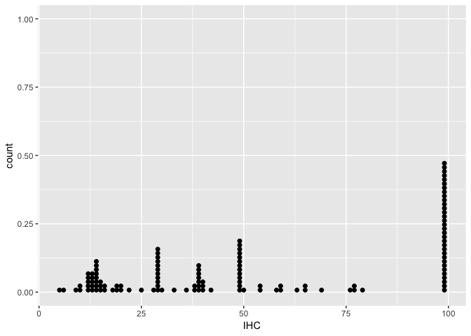<!-- -->


## WCN 
Infinity in relation to WCN

```
## Joining, by = "LadlabID"
```

```
## # A tibble: 2 x 3
##   EndlessKnower mean_nn_score median_nn_score
##           <int>         <dbl>           <dbl>
## 1             0          3.73             3.5
## 2             1          5.79             6
```

```
## Joining, by = "LadlabID"
```

```
## # A tibble: 2 x 3
##   SuccessorKnower mean_nn_score median_nn_score
##             <int>         <dbl>           <dbl>
## 1               0          4.01               5
## 2               1          4.69               5
```

```
## Joining, by = "LadlabID"
```

```
## # A tibble: 2 x 3
##   InfinityKnower  mean_nn_score median_nn_score
##   <fct>                   <dbl>           <int>
## 1 None or partial          3.95               4
## 2 Full Infinity            5.83               6
```

# Productivity gradient


## Correlation between productivity gradient and IHC/FHC


## Correlation between Productivity classification and Prod.gradient


***

# Infinity Regression Analyses

## Setup
Counting, Productivity, and Infinity Battery
To identify whether there is connection between counting experience and Infinity Task performance, we will conduct three initial analyses, predicting Infinity Task performance from either (1) Initial Highest Count, (3) Productivity for Decade Rule (defined above), or (3) performance on the Next Number task. 

glm(inf.0/1 ~ (predictor) + age, family = binomial).

---
First, we need to make a model data frame that readily has all of this information


```r
# model base each participant only needs one row here, because we only need to
# know whether they are a Successor Knower or Endless Knower
model.df <- full.data %>% dplyr::distinct(LadlabID, Age, AgeGroup, Gender, SuccessorKnower, 
    EndlessKnower, InfinityKnower, NonKnower, IHC, Productivity, Productivity.tertiary, 
    prod.gradient)
model.df <- right_join(model.df, wcn.accuracy, by = "LadlabID") %>% mutate(SuccessorKnower = factor(SuccessorKnower, 
    levels = c(0, 1)), EndlessKnower = factor(EndlessKnower, levels = c(0, 1)), IHC = as.integer(IHC), 
    LadlabID = factor(LadlabID))
```

Let's show a scatter plot first for the base models


By productivity

```r
ggplot(model.df, aes(x = Age, y = IHC)) + # specify points
geom_point(aes(color = InfinityKnower)) + # specify that we want the rug plot
geom_rug(aes(color = InfinityKnower), size = 0.2) + facet_wrap(. ~ Productivity.tertiary) + 
    # improve the data/ink ratio
theme_minimal() + theme(legend.position = "top")
```

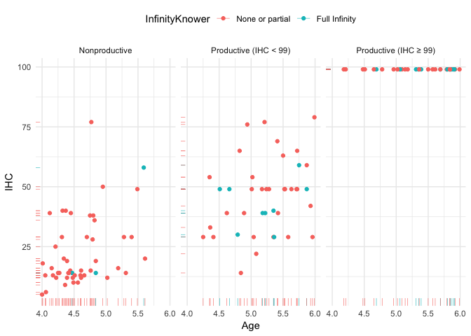<!-- -->

```r
ggplot(model.df, aes(x = Age, y = IHC)) + # specify points
geom_point(aes(color = SuccessorKnower)) + # specify that we want the rug plot
geom_rug(aes(color = SuccessorKnower), size = 0.2) + facet_wrap(. ~ Productivity.tertiary) + 
    # improve the data/ink ratio
theme_minimal() + theme(legend.position = "top")
```

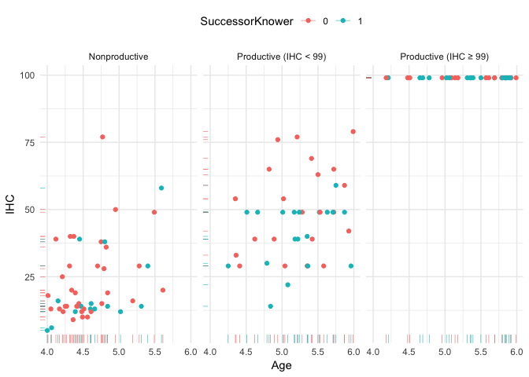<!-- -->

```r
ggplot(model.df, aes(x = Age, y = IHC)) + # specify points
geom_point(aes(color = EndlessKnower)) + # specify that we want the rug plot
geom_rug(aes(color = EndlessKnower), size = 0.2) + facet_wrap(. ~ Productivity.tertiary) + 
    # improve the data/ink ratio
theme_minimal() + theme(legend.position = "top")
```

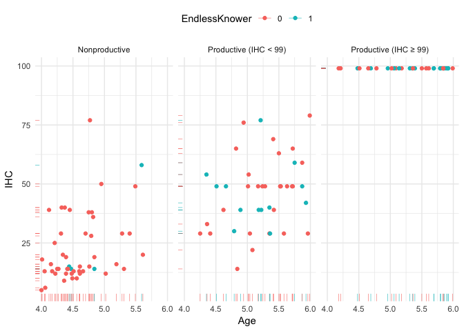<!-- -->

```r
ggplot(model.df, aes(x = Age, y = IHC)) + # specify points
geom_point(aes(color = NonKnower)) + # specify that we want the rug plot
geom_rug(aes(color = NonKnower), size = 0.2) + facet_wrap(. ~ Productivity.tertiary) + 
    # improve the data/ink ratio
theme_minimal() + theme(legend.position = "top")
```

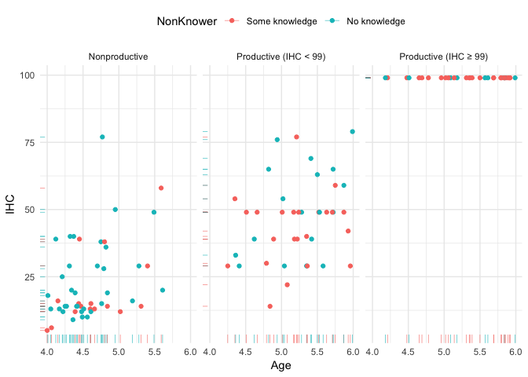<!-- -->


```r
ggplot(model.df, aes(x = prod.gradient, y = as.numeric(SuccessorKnower))) + # specify points
geom_point(aes(color = IHC), position = position_dodge()) + # specify that we want the rug plot
geom_rug(aes(color = as.numeric(SuccessorKnower)), size = 0.2) + facet_wrap(. ~ Productivity.tertiary) + 
    # improve the data/ink ratio
theme_minimal() + theme(legend.position = "top")
```

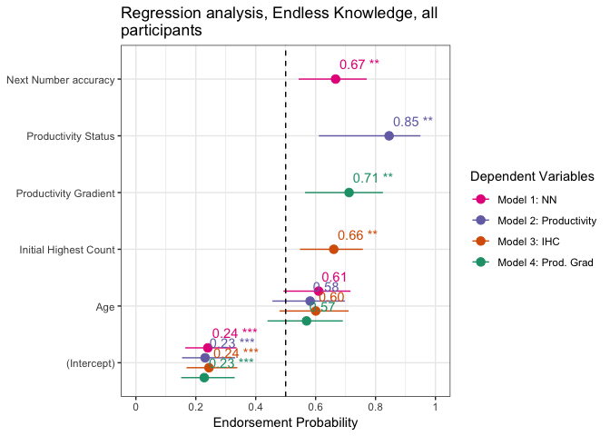<!-- -->


## Regressions no ihc=99

### prep

```r
distinct_model.df2 <- model.df %>% filter(Productivity.tertiary != "Productive (IHC ≥ 99)") %>% 
    mutate(IHC.c = as.vector(scale(IHC, center = TRUE, scale = TRUE)), Age.c = as.vector(scale(Age, 
        center = TRUE, scale = TRUE)), prod.gradient.c = as.vector(scale(prod.gradient, 
        center = TRUE, scale = TRUE)), wcnscore.c = as.vector(scale(wcnscore, center = TRUE, 
        scale = TRUE)))
# weighted effect coding for productivity
wec <- mean(as.numeric(distinct_model.df2$Productivity) - 1)
contrasts(distinct_model.df2$Productivity) <- c(-wec, 1 - wec)
str(distinct_model.df2)
```

```
## 'data.frame':	90 obs. of  17 variables:
##  $ LadlabID             : Factor w/ 122 levels "010516-K4","010916-D5",..: 1 3 4 5 6 7 8 9 10 11 ...
##  $ Age                  : num  4.17 4 4.44 4.12 4.41 4.75 5.42 4.25 4.6 4.77 ...
##  $ AgeGroup             : Factor w/ 6 levels "4-4.5y","4.5-5y",..: 1 1 1 1 1 2 3 1 2 2 ...
##  $ Gender               : Factor w/ 5 levels "f","F","m","M",..: 1 1 3 1 1 1 2 1 3 1 ...
##  $ SuccessorKnower      : Factor w/ 2 levels "0","1": 1 2 1 1 1 1 1 2 2 1 ...
##  $ EndlessKnower        : Factor w/ 2 levels "0","1": 1 1 2 1 1 1 1 1 1 1 ...
##  $ InfinityKnower       : Factor w/ 2 levels "None or partial",..: 1 1 1 1 1 1 1 1 1 1 ...
##  $ NonKnower            : Factor w/ 2 levels "Some knowledge",..: 2 1 1 2 2 2 2 1 1 2 ...
##  $ IHC                  : int  13 5 15 39 29 38 39 29 13 77 ...
##  $ Productivity         : Factor w/ 2 levels "Nonproductive",..: 1 1 1 1 2 1 2 2 1 1 ...
##   ..- attr(*, "contrasts")= num [1:2, 1] -0.456 0.544
##   .. ..- attr(*, "dimnames")=List of 2
##   .. .. ..$ : chr  "Nonproductive" "Productive"
##   .. .. ..$ : NULL
##  $ Productivity.tertiary: chr  "Nonproductive" "Nonproductive" "Nonproductive" "Nonproductive" ...
##  $ prod.gradient        : num  0.186 0 0.179 0 0.857 ...
##  $ wcnscore             : int  0 0 1 2 0 6 8 3 0 7 ...
##  $ IHC.c                : num  -1.066 -1.487 -0.961 0.3 -0.225 ...
##  $ Age.c                : num  -1.318 -1.631 -0.82 -1.41 -0.876 ...
##  $ prod.gradient.c      : num  -0.666 -1.081 -0.682 -1.081 0.832 ...
##  $ wcnscore.c           : num  -1.389 -1.389 -0.962 -0.536 -1.389 ...
```


### Successor models


Now the regressions

```
## 
## Calls:
## Base: glm(formula = SuccessorKnower ~ Age.c, family = "binomial", data = distinct_model.df2)
## IHC: glm(formula = SuccessorKnower ~ IHC.c + Age.c, family = "binomial", 
##     data = distinct_model.df2)
## NN: glm(formula = SuccessorKnower ~ wcnscore.c + Age.c, family = "binomial", 
##     data = distinct_model.df2)
## Productivity: glm(formula = SuccessorKnower ~ Productivity + Age.c, family = "binomial", 
##     data = distinct_model.df2)
## Prod. gain: glm(formula = SuccessorKnower ~ prod.gradient.c + Age.c, family = "binomial", 
##     data = distinct_model.df2)
## 
## ============================================================================
##                       Base      IHC        NN     Productivity  Prod. gain  
## ----------------------------------------------------------------------------
##   (Intercept)        -0.509*   -0.532*   -0.511*     -0.514*      -0.511*   
##                      (0.220)   (0.226)   (0.221)     (0.221)      (0.221)   
##   Age.c               0.296     0.598*    0.358       0.156        0.213    
##                      (0.221)   (0.285)   (0.242)     (0.267)      (0.273)   
##   IHC.c                        -0.520                                       
##                                (0.294)                                      
##   wcnscore.c                             -0.155                             
##                                          (0.242)                            
##   Productivity: 1                                     0.496                 
##                                                      (0.532)                
##   prod.gradient.c                                                  0.141    
##                                                                   (0.271)   
## ----------------------------------------------------------------------------
##   Nagelkerke R-sq.    0.027     0.077     0.033       0.040        0.031    
##   Log-likelihood    -58.755   -57.049   -58.547     -58.320      -58.619    
##   AIC               121.509   120.097   123.095     122.640      123.239    
##   N                  90        90        90          90           90        
## ============================================================================
```

#### Model comparisons
Looks like only IHC is a significant predictor. 

```
## Analysis of Deviance Table
## 
## Model 1: SuccessorKnower ~ Age.c
## Model 2: SuccessorKnower ~ IHC.c + Age.c
##   Resid. Df Resid. Dev Df Deviance Pr(>Chi)  
## 1        88     117.51                       
## 2        87     114.10  1   3.4123  0.06471 .
## ---
## Signif. codes:  0 '***' 0.001 '**' 0.01 '*' 0.05 '.' 0.1 ' ' 1
```

```
## Analysis of Deviance Table
## 
## Model 1: SuccessorKnower ~ Age.c
## Model 2: SuccessorKnower ~ wcnscore.c + Age.c
##   Resid. Df Resid. Dev Df Deviance Pr(>Chi)
## 1        88     117.51                     
## 2        87     117.09  1  0.41472   0.5196
```

```
## Analysis of Deviance Table
## 
## Model 1: SuccessorKnower ~ Age.c
## Model 2: SuccessorKnower ~ Productivity + Age.c
##   Resid. Df Resid. Dev Df Deviance Pr(>Chi)
## 1        88     117.51                     
## 2        87     116.64  1  0.86926   0.3512
```

```
## Analysis of Deviance Table
## 
## Model 1: SuccessorKnower ~ Age.c
## Model 2: SuccessorKnower ~ prod.gradient.c + Age.c
##   Resid. Df Resid. Dev Df Deviance Pr(>Chi)
## 1        88     117.51                     
## 2        87     117.24  1  0.27059   0.6029
```

Ok, let's test the base model too.. 

```r
# NULL MODEL
null.successor2 <- glm(SuccessorKnower ~ 1, family = "binomial", data = distinct_model.df2)

anova(null.successor2, base.successor2, test = "LRT")  # n.s.
```

```
## Analysis of Deviance Table
## 
## Model 1: SuccessorKnower ~ 1
## Model 2: SuccessorKnower ~ Age.c
##   Resid. Df Resid. Dev Df Deviance Pr(>Chi)
## 1        89     119.33                     
## 2        88     117.51  1   1.8245   0.1768
```

#### Visualizations


```r
plot_models(model.nn.successor2, model.prod.successor2, model.ihc.successor2, model.gain.successor2, 
    transform = "plogis", show.values = T, show.p = T, grid = T, colors = "bw", show.intercept = T, 
    spacing = 0.2, m.labels = c("Model 1: NN", "Model 2: Productivity", "Model 3: IHC", 
        "Model 4: Prod. Grad"), show.legend = T, title = "What predicts Successor Knowledge of infinity? (IHC<99)", 
    axis.labels = c(Age.c = "Age", wcnscore.c = "Next Number accuracy", IHC.c = "Initial Highest Count", 
        Productivity1 = "Productivity Status", prod.gradient.c = "Productivity Gradient"), 
    axis.title = "Endorsement Probability", axis.lim = c(0, 1)) + theme_bw() + ggplot2::geom_hline(yintercept = 0.5, 
    linetype = "dashed")
```

<!-- -->

```r
ggsave("graphs/reg1-succ.png", height = 6, width = 13)
```

**Predicted probabilities of Successor Knowledge of infinity (IHC<99)**


```r
reg1.succ.ihc <- plot_model(model.ihc.successor2, type = "pred", title = " ")$IHC.c
ggsave("graphs/reg1-succ-ihc.png", width = 6, height = 4)

reg1.succ.nn <- plot_model(model.nn.successor2, type = "pred", title = " ")$wcnscore.c
ggsave("graphs/reg1-succ-nn.png", width = 6, height = 4)

reg1.succ.prod <- plot_model(model.prod.successor2, type = "pred", title = " ")$Productivity
ggsave("graphs/reg1-succ-prodgroup.png", width = 6, height = 4)

reg1.succ.gain <- plot_model(model.gain.successor2, type = "pred", title = " ")$prod.grad
ggsave("graphs/reg1-succ-prodgrad.png", width = 6, height = 4)

ggarrange(reg1.succ.ihc, reg1.succ.nn, reg1.succ.prod, reg1.succ.gain, ncol = 2, 
    nrow = 2)
```

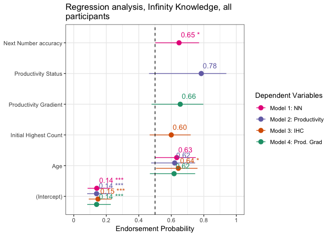<!-- -->


### Endless Models

```r
# Base model
base.endless2 <- glm(EndlessKnower ~ Age.c, family = "binomial", data = distinct_model.df2)

### IHC MODEL###
model.ihc.endless2 <- glm(EndlessKnower ~ IHC.c + Age.c, family = "binomial", data = distinct_model.df2)

### WCN MODEL###
model.nn.endless2 <- glm(EndlessKnower ~ wcnscore.c + Age.c, family = "binomial", 
    data = distinct_model.df2)

### PRODUCTIVITY MODEL###
model.prod.endless2 <- glm(EndlessKnower ~ Productivity + Age.c, family = "binomial", 
    data = distinct_model.df2)

## EXPLORATORY## - GAIN SCORE
model.gain.endless2 <- glm(EndlessKnower ~ prod.gradient.c + Age.c, family = "binomial", 
    data = distinct_model.df2)

## Regression table for Endless Models
mtable.endless.knowers2 <- mtable(Base = base.endless2, IHC = model.ihc.endless2, 
    NN = model.nn.endless2, Productivity = model.prod.endless2, `Prod. gradient` = model.gain.endless2, 
    summary.stats = c("Nagelkerke R-sq.", "Log-likelihood", "AIC", "F", "p", "N"))

mtable.endless.knowers2
```

```
## 
## Calls:
## Base: glm(formula = EndlessKnower ~ Age.c, family = "binomial", data = distinct_model.df2)
## IHC: glm(formula = EndlessKnower ~ IHC.c + Age.c, family = "binomial", 
##     data = distinct_model.df2)
## NN: glm(formula = EndlessKnower ~ wcnscore.c + Age.c, family = "binomial", 
##     data = distinct_model.df2)
## Productivity: glm(formula = EndlessKnower ~ Productivity + Age.c, family = "binomial", 
##     data = distinct_model.df2)
## Prod. gradient: glm(formula = EndlessKnower ~ prod.gradient.c + Age.c, family = "binomial", 
##     data = distinct_model.df2)
## 
## ======================================================================================
##                        Base        IHC          NN      Productivity  Prod. gradient  
## --------------------------------------------------------------------------------------
##   (Intercept)        -1.519***   -1.546***   -1.578***    -1.667***      -1.688***    
##                      (0.284)     (0.290)     (0.298)      (0.323)        (0.328)      
##   Age.c               0.451       0.261       0.287        0.025         -0.057       
##                      (0.274)     (0.325)     (0.296)      (0.334)        (0.356)      
##   IHC.c                           0.349                                               
##                                  (0.318)                                              
##   wcnscore.c                                  0.466                                   
##                                              (0.308)                                  
##   Productivity: 1                                          1.625*                     
##                                                           (0.726)                     
##   prod.gradient.c                                                         0.905*      
##                                                                          (0.389)      
## --------------------------------------------------------------------------------------
##   Nagelkerke R-sq.    0.049       0.070       0.090        0.142          0.154       
##   Log-likelihood    -42.222     -41.629     -41.036      -39.462        -39.106       
##   AIC                88.445      89.259      88.072       84.924         84.211       
##   p                   0.095       0.137       0.076        0.016          0.011       
##   N                  90          90          90           90             90           
## ======================================================================================
```

```r
write.mtable(mtable.endless.knowers2, file = "graphs/table3.txt")
```

#### Model comparisons
Only productivity (& productivity gain) is significant

```r
# base v. IHC
anova(base.endless2, model.ihc.endless2, test = "LRT")  #IHC not significant
```

```
## Analysis of Deviance Table
## 
## Model 1: EndlessKnower ~ Age.c
## Model 2: EndlessKnower ~ IHC.c + Age.c
##   Resid. Df Resid. Dev Df Deviance Pr(>Chi)
## 1        88     84.445                     
## 2        87     83.259  1   1.1857   0.2762
```

```r
# base v. highest contiguous
anova(model.nn.endless2, base.endless2, test = "LRT")  #not significant
```

```
## Analysis of Deviance Table
## 
## Model 1: EndlessKnower ~ wcnscore.c + Age.c
## Model 2: EndlessKnower ~ Age.c
##   Resid. Df Resid. Dev Df Deviance Pr(>Chi)
## 1        87     82.072                     
## 2        88     84.445 -1   -2.373   0.1234
```

```r
# base v. productivity
anova(model.prod.endless2, base.endless2, test = "LRT")  #Prod significant
```

```
## Analysis of Deviance Table
## 
## Model 1: EndlessKnower ~ Productivity + Age.c
## Model 2: EndlessKnower ~ Age.c
##   Resid. Df Resid. Dev Df Deviance Pr(>Chi)  
## 1        87     78.924                       
## 2        88     84.445 -1  -5.5209  0.01879 *
## ---
## Signif. codes:  0 '***' 0.001 '**' 0.01 '*' 0.05 '.' 0.1 ' ' 1
```

```r
## Exploratory base v. productivity gradient
anova(base.endless2, model.gain.endless2, test = "LRT")  # prod. gradient significant
```

```
## Analysis of Deviance Table
## 
## Model 1: EndlessKnower ~ Age.c
## Model 2: EndlessKnower ~ prod.gradient.c + Age.c
##   Resid. Df Resid. Dev Df Deviance Pr(>Chi)  
## 1        88     84.445                       
## 2        87     78.211  1   6.2332  0.01254 *
## ---
## Signif. codes:  0 '***' 0.001 '**' 0.01 '*' 0.05 '.' 0.1 ' ' 1
```

Report confidence interval around productivity group model 

```r
summary(model.prod.endless2)
```

```
## 
## Call:
## glm(formula = EndlessKnower ~ Productivity + Age.c, family = "binomial", 
##     data = distinct_model.df2)
## 
## Deviance Residuals: 
##     Min       1Q   Median       3Q      Max  
## -0.8861  -0.8670  -0.4129  -0.4086   2.2417  
## 
## Coefficients:
##               Estimate Std. Error z value Pr(>|z|)    
## (Intercept)   -1.66740    0.32262  -5.168 2.36e-07 ***
## Productivity1  1.62516    0.72613   2.238   0.0252 *  
## Age.c          0.02465    0.33354   0.074   0.9411    
## ---
## Signif. codes:  0 '***' 0.001 '**' 0.01 '*' 0.05 '.' 0.1 ' ' 1
## 
## (Dispersion parameter for binomial family taken to be 1)
## 
##     Null deviance: 87.229  on 89  degrees of freedom
## Residual deviance: 78.924  on 87  degrees of freedom
## AIC: 84.924
## 
## Number of Fisher Scoring iterations: 5
```

```r
confint(model.prod.endless2, "Productivity1")
```

```
## Waiting for profiling to be done...
```

```
##     2.5 %    97.5 % 
## 0.2622983 3.1558550
```

Test base model against null model

```r
# NULL MODEL
null.endless2 <- glm(EndlessKnower ~ 1, family = "binomial", data = distinct_model.df2)

anova(null.endless2, base.endless2, test = "LRT")  # n.s.
```

```
## Analysis of Deviance Table
## 
## Model 1: EndlessKnower ~ 1
## Model 2: EndlessKnower ~ Age.c
##   Resid. Df Resid. Dev Df Deviance Pr(>Chi)  
## 1        89     87.229                       
## 2        88     84.445  1   2.7848  0.09516 .
## ---
## Signif. codes:  0 '***' 0.001 '**' 0.01 '*' 0.05 '.' 0.1 ' ' 1
```

#### Visualizations


```r
plot_models(model.nn.endless2, model.prod.endless2, model.ihc.endless2, model.gain.endless2, 
    transform = "plogis", show.values = T, show.p = T, grid = T, colors = "bw", show.intercept = T, 
    spacing = 0.2, m.labels = c("Model 1: NN", "Model 2: Productivity", "Model 3: IHC", 
        "Model 4: Prod. Grad"), show.legend = T, title = "What predicts Endless Knowledge of infinity? (IHC<99)", 
    axis.labels = c(Age.c = "Age", wcnscore.c = "Next Number accuracy", IHC.c = "Initial Highest Count", 
        Productivity1 = "Productivity Status", prod.gradient.c = "Productivity Gradient"), 
    axis.title = "Endorsement Probability", axis.lim = c(0, 1)) + theme_bw() + ggplot2::geom_hline(yintercept = 0.5, 
    linetype = "dashed")
```

<!-- -->

```r
ggsave("graphs/reg1-endless.png", height = 6, width = 13)
```
**Predicted probability of Endless knowledge of infinity (IHC<99)**

Show predicted effects of Endless ~ Productivity + Age

```r
reg1.end.ihc <- plot_model(model.ihc.endless2, type = "pred")$IHC.c
ggsave("graphs/reg1-endless-ihc.png", width = 6, height = 4)

reg1.end.nn <- plot_model(model.nn.endless2, type = "pred", title = " ")$wcnscore.c
ggsave("graphs/reg1-endless-nn.png", width = 6, height = 4)

reg1.end.prod <- plot_model(model.prod.endless2, type = "pred", title = " ")$Productivity
ggsave("graphs/reg1-endless-prodgroup.png", width = 6, height = 4)

reg1.end.gain <- plot_model(model.gain.endless2, type = "pred", title = " ")$prod.grad
ggsave("graphs/reg1-endless-prodgrad.png", width = 6, height = 4)

ggarrange(reg1.end.ihc, reg1.end.nn, reg1.end.prod, reg1.end.gain, ncol = 2, nrow = 2)
```

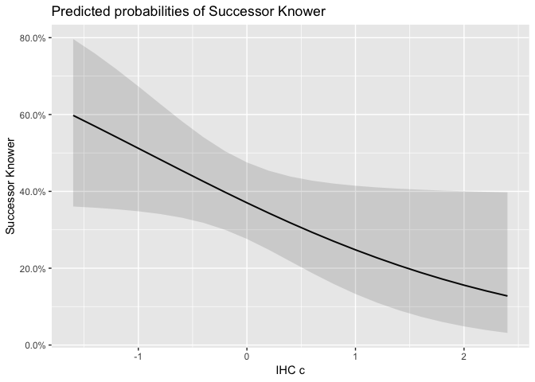<!-- -->


### Full Infinity Knowledge models

```r
###MODEL BUILDING AND COMPARISONS###
#base model for successor knower
base.infinity2 <- glm(InfinityKnower ~ Age.c, family = "binomial", 
                        data = distinct_model.df2)

##IHC model
model.ihc.infinity2 <- glm(InfinityKnower ~ IHC.c + Age.c, family = "binomial", 
                             data = distinct_model.df2)
##Highest NN Model
model.nn.infinity2 <- glm(InfinityKnower ~ wcnscore.c + Age.c, family = "binomial", 
                            data = distinct_model.df2)
##Productivity model
model.prod.infinity2 <- glm(InfinityKnower ~ Productivity + Age.c, family = "binomial",
                              data = distinct_model.df2)

##Gain Score model
model.gain.infinity2 <- glm(InfinityKnower ~ prod.gradient.c + Age.c, family = "binomial",
                              data = distinct_model.df2)

##Regression table for Infinity Knower Models (Table 4)
mtable.inf.knowers2 <- mtable('Base' = base.infinity2,
            'IHC' = model.ihc.infinity2,
            'NN' = model.nn.infinity2,
            'Prod. Group' = model.prod.infinity2,
            'Prod. Gain' = model.gain.infinity2,
            #summary.stats = c('R-squared','F','p','N'))
            summary.stats = c('Nagelkerke R-sq.','Log-likelihood','AIC','N'))
mtable.inf.knowers2
```

```
## 
## Calls:
## Base: glm(formula = InfinityKnower ~ Age.c, family = "binomial", data = distinct_model.df2)
## IHC: glm(formula = InfinityKnower ~ IHC.c + Age.c, family = "binomial", 
##     data = distinct_model.df2)
## NN: glm(formula = InfinityKnower ~ wcnscore.c + Age.c, family = "binomial", 
##     data = distinct_model.df2)
## Prod. Group: glm(formula = InfinityKnower ~ Productivity + Age.c, family = "binomial", 
##     data = distinct_model.df2)
## Prod. Gain: glm(formula = InfinityKnower ~ prod.gradient.c + Age.c, family = "binomial", 
##     data = distinct_model.df2)
## 
## =================================================================================
##                        Base        IHC          NN      Prod. Group  Prod. Gain  
## ---------------------------------------------------------------------------------
##   (Intercept)        -1.972***   -1.975***   -2.003***   -2.075***    -2.065***  
##                      (0.337)     (0.338)     (0.346)     (0.370)      (0.366)    
##   Age.c               0.527       0.481       0.417       0.207        0.193     
##                      (0.317)     (0.377)     (0.341)     (0.379)      (0.396)    
##   IHC.c                           0.084                                          
##                                  (0.373)                                         
##   wcnscore.c                                  0.307                              
##                                              (0.349)                             
##   Productivity: 1                                         1.229                  
##                                                          (0.823)                 
##   prod.gradient.c                                                      0.603     
##                                                                       (0.424)    
## ---------------------------------------------------------------------------------
##   Nagelkerke R-sq.    0.058       0.059       0.073       0.104        0.101     
##   Log-likelihood    -33.907     -33.882     -33.514     -32.714      -32.806     
##   AIC                71.814      73.763      73.028      71.428       71.612     
##   N                  90          90          90          90           90         
## =================================================================================
```

```r
# save as txt
write.mtable(mtable.inf.knowers2, file="graphs/table4.txt")
```

#### Model comparisons
No variable is predictive. 

```r
# base v. IHC
anova(base.infinity2, model.ihc.infinity2, test = "LRT")  #n.s.
```

```
## Analysis of Deviance Table
## 
## Model 1: InfinityKnower ~ Age.c
## Model 2: InfinityKnower ~ IHC.c + Age.c
##   Resid. Df Resid. Dev Df Deviance Pr(>Chi)
## 1        88     67.814                     
## 2        87     67.763  1 0.050587    0.822
```

```r
# base v. highest contiguous
anova(base.infinity2, model.nn.infinity2, test = "LRT")  # n.s.
```

```
## Analysis of Deviance Table
## 
## Model 1: InfinityKnower ~ Age.c
## Model 2: InfinityKnower ~ wcnscore.c + Age.c
##   Resid. Df Resid. Dev Df Deviance Pr(>Chi)
## 1        88     67.814                     
## 2        87     67.028  1  0.78552   0.3755
```

```r
# base v. productivity
anova(base.infinity2, model.prod.infinity2, test = "LRT")  #n.s. 
```

```
## Analysis of Deviance Table
## 
## Model 1: InfinityKnower ~ Age.c
## Model 2: InfinityKnower ~ Productivity + Age.c
##   Resid. Df Resid. Dev Df Deviance Pr(>Chi)
## 1        88     67.814                     
## 2        87     65.428  1   2.3862   0.1224
```

```r
# base v. productivity gradient
anova(base.infinity2, model.gain.infinity2, test = "LRT")  #n.s.
```

```
## Analysis of Deviance Table
## 
## Model 1: InfinityKnower ~ Age.c
## Model 2: InfinityKnower ~ prod.gradient.c + Age.c
##   Resid. Df Resid. Dev Df Deviance Pr(>Chi)
## 1        88     67.814                     
## 2        87     65.612  1    2.202   0.1378
```
#### Visualization


```r
plot_models(model.nn.infinity2, model.prod.infinity2, model.ihc.infinity2, model.gain.infinity2, 
    transform = "plogis", show.values = T, show.p = T, grid = T, colors = "bw", show.intercept = T, 
    spacing = 0.2, m.labels = c("Model 1: NN", "Model 2: Productivity", "Model 3: IHC", 
        "Model 4: Prod. Grad"), show.legend = T, title = "What predicts Full Knowledge of infinity? (IHC<99)", 
    axis.labels = c(Age.c = "Age", wcnscore.c = "Next Number accuracy", IHC.c = "Initial Highest Count", 
        Productivity1 = "Productivity Status", prod.gradient.c = "Productivity Gradient"), 
    axis.title = "Endorsement Probability", axis.lim = c(0, 1)) + theme_bw() + ggplot2::geom_hline(yintercept = 0.5, 
    linetype = "dashed")
```

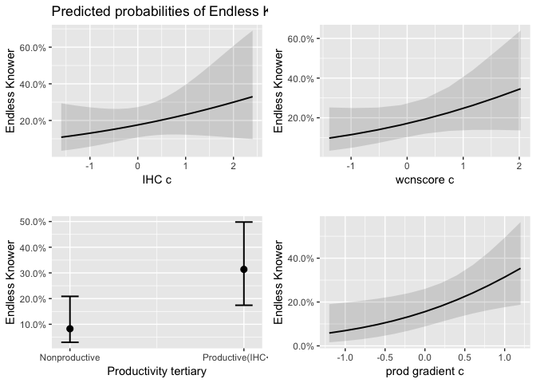<!-- -->

```r
ggsave("graphs/reg1-fullinf.png", height = 6, width = 13)
```

**Predicted probability of Full knowledge of infinity (IHC<99)**


```r
reg1.full.ihc <- plot_model(model.ihc.infinity2, type = "pred", title = " ")$IHC.c
ggsave("graphs/reg1-fullinf-ihc.png", width = 6, height = 4)

reg1.full.nn <- plot_model(model.nn.infinity2, type = "pred", title = " ")$wcnscore.c
ggsave("graphs/reg1-fullinf-nn.png", width = 6, height = 4)

reg1.full.prod <- plot_model(model.prod.infinity2, type = "pred", title = " ")$Productivity
ggsave("graphs/reg1-fullinf-prodgroup.png", width = 6, height = 4)

reg1.full.gain <- plot_model(model.gain.infinity2, type = "pred", title = " ")$prod.grad
ggsave("graphs/reg1-fullinf-prodgrad.png", width = 6, height = 4)

ggarrange(reg1.full.ihc, reg1.full.nn, reg1.full.prod, reg1.full.gain, ncol = 2, 
    nrow = 2, labels = "AUTO")
```

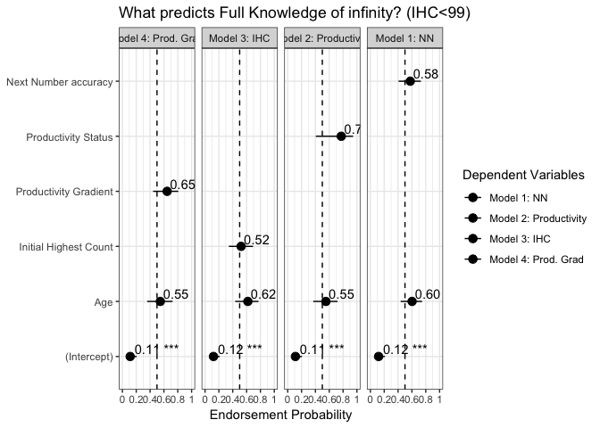<!-- -->


### Graphical model comparisons

Using binary productivity

```r
large.endless.full2 <- glm(EndlessKnower ~ Productivity + wcnscore.c + IHC.c + Age.c, 
    family = "binomial", data = distinct_model.df2)
large.successor.full2 <- glm(SuccessorKnower ~ Productivity + wcnscore.c + IHC.c + 
    Age.c, family = "binomial", data = distinct_model.df2)
large.inf.full2 <- glm(InfinityKnower ~ Productivity + wcnscore.c + IHC.c + Age.c, 
    family = "binomial", data = distinct_model.df2)
# plot all 3 together
plot_models(large.successor.full2, large.endless.full2, large.inf.full2, transform = "plogis", 
    show.values = TRUE, show.p = T, grid = T, colors = "bw", show.intercept = T, 
    m.labels = c(SuccessorKnower = "Succesor: Can always +1", EndlessKnower = "Endless: Numbers go forever", 
        InfinityKnower = "Full Infinity knowledge"), show.legend = F, title = "Regression analysis, IHC < 99", 
    axis.labels = c(Age.c = "Age", wcnscore.c = "Next Number accuracy", IHC.c = "Initial Highest Count", 
        Productivity1 = "Productivity Status"), axis.title = "Endorsement Probability") + 
    theme_bw() + ggplot2::geom_hline(yintercept = 0.5, linetype = "dashed")
ggsave("graphs/reg1-all-prod.png", height = 6, width = 9)
```

Using productivity gradient

```r
large.endless.full2.gain <- glm(EndlessKnower ~ prod.gradient.c + wcnscore.c + IHC.c + 
    Age.c, family = "binomial", data = distinct_model.df2)
large.successor.full2.gain <- glm(SuccessorKnower ~ prod.gradient.c + wcnscore.c + 
    IHC.c + Age.c, family = "binomial", data = distinct_model.df2)
large.inf.full2.gain <- glm(InfinityKnower ~ prod.gradient.c + wcnscore.c + IHC.c + 
    Age.c, family = "binomial", data = distinct_model.df2)
# plot all 3 together
plot_models(large.successor.full2.gain, large.endless.full2.gain, large.inf.full2.gain, 
    transform = "plogis", show.values = TRUE, show.p = T, grid = T, colors = "bw", 
    show.intercept = T, m.labels = c(SuccessorKnower = "Succesor: Can always +1", 
        EndlessKnower = "Endless: Numbers go forever", InfinityKnower = "Full Infinity knowledge"), 
    show.legend = F, title = "Regression analysis, IHC < 99", axis.labels = c(Age.c = "Age", 
        wcnscore.c = "Next Number accuracy", IHC.c = "Initial Highest Count", prod.gradient.c = "Productivity Gradient"), 
    axis.title = "Endorsement Probability") + theme_bw() + ggplot2::geom_hline(yintercept = 0.5, 
    linetype = "dashed")
```

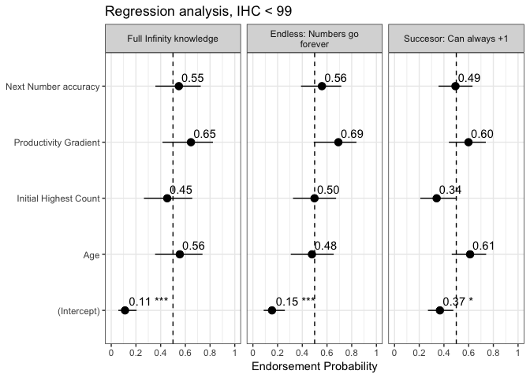<!-- -->

```r
ggsave("graphs/reg1-all-gain.png", height = 6, width = 9)
```


## Regression with All subjects
### prep

```r
# scale and center for model fit
distinct_model.df <- model.df %>% mutate(IHC.c = as.vector(scale(IHC, center = TRUE, 
    scale = TRUE)), Age.c = as.vector(scale(Age, center = TRUE, scale = TRUE)), prod.gradient.c = as.vector(scale(prod.gradient, 
    center = TRUE, scale = TRUE)), wcnscore.c = as.vector(scale(wcnscore, center = TRUE, 
    scale = TRUE)))
# weighted effect coding for productivity
wec <- mean(as.numeric(distinct_model.df$Productivity) - 1)
contrasts(distinct_model.df$Productivity) <- c(-wec, 1 - wec)
# structure
str(distinct_model.df)
```

```
## 'data.frame':	122 obs. of  17 variables:
##  $ LadlabID             : Factor w/ 122 levels "010516-K4","010916-D5",..: 1 2 3 4 5 6 7 8 9 10 ...
##  $ Age                  : num  4.17 4.78 4 4.44 4.12 4.41 4.75 5.42 4.25 4.6 ...
##  $ AgeGroup             : Factor w/ 6 levels "4-4.5y","4.5-5y",..: 1 2 1 1 1 1 2 3 1 2 ...
##  $ Gender               : Factor w/ 5 levels "f","F","m","M",..: 1 3 1 3 1 1 1 2 1 3 ...
##  $ SuccessorKnower      : Factor w/ 2 levels "0","1": 1 2 2 1 1 1 1 1 2 2 ...
##  $ EndlessKnower        : Factor w/ 2 levels "0","1": 1 1 1 2 1 1 1 1 1 1 ...
##  $ InfinityKnower       : Factor w/ 2 levels "None or partial",..: 1 1 1 1 1 1 1 1 1 1 ...
##  $ NonKnower            : Factor w/ 2 levels "Some knowledge",..: 2 1 1 1 2 2 2 2 1 1 ...
##  $ IHC                  : int  13 99 5 15 39 29 38 39 29 13 ...
##  $ Productivity         : Factor w/ 2 levels "Nonproductive",..: 1 2 1 1 1 2 1 2 2 1 ...
##   ..- attr(*, "contrasts")= num [1:2, 1] -0.598 0.402
##   .. ..- attr(*, "dimnames")=List of 2
##   .. .. ..$ : chr  "Nonproductive" "Productive"
##   .. .. ..$ : NULL
##  $ Productivity.tertiary: chr  "Nonproductive" "Productive (IHC ≥ 99)" "Nonproductive" "Nonproductive" ...
##  $ prod.gradient        : num  0.186 1 0 0.179 0 ...
##  $ wcnscore             : int  0 8 0 1 2 0 6 8 3 0 ...
##  $ IHC.c                : num  -1.127 1.456 -1.367 -1.067 -0.346 ...
##  $ Age.c                : num  -1.449 -0.382 -1.747 -0.977 -1.537 ...
##  $ prod.gradient.c      : num  -0.97 0.852 -1.387 -0.987 -1.387 ...
##  $ wcnscore.c           : num  -1.571 1.35 -1.571 -1.206 -0.841 ...
```
### Successor models

```r
###MODEL BUILDING AND COMPARISONS###
#base model for successor knower
base.successor <- glm(SuccessorKnower ~ Age.c, family = "binomial", 
                        data = distinct_model.df)

##IHC model##
model.ihc.successor <- glm(SuccessorKnower ~ IHC.c + Age.c, family = "binomial", 
                             data = distinct_model.df)
##WCN Model##
model.nn.successor <- glm(SuccessorKnower ~ wcnscore.c + Age.c, family = "binomial", 
                            data = distinct_model.df)
##Productivity model##
model.prod.successor <- glm(SuccessorKnower ~ Productivity + Age.c, family = "binomial",
                              data = distinct_model.df)

##EXPLORATORY## - GAIN SCORE
model.gain.successor <- glm(SuccessorKnower ~ prod.gradient.c + Age.c, family = "binomial",
                              data = distinct_model.df)

##Regression table for Successor Knower Models (Table )
mtable.sf.knowers <- mtable('Base' = base.successor,
            'IHC' = model.ihc.successor,
            'NN' = model.nn.successor,
            'Productivity' = model.prod.successor,
            'Prod. gain' = model.gain.successor,
            #summary.stats = c('R-squared','F','p','N'))
            summary.stats = c('Nagelkerke R-sq.','Log-likelihood','AIC','N'))
mtable.sf.knowers
```

```
## 
## Calls:
## Base: glm(formula = SuccessorKnower ~ Age.c, family = "binomial", data = distinct_model.df)
## IHC: glm(formula = SuccessorKnower ~ IHC.c + Age.c, family = "binomial", 
##     data = distinct_model.df)
## NN: glm(formula = SuccessorKnower ~ wcnscore.c + Age.c, family = "binomial", 
##     data = distinct_model.df)
## Productivity: glm(formula = SuccessorKnower ~ Productivity + Age.c, family = "binomial", 
##     data = distinct_model.df)
## Prod. gain: glm(formula = SuccessorKnower ~ prod.gradient.c + Age.c, family = "binomial", 
##     data = distinct_model.df)
## 
## ============================================================================
##                       Base      IHC        NN     Productivity  Prod. gain  
## ----------------------------------------------------------------------------
##   (Intercept)        -0.306    -0.306    -0.307      -0.313       -0.310    
##                      (0.186)   (0.186)   (0.186)     (0.188)      (0.187)   
##   Age.c               0.342     0.304     0.286       0.163        0.197    
##                      (0.188)   (0.218)   (0.210)     (0.226)      (0.230)   
##   IHC.c                         0.074                                       
##                                (0.216)                                      
##   wcnscore.c                              0.126                             
##                                          (0.209)                            
##   Productivity: 1                                     0.661                 
##                                                      (0.464)                
##   prod.gradient.c                                                  0.254    
##                                                                   (0.231)   
## ----------------------------------------------------------------------------
##   Nagelkerke R-sq.    0.037     0.038     0.041       0.059        0.050    
##   Log-likelihood    -81.539   -81.480   -81.358     -80.515      -80.929    
##   AIC               167.077   168.960   168.716     167.030      167.858    
##   N                 122       122       122         122          122        
## ============================================================================
```

```r
write.mtable(mtable.sf.knowers, file="graphs/table3-all.txt")
```

#### Model comparisons

Comparing models with a single predictor against base model, we find that none of the predictors are significant in accounting for successor knowledge after controlling for age and IHC.

```r
# base v. IHC
anova(base.successor, model.ihc.successor, test = "LRT")  #IHC n.s.
```

```
## Analysis of Deviance Table
## 
## Model 1: SuccessorKnower ~ Age.c
## Model 2: SuccessorKnower ~ IHC.c + Age.c
##   Resid. Df Resid. Dev Df Deviance Pr(>Chi)
## 1       120     163.08                     
## 2       119     162.96  1  0.11678   0.7325
```

```r
# wcn v. base
anova(base.successor, model.nn.successor, test = "LRT")  #NN n.s.
```

```
## Analysis of Deviance Table
## 
## Model 1: SuccessorKnower ~ Age.c
## Model 2: SuccessorKnower ~ wcnscore.c + Age.c
##   Resid. Df Resid. Dev Df Deviance Pr(>Chi)
## 1       120     163.08                     
## 2       119     162.72  1  0.36154   0.5477
```

```r
# Productivity v. base
anova(base.successor, model.prod.successor, test = "LRT")  # n.s.
```

```
## Analysis of Deviance Table
## 
## Model 1: SuccessorKnower ~ Age.c
## Model 2: SuccessorKnower ~ Productivity + Age.c
##   Resid. Df Resid. Dev Df Deviance Pr(>Chi)
## 1       120     163.08                     
## 2       119     161.03  1   2.0476   0.1524
```

```r
## Exploratory vs. base
anova(base.successor, model.gain.successor, test = "LRT")  # n.s.
```

```
## Analysis of Deviance Table
## 
## Model 1: SuccessorKnower ~ Age.c
## Model 2: SuccessorKnower ~ prod.gradient.c + Age.c
##   Resid. Df Resid. Dev Df Deviance Pr(>Chi)
## 1       120     163.08                     
## 2       119     161.86  1   1.2192   0.2695
```

#### Visualize


```r
plot_models(model.ihc.successor, model.nn.successor, model.prod.successor, model.gain.successor, 
    transform = "plogis", show.values = T, show.p = T, colors = "bw", show.intercept = T, 
    spacing = 0.7, grid = T, m.labels = c("Model 1: IHC", "Model 2: NN", "Model 3: Productivity", 
        "Model 4: Prod. Grad"), show.legend = T, title = "What predicts Successor Knowledge of infinity? (all participants)", 
    axis.labels = c(Age.c = "Age", wcnscore.c = "Next Number accuracy", IHC.c = "Initial Highest Count", 
        Productivity1 = "Productivity Group", prod.gradient.c = "Productivity Gradient"), 
    axis.title = "Endorsement Probability", axis.lim = c(0, 1)) + theme_bw() + ggplot2::geom_hline(yintercept = 0.5, 
    linetype = "dashed") + ggsave("graphs/reg2-succ.png", height = 6, width = 10)
```

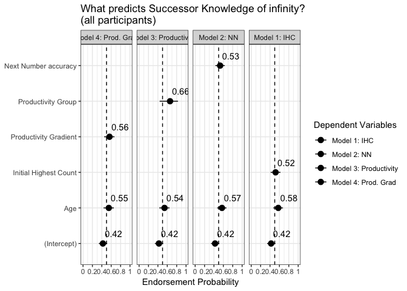<!-- -->

Visualize relationship between IHC and SuccessorKnowledge, by productivity

```r
distinct_model.df %>% ggplot(data = ., mapping = aes(x = IHC, y = SuccessorKnower, 
    color = Productivity, group = Productivity)) + geom_point(alpha = 0.2, size = 2) + 
    geom_smooth(method = "glm", method.args = list(family = "binomial"), alpha = 0.2, 
        aes(fill = Productivity)) + scale_color_manual(values = mypalette, name = "Productivity") + 
    scale_fill_manual(values = mypalette, name = "Productivity")
```

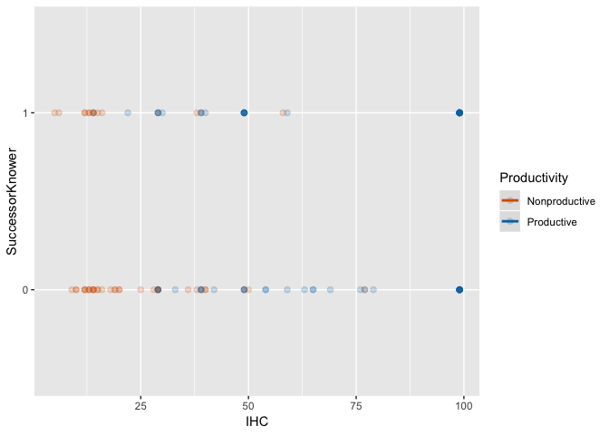<!-- -->

### Endless models

```r
# Base model
base.endless <- glm(EndlessKnower ~ Age.c, family = "binomial", data = distinct_model.df)

### IHC MODEL###
model.ihc.endless <- glm(EndlessKnower ~ IHC.c + Age.c, family = "binomial", data = distinct_model.df)

### NN MODEL###
model.nn.endless <- glm(EndlessKnower ~ wcnscore.c + Age.c, family = "binomial", 
    data = distinct_model.df)

### PRODUCTIVITY MODEL###
model.prod.endless <- glm(EndlessKnower ~ Productivity + Age.c, family = "binomial", 
    data = distinct_model.df)

## EXPLORATORY## - GAIN SCORE
model.gain.endless <- glm(EndlessKnower ~ prod.gradient.c + Age.c, family = "binomial", 
    data = distinct_model.df)
```

#### Model comparisons
Unlike for successor knowledge, here we find that every predictor is significant addition to the base model.

```r
# base v. IHC
anova(base.endless, model.ihc.endless, test = "LRT")
```

```
## Analysis of Deviance Table
## 
## Model 1: EndlessKnower ~ Age.c
## Model 2: EndlessKnower ~ IHC.c + Age.c
##   Resid. Df Resid. Dev Df Deviance Pr(>Chi)   
## 1       120     133.31                        
## 2       119     125.50  1   7.8065 0.005206 **
## ---
## Signif. codes:  0 '***' 0.001 '**' 0.01 '*' 0.05 '.' 0.1 ' ' 1
```

```r
# base v. wcn accuracy
anova(model.nn.endless, base.endless, test = "LRT")
```

```
## Analysis of Deviance Table
## 
## Model 1: EndlessKnower ~ wcnscore.c + Age.c
## Model 2: EndlessKnower ~ Age.c
##   Resid. Df Resid. Dev Df Deviance Pr(>Chi)   
## 1       119     125.79                        
## 2       120     133.31 -1  -7.5249 0.006085 **
## ---
## Signif. codes:  0 '***' 0.001 '**' 0.01 '*' 0.05 '.' 0.1 ' ' 1
```

```r
# base v. productivity
anova(model.prod.endless, base.endless, test = "LRT")
```

```
## Analysis of Deviance Table
## 
## Model 1: EndlessKnower ~ Productivity + Age.c
## Model 2: EndlessKnower ~ Age.c
##   Resid. Df Resid. Dev Df Deviance Pr(>Chi)   
## 1       119     124.93                        
## 2       120     133.31 -1  -8.3837 0.003786 **
## ---
## Signif. codes:  0 '***' 0.001 '**' 0.01 '*' 0.05 '.' 0.1 ' ' 1
```

```r
## Exploratory base v. productivity gradient
anova(base.endless, model.gain.endless, test = "LRT")
```

```
## Analysis of Deviance Table
## 
## Model 1: EndlessKnower ~ Age.c
## Model 2: EndlessKnower ~ prod.gradient.c + Age.c
##   Resid. Df Resid. Dev Df Deviance Pr(>Chi)   
## 1       120     133.31                        
## 2       119     124.06  1   9.2477 0.002358 **
## ---
## Signif. codes:  0 '***' 0.001 '**' 0.01 '*' 0.05 '.' 0.1 ' ' 1
```

#### Larger models
Combining two factors don't explain additional variance over single-factor models.

```r
model.prod.nn.endless <- glm(EndlessKnower ~ Productivity + wcnscore.c + Age.c, family = "binomial", 
    data = distinct_model.df)
drop1(model.prod.nn.endless, test = "Chisq")
```

```
## Single term deletions
## 
## Model:
## EndlessKnower ~ Productivity + wcnscore.c + Age.c
##              Df Deviance    AIC    LRT Pr(>Chi)  
## <none>            122.52 130.52                  
## Productivity  1   125.79 131.79 3.2692  0.07059 .
## wcnscore.c    1   124.93 130.93 2.4104  0.12053  
## Age.c         1   123.56 129.56 1.0449  0.30668  
## ---
## Signif. codes:  0 '***' 0.001 '**' 0.01 '*' 0.05 '.' 0.1 ' ' 1
```

```r
# prod + ihc
model.prod.ihc.endless <- glm(EndlessKnower ~ Productivity + IHC.c + Age.c, family = "binomial", 
    data = distinct_model.df)
drop1(model.prod.ihc.endless, test = "Chisq")
```

```
## Single term deletions
## 
## Model:
## EndlessKnower ~ Productivity + IHC.c + Age.c
##              Df Deviance    AIC    LRT Pr(>Chi)  
## <none>            122.64 130.63                  
## Productivity  1   125.50 131.50 2.8689   0.0903 .
## IHC.c         1   124.93 130.93 2.2917   0.1301  
## Age.c         1   123.64 129.64 1.0062   0.3158  
## ---
## Signif. codes:  0 '***' 0.001 '**' 0.01 '*' 0.05 '.' 0.1 ' ' 1
```

```r
# nn + ihc
model.nn.ihc.endless <- glm(EndlessKnower ~ wcnscore.c + IHC.c + Age.c, family = "binomial", 
    data = distinct_model.df)
drop1(model.nn.ihc.endless, test = "Chisq")
```

```
## Single term deletions
## 
## Model:
## EndlessKnower ~ wcnscore.c + IHC.c + Age.c
##            Df Deviance    AIC    LRT Pr(>Chi)
## <none>          124.33 132.33                
## wcnscore.c  1   125.50 131.50 1.1747   0.2784
## IHC.c       1   125.79 131.79 1.4563   0.2275
## Age.c       1   126.65 132.65 2.3186   0.1278
```

```r
# all 3
large.endless.full <- glm(EndlessKnower ~ Productivity + wcnscore.c + IHC.c + Age.c, 
    family = "binomial", data = distinct_model.df)
summary(large.endless.full)
```

```
## 
## Call:
## glm(formula = EndlessKnower ~ Productivity + wcnscore.c + IHC.c + 
##     Age.c, family = "binomial", data = distinct_model.df)
## 
## Deviance Residuals: 
##     Min       1Q   Median       3Q      Max  
## -1.3528  -0.8714  -0.4191   1.0431   2.4089  
## 
## Coefficients:
##               Estimate Std. Error z value Pr(>|z|)    
## (Intercept)    -1.2281     0.2601  -4.721 2.34e-06 ***
## Productivity1   1.0915     0.7336   1.488    0.137    
## wcnscore.c      0.2906     0.3662   0.794    0.427    
## IHC.c           0.2511     0.3508   0.716    0.474    
## Age.c           0.2507     0.2646   0.947    0.343    
## ---
## Signif. codes:  0 '***' 0.001 '**' 0.01 '*' 0.05 '.' 0.1 ' ' 1
## 
## (Dispersion parameter for binomial family taken to be 1)
## 
##     Null deviance: 144.38  on 121  degrees of freedom
## Residual deviance: 122.00  on 117  degrees of freedom
## AIC: 132
## 
## Number of Fisher Scoring iterations: 5
```

```r
drop1(large.endless.full, test = "Chisq")
```

```
## Single term deletions
## 
## Model:
## EndlessKnower ~ Productivity + wcnscore.c + IHC.c + Age.c
##              Df Deviance    AIC     LRT Pr(>Chi)
## <none>            122.00 132.00                 
## Productivity  1   124.33 132.33 2.33019   0.1269
## wcnscore.c    1   122.64 130.63 0.63592   0.4252
## IHC.c         1   122.52 130.52 0.51726   0.4720
## Age.c         1   122.90 130.90 0.90512   0.3414
```

#### Table

```r
##Regression table for Endless Models
mtable.endless.knowers <- mtable('Base' = base.endless,
            'IHC' = model.ihc.endless,
            'NN' = model.nn.endless,
            'Productivity' = model.prod.endless,
            'Full' = large.endless.full,
            #'Prod. gradient' = model.gain.endless,
            summary.stats = c('Nagelkerke R-sq.','Log-likelihood','AIC','F','p','N'))

mtable.endless.knowers
```

```
## 
## Calls:
## Base: glm(formula = EndlessKnower ~ Age.c, family = "binomial", data = distinct_model.df)
## IHC: glm(formula = EndlessKnower ~ IHC.c + Age.c, family = "binomial", 
##     data = distinct_model.df)
## NN: glm(formula = EndlessKnower ~ wcnscore.c + Age.c, family = "binomial", 
##     data = distinct_model.df)
## Productivity: glm(formula = EndlessKnower ~ Productivity + Age.c, family = "binomial", 
##     data = distinct_model.df)
## Full: glm(formula = EndlessKnower ~ Productivity + wcnscore.c + IHC.c + 
##     Age.c, family = "binomial", data = distinct_model.df)
## 
## ==================================================================================
##                        Base        IHC          NN      Productivity     Full     
## ----------------------------------------------------------------------------------
##   (Intercept)        -1.057***   -1.134***   -1.152***    -1.202***    -1.228***  
##                      (0.221)     (0.236)     (0.240)      (0.256)      (0.260)    
##   Age.c               0.707**     0.403       0.448        0.329        0.251     
##                      (0.224)     (0.250)     (0.244)      (0.258)      (0.265)    
##   IHC.c                           0.675**                               0.251     
##                                  (0.244)                               (0.351)    
##   wcnscore.c                                  0.693**                   0.291     
##                                              (0.265)                   (0.366)    
##   Productivity: 1                                          1.698**      1.092     
##                                                           (0.636)      (0.734)    
## ----------------------------------------------------------------------------------
##   Nagelkerke R-sq.    0.125       0.207       0.204        0.212        0.242     
##   Log-likelihood    -66.655     -62.752     -62.893      -62.463      -61.000     
##   AIC               137.311     131.504     131.786      130.927      131.999     
##   p                   0.001       0.000       0.000        0.000        0.000     
##   N                 122         122         122          122          122         
## ==================================================================================
```

```r
write.mtable(mtable.endless.knowers, file="graphs/table3-all.txt")
```


#### Visualize

Regressions, simple models

```r
plot_models(model.nn.endless, model.prod.endless, model.ihc.endless, model.gain.endless, 
    transform = "plogis", show.values = T, show.p = T, grid = T, colors = "bw", show.intercept = T, 
    spacing = 0.7, m.labels = c("Model 1: NN", "Model 2: Productivity", "Model 3: IHC", 
        "Model 4: Prod. Grad"), show.legend = T, title = "What predicts Endless Knowledge of infinity? (all participants)", 
    axis.labels = c(Age.c = "Age", wcnscore.c = "Next Number accuracy", IHC.c = "Initial Highest Count", 
        Productivity1 = "Productivity Status", prod.gradient.c = "Productivity Gradient"), 
    axis.title = "Endorsement Probability", axis.lim = c(0, 1)) + theme_bw() + ggplot2::geom_hline(yintercept = 0.5, 
    linetype = "dashed")
```

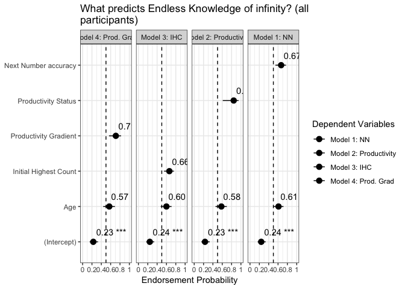<!-- -->

```r
ggsave("graphs/reg2-endless.png", height = 6, width = 13)
```


```r
# twofactors
plot_models(model.prod.nn.endless, model.prod.ihc.endless, model.nn.ihc.endless, 
    transform = "plogis", show.values = T, show.p = T, grid = T, colors = "bw", show.intercept = T, 
    spacing = 0.5, m.labels = c("Model 1: Prod+NN", "Model 2: Prod+IHC", "Model 3: NN+IHC"), 
    show.legend = F, title = "Regression analysis, Endless Knowledge, all participants", 
    axis.labels = c(Age.c = "Age", wcnscore.c = "Next Number accuracy", IHC.c = "Initial Highest Count", 
        Productivity1 = "Productivity Status", prod.gradient.c = "Productivity Gradient"), 
    axis.title = "Endorsement Probability", axis.lim = c(0, 1)) + theme_bw() + ggplot2::geom_hline(yintercept = 0.5, 
    linetype = "dashed")
```

<!-- -->

```r
# graph
plot_model(large.endless.full, transform = "plogis", show.values = T, show.p = T, 
    colors = "Dark2", show.intercept = T, spacing = 0.7, title = "Regression analysis, Endless Knowledge, all participants", 
    axis.labels = c(Age.c = "Age", wcnscore.c = "Next Number accuracy", IHC.c = "Initial Highest Count", 
        Productivity1 = "Productivity Status", prod.gradient.c = "Productivity Gradient"), 
    axis.title = "Endorsement Probability", axis.lim = c(0, 1)) + theme_bw() + ggplot2::geom_hline(yintercept = 0.5, 
    linetype = "dashed")
```

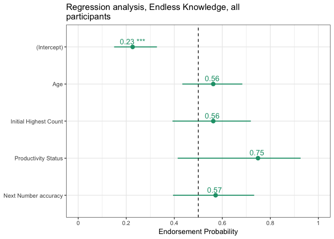<!-- -->

```r
ggsave("graphs/reg-large.png", height = 7, width = 7)
```

Visualize relationship between IHC and SuccessorKnowledge, by productivity

```r
distinct_model.df %>% ggplot(data = ., mapping = aes(x = IHC, y = EndlessKnower, 
    color = Productivity, group = Productivity)) + geom_point(alpha = 0.2, size = 2) + 
    geom_smooth(method = "glm", method.args = list(family = "binomial"), alpha = 0.2, 
        aes(fill = Productivity)) + scale_color_manual(values = mypalette, name = "Productivity") + 
    scale_fill_manual(values = mypalette, name = "Productivity")
```

<!-- -->


### Full Infinity Knowledge models

```r
###MODEL BUILDING AND COMPARISONS###
#base model for successor knower
base.infinity <- glm(InfinityKnower ~ Age.c, family = "binomial", 
                        data = distinct_model.df)

##IHC model
model.ihc.infinity <- glm(InfinityKnower ~ IHC.c + Age.c, family = "binomial", 
                             data = distinct_model.df)
##Highest NN Model
model.nn.infinity <- glm(InfinityKnower ~ wcnscore.c + Age.c, family = "binomial", 
                            data = distinct_model.df)
##Productivity model
model.prod.infinity <- glm(InfinityKnower ~ Productivity + Age.c, family = "binomial",
                              data = distinct_model.df)

##Gain Score model
model.gain.infinity <- glm(InfinityKnower ~ prod.gradient.c + Age.c, family = "binomial",
                              data = distinct_model.df)

##Regression table for Infinity Knower Models (Table 4)
mtable.inf.knowers <- mtable('Base' = base.infinity,
            'IHC' = model.ihc.infinity,
            'NN' = model.nn.infinity,
            'Prod. Group' = model.prod.infinity,
            'Prod. Gain' = model.gain.infinity,
            #summary.stats = c('R-squared','F','p','N'))
            summary.stats = c('Nagelkerke R-sq.','Log-likelihood','AIC','N'))
mtable.inf.knowers
```

```
## 
## Calls:
## Base: glm(formula = InfinityKnower ~ Age.c, family = "binomial", data = distinct_model.df)
## IHC: glm(formula = InfinityKnower ~ IHC.c + Age.c, family = "binomial", 
##     data = distinct_model.df)
## NN: glm(formula = InfinityKnower ~ wcnscore.c + Age.c, family = "binomial", 
##     data = distinct_model.df)
## Prod. Group: glm(formula = InfinityKnower ~ Productivity + Age.c, family = "binomial", 
##     data = distinct_model.df)
## Prod. Gain: glm(formula = InfinityKnower ~ prod.gradient.c + Age.c, family = "binomial", 
##     data = distinct_model.df)
## 
## =================================================================================
##                        Base        IHC          NN      Prod. Group  Prod. Gain  
## ---------------------------------------------------------------------------------
##   (Intercept)        -1.629***   -1.668***   -1.717***   -1.726***    -1.720***  
##                      (0.266)     (0.274)     (0.286)     (0.294)      (0.292)    
##   Age.c               0.752**     0.560       0.532       0.480        0.472     
##                      (0.260)     (0.289)     (0.282)     (0.298)      (0.305)    
##   IHC.c                           0.400                                          
##                                  (0.275)                                         
##   wcnscore.c                                  0.573                              
##                                              (0.304)                             
##   Productivity: 1                                         1.219                  
##                                                          (0.730)                 
##   prod.gradient.c                                                      0.589     
##                                                                       (0.361)    
## ---------------------------------------------------------------------------------
##   Nagelkerke R-sq.    0.120       0.145       0.166       0.158        0.156     
##   Log-likelihood    -54.355     -53.311     -52.428     -52.784      -52.852     
##   AIC               112.711     112.623     110.857     111.567      111.704     
##   N                 122         122         122         122          122         
## =================================================================================
```

```r
# save as txt
write.mtable(mtable.inf.knowers, file="graphs/table4-all.txt")
```

#### Model comparisons

```r
# base v. IHC
anova(base.infinity, model.ihc.infinity, test = "LRT")  #n.s.
```

```
## Analysis of Deviance Table
## 
## Model 1: InfinityKnower ~ Age.c
## Model 2: InfinityKnower ~ IHC.c + Age.c
##   Resid. Df Resid. Dev Df Deviance Pr(>Chi)
## 1       120     108.71                     
## 2       119     106.62  1   2.0875   0.1485
```

```r
# base v. highest contiguous
anova(base.infinity, model.nn.infinity, test = "LRT")  # significant.
```

```
## Analysis of Deviance Table
## 
## Model 1: InfinityKnower ~ Age.c
## Model 2: InfinityKnower ~ wcnscore.c + Age.c
##   Resid. Df Resid. Dev Df Deviance Pr(>Chi)  
## 1       120     108.71                       
## 2       119     104.86  1   3.8538  0.04963 *
## ---
## Signif. codes:  0 '***' 0.001 '**' 0.01 '*' 0.05 '.' 0.1 ' ' 1
```

```r
# base v. productivity
anova(base.infinity, model.prod.infinity, test = "LRT")  #n.s. 
```

```
## Analysis of Deviance Table
## 
## Model 1: InfinityKnower ~ Age.c
## Model 2: InfinityKnower ~ Productivity + Age.c
##   Resid. Df Resid. Dev Df Deviance Pr(>Chi)  
## 1       120     108.71                       
## 2       119     105.57  1   3.1433  0.07624 .
## ---
## Signif. codes:  0 '***' 0.001 '**' 0.01 '*' 0.05 '.' 0.1 ' ' 1
```

```r
# base v. productivity gradient
anova(base.infinity, model.gain.infinity, test = "LRT")  #n.s.
```

```
## Analysis of Deviance Table
## 
## Model 1: InfinityKnower ~ Age.c
## Model 2: InfinityKnower ~ prod.gradient.c + Age.c
##   Resid. Df Resid. Dev Df Deviance Pr(>Chi)  
## 1       120     108.71                       
## 2       119     105.70  1   3.0068  0.08292 .
## ---
## Signif. codes:  0 '***' 0.001 '**' 0.01 '*' 0.05 '.' 0.1 ' ' 1
```

#### Visualize

```r
plot_models(model.nn.infinity, model.prod.infinity, model.ihc.infinity, model.gain.infinity, 
    transform = "plogis", show.values = T, show.p = T, colors = "Dark2", show.intercept = T, 
    spacing = 0.7, m.labels = c("Model 1: NN", "Model 2: Productivity", "Model 3: IHC", 
        "Model 4: Prod. Grad"), show.legend = T, title = "Regression analysis, Infinity Knowledge, all participants", 
    axis.labels = c(Age.c = "Age", wcnscore.c = "Next Number accuracy", IHC.c = "Initial Highest Count", 
        Productivity1 = "Productivity Status", prod.gradient.c = "Productivity Gradient"), 
    axis.title = "Endorsement Probability", axis.lim = c(0, 1)) + theme_bw() + ggplot2::geom_hline(yintercept = 0.5, 
    linetype = "dashed")
```

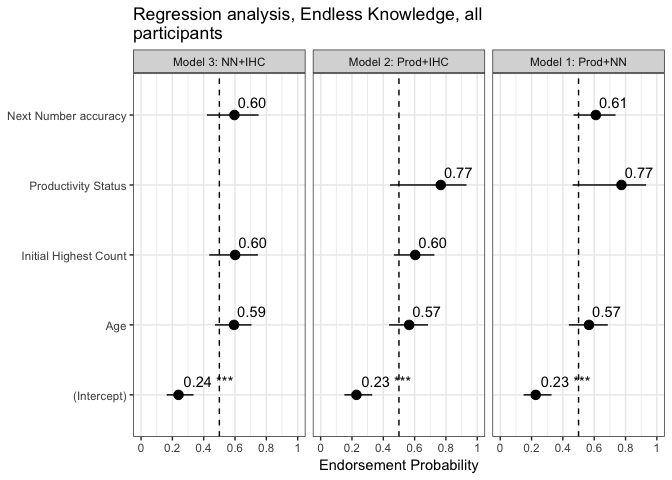<!-- -->

```r
ggsave("graphs/reg-infinity.png", height = 7, width = 7)
```


### Graph maximal models

```r
large.successor.full.grad <- glm(SuccessorKnower ~ prod.gradient.c + wcnscore.c + 
    IHC.c + Age.c, family = "binomial", data = distinct_model.df)
large.endless.full.grad <- glm(EndlessKnower ~ prod.gradient.c + wcnscore.c + IHC.c + 
    Age.c, family = "binomial", data = distinct_model.df)
large.inf.full.grad <- glm(InfinityKnower ~ prod.gradient.c + wcnscore.c + IHC.c + 
    Age.c, family = "binomial", data = distinct_model.df)

# plot all 3 together
plot_models(large.successor.full.grad, large.endless.full.grad, large.inf.full.grad, 
    transform = "plogis", show.values = TRUE, show.p = T, grid = T, colors = "bw", 
    show.intercept = T, m.labels = c(SuccessorKnower = "Succesor: Can always +1", 
        EndlessKnower = "Endless: Numbers go forever", InfinityKnower = "Full Infinity knowledge"), 
    show.legend = F, title = "Regression analysis, all participants", axis.labels = c(Age.c = "Age", 
        wcnscore.c = "Next Number accuracy", IHC.c = "Initial Highest Count", Productivity1 = "Productivity Status", 
        prod.gradient.c = "Productivity Gradient"), axis.title = "Endorsement Probability") + 
    theme_bw() + ggplot2::geom_hline(yintercept = 0.5, linetype = "dashed")
```

## Correlations between variables
### LM predicting IHC from NN accuracy and age

```r
lm3 <- lm(IHC ~ wcnscore + Age.c, data = distinct_model.df)
summary(lm3)
```

```
## 
## Call:
## lm(formula = IHC ~ wcnscore + Age.c, data = distinct_model.df)
## 
## Residuals:
##     Min      1Q  Median      3Q     Max 
## -48.166 -12.840   2.197  13.587  57.498 
## 
## Coefficients:
##             Estimate Std. Error t value Pr(>|t|)    
## (Intercept)  15.0353     3.7480   4.012 0.000106 ***
## wcnscore      8.2470     0.7582  10.877  < 2e-16 ***
## Age.c         6.9490     2.0768   3.346 0.001097 ** 
## ---
## Signif. codes:  0 '***' 0.001 '**' 0.01 '*' 0.05 '.' 0.1 ' ' 1
## 
## Residual standard error: 20.37 on 119 degrees of freedom
## Multiple R-squared:  0.6319,	Adjusted R-squared:  0.6257 
## F-statistic: 102.1 on 2 and 119 DF,  p-value: < 2.2e-16
```


## Regressions productive kids only

### prep


### Successor models


#### Model comparisons
Productivity gradient marginally significant, in negative direction.


### Endless Models


#### Model comparisons
WCN is significant.


Final model


### Full Infinity Knowledge models


#### Model comparisons
No variable is predictive. 

