RecursionAnalysis
================
Junyi Chu, Rose M. Schneider, Pierina Cheung
2019-03-21

# Setup

R Version for citation is: R version 3.5.1 (2018-07-02).

## Loading data

``` r
# original data
full.data <- read.csv("data/recursion_full.csv", na.strings = c("", " ", "NA", "NA "))
```

Reasons for exclusion and their
numbers

``` r
full.data %>% dplyr::filter(ExclusionGroup != "include") %>% dplyr::distinct(LadlabID, 
    .keep_all = TRUE) %>% dplyr::group_by(ExclusionGroup) %>% dplyr::summarize(countN = dplyr::n_distinct(LadlabID)) %>% 
    kable()
```

| ExclusionGroup      | countN |
| :------------------ | -----: |
| age                 |      5 |
| dnf infinity        |      4 |
| dnf WCN             |      6 |
| experimenter error  |      3 |
| L1 not english      |      4 |
| parent interference |      1 |
| pilot order         |      3 |

RMS original code for checking who failed practice - do not need to run.
EVAL set to FALSE

``` r
# check how many failed both practice trials
x <- full.data %>% filter(Task == "WCN" & (TaskItem == 1 | TaskItem == 5)) %>% group_by(LadlabID) %>% 
    summarise(sum = sum(Accuracy)) %>% filter(sum != 2)

# just hardcoding kids because it's easier than going back to the full data frame
# These kids got 1 right, 5 wrong:
one.corr <- as.vector(c("012316-BO", "022616-JM", "030216-ED", "030817-ZI", "031516-A", 
    "032216-JH", "032216-RC", "040317-AL", "040317-SL", "041316-AR", "041316-NC", 
    "041316-VN", "062416-MC"))

five.corr <- as.vector("050617-Z1")

zero.corr <- as.vector(c("030216-AD", "040616-K"))
```

Exclude those who failed the practice trials on What Comes Next Task

``` r
# final decision: remove kids who fail 1 trial out of 2 trials, with no
# additional information about whether E reran the failed trial. Removing 8 kids
# in total

# added 022516-ML on 2018-09-03 to the exclusion list. kid had NA data for wcn
# practice trials and 0 correct on test. assume kid failed wcn.

full.data %<>% mutate(ExclusionGroup = ifelse(LadlabID == "022616-JM" | LadlabID == 
    "030216-AD" | LadlabID == "031516-A" | LadlabID == "041316-AR" | LadlabID == 
    "041316-VN" | LadlabID == "032216-RC" | LadlabID == "012316-BO" | LadlabID == 
    "041316-NC" | LadlabID == "022516-ML", "fail wcn", levels(ExclusionGroup)[ExclusionGroup]), 
    ExclusionGroup = as.factor(ExclusionGroup))

# check. good full.data %>% filter(LadlabID == '022616-JM')
```

Let’s remove anyone who should not be included in the final dataset.

``` r
full.data %<>% dplyr::filter(ExclusionGroup == "include")
```

Now, add in the Productivity classification, IHC, and FHC from PC, JC,
and RMS coding

``` r
# productivity, fhc, ihc coding from pc, jc, and rms
hc.data <- read.csv("data/HC-datawide-forcoding - hc.datawide.csv") %>% dplyr::select(LadlabID, 
    prod_tomerge, ihc_tomerge, fhc_tomerge, dce)

full.data <- dplyr::left_join(full.data, hc.data, by = "LadlabID")

full.data %<>% dplyr::rename(Productivity = prod_tomerge, IHC = ihc_tomerge, FHC = fhc_tomerge, 
    DCE = dce) %>% dplyr::mutate(Productivity = factor(Productivity, levels = c("nonprod", 
    "prod"), labels = c("Nonproductive", "Productive")), IHC = ifelse(IHC > 100, 
    100, IHC), FHC = ifelse(FHC > 100, 100, FHC))

# do a quick check to make sure we have the same SIDs in each
unique.full <- as.vector(unique(full.data$LadlabID))
unique.hc <- as.vector(unique(hc.data$LadlabID))

tmp <- hc.data %>% dplyr::filter(LadlabID %!in% unique.full)

# good to go - the only kids who are not included in full data are the ones who
# we excluded
```

Add in coding for reminder prompts and recovery from
reminders

``` r
reminders.data <- read.csv("data/sara-HC-datawide-forcoding - hc.datawide.csv") %>% 
    dplyr::select(LadlabID, reminders.total, reminders.recovered)
full.data <- dplyr::left_join(full.data, reminders.data, by = "LadlabID")
```

## Post-exclusion summary

Number of kids by age group and average
age

``` r
full.data %>% dplyr::group_by(AgeGroup) %>% dplyr::summarize(sumAge = n_distinct(LadlabID)) %>% 
    kable()
```

| AgeGroup | sumAge |
| :------- | -----: |
| 4-4.5y   |     32 |
| 4.5-5y   |     29 |
| 5-5.5y   |     32 |
| 5.5-6y   |     29 |

``` r
full.data %>% dplyr::distinct(LadlabID, .keep_all = TRUE) %>% dplyr::summarize(minAge = min(Age), 
    maxAge = max(Age), meanAge = mean(Age), sdAge = sd(Age)) %>% kable()
```

| minAge | maxAge |  meanAge |     sdAge |
| -----: | -----: | -------: | --------: |
|      4 |   5.99 | 4.998115 | 0.5713336 |

Number of kids who were classified as decade productive &
nonproductive

``` r
full.data %>% dplyr::distinct(LadlabID, Productivity, Age) %>% dplyr::group_by(Productivity) %>% 
    dplyr::summarise(n = n(), meanage = mean(Age, na.rm = TRUE), sdage = sd(Age, 
        na.rm = TRUE), minage = min(Age, na.rm = TRUE), maxage = max(Age, na.rm = TRUE)) %>% 
    kable()
```

| Productivity  |  n |  meanage |     sdage | minage | maxage |
| :------------ | -: | -------: | --------: | -----: | -----: |
| Nonproductive | 48 | 4.615833 | 0.4153483 |   4.00 |   5.61 |
| Productive    | 74 | 5.246081 | 0.5211179 |   4.05 |   5.99 |

Just for reference, this is the number of kids who switched
classifications from PC, JC, RMS
recode

``` r
full.data %>% dplyr::filter(TaskType == "productivity") %>% droplevels() %>% dplyr::distinct(LadlabID, 
    Response, Productivity) %>% dplyr::mutate(Response = factor(Response, levels = c("nonprod", 
    "prod"), labels = c("Nonproductive", "Productive"))) %>% dplyr::mutate(changed_classification = ifelse((is.na(Response) & 
    Productivity == "Nonproductive"), "NA_toNonprod", ifelse((is.na(Response) & Productivity == 
    "Productive"), "NA_toProd", ifelse((Response == "Nonproductive" & Productivity == 
    "Productive"), "Nonprod_toProd", ifelse((Response == "Productive" & Productivity == 
    "Nonproductive"), "Prod_toNonprod", "no_change"))))) %>% dplyr::group_by(changed_classification) %>% 
    dplyr::summarise(n = n())
```

    ## # A tibble: 4 x 2
    ##   changed_classification     n
    ##   <chr>                  <int>
    ## 1 NA_toNonprod              34
    ## 2 NA_toProd                  2
    ## 3 no_change                 85
    ## 4 Nonprod_toProd             1

## Productivity gradient

``` r
full.data %<>% mutate(delta.hc = FHC - IHC, prod.gradient = delta.hc/(99 - IHC), 
    prod.gradient = ifelse(IHC >= 99, 1, as.numeric(prod.gradient)), prod.gradient = ifelse(prod.gradient == 
        0 & IHC == 99, 1, as.numeric(prod.gradient)))
```

-----

# Highest Count Descriptives

Average of IHC, DCE, and FHC for all
kids

``` r
full.data %>% dplyr::distinct(LadlabID, IHC) %>% dplyr::summarise(mean_IHC = mean(IHC), 
    sd_IHC = sd(IHC), min_IHC = min(IHC), max_IHC = max(IHC), median_IHC = median(IHC)) %>% 
    kable()
```

| mean\_IHC |  sd\_IHC | min\_IHC | max\_IHC | median\_IHC |
| --------: | -------: | -------: | -------: | ----------: |
|  50.41803 | 33.80568 |        5 |      100 |        39.5 |

``` r
full.data %>% dplyr::distinct(LadlabID, DCE) %>% dplyr::summarise(mean_DCE = mean(DCE, 
    na.rm = TRUE), sd_DCE = sd(DCE, na.rm = TRUE), min_DCE = min(DCE, na.rm = TRUE), 
    max_DCE = max(DCE, na.rm = TRUE), median_DCE = median(DCE, na.rm = TRUE)) %>% 
    kable()
```

| mean\_DCE |  sd\_DCE | min\_DCE | max\_DCE | median\_DCE |
| --------: | -------: | -------: | -------: | ----------: |
|  43.80769 | 17.54438 |       19 |       99 |          44 |

``` r
full.data %>% dplyr::distinct(LadlabID, FHC) %>% dplyr::summarise(mean_FHC = mean(FHC), 
    sd_FHC = sd(FHC), min_FHC = min(FHC), max_FHC = max(FHC), median_FHC = median(FHC)) %>% 
    kable()
```

| mean\_FHC |  sd\_FHC | min\_FHC | max\_FHC | median\_FHC |
| --------: | -------: | -------: | -------: | ----------: |
|  71.55738 | 34.64532 |        5 |      100 |          99 |

``` r
# productivity gradient
full.data %>% distinct(LadlabID, delta.hc, prod.gradient) %>% summarise(mean_gradient = mean(prod.gradient), 
    sd_gradient = sd(prod.gradient), mean_delta.hc = mean(delta.hc), sd_delta.hc = sd(delta.hc)) %>% 
    kable()
```

| mean\_gradient | sd\_gradient | mean\_delta.hc | sd\_delta.hc |
| -------------: | -----------: | -------------: | -----------: |
|      0.6340588 |    0.4485848 |       21.13934 |      25.5331 |

Similar data by decade
productivity

``` r
full.data %>% dplyr::distinct(LadlabID, Productivity, IHC) %>% dplyr::group_by(Productivity) %>% 
    dplyr::summarise(mean_IHC = mean(IHC), sd_IHC = sd(IHC), min_IHC = min(IHC), 
        max_IHC = max(IHC), median_IHC = median(IHC)) %>% kable()
```

| Productivity  | mean\_IHC |  sd\_IHC | min\_IHC | max\_IHC | median\_IHC |
| :------------ | --------: | -------: | -------: | -------: | ----------: |
| Nonproductive |  22.58333 | 14.79481 |        5 |       77 |        15.5 |
| Productive    |  68.47297 | 30.22347 |       13 |      100 |        65.0 |

``` r
full.data %>% dplyr::distinct(LadlabID, Productivity, DCE) %>% dplyr::group_by(Productivity) %>% 
    dplyr::summarise(mean_DCE = mean(DCE, na.rm = TRUE), sd_DCE = sd(DCE, na.rm = TRUE), 
        min_DCE = min(DCE, na.rm = TRUE), max_DCE = max(DCE, na.rm = TRUE), median_DCE = median(DCE, 
            na.rm = TRUE)) %>% kable()
```

| Productivity  | mean\_DCE |   sd\_DCE | min\_DCE | max\_DCE | median\_DCE |
| :------------ | --------: | --------: | -------: | -------: | ----------: |
| Nonproductive |  29.62500 |  8.539126 |       19 |       49 |          29 |
| Productive    |  50.11111 | 16.865481 |       19 |       99 |          49 |

``` r
full.data %>% dplyr::distinct(LadlabID, Productivity, FHC) %>% dplyr::group_by(Productivity) %>% 
    dplyr::summarise(mean_FHC = mean(FHC), sd_FHC = sd(FHC), min_FHC = min(FHC), 
        max_FHC = max(FHC), median_FHC = median(FHC)) %>% kable()
```

| Productivity  | mean\_FHC |  sd\_FHC | min\_FHC | max\_FHC | median\_FHC |
| :------------ | --------: | -------: | -------: | -------: | ----------: |
| Nonproductive |  33.27083 | 20.15656 |        5 |      100 |          29 |
| Productive    |  96.39189 | 11.78555 |       39 |      100 |         100 |

``` r
# productivity gradient
full.data %>% distinct(LadlabID, Productivity, delta.hc, prod.gradient) %>% group_by(Productivity) %>% 
    summarise(mean_gradient = mean(prod.gradient), sd_gradient = sd(prod.gradient), 
        mean_delta.hc = mean(delta.hc), sd_delta.hc = sd(delta.hc)) %>% kable()
```

| Productivity  | mean\_gradient | sd\_gradient | mean\_delta.hc | sd\_delta.hc |
| :------------ | -------------: | -----------: | -------------: | -----------: |
| Nonproductive |      0.1270944 |    0.2210244 |       10.68750 |     19.02200 |
| Productive    |      0.9629005 |    0.1532229 |       27.91892 |     27.00419 |

Plotting distribution of IHC, as a function of productivity (\~ junyi’s
graph)

``` r
unique.hc.data <- full.data %>% dplyr::distinct(LadlabID, Gender, Age, AgeGroup, 
    HCReceivedSupport, IHC, DCE, FHC, Productivity)

ggplot(unique.hc.data, aes(x = IHC, color = Productivity)) + geom_dotplot(aes(fill = Productivity), 
    binwidth = 1, stackgroups = TRUE, binpositions = "all", method = "dotdensity", 
    dotsize = 1) + scale_color_brewer(palette = "Set1") + scale_fill_brewer(palette = "Set1") + 
    coord_fixed(ratio = 1) + scale_y_continuous(breaks = seq(0, 40, 10), lim = c(0, 
    35)) + scale_x_continuous(breaks = seq(0, 100, by = 10)) + labs(x = "IHC", y = "Frequency") + 
    theme_bw(base_size = 13) + theme(legend.position = "bottom", legend.title = element_blank(), 
    panel.grid.minor = element_blank())
```

<!-- -->

``` r
ggsave("graphs/ihc-by-prod.png")
```

    ## Saving 7 x 5 in image

``` r
## Black graph for talk purposes
ggplot(unique.hc.data, aes(x = IHC)) + geom_dotplot(binwidth = 1, stackgroups = TRUE, 
    binpositions = "all", method = "dotdensity", dotsize = 1) + coord_fixed(ratio = 1) + 
    scale_y_continuous(breaks = seq(0, 40, 10), lim = c(0, 35)) + scale_x_continuous(breaks = seq(0, 
    100, by = 10)) + labs(x = "IHC", y = "Frequency") + theme_bw(base_size = 13) + 
    theme(legend.position = "bottom", legend.title = element_blank(), panel.grid.minor = element_blank())
```

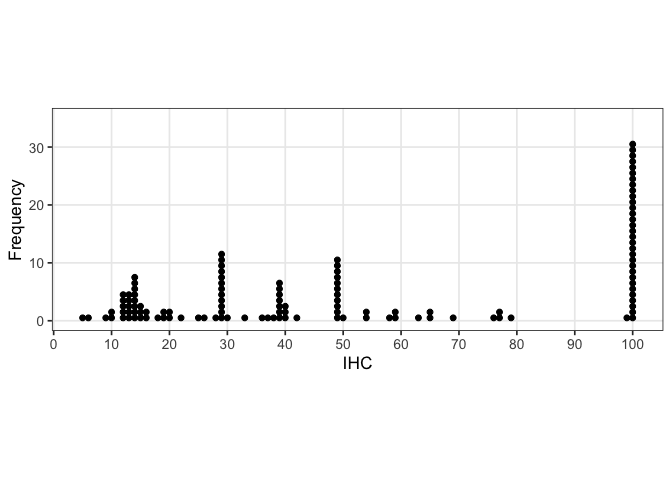<!-- -->

``` r
ggsave("graphs/ihc.png")
```

    ## Saving 7 x 5 in image

Plotting productivity as a function of age in months

``` r
unique.hc.data$AgeMonths = floor(unique.hc.data$Age * 12)

ggplot(unique.hc.data, aes(x = AgeMonths, colour = Productivity)) + geom_dotplot(aes(fill = Productivity), 
    binwidth = 1, stackgroups = TRUE, binpositions = "all") + coord_fixed(ratio = 1) + 
    scale_y_continuous(breaks = seq(0, 10, 5), lim = c(0, 12)) + scale_x_continuous(breaks = seq(48, 
    72, by = 6)) + scale_color_brewer(palette = "Set1") + scale_fill_brewer(palette = "Set1") + 
    labs(x = "Age in Months", y = "Frequency") + theme_bw(base_size = 13) + theme(legend.position = "bottom")
```

<!-- -->

``` r
ggsave("graphs/prod-by-age.png")
```

    ## Saving 7 x 5 in image

## Distance between IHC and FHC

Restructure data to plot distance between IHC, DCE, and
FHC

``` r
hc.dev.data <- full.data %>% dplyr::select(LadlabID, Age, Productivity, IHC, DCE, 
    FHC, prod.gradient) %>% gather(hcprogression, hc, IHC:FHC) %>% mutate(hcprogression = factor(hcprogression, 
    levels = c("IHC", "DCE", "FHC"))) %>% dplyr::rename(`Highest Count Coding` = hcprogression)

# all kids together ggplot(hc.dev.data, aes(x = LadlabID, y = hc)) +
# facet_grid(rows = vars(Productivity)) +
# geom_line(data=hc.dev.data[!is.na(hc.dev.data$hc),]) + geom_point(aes(shape =
# `Highest Count Coding`, colour = `Highest Count Coding`), size = 2, stroke =
# 1.5) + scale_color_brewer(palette='Dark2') + scale_shape_manual(values =
# c(4,5,20)) + labs(title='Highest Count Progression by Decade Productivity', x =
# 'Each line = individual participant', y='Highest Count by Count Type') +
# theme_bw(base_size = 13) + theme(legend.position='bottom', axis.text.x =
# element_text(angle = 270, hjust = 1)) + theme(axis.text.x=element_blank(),
# axis.ticks.x=element_blank())

hc.dev.prod <- subset(hc.dev.data, Productivity == "Productive")
hc.dev.nonprod <- subset(hc.dev.data, Productivity == "Nonproductive")
```

Separate graphs for productivity groups (for easier viewing)

### Fig 2a/b

Separate graphs for productivity groups, sorted by ascending IHC

``` r
#productive
ggplot(hc.dev.prod, aes(x = reorder(LadlabID, hc, FUN=min), y = hc)) + 
  facet_grid(rows = vars(Productivity)) +
  geom_line(data=hc.dev.prod[!is.na(hc.dev.prod$hc),]) + 
  geom_point(aes(shape = `Highest Count Coding`, colour = `Highest Count Coding`), 
             size = 2, stroke = 1.5) +
  scale_color_brewer(palette="Dark2", labels=c("Initial Highest Count", "Decade-Change Error", "Final Highest Count")) +
  scale_shape_manual(values = c(4,5,20), labels=c("Initial Highest Count", "Decade-Change Error", "Final Highest Count")) +
  ylim(0, 100) +
  labs(title="a. Distance, Productive Decade Counters",
       x = "Each line = individual participant",
       y="Highest Count",
       colour="Highest Count Coding",
       shape="Highest Count Coding") +
  theme_bw(base_size = 13) + 
  theme(legend.position="bottom", 
        #axis.text.x = element_text(angle = 270, hjust = 1),
        axis.text.x=element_blank(),
        axis.ticks.x=element_blank())
```

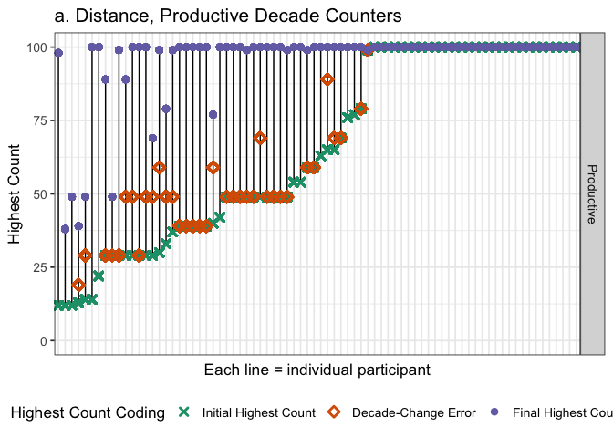<!-- -->

``` r
ggsave('graphs/distance-prod-sorted.png', width=8, height=4)

#nonproductive
ggplot(hc.dev.nonprod, aes(x = reorder(LadlabID, hc, FUN=min), y = hc)) + 
  facet_grid(rows = vars(Productivity)) +
  geom_line(data=hc.dev.nonprod[!is.na(hc.dev.nonprod$hc),]) + 
  geom_point(aes(shape = `Highest Count Coding`, colour = `Highest Count Coding`), 
             size = 2, stroke = 1.5) +
  scale_color_brewer(palette="Dark2", labels=c("Initial Highest Count", "Decade-Change Error", "Final Highest Count")) +
  scale_shape_manual(values = c(4,5,20), labels=c("Initial Highest Count", "Decade-Change Error", "Final Highest Count")) +
  ylim(0, 100) +
  labs(title="b. Distance, Non-productive Decade Counters",
       x = "Each line = individual participant",
       y="Highest Count",
       colour="Highest Count Coding",
       shape="Highest Count Coding") +
  theme_bw(base_size = 13) + 
  theme(legend.position="bottom", 
        #axis.text.x = element_text(angle = 270, hjust = 1),
        axis.text.x=element_blank(),
        axis.ticks.x=element_blank()) 
```

<!-- -->

``` r
ggsave('graphs/distance-nonprod-sorted.png', width=8, height=4)
```

Number of kids who counted to 99+ spontaneously on IHC plus those whose
FHC = 99+ without prompting

``` r
# full.data %>% filter(IHC > 98) %>% distinct(LadlabID, IHC, FHC,
# HCReceivedSupport) %>% count() #n=32 but some kids made errors past IHC but < 3
# so need to account for that
full.data %>% filter(FHC > 98 & (is.na(HCReceivedSupport) | HCReceivedSupport != 
    1)) %>% distinct(LadlabID, IHC, FHC, HCReceivedSupport) %>% count()  #n =42
```

    ## # A tibble: 1 x 1
    ##       n
    ##   <int>
    ## 1    42

## Decade prompts

Average number of decade prompts provided. Productive counters
first

``` r
full.data %>% filter(TaskItem == "times") %>% filter(Productivity == "Productive") %>% 
    distinct(LadlabID, HCReceivedSupport, TaskItem, Response) %>% mutate(Response = as.numeric(levels(Response)[Response])) %>% 
    group_by(HCReceivedSupport) %>% summarize(mean = mean(Response, na.rm = TRUE), 
    sd = sd(Response, na.rm = TRUE), min = min(Response, na.rm = TRUE), max = max(Response, 
        na.rm = TRUE), count = n())
```

    ## # A tibble: 3 x 6
    ##   HCReceivedSupport   mean     sd   min   max count
    ##   <fct>              <dbl>  <dbl> <dbl> <dbl> <int>
    ## 1 0                   2     NA        2     2    36
    ## 2 1                   3.36   1.71     1     7    33
    ## 3 <NA>              NaN    NaN      Inf  -Inf     5

``` r
# assume 0 = NA error in supported.times coding, should only count to 90 but one
# kid got prompted with 100 and 110 and times should be 0
```

Then nonproductive
counters.

``` r
full.data %>% filter(TaskItem == "times") %>% filter(Productivity == "Nonproductive") %>% 
    distinct(LadlabID, HCReceivedSupport, TaskItem, Response) %>% mutate(Response = as.numeric(levels(Response)[Response])) %>% 
    group_by(HCReceivedSupport) %>% summarize(mean = mean(Response, na.rm = TRUE), 
    sd = sd(Response, na.rm = TRUE), min = min(Response, na.rm = TRUE), max = max(Response, 
        na.rm = TRUE), count = n())
```

    ## # A tibble: 2 x 6
    ##   HCReceivedSupport  mean    sd   min   max count
    ##   <fct>             <dbl> <dbl> <dbl> <dbl> <int>
    ## 1 0                  1.33 0.577     1     2    30
    ## 2 1                  1.67 1.24      1     6    18

``` r
# assume 0 = NA error in supported.times coding, should only count to 90 but one
# kid got prompted with 100 and 110 and times should be 0
```

## Reminder prompts

How many kids have coded data for receiving
reminders?

``` r
full.data %>% dplyr::select(LadlabID, Productivity, reminders.total, reminders.recovered) %>% 
    unique() %>% na.omit() %>% summarise(Ncoded = n(), total.min = min(reminders.total), 
    total.max = max(reminders.total), total.mean = mean(reminders.total), total.median = median(reminders.total))
```

    ##   Ncoded total.min total.max total.mean total.median
    ## 1     84         0         5    1.27381            1

How often did kids miss a reminder? Remember that the experiment ended
when kids failed to recover from a reminder, unless that failure occured
at a decade transition in which case the experimenter would provide a
decade prompt and continue the
experiment.

``` r
full.data %>% dplyr::select(LadlabID, Productivity, reminders.total, reminders.recovered) %>% 
    unique() %>% na.omit() %>% mutate(missed = reminders.total - reminders.recovered) %>% 
    summarise(Ncoded = n(), missed.min = min(missed), missed.max = max(missed), missed.mean = mean(missed), 
        missed.median = median(missed))
```

    ##   Ncoded missed.min missed.max missed.mean missed.median
    ## 1     84          0          1   0.1785714             0

``` r
# look at proportion of kids who failed to recover from reminders.
full.data %>% dplyr::select(LadlabID, Productivity, reminders.total, reminders.recovered) %>% 
    unique() %>% na.omit() %>% mutate(missed = reminders.total - reminders.recovered) %>% 
    group_by(reminders.total) %>% summarise(Nkids = n(), N.kids.missed = sum(missed), 
    Perc.kids.missed = sum(missed)/n())
```

    ## # A tibble: 6 x 4
    ##   reminders.total Nkids N.kids.missed Perc.kids.missed
    ##             <int> <int>         <int>            <dbl>
    ## 1               0    25             0            0    
    ## 2               1    31            11            0.355
    ## 3               2    16             3            0.188
    ## 4               3     7             0            0    
    ## 5               4     2             0            0    
    ## 6               5     3             1            0.333

# What Comes Next Descriptives

<span style="color:red">Note minimum highest contig NN can be 5 (one of
the practice trials). Practice trials are excluded from %corr and within
vs. beyond computation.</span>

First check if Accuracy column in full.data is coded correctly. Good to
go.

``` r
wcn.data <- full.data %>% filter(Task == "WCN")

wcn.data %<>% mutate(Response_num = as.numeric(as.character(Response)), TaskItem_num = as.numeric(as.character(TaskItem)), 
    Accuracy_check = ifelse(Response_num == (TaskItem_num + 1), 1, 0), Accuracy_valid = ifelse(Accuracy == 
        Accuracy_check, TRUE, FALSE))

validate <- function() {
    validation <- wcn.data %>% filter(Accuracy_valid == FALSE)
    if (length(validation$LadlabID) > 0) {
        print("WARNING: CHECK CODING")
    } else {
        print("All coding correct")
    }
}

validate()
```

    ## [1] "All coding correct"

Add overall accuracy to the
dataframe.

``` r
wcn.accuracy <- wcn.data %>% filter(TaskType != "practice") %>% filter(TaskType == 
    "immediate") %>% group_by(LadlabID) %>% mutate(wcnscore = sum(Accuracy, na.rm = TRUE)) %>% 
    dplyr::select(LadlabID, wcnscore) %>% unique()
```

Immediate vs. Momentum trials: Children were provided with momentum
trials if they got wrong on immediate trials. Check %trials where
immediate = wrong, momentum = right

``` r
wcn.wide <- full.data %>%
  filter(ExclusionGroup == "include") %>%
  filter(Task == "WCN") %>%
  filter(TaskType != "practice") %>%
  filter(TaskItem != 3) %>% # a trial on 3 for momentum that doesn't exist for immediate
  droplevels()%>%
  dplyr::select(LadlabID, Age, AgeGroup, TaskType, TaskItem, Accuracy, Productivity, prod.gradient) %>%
  spread(TaskType, Accuracy)

# data check: some kids got 1 for immediate but 0 for momentum or 1 for immediate and 1 for momentum (N = 5).Keeping them. 
## for reference, pulling out these kids below
full.data %>%
  filter(Task == "WCN", 
         TaskType == "momentum" | TaskType == "immediate")%>%
  dplyr::select(LadlabID, Age, AgeGroup, TaskType, TaskItem, Accuracy) %>%
  spread(TaskType, Accuracy)%>%
  mutate(issue_immediate1Momentum0 = ifelse(immediate == 1 & momentum == 0, TRUE, FALSE), 
         issue_immediate1Momentum1 = ifelse(immediate == 1 & momentum == 1, TRUE, FALSE))%>%
  filter(issue_immediate1Momentum0 == TRUE | 
           issue_immediate1Momentum1 == TRUE)
```

    ##    LadlabID  Age AgeGroup TaskItem immediate momentum
    ## 1 011216-WB 4.44   4-4.5y       59         1        1
    ## 2 022616-AG 4.32   4-4.5y       37         1        1
    ## 3 031616-RP 4.84   4.5-5y       23         1        1
    ## 4 041316-CC 4.36   4-4.5y       62         1        0
    ## 5 111117-VK 5.87   5.5-6y       29         1        1
    ##   issue_immediate1Momentum0 issue_immediate1Momentum1
    ## 1                     FALSE                      TRUE
    ## 2                     FALSE                      TRUE
    ## 3                     FALSE                      TRUE
    ## 4                      TRUE                     FALSE
    ## 5                     FALSE                      TRUE

``` r
# how many kids show improved performance
xtabs(~immediate + momentum, data = wcn.wide, na.action = na.pass, exclude = NULL)
```

    ##          momentum
    ## immediate   0   1 <NA>
    ##      0    263 174   13
    ##      1      1   4  520
    ##      <NA>   1   0    0

``` r
# 191 / 1048 trials = ~ 18%. NOTE % not by kids but by trials.
```

## Percent Correct on WCN

``` r
wcn.data %>% dplyr::filter(TaskType == "immediate") %>% dplyr::group_by(LadlabID) %>% 
    dplyr::summarize(avg.wcn = mean(Accuracy, na.rm = TRUE), sd.wcn = sd(Accuracy, 
        na.rm = TRUE)) %>% dplyr::summarize(avg = mean(avg.wcn), sd = sd(sd.wcn))
```

    ## # A tibble: 1 x 2
    ##     avg    sd
    ##   <dbl> <dbl>
    ## 1 0.538 0.215

``` r
wcn.data %>% dplyr::filter(TaskType == "immediate") %>% dplyr::group_by(LadlabID, 
    Productivity) %>% dplyr::summarize(avg.wcn = mean(Accuracy, na.rm = TRUE), sd.wcn = sd(Accuracy, 
    na.rm = TRUE)) %>% dplyr::group_by(Productivity) %>% dplyr::summarize(avg = mean(avg.wcn), 
    sd = sd(sd.wcn))
```

    ## # A tibble: 2 x 3
    ##   Productivity    avg    sd
    ##   <fct>         <dbl> <dbl>
    ## 1 Nonproductive 0.276 0.211
    ## 2 Productive    0.708 0.219

Plotting %corr on WCN as function of
productivity

``` r
wcn.data %>% dplyr::filter(TaskType == "immediate") %>% dplyr::group_by(LadlabID, 
    Productivity, prod.gradient) %>% dplyr::summarize(avg.wcn = mean(Accuracy, na.rm = TRUE), 
    sd.wcn = sd(Accuracy, na.rm = TRUE)) %>% ggplot(aes(x = Productivity, y = avg.wcn, 
    fill = factor(Productivity))) + stat_summary(fun.y = mean, position = position_dodge(width = 0.95), 
    geom = "bar", alpha = 0.8, colour = "black") + geom_violin(alpha = 0.3) + stat_summary(fun.data = mean_se, 
    geom = "errorbar", position = position_dodge(width = 0.9), width = 0.2) + # scale_fill_discrete(name = 'Productivity') +
scale_fill_brewer(name = "Productivity", palette = "Set1", guide = "none") + scale_colour_brewer(palette = "Greys") + 
    ylab("Proportion Correct") + xlab("Productivity") + theme_bw(base_size = 13) + 
    theme(legend.position = "none", panel.grid.major = element_blank(), panel.grid.minor = element_blank()) + 
    theme(text = element_text(size = 12)) + ylim(0, 1)
```

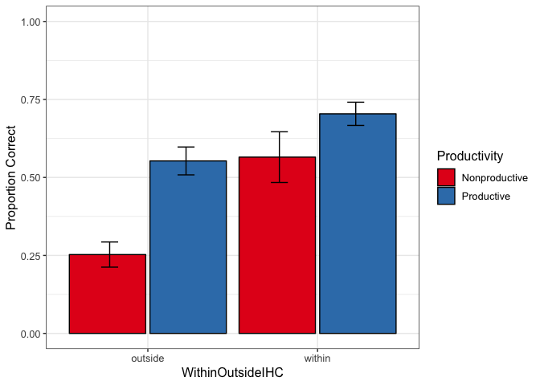<!-- -->

``` r
ggsave("graphs/wcn-percentcorr.png")
```

    ## Saving 7 x 5 in image

### Fig 3

Jess graph

``` r
wcn.data <- wcn.data %>%
  mutate(prod.group = ifelse(IHC > 99, "Productive (IHC \u2265 99)", 
                             ifelse(Productivity == "Productive", "Productive (IHC < 99)", "Nonproductive")))

fig3.data <- wcn.data %>%
  filter(TaskType == "immediate")%>%
  mutate(TaskItem_type= ifelse(mod(TaskItem_num,10)==9, "Decade transition", "Mid-decade")) %>%
  mutate(TaskItem_type_ordered = ordered(TaskItem_type, levels=c("Mid-decade", "Decade transition")))

prod.pal <- c("#E41A1C", "#4DAF4A", "#377EB8")

fig3.data %>%
  group_by(TaskItem_type_ordered, TaskItem, prod.group)%>%
   summarise(mean = mean(Accuracy, na.rm = TRUE), 
            n = n(), 
            sd = sd(Accuracy, na.rm = TRUE), 
            se = sd/sqrt(n)) %>%
  ggplot(aes(x = factor(TaskItem), y = mean, colour = prod.group, group= prod.group)) +
  geom_point(size = 2.5) + 
  geom_line(size = .7) +
  geom_errorbar(aes(ymin = mean - se, ymax = mean + se), 
                width = 0, size = .5) +
  facet_grid(~TaskItem_type_ordered, scales = "free_x") +#, space = "free_x") +
  theme_bw(base_size = 13) + 
  scale_colour_manual(values = prod.pal) +
  theme(legend.position = "right", legend.title = element_blank()) +
  labs(x = "Task item", y = "Mean performance") +
  theme(axis.text.x = element_text(angle = 45, hjust = 1))
```

<!-- -->

``` r
        #, strip.text=element_text(margin=margin(t=5, b=5, l=20, r=20)))
ggsave('graphs/wcn-trial-accuracy.png')
```

    ## Saving 7 x 5 in image

Productive (IHC\<99) vs. Nonproductive on NN accuracy

``` r
# Only for productive IHC < 99 and nonproductive
fig3.model.df <- fig3.data %>%
  filter(prod.group != "Productive (IHC \u2265 99)") %>%
  dplyr::select(c(LadlabID, IHC, FHC, Age, prod.group,
                  TaskItem_num, TaskItem_type, Accuracy)) %>%
  mutate(IHC = as.integer(IHC),
         LadlabID=as.factor(LadlabID),
         prod.group=as.factor(prod.group),
         TaskItem_type=as.factor(TaskItem_type))%>%
  mutate(IHC.c = as.vector(scale(IHC, center = TRUE, scale=TRUE)), #scale and center for model fit
         FHC.c = as.vector(scale(FHC, center = TRUE, scale=TRUE)), 
         age.c = as.vector(scale(Age, center = TRUE, scale=TRUE)))
str(fig3.model.df)
```

    ## 'data.frame':    728 obs. of  11 variables:
    ##  $ LadlabID     : Factor w/ 91 levels "010516-K4","011216-KD1",..: 1 1 1 1 1 1 1 1 2 2 ...
    ##  $ IHC          : int  13 13 13 13 13 13 13 13 5 5 ...
    ##  $ FHC          : num  29 29 29 29 29 29 29 29 5 5 ...
    ##  $ Age          : num  4.17 4.17 4.17 4.17 4.17 4.17 4.17 4.17 4 4 ...
    ##  $ prod.group   : Factor w/ 2 levels "Nonproductive",..: 1 1 1 1 1 1 1 1 1 1 ...
    ##  $ TaskItem_num : num  23 40 62 70 37 29 86 59 23 40 ...
    ##  $ TaskItem_type: Factor w/ 2 levels "Decade transition",..: 2 2 2 2 2 1 2 1 2 2 ...
    ##  $ Accuracy     : int  0 0 0 0 0 0 0 0 0 0 ...
    ##  $ IHC.c        : num  -1.03 -1.03 -1.03 -1.03 -1.03 ...
    ##  $ FHC.c        : num  -0.938 -0.938 -0.938 -0.938 -0.938 ...
    ##  $ age.c        : num  -1.33 -1.33 -1.33 -1.33 -1.33 ...

``` r
# means by item type
fig3.model.df %>%
  group_by(LadlabID, TaskItem_type) %>%
  summarise(score=mean(Accuracy, na.rm=T)) %>%
  ungroup() %>%
  group_by(TaskItem_type) %>%
  summarise(mean=mean(score, na.rm=T), sd=sd(score, na.rm=T), n=n())
```

    ## # A tibble: 2 x 4
    ##   TaskItem_type      mean    sd     n
    ##   <fct>             <dbl> <dbl> <int>
    ## 1 Decade transition 0.165 0.299    91
    ## 2 Mid-decade        0.494 0.347    91

``` r
# means by productivity
fig3.model.df %>%
  group_by(LadlabID, prod.group) %>%
  summarise(score=mean(Accuracy, na.rm=T)) %>%
  ungroup() %>%
  group_by(prod.group) %>%
  summarise(mean=mean(score, na.rm=T), sd=sd(score, na.rm=T), n=n())
```

    ## # A tibble: 2 x 4
    ##   prod.group             mean    sd     n
    ##   <fct>                 <dbl> <dbl> <int>
    ## 1 Nonproductive         0.276 0.263    48
    ## 2 Productive (IHC < 99) 0.562 0.251    43

### Analyses of Figure 3 data

``` r
## WCN model looking at interaction between productivity and decade/non-decade
## item accuracy
fig3.model.base <- glmer(Accuracy ~ age.c + (1 | TaskItem_num) + (1 | LadlabID), 
    family = "binomial", data = fig3.model.df)
fig3.model.ihc <- glmer(Accuracy ~ IHC.c + age.c + (1 | TaskItem_num) + (1 | LadlabID), 
    family = "binomial", data = fig3.model.df)
fig3.model.prod <- glmer(Accuracy ~ prod.group + IHC.c + age.c + (1 | TaskItem_num) + 
    (1 | LadlabID), family = "binomial", data = fig3.model.df)
fig3.model.itemtype <- glmer(Accuracy ~ prod.group + TaskItem_type + IHC.c + age.c + 
    (1 | TaskItem_num) + (1 | LadlabID), family = "binomial", data = fig3.model.df)
fig3.model.full <- glmer(Accuracy ~ prod.group + TaskItem_type + prod.group:TaskItem_type + 
    IHC.c + age.c + (1 | TaskItem_num) + (1 | LadlabID), family = "binomial", data = fig3.model.df)
# LRT tests
drop1(fig3.model.itemtype, test = "Chisq")
```

    ## Single term deletions
    ## 
    ## Model:
    ## Accuracy ~ prod.group + TaskItem_type + IHC.c + age.c + (1 | 
    ##     TaskItem_num) + (1 | LadlabID)
    ##               Df    AIC     LRT   Pr(Chi)    
    ## <none>           763.91                      
    ## prod.group     1 765.93  4.0136 0.0451342 *  
    ## TaskItem_type  1 774.90 12.9842 0.0003141 ***
    ## IHC.c          1 777.12 15.2057 9.641e-05 ***
    ## age.c          1 762.00  0.0887 0.7657757    
    ## ---
    ## Signif. codes:  0 '***' 0.001 '**' 0.01 '*' 0.05 '.' 0.1 ' ' 1

``` r
# comparison of models
anova(fig3.model.full, fig3.model.itemtype, fig3.model.prod, fig3.model.ihc, fig3.model.base, 
    test = "LRT")
```

    ## Data: fig3.model.df
    ## Models:
    ## fig3.model.base: Accuracy ~ age.c + (1 | TaskItem_num) + (1 | LadlabID)
    ## fig3.model.ihc: Accuracy ~ IHC.c + age.c + (1 | TaskItem_num) + (1 | LadlabID)
    ## fig3.model.prod: Accuracy ~ prod.group + IHC.c + age.c + (1 | TaskItem_num) + 
    ## fig3.model.prod:     (1 | LadlabID)
    ## fig3.model.itemtype: Accuracy ~ prod.group + TaskItem_type + IHC.c + age.c + (1 | 
    ## fig3.model.itemtype:     TaskItem_num) + (1 | LadlabID)
    ## fig3.model.full: Accuracy ~ prod.group + TaskItem_type + prod.group:TaskItem_type + 
    ## fig3.model.full:     IHC.c + age.c + (1 | TaskItem_num) + (1 | LadlabID)
    ##                     Df    AIC    BIC  logLik deviance   Chisq Chi Df
    ## fig3.model.base      4 799.43 817.79 -395.71   791.43               
    ## fig3.model.ihc       5 776.93 799.87 -383.46   766.93 24.5044      1
    ## fig3.model.prod      6 774.90 802.43 -381.45   762.90  4.0295      1
    ## fig3.model.itemtype  7 763.91 796.03 -374.96   749.91 12.9842      1
    ## fig3.model.full      8 764.55 801.26 -374.28   748.55  1.3615      1
    ##                     Pr(>Chisq)    
    ## fig3.model.base                   
    ## fig3.model.ihc       7.414e-07 ***
    ## fig3.model.prod      0.0447111 *  
    ## fig3.model.itemtype  0.0003141 ***
    ## fig3.model.full      0.2432764    
    ## ---
    ## Signif. codes:  0 '***' 0.001 '**' 0.01 '*' 0.05 '.' 0.1 ' ' 1

``` r
# summary of final model
summary(fig3.model.itemtype)
```

    ## Generalized linear mixed model fit by maximum likelihood (Laplace
    ##   Approximation) [glmerMod]
    ##  Family: binomial  ( logit )
    ## Formula: Accuracy ~ prod.group + TaskItem_type + IHC.c + age.c + (1 |  
    ##     TaskItem_num) + (1 | LadlabID)
    ##    Data: fig3.model.df
    ## 
    ##      AIC      BIC   logLik deviance df.resid 
    ##    763.9    796.0   -375.0    749.9      720 
    ## 
    ## Scaled residuals: 
    ##     Min      1Q  Median      3Q     Max 
    ## -2.8238 -0.5192 -0.2341  0.5401  7.4168 
    ## 
    ## Random effects:
    ##  Groups       Name        Variance Std.Dev.
    ##  LadlabID     (Intercept) 1.4440   1.2017  
    ##  TaskItem_num (Intercept) 0.1769   0.4206  
    ## Number of obs: 727, groups:  LadlabID, 91; TaskItem_num, 8
    ## 
    ## Fixed effects:
    ##                                 Estimate Std. Error z value Pr(>|z|)    
    ## (Intercept)                     -2.79614    0.46886  -5.964 2.47e-09 ***
    ## prod.groupProductive (IHC < 99)  0.82951    0.41412   2.003   0.0452 *  
    ## TaskItem_typeMid-decade          2.34447    0.44353   5.286 1.25e-07 ***
    ## IHC.c                            0.82934    0.21032   3.943 8.04e-05 ***
    ## age.c                            0.05939    0.19931   0.298   0.7657    
    ## ---
    ## Signif. codes:  0 '***' 0.001 '**' 0.01 '*' 0.05 '.' 0.1 ' ' 1
    ## 
    ## Correlation of Fixed Effects:
    ##             (Intr) p.P(<9 TsI_M- IHC.c 
    ## p.P(IHC<99) -0.463                     
    ## TskItm_tyM- -0.766  0.039              
    ## IHC.c        0.072 -0.365  0.082       
    ## age.c        0.131 -0.330  0.006 -0.305

``` r
# random effects ranef(fig3.model.prod)

# visualization

# library(effects) fig3.model.noint.df <-
# as.data.frame(allEffects(fig3.model.noint)[[2]]) ggplot(fig3.model.noint.df,
# aes(x=TaskItem_type,y=fit,ymin=lower,ymax=upper)) +
# geom_pointrange(position=position_dodge(width=.1))
```

### Analyses including all participants

``` r
fig3.model2.df <- fig3.data %>%
  dplyr::select(c(LadlabID, IHC, FHC, Age, prod.group,
                  TaskItem_num, TaskItem_type, Accuracy)) %>%
  mutate(IHC = as.integer(IHC),
         LadlabID=as.factor(LadlabID),
         prod.group=as.factor(prod.group),
         TaskItem_type=as.factor(TaskItem_type))%>%
  mutate(IHC.c = as.vector(scale(IHC, center = TRUE, scale=TRUE)), #scale and center for model fit
         FHC.c = as.vector(scale(FHC, center = TRUE, scale=TRUE)), 
         age.c = as.vector(scale(Age, center = TRUE, scale=TRUE)))
str(fig3.model2.df)
```

    ## 'data.frame':    976 obs. of  11 variables:
    ##  $ LadlabID     : Factor w/ 122 levels "010516-K4","010916-D5",..: 1 1 1 1 1 1 1 1 2 2 ...
    ##  $ IHC          : int  13 13 13 13 13 13 13 13 100 100 ...
    ##  $ FHC          : num  29 29 29 29 29 29 29 29 100 100 ...
    ##  $ Age          : num  4.17 4.17 4.17 4.17 4.17 4.17 4.17 4.17 4.78 4.78 ...
    ##  $ prod.group   : Factor w/ 3 levels "Nonproductive",..: 1 1 1 1 1 1 1 1 3 3 ...
    ##  $ TaskItem_num : num  23 40 62 70 37 29 86 59 23 40 ...
    ##  $ TaskItem_type: Factor w/ 2 levels "Decade transition",..: 2 2 2 2 2 1 2 1 2 2 ...
    ##  $ Accuracy     : int  0 0 0 0 0 0 0 0 1 1 ...
    ##  $ IHC.c        : num  -1.11 -1.11 -1.11 -1.11 -1.11 ...
    ##  $ FHC.c        : num  -1.23 -1.23 -1.23 -1.23 -1.23 ...
    ##  $ age.c        : num  -1.45 -1.45 -1.45 -1.45 -1.45 ...

``` r
# means by item type
fig3.model2.df %>%
  group_by(LadlabID, TaskItem_type) %>%
  summarise(score=mean(Accuracy, na.rm=T)) %>%
  ungroup() %>%
  group_by(TaskItem_type) %>%
  summarise(mean=mean(score, na.rm=T), sd=sd(score, na.rm=T), n=n())
```

    ## # A tibble: 2 x 4
    ##   TaskItem_type      mean    sd     n
    ##   <fct>             <dbl> <dbl> <int>
    ## 1 Decade transition 0.336 0.424   122
    ## 2 Mid-decade        0.606 0.361   122

``` r
# means by productivity
fig3.model2.df %>%
  group_by(LadlabID, prod.group) %>%
  summarise(score=mean(Accuracy, na.rm=T)) %>%
  ungroup() %>%
  group_by(prod.group) %>%
  summarise(mean=mean(score, na.rm=T), sd=sd(score, na.rm=T), n=n())
```

    ## # A tibble: 3 x 4
    ##   prod.group             mean    sd     n
    ##   <fct>                 <dbl> <dbl> <int>
    ## 1 Nonproductive         0.276 0.263    48
    ## 2 Productive (IHC < 99) 0.562 0.251    43
    ## 3 Productive (IHC ≥ 99) 0.911 0.145    31

``` r
## regressions
fig3.model2.noint <- glmer(Accuracy ~ prod.group + TaskItem_type+ 
                             IHC.c + age.c + 
                             (1|TaskItem_num) + (1|LadlabID), 
                           family = "binomial", data = fig3.model2.df)
fig3.model2.full <- glmer(Accuracy ~ prod.group + TaskItem_type +
                            prod.group:TaskItem_type +
                         IHC.c + age.c + 
                             (1|TaskItem_num) + (1|LadlabID), 
                           family = "binomial", data = fig3.model2.df)
#comparison of models
anova(fig3.model2.full, fig3.model2.noint, test = 'LRT')
```

    ## Data: fig3.model2.df
    ## Models:
    ## fig3.model2.noint: Accuracy ~ prod.group + TaskItem_type + IHC.c + age.c + (1 | 
    ## fig3.model2.noint:     TaskItem_num) + (1 | LadlabID)
    ## fig3.model2.full: Accuracy ~ prod.group + TaskItem_type + prod.group:TaskItem_type + 
    ## fig3.model2.full:     IHC.c + age.c + (1 | TaskItem_num) + (1 | LadlabID)
    ##                   Df    AIC    BIC  logLik deviance  Chisq Chi Df
    ## fig3.model2.noint  8 900.18 939.24 -442.09   884.18              
    ## fig3.model2.full  10 898.94 947.76 -439.47   878.94 5.2406      2
    ##                   Pr(>Chisq)  
    ## fig3.model2.noint             
    ## fig3.model2.full     0.07278 .
    ## ---
    ## Signif. codes:  0 '***' 0.001 '**' 0.01 '*' 0.05 '.' 0.1 ' ' 1

``` r
# LRT tests
drop1(fig3.model2.noint,test="Chisq")
```

    ## Single term deletions
    ## 
    ## Model:
    ## Accuracy ~ prod.group + TaskItem_type + IHC.c + age.c + (1 | 
    ##     TaskItem_num) + (1 | LadlabID)
    ##               Df    AIC     LRT   Pr(Chi)    
    ## <none>           900.18                      
    ## prod.group     2 900.63  4.4466 0.1082505    
    ## TaskItem_type  1 909.68 11.4977 0.0006968 ***
    ## IHC.c          1 913.00 14.8240 0.0001180 ***
    ## age.c          1 898.29  0.1069 0.7436697    
    ## ---
    ## Signif. codes:  0 '***' 0.001 '**' 0.01 '*' 0.05 '.' 0.1 ' ' 1

``` r
# summary of full model
summary(fig3.model2.noint)
```

    ## Generalized linear mixed model fit by maximum likelihood (Laplace
    ##   Approximation) [glmerMod]
    ##  Family: binomial  ( logit )
    ## Formula: Accuracy ~ prod.group + TaskItem_type + IHC.c + age.c + (1 |  
    ##     TaskItem_num) + (1 | LadlabID)
    ##    Data: fig3.model2.df
    ## 
    ##      AIC      BIC   logLik deviance df.resid 
    ##    900.2    939.2   -442.1    884.2      967 
    ## 
    ## Scaled residuals: 
    ##     Min      1Q  Median      3Q     Max 
    ## -4.6025 -0.4424  0.0997  0.4609  6.9182 
    ## 
    ## Random effects:
    ##  Groups       Name        Variance Std.Dev.
    ##  LadlabID     (Intercept) 1.5493   1.2447  
    ##  TaskItem_num (Intercept) 0.1981   0.4451  
    ## Number of obs: 975, groups:  LadlabID, 122; TaskItem_num, 8
    ## 
    ## Fixed effects:
    ##                                 Estimate Std. Error z value Pr(>|z|)    
    ## (Intercept)                     -1.91543    0.51710  -3.704 0.000212 ***
    ## prod.groupProductive (IHC < 99)  0.83146    0.41725   1.993 0.046293 *  
    ## prod.groupProductive (IHC ≥ 99)  1.56654    0.88596   1.768 0.077029 .  
    ## TaskItem_typeMid-decade          2.12660    0.43655   4.871 1.11e-06 ***
    ## IHC.c                            1.38901    0.35707   3.890 0.000100 ***
    ## age.c                            0.06165    0.18846   0.327 0.743565    
    ## ---
    ## Signif. codes:  0 '***' 0.001 '**' 0.01 '*' 0.05 '.' 0.1 ' ' 1
    ## 
    ## Correlation of Fixed Effects:
    ##             (Intr) p.P(<9 pP(I≥9 TsI_M- IHC.c 
    ## p.P(IHC<99) -0.578                            
    ## prP(IHC≥99) -0.605  0.620                     
    ## TskItm_tyM- -0.649  0.030  0.042              
    ## IHC.c        0.424 -0.404 -0.802  0.061       
    ## age.c        0.086 -0.293 -0.013  0.006 -0.269

``` r
# random effects
#ranef(fig3.model.prod)

# visualization
library(effects)
```

    ## Loading required package: carData

    ## Use the command
    ##     lattice::trellis.par.set(effectsTheme())
    ##   to customize lattice options for effects plots.
    ## See ?effectsTheme for details.

``` r
fig3.model.full.df <- as.data.frame(allEffects(fig3.model.full)[[3]])
ggplot(fig3.model.full.df,
       aes(x=TaskItem_type,y=fit,color=prod.group, ymin=lower,ymax=upper)) + 
    geom_pointrange(position=position_dodge(width=.1)) 
```

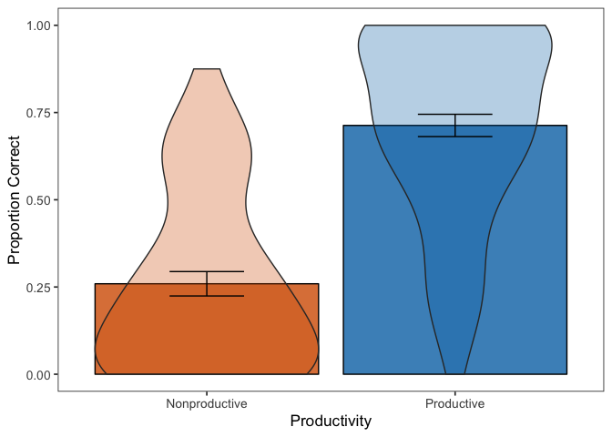<!-- -->

## Within / Outside IHC

Add whether the Task Item was within or outside of the kid’s initial
highest
count.

``` r
# first, get initial highest count for each kiddo Make a lookup table with SID
# and initial highest count
lookup <- full.data %>% distinct(LadlabID, IHC)

wcn.data %<>% dplyr::mutate(TaskItem = as.numeric(as.character(TaskItem)))

# This is a function that, for each trial, checks the number queried. If number
# queried is above the child's initial highest count, marks that trial as beyond
# count range.
determine_count_range <- function(df) {
    tmp <- df
    for (row in 1:nrow(tmp)) {
        sub = as.character(tmp[row, "LadlabID"])
        count_range = as.numeric(as.character(subset(lookup, LadlabID == sub)$IHC))
        tmp[row, "IHC"] = as.numeric(as.character(count_range))
        if (tmp[row, "TaskItem"] > count_range) {
            tmp[row, "WithinOutsideIHC"] = "outside"
        } else {
            tmp[row, "WithinOutsideIHC"] = "within"
        }
    }
    return(tmp)
}

# Run for wcn
wcn.data <- determine_count_range(wcn.data)
```

WCN accuracy, within and outside of
IHC

``` r
wcn.data %>% dplyr::filter(TaskType == "immediate") %>% dplyr::group_by(LadlabID, 
    WithinOutsideIHC) %>% dplyr::summarize(score = mean(Accuracy, na.rm = T)) %>% 
    ungroup() %>% group_by(WithinOutsideIHC) %>% dplyr::summarize(mean = mean(score, 
    na.rm = TRUE), sd = sd(score, na.rm = TRUE))
```

    ## # A tibble: 2 x 3
    ##   WithinOutsideIHC  mean    sd
    ##   <chr>            <dbl> <dbl>
    ## 1 outside          0.410 0.323
    ## 2 within           0.677 0.321

Now WCN by within/outside count range and
productivity

``` r
wcn.data %>% dplyr::filter(TaskType == "immediate") %>% dplyr::group_by(LadlabID, 
    Productivity, WithinOutsideIHC) %>% dplyr::summarize(score = mean(Accuracy, na.rm = T)) %>% 
    ungroup() %>% group_by(Productivity, WithinOutsideIHC) %>% dplyr::summarize(mean = mean(score, 
    na.rm = TRUE), sd = sd(score, na.rm = TRUE))
```

    ## # A tibble: 4 x 4
    ## # Groups:   Productivity [2]
    ##   Productivity  WithinOutsideIHC  mean    sd
    ##   <fct>         <chr>            <dbl> <dbl>
    ## 1 Nonproductive outside          0.266 0.262
    ## 2 Nonproductive within           0.565 0.335
    ## 3 Productive    outside          0.574 0.309
    ## 4 Productive    within           0.704 0.314

Plotting WCN as within vs. beyond by productivity \#\#\# Fig
4

``` r
group_names <- c(Productive = "Productive Counters", Nonproductive = "Nonproductive Counters")
# alternative 2, use fewer colors.
wcn.data %>% mutate(WithinOutsideIHC = factor(WithinOutsideIHC, levels = c("within", 
    "outside"), labels = c("Within IHC", "Beyond IHC"))) %>% dplyr::filter(TaskType == 
    "immediate") %>% dplyr::group_by(Productivity, WithinOutsideIHC, LadlabID, prod.gradient) %>% 
    dplyr::summarize(meansubj = mean(Accuracy, na.rm = TRUE)) %>% ggplot(aes(x = WithinOutsideIHC, 
    y = meansubj)) + geom_violin(aes(color = Productivity), alpha = 0.7, scale = "count", 
    position = position_dodge(width = 0.8)) + geom_point(aes(fill = WithinOutsideIHC), 
    position = position_jitterdodge(jitter.width = 0.25, dodge.width = 0.9), alpha = 0.5) + 
    stat_summary(aes(color = Productivity), fun.data = mean_cl_boot, geom = "errorbar", 
        position = position_dodge(width = 0.8), width = 0.2) + stat_summary(aes(color = Productivity), 
    fill = "white", fun.y = mean, position = position_dodge(width = 0.8), geom = "point", 
    shape = 23, size = 3) + facet_grid(. ~ Productivity, labeller = as_labeller(group_names)) + 
    scale_colour_brewer(guide = FALSE, palette = "Set1") + scale_fill_brewer(guide = FALSE) + 
    scale_y_continuous(limits = c(0, 1)) + labs(y = "Average Proportion Correct", 
    x = "Trial Type") + theme_bw(base_size = 13) + theme(panel.grid.major = element_blank(), 
    panel.grid.minor = element_blank())
```

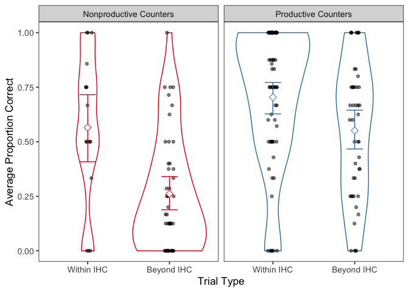<!-- -->

``` r
ggsave("graphs/wcn-within-beyond-final.png", width = 6, height = 4)
```

``` r
# Alternative
wcn.data %>% mutate(WithinOutsideIHC = factor(WithinOutsideIHC, levels = c("within", 
    "outside"), labels = c("Within IHC", "Beyond IHC"))) %>% dplyr::filter(TaskType == 
    "immediate") %>% dplyr::group_by(Productivity, WithinOutsideIHC, LadlabID, prod.gradient) %>% 
    dplyr::summarize(meansubj = mean(Accuracy, na.rm = TRUE)) %>% ggplot(aes(x = Productivity, 
    y = meansubj)) + geom_violin(aes(color = Productivity), alpha = 0.7, scale = "count", 
    position = position_dodge(width = 0.8)) + geom_point(aes(fill = Productivity), 
    position = position_jitterdodge(jitter.width = 0.25, dodge.width = 0.9), alpha = 0.4) + 
    stat_summary(aes(color = Productivity), fun.data = mean_cl_boot, geom = "errorbar", 
        position = position_dodge(width = 0.8), width = 0.2) + stat_summary(aes(color = Productivity), 
    fill = "white", fun.y = mean, position = position_dodge(width = 0.8), geom = "point", 
    shape = 23, size = 3) + facet_wrap(. ~ WithinOutsideIHC, strip.position = "bottom") + 
    scale_colour_brewer(palette = "Set1", direction = -1) + scale_y_continuous(limits = c(0, 
    1)) + labs(y = "Average Proportion Correct", x = "Trial Type") + theme_bw(base_size = 13) + 
    theme(panel.grid.major = element_blank(), panel.grid.minor = element_blank(), 
        axis.ticks = element_blank(), axis.text.x = element_blank())
```

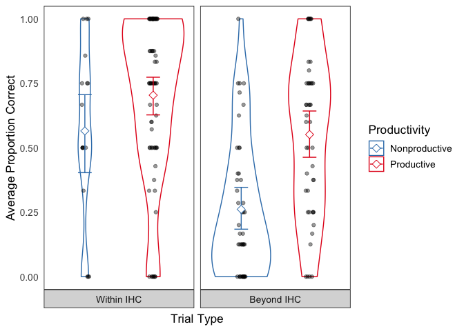<!-- -->

``` r
ggsave("graphs/wcn-within-beyond4.png", width = 6, height = 4)
```

#### Analysis for fig 4

Analysis of WCN accuracy by productivity and trial type

``` r
# wcn_score.df <- wcn.data %>%
#   dplyr::filter(TaskType == "immediate") %>%
#   dplyr::group_by(LadlabID, Productivity, TrialType=as.factor(WithinOutsideIHC)) %>%
#   dplyr::summarize(correct = sum(Accuracy, na.rm = TRUE), total=n())
# 
wcn_model.df <- wcn.data %>%
  filter(TaskType == "immediate")%>%
  mutate(IHC = as.integer(IHC),
         LadlabID = factor(LadlabID))%>%
  mutate(IHC.c = as.vector(scale(IHC, center = TRUE, scale=TRUE)), #scale and center for model fit
         FHC.c = as.vector(scale(FHC, center = TRUE, scale=TRUE)), 
         age.c = as.vector(scale(Age, center = TRUE, scale=TRUE)))

##WCN model looking at interaction between productivity and trial type in WCN task
wcn.model.base <- glmer(Accuracy ~ age.c + (1|TaskItem_num) + (1|LadlabID), 
                        family = "binomial", data = wcn_model.df)
wcn.model.ihc <- glmer(Accuracy ~ IHC.c + age.c + (1|TaskItem_num) + (1|LadlabID), 
                       family = "binomial", data = wcn_model.df)
wcn.model.noint <- glmer(Accuracy ~ Productivity + WithinOutsideIHC + 
                           IHC.c + age.c + (1|TaskItem_num) +
                     (1|LadlabID), family = "binomial", data = wcn_model.df)
wcn.model.int <- glmer(Accuracy ~ Productivity + WithinOutsideIHC + 
                         Productivity:WithinOutsideIHC + 
                         IHC.c + age.c + (1|TaskItem_num) +
                     (1|LadlabID), family = "binomial", data = wcn_model.df)

#comparison of models
anova(wcn.model.int, wcn.model.noint, wcn.model.ihc, wcn.model.base, test = 'LRT')
```

    ## Data: wcn_model.df
    ## Models:
    ## wcn.model.base: Accuracy ~ age.c + (1 | TaskItem_num) + (1 | LadlabID)
    ## wcn.model.ihc: Accuracy ~ IHC.c + age.c + (1 | TaskItem_num) + (1 | LadlabID)
    ## wcn.model.noint: Accuracy ~ Productivity + WithinOutsideIHC + IHC.c + age.c + 
    ## wcn.model.noint:     (1 | TaskItem_num) + (1 | LadlabID)
    ## wcn.model.int: Accuracy ~ Productivity + WithinOutsideIHC + Productivity:WithinOutsideIHC + 
    ## wcn.model.int:     IHC.c + age.c + (1 | TaskItem_num) + (1 | LadlabID)
    ##                 Df    AIC     BIC  logLik deviance   Chisq Chi Df
    ## wcn.model.base   4 992.28 1011.81 -492.14   984.28               
    ## wcn.model.ihc    5 910.10  934.51 -450.05   900.10 84.1798      1
    ## wcn.model.noint  7 910.02  944.20 -448.01   896.02  4.0794      2
    ## wcn.model.int    8 908.14  947.19 -446.07   892.14  3.8828      1
    ##                 Pr(>Chisq)    
    ## wcn.model.base                
    ## wcn.model.ihc      < 2e-16 ***
    ## wcn.model.noint    0.13007    
    ## wcn.model.int      0.04878 *  
    ## ---
    ## Signif. codes:  0 '***' 0.001 '**' 0.01 '*' 0.05 '.' 0.1 ' ' 1

``` r
anova(wcn.model.int, wcn.model.ihc, wcn.model.base, test = 'LRT')
```

    ## Data: wcn_model.df
    ## Models:
    ## wcn.model.base: Accuracy ~ age.c + (1 | TaskItem_num) + (1 | LadlabID)
    ## wcn.model.ihc: Accuracy ~ IHC.c + age.c + (1 | TaskItem_num) + (1 | LadlabID)
    ## wcn.model.int: Accuracy ~ Productivity + WithinOutsideIHC + Productivity:WithinOutsideIHC + 
    ## wcn.model.int:     IHC.c + age.c + (1 | TaskItem_num) + (1 | LadlabID)
    ##                Df    AIC     BIC  logLik deviance   Chisq Chi Df
    ## wcn.model.base  4 992.28 1011.81 -492.14   984.28               
    ## wcn.model.ihc   5 910.10  934.51 -450.05   900.10 84.1798      1
    ## wcn.model.int   8 908.14  947.19 -446.07   892.14  7.9623      3
    ##                Pr(>Chisq)    
    ## wcn.model.base               
    ## wcn.model.ihc      <2e-16 ***
    ## wcn.model.int      0.0468 *  
    ## ---
    ## Signif. codes:  0 '***' 0.001 '**' 0.01 '*' 0.05 '.' 0.1 ' ' 1

``` r
# summary of final model
drop1(wcn.model.int,test="Chisq")
```

    ## Single term deletions
    ## 
    ## Model:
    ## Accuracy ~ Productivity + WithinOutsideIHC + Productivity:WithinOutsideIHC + 
    ##     IHC.c + age.c + (1 | TaskItem_num) + (1 | LadlabID)
    ##                               Df    AIC    LRT   Pr(Chi)    
    ## <none>                           908.14                     
    ## IHC.c                          1 959.32 53.186 3.034e-13 ***
    ## age.c                          1 906.16  0.022   0.88207    
    ## Productivity:WithinOutsideIHC  1 910.02  3.883   0.04878 *  
    ## ---
    ## Signif. codes:  0 '***' 0.001 '**' 0.01 '*' 0.05 '.' 0.1 ' ' 1

``` r
summary(wcn.model.int)
```

    ## Generalized linear mixed model fit by maximum likelihood (Laplace
    ##   Approximation) [glmerMod]
    ##  Family: binomial  ( logit )
    ## Formula: 
    ## Accuracy ~ Productivity + WithinOutsideIHC + Productivity:WithinOutsideIHC +  
    ##     IHC.c + age.c + (1 | TaskItem_num) + (1 | LadlabID)
    ##    Data: wcn_model.df
    ## 
    ##      AIC      BIC   logLik deviance df.resid 
    ##    908.1    947.2   -446.1    892.1      967 
    ## 
    ## Scaled residuals: 
    ##     Min      1Q  Median      3Q     Max 
    ## -4.2690 -0.4447  0.1061  0.4371  7.0739 
    ## 
    ## Random effects:
    ##  Groups       Name        Variance Std.Dev.
    ##  LadlabID     (Intercept) 1.503    1.226   
    ##  TaskItem_num (Intercept) 1.048    1.024   
    ## Number of obs: 975, groups:  LadlabID, 122; TaskItem_num, 8
    ## 
    ## Fixed effects:
    ##                                               Estimate Std. Error z value
    ## (Intercept)                                   -0.05930    0.48961  -0.121
    ## ProductivityProductive                         1.01284    0.42568   2.379
    ## WithinOutsideIHCwithin                         0.44626    0.48524   0.920
    ## IHC.c                                          1.81984    0.26188   6.949
    ## age.c                                          0.02729    0.18391   0.148
    ## ProductivityProductive:WithinOutsideIHCwithin -1.02504    0.52089  -1.968
    ##                                               Pr(>|z|)    
    ## (Intercept)                                     0.9036    
    ## ProductivityProductive                          0.0173 *  
    ## WithinOutsideIHCwithin                          0.3577    
    ## IHC.c                                         3.68e-12 ***
    ## age.c                                           0.8821    
    ## ProductivityProductive:WithinOutsideIHCwithin   0.0491 *  
    ## ---
    ## Signif. codes:  0 '***' 0.001 '**' 0.01 '*' 0.05 '.' 0.1 ' ' 1
    ## 
    ## Correlation of Fixed Effects:
    ##             (Intr) PrdctP WtOIHC IHC.c  age.c 
    ## PrdctvtyPrd -0.504                            
    ## WthnOtsdIHC -0.246  0.191                     
    ## IHC.c        0.361 -0.294 -0.261              
    ## age.c        0.167 -0.320 -0.025 -0.195       
    ## PrdcP:WOIHC  0.068 -0.292 -0.745 -0.093  0.018

#### analysis removing IHC=99

``` r
wcn_model.df2 <- wcn_model.df %>% filter(prod.group != "Productive (IHC ≥ 99)")

## WCN model looking at interaction between productivity and trial type in WCN
## task
wcn.model2.base <- glmer(Accuracy ~ age.c + (1 | TaskItem) + (1 | LadlabID), family = "binomial", 
    data = wcn_model.df2)
wcn.model2.ihc <- glmer(Accuracy ~ IHC.c + age.c + (1 | TaskItem) + (1 | LadlabID), 
    family = "binomial", data = wcn_model.df2)
wcn.model2.noint <- glmer(Accuracy ~ Productivity + WithinOutsideIHC + IHC.c + age.c + 
    (1 | TaskItem) + (1 | LadlabID), family = "binomial", data = wcn_model.df2)
wcn.model2.int <- glmer(Accuracy ~ Productivity + WithinOutsideIHC + Productivity:WithinOutsideIHC + 
    IHC.c + age.c + (1 | TaskItem) + (1 | LadlabID), family = "binomial", data = wcn_model.df2)

# comparison of models
anova(wcn.model2.int, wcn.model2.noint, wcn.model2.ihc, wcn.model2.base, test = "LRT")
```

    ## Data: wcn_model.df2
    ## Models:
    ## wcn.model2.base: Accuracy ~ age.c + (1 | TaskItem) + (1 | LadlabID)
    ## wcn.model2.ihc: Accuracy ~ IHC.c + age.c + (1 | TaskItem) + (1 | LadlabID)
    ## wcn.model2.noint: Accuracy ~ Productivity + WithinOutsideIHC + IHC.c + age.c + 
    ## wcn.model2.noint:     (1 | TaskItem) + (1 | LadlabID)
    ## wcn.model2.int: Accuracy ~ Productivity + WithinOutsideIHC + Productivity:WithinOutsideIHC + 
    ## wcn.model2.int:     IHC.c + age.c + (1 | TaskItem) + (1 | LadlabID)
    ##                  Df    AIC    BIC  logLik deviance   Chisq Chi Df
    ## wcn.model2.base   4 799.43 817.79 -395.71   791.43               
    ## wcn.model2.ihc    5 776.94 799.88 -383.47   766.94 24.4941      1
    ## wcn.model2.noint  7 776.79 808.92 -381.40   762.79  4.1414      2
    ## wcn.model2.int    8 773.81 810.52 -378.91   757.81  4.9824      1
    ##                  Pr(>Chisq)    
    ## wcn.model2.base                
    ## wcn.model2.ihc    7.454e-07 ***
    ## wcn.model2.noint    0.12610    
    ## wcn.model2.int      0.02561 *  
    ## ---
    ## Signif. codes:  0 '***' 0.001 '**' 0.01 '*' 0.05 '.' 0.1 ' ' 1

``` r
# summary of final model
summary(wcn.model2.int)
```

    ## Generalized linear mixed model fit by maximum likelihood (Laplace
    ##   Approximation) [glmerMod]
    ##  Family: binomial  ( logit )
    ## Formula: 
    ## Accuracy ~ Productivity + WithinOutsideIHC + Productivity:WithinOutsideIHC +  
    ##     IHC.c + age.c + (1 | TaskItem) + (1 | LadlabID)
    ##    Data: wcn_model.df2
    ## 
    ##      AIC      BIC   logLik deviance df.resid 
    ##    773.8    810.5   -378.9    757.8      719 
    ## 
    ## Scaled residuals: 
    ##     Min      1Q  Median      3Q     Max 
    ## -3.2662 -0.5023 -0.2438  0.5353  7.3126 
    ## 
    ## Random effects:
    ##  Groups   Name        Variance Std.Dev.
    ##  LadlabID (Intercept) 1.354    1.164   
    ##  TaskItem (Intercept) 1.175    1.084   
    ## Number of obs: 727, groups:  LadlabID, 91; TaskItem, 8
    ## 
    ## Fixed effects:
    ##                                               Estimate Std. Error z value
    ## (Intercept)                                    -0.4248     0.5493  -0.773
    ## ProductivityProductive                          1.1429     0.4297   2.660
    ## WithinOutsideIHCwithin                          0.7132     0.5049   1.413
    ## IHC.c                                           1.3736     0.3835   3.582
    ## age.c                                           0.0687     0.2067   0.332
    ## ProductivityProductive:WithinOutsideIHCwithin  -1.1795     0.5288  -2.230
    ##                                               Pr(>|z|)    
    ## (Intercept)                                   0.439266    
    ## ProductivityProductive                        0.007817 ** 
    ## WithinOutsideIHCwithin                        0.157783    
    ## IHC.c                                         0.000341 ***
    ## age.c                                         0.739675    
    ## ProductivityProductive:WithinOutsideIHCwithin 0.025725 *  
    ## ---
    ## Signif. codes:  0 '***' 0.001 '**' 0.01 '*' 0.05 '.' 0.1 ' ' 1
    ## 
    ## Correlation of Fixed Effects:
    ##             (Intr) PrdctP WtOIHC IHC.c  age.c 
    ## PrdctvtyPrd -0.517                            
    ## WthnOtsdIHC -0.307  0.224                     
    ## IHC.c        0.503 -0.330 -0.336              
    ## age.c        0.093 -0.307  0.005 -0.274       
    ## PrdcP:WOIHC  0.136 -0.326 -0.738  0.081 -0.013

How many trials do kids have beyond their
IHC?

``` r
wcn.data %>% dplyr::filter(TaskType == "immediate") %>% dplyr::group_by(Productivity, 
    WithinOutsideIHC) %>% dplyr::summarise(n = n())
```

    ## # A tibble: 4 x 3
    ## # Groups:   Productivity [2]
    ##   Productivity  WithinOutsideIHC     n
    ##   <fct>         <chr>            <int>
    ## 1 Nonproductive outside            335
    ## 2 Nonproductive within              49
    ## 3 Productive    outside            187
    ## 4 Productive    within             405

## Highest contiguous NN

``` r
wcn.wide %<>% dplyr::mutate(TaskItem = as.numeric(as.character(TaskItem)))

unique.nn <- as.vector(unique(wcn.wide$LadlabID))
# get the task items from wcn
nextnums <- as.vector(unique(wcn.wide$TaskItem))

# this is a function that pulls out the largest number for which a participant
# had a correct consecutive
get_contiguous <- function() {
    contig <- data.frame()
    for (sub in unique.nn) {
        tmp <- wcn.wide %>% dplyr::select(LadlabID, Age, AgeGroup, TaskItem, immediate) %>% 
            filter(LadlabID == sub, immediate == 0) %>% mutate(TaskItem = sort(TaskItem))
        if (length(tmp$LadlabID) == 0) {
            highest_contig = 86
            sub_contig <- data.frame(sub, highest_contig)
            contig <- bind_rows(contig, sub_contig)
        } else if (length(tmp$TaskItem) > 0 & min(tmp$TaskItem) == 23) {
            # if(sub %in% one.corr){
            highest_contig = 5
            sub_contig <- data.frame(sub, highest_contig)
            contig <- bind_rows(contig, sub_contig)
            # } else if(sub %in% five.corr | sub %in% zero.corr){ highest_contig = 0
            # sub_contig <- data.frame(sub, highest_contig) contig <- bind_rows(contig,
            # sub_contig) } else { highest_contig = 5 sub_contig <- data.frame(sub,
            # highest_contig) contig <- bind_rows(contig, sub_contig) }
        } else {
            min.nn <- min(tmp$TaskItem)
            prev_correct <- nextnums[nextnums < min.nn]
            highest_contig <- max(prev_correct)
            
            sub_contig <- data.frame(sub, highest_contig)
            contig <- bind_rows(contig, sub_contig)
        }
    }
    return(contig)
}

highest_contiguous_nn <- get_contiguous() %>% dplyr::rename(LadlabID = sub) %>% distinct(LadlabID, 
    highest_contig) %>% dplyr::rename(Highest_Contig_NN = highest_contig)

# add highest contiguous to wcn.data
wcn.data <- full_join(wcn.data, highest_contiguous_nn, by = "LadlabID")
```

Code for checking highest contig NN

``` r
full.data %>% # filter(LadlabID == '022316-AB') %>%
filter(TaskType == "immediate" | TaskType == "practice") %>% dplyr::select(LadlabID, 
    TaskType, TaskItem, Accuracy)

# these two kids, for example, had the same contig highest NN but diff profile of
# responses 040317-KK #7 correct out of 10 022316-AB #9 correct out of 10


# wcn.data %<>% dplyr::right_join(highest_contiguous_nn) wcn.data %>%
# filter(LadlabID == '040317-KK')
```

See if highest contiguous next number underestimates kids’ knowledge.
Seems to correspond well with \# correct data.

``` r
wcn.data %>%
  dplyr::filter(TaskType == "immediate"|TaskType == "practice") %>% #added prac for 1&5
  dplyr::group_by(LadlabID, Highest_Contig_NN) %>%
  dplyr::summarize(n_corr = sum(Accuracy, na.rm = TRUE)) %>%
  dplyr::group_by(Highest_Contig_NN, n_corr) %>%
  dplyr::summarize(n_participants = n_distinct(LadlabID)) %>%
  tidyr::spread(n_corr, n_participants) %>%
  kable()
```

| Highest\_Contig\_NN |  1 |  2 |  3 |  4 |  5 |  6 |  7 |  8 |  9 | 10 |
| ------------------: | -: | -: | -: | -: | -: | -: | -: | -: | -: | -: |
|                   5 |  1 | 13 | 11 |  7 | NA |  2 |  2 | NA | NA | NA |
|                  23 | NA |  2 |  2 |  6 |  7 |  4 | 14 |  7 |  1 | NA |
|                  29 | NA | NA | NA | NA | NA | NA |  1 |  3 | NA | NA |
|                  37 | NA | NA | NA | NA | NA |  1 |  1 |  3 |  2 | NA |
|                  40 | NA | NA | NA | NA | NA | NA |  1 |  3 |  4 | NA |
|                  62 | NA | NA | NA | NA | NA | NA | NA | NA |  2 | NA |
|                  70 | NA | NA | NA | NA | NA | NA | NA | NA |  1 | NA |
|                  86 | NA | NA | NA | NA | NA | NA | NA | NA | NA | 21 |

``` r
# 2 kids had NA as n_corr
wcn.data %>%
  dplyr::filter(TaskType == "immediate"|TaskType == "practice") %>% #added prac for 1&5
  dplyr::group_by(LadlabID, Highest_Contig_NN) %>%
  dplyr::summarize(n_corr = sum(Accuracy)) %>%
  dplyr::group_by(Highest_Contig_NN, n_corr) %>%
  filter(is.na(n_corr))
```

    ## # A tibble: 1 x 3
    ## # Groups:   Highest_Contig_NN, n_corr [1]
    ##   LadlabID  Highest_Contig_NN n_corr
    ##   <chr>                 <dbl>  <int>
    ## 1 040317-SL                23     NA

``` r
# 022516-ML
# 040317-SL

# this kid (ML) got 0 for all test and NA for 1 and 5. Not one of the two kids under zero.corr because kid's sum is NA. Now excluded up top.

# commentout
# full.data %>%
#   filter(LadlabID == "022516-ML") %>%
#   filter(TaskType == "immediate"|TaskType == "practice") %>%
#   select(LadlabID, TaskType, TaskItem, Accuracy)

# this kid (SL) has one NA value but otherwise look fine
# now added na.rm=TRUE for sum(accuracy)

# commentout
# full.data %>%
#   filter(LadlabID == "040317-SL") %>%
#   filter(TaskType == "immediate"|TaskType == "practice") %>%
#   select(LadlabID, TaskType, TaskItem, Accuracy)

# overview of highest contiguous coding and by-trial performance
z <- wcn.data %>%
  dplyr::right_join(highest_contiguous_nn) %>%
  filter(TaskType == "immediate") %>%
  dplyr::select(LadlabID, Highest_Contig_NN, TaskItem, Accuracy) %>%
  spread(TaskItem, Accuracy)
```

    ## Joining, by = c("LadlabID", "Highest_Contig_NN")

#### Test of medians

Median highest contiguous next number by productivity – all
kids

``` r
wcn.data.bysubject <- wcn.data %>% dplyr::distinct(LadlabID, Highest_Contig_NN, Productivity, 
    IHC)
wcn.data.bysubject %>% dplyr::group_by(Productivity) %>% dplyr::summarise(n = n(), 
    median_NN = median(Highest_Contig_NN), mean_NN = mean(Highest_Contig_NN)) %>% 
    kable()
```

| Productivity  |  n | median\_NN | mean\_NN |
| :------------ | -: | ---------: | -------: |
| Nonproductive | 48 |          5 | 13.77083 |
| Productive    | 74 |         33 | 43.28378 |

``` r
# independent 2-group Mann-Whitney U Test wilcox.test(continuous variable ~
# binary factor)
wilcox.test(wcn.data.bysubject$Highest_Contig_NN ~ wcn.data.bysubject$Productivity, 
    paired = FALSE)
```

    ## 
    ##  Wilcoxon rank sum test with continuity correction
    ## 
    ## data:  wcn.data.bysubject$Highest_Contig_NN by wcn.data.bysubject$Productivity
    ## W = 654, p-value = 9.88e-10
    ## alternative hypothesis: true location shift is not equal to 0

Median highest contiguous next number by productivity - minus kids who
counted to 99
spontaneously

``` r
wcn.data.bysubject %>% filter(IHC < 99) %>% dplyr::group_by(Productivity) %>% dplyr::summarise(n = n(), 
    median_NN = median(Highest_Contig_NN), mean_NN = mean(Highest_Contig_NN)) %>% 
    kable()
```

| Productivity  |  n | median\_NN | mean\_NN |
| :------------ | -: | ---------: | -------: |
| Nonproductive | 48 |          5 | 13.77083 |
| Productive    | 42 |         23 | 25.38095 |

``` r
# independent 2-group Mann-Whitney U Test wilcox.test(continuous variable ~
# binary factor)
wilcox.test(wcn.data.bysubject[wcn.data.bysubject$IHC < 99, ]$Highest_Contig_NN ~ 
    wcn.data.bysubject[wcn.data.bysubject$IHC < 99, ]$Productivity)
```

    ## 
    ##  Wilcoxon rank sum test with continuity correction
    ## 
    ## data:  wcn.data.bysubject[wcn.data.bysubject$IHC < 99, ]$Highest_Contig_NN by wcn.data.bysubject[wcn.data.bysubject$IHC < 99, ]$Productivity
    ## W = 587, p-value = 0.000246
    ## alternative hypothesis: true location shift is not equal to 0

#### Histogram

Plotting freq of highest contiguous as a function of productivity

``` r
# full.data %>% dplyr::right_join(highest_contiguous_nn) %>%
# dplyr::distinct(LadlabID, Highest_Contig_NN, Productivity) %>%
# ggplot(aes(x=Highest_Contig_NN, color=Productivity)) + geom_dotplot(aes(fill =
# Productivity), binwidth=1, stackgroups=TRUE,
# binpositions='all',method='dotdensity') + scale_color_brewer(palette='Set1') +
# scale_fill_brewer(palette='Set1') + coord_fixed(ratio=1) +
# scale_y_continuous(breaks=seq(0,50,10), lim=c(0,50)) +
# #scale_x_continuous(breaks=seq(0,100,by=10)) + scale_x_continuous(breaks = c(0,
# 1, 5, 23, 29, 37, 40, 62, 70, 86), labels=c('0', '1', '5', '23', '29', '37',
# '40', '62', '70', '86')) + labs(x='Highest Contiguous Next Number',
# y='Frequency') + theme_bw() + theme(legend.position='bottom')
# ggsave('graphs/highestcontig-by-prod.png')

# side by side
full.data %>% dplyr::right_join(highest_contiguous_nn) %>% dplyr::distinct(LadlabID, 
    Highest_Contig_NN, Productivity) %>% ggplot(aes(x = Highest_Contig_NN, color = Productivity)) + 
    geom_dotplot(aes(fill = Productivity), binwidth = 1, stackdir = "up", position = position_dodge(width = 2), 
        stackgroups = FALSE, binpositions = "all", method = "dotdensity") + scale_color_brewer(palette = "Set1") + 
    scale_fill_brewer(palette = "Set1") + coord_fixed(ratio = 1) + scale_y_continuous(breaks = seq(0, 
    30, 10), lim = c(0, 30)) + # scale_x_continuous(breaks=seq(0,100,by=10)) +
scale_x_continuous(breaks = c(0, 1, 5, 23, 29, 37, 40, 62, 70, 86), labels = c("0", 
    "1", "5", "23", "29", "37", "40", "62", "70", "86")) + labs(x = "Highest Contiguous Next Number", 
    y = "Frequency") + theme_bw() + theme(legend.position = "bottom")
```

    ## Joining, by = "LadlabID"

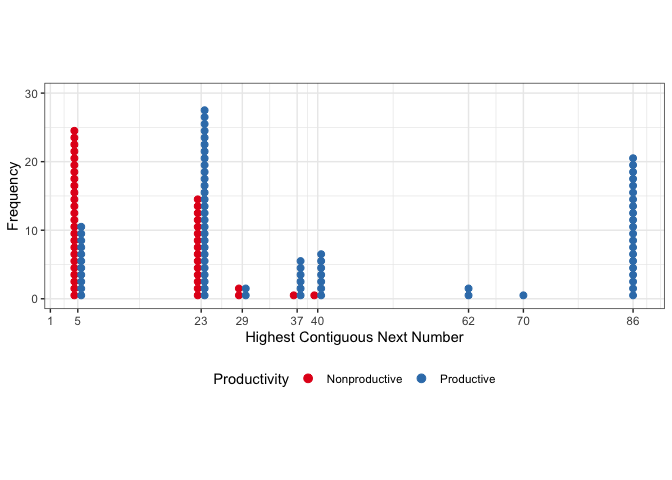<!-- -->

``` r
ggsave("graphs/highestcontig-by-prod-2.png")
```

    ## Saving 7 x 5 in image

#### Correlations

``` r
corrdf <- full.data %>% dplyr::right_join(highest_contiguous_nn) %>% dplyr::right_join(wcn.accuracy) %>% 
    dplyr::distinct(LadlabID, Highest_Contig_NN, wcn.score, prod.gradient, Age, IHC, 
        FHC) %>% dplyr::select(-LadlabID)
```

    ## Joining, by = "LadlabID"
    ## Joining, by = "LadlabID"

``` r
rcorr(as.matrix(corrdf), type = "pearson")
```

    ##                   Highest_Contig_NN prod.gradient  Age  IHC  FHC
    ## Highest_Contig_NN              1.00          0.51 0.37 0.75 0.54
    ## prod.gradient                  0.51          1.00 0.58 0.66 0.97
    ## Age                            0.37          0.58 1.00 0.51 0.61
    ## IHC                            0.75          0.66 0.51 1.00 0.72
    ## FHC                            0.54          0.97 0.61 0.72 1.00
    ## 
    ## n= 122 
    ## 
    ## 
    ## P
    ##                   Highest_Contig_NN prod.gradient Age IHC FHC
    ## Highest_Contig_NN                    0             0   0   0 
    ## prod.gradient      0                               0   0   0 
    ## Age                0                 0                 0   0 
    ## IHC                0                 0             0       0 
    ## FHC                0                 0             0   0

# Infinity Descriptives

Number of kids in each infinity category

``` r
# Code the categories
full.data <- full.data %>% mutate(Category = case_when(SuccessorKnower == 0 & EndlessKnower == 
    0 ~ "A Non-knower", SuccessorKnower == 0 & EndlessKnower == 1 ~ "B Endless-only", 
    SuccessorKnower == 1 & EndlessKnower == 0 ~ "C Successor-only", SuccessorKnower == 
        1 & EndlessKnower == 1 ~ "D Full-knower"))

full.data %>% dplyr::distinct(LadlabID, Category, Productivity) %>% dplyr::group_by(Productivity, 
    Category) %>% dplyr::summarise(n = n())
```

    ## # A tibble: 8 x 3
    ## # Groups:   Productivity [2]
    ##   Productivity  Category             n
    ##   <fct>         <chr>            <int>
    ## 1 Nonproductive A Non-knower        32
    ## 2 Nonproductive B Endless-only       1
    ## 3 Nonproductive C Successor-only    12
    ## 4 Nonproductive D Full-knower        3
    ## 5 Productive    A Non-knower        27
    ## 6 Productive    B Endless-only      10
    ## 7 Productive    C Successor-only    17
    ## 8 Productive    D Full-knower       20

``` r
classification.data <- full.data %>% dplyr::distinct(LadlabID, EndlessKnower, SuccessorKnower, 
    Productivity)

# Successor contingency table
table(classification.data$SuccessorKnower, classification.data$Productivity)
```

    ##    
    ##     Nonproductive Productive
    ##   0            33         37
    ##   1            15         37

``` r
chisq.test(table(classification.data$SuccessorKnower, classification.data$Productivity))
```

    ## 
    ##  Pearson's Chi-squared test with Yates' continuity correction
    ## 
    ## data:  table(classification.data$SuccessorKnower, classification.data$Productivity)
    ## X-squared = 3.4538, df = 1, p-value = 0.06311

``` r
# Endless contingency table
table(classification.data$EndlessKnower, classification.data$Productivity)
```

    ##    
    ##     Nonproductive Productive
    ##   0            44         44
    ##   1             4         30

``` r
chisq.test(table(classification.data$EndlessKnower, classification.data$Productivity))
```

    ## 
    ##  Pearson's Chi-squared test with Yates' continuity correction
    ## 
    ## data:  table(classification.data$EndlessKnower, classification.data$Productivity)
    ## X-squared = 13.464, df = 1, p-value = 0.0002432

``` r
# Cross tab
table(classification.data$SuccessorKnower, classification.data$EndlessKnower)
```

    ##    
    ##      0  1
    ##   0 59 11
    ##   1 29 23

Average age of kids for Endless and Successor
Knowers

``` r
full.data %>% dplyr::distinct(LadlabID, SuccessorKnower, Age) %>% dplyr::group_by(SuccessorKnower) %>% 
    dplyr::summarise(meanAge = mean(Age), sdAge = sd(Age), meanAgeMonths = mean(Age) * 
        12, sdAgeMonths = sd(Age) * 12)
```

    ## # A tibble: 2 x 5
    ##   SuccessorKnower meanAge sdAge meanAgeMonths sdAgeMonths
    ##             <int>   <dbl> <dbl>         <dbl>       <dbl>
    ## 1               0    4.92 0.577          59.0        6.93
    ## 2               1    5.11 0.550          61.3        6.60

``` r
full.data %>% dplyr::distinct(LadlabID, EndlessKnower, Age) %>% dplyr::group_by(EndlessKnower) %>% 
    dplyr::summarise(meanAge = mean(Age), sdAge = sd(Age), meanAgeMonths = mean(Age) * 
        12, sdAgeMonths = sd(Age) * 12)
```

    ## # A tibble: 2 x 5
    ##   EndlessKnower meanAge sdAge meanAgeMonths sdAgeMonths
    ##           <int>   <dbl> <dbl>         <dbl>       <dbl>
    ## 1             0    4.89 0.560          58.7        6.71
    ## 2             1    5.27 0.516          63.2        6.19

Infinity in relation to highest
count

``` r
full.data %>% dplyr::distinct(LadlabID, EndlessKnower, IHC, FHC) %>% dplyr::group_by(EndlessKnower) %>% 
    dplyr::summarize(mean_IHC = mean(IHC), mean_FHC = mean(FHC))
```

    ## # A tibble: 2 x 3
    ##   EndlessKnower mean_IHC mean_FHC
    ##           <int>    <dbl>    <dbl>
    ## 1             0     42.8     63.8
    ## 2             1     70.1     91.8

``` r
full.data %>% dplyr::distinct(LadlabID, SuccessorKnower, IHC, FHC) %>% dplyr::group_by(SuccessorKnower) %>% 
    dplyr::summarize(mean_IHC = mean(IHC), mean_FHC = mean(FHC))
```

    ## # A tibble: 2 x 3
    ##   SuccessorKnower mean_IHC mean_FHC
    ##             <int>    <dbl>    <dbl>
    ## 1               0     47.4     67.0
    ## 2               1     54.5     77.7

Infinity in relation to
WCN

``` r
full.data %>% dplyr::right_join(highest_contiguous_nn) %>% dplyr::distinct(LadlabID, 
    EndlessKnower, Highest_Contig_NN) %>% dplyr::group_by(EndlessKnower) %>% dplyr::summarize(mean_contig_nn = mean(Highest_Contig_NN), 
    median_contig_nn = median(Highest_Contig_NN))
```

    ## Joining, by = "LadlabID"

    ## # A tibble: 2 x 3
    ##   EndlessKnower mean_contig_nn median_contig_nn
    ##           <int>          <dbl>            <dbl>
    ## 1             0           26.2               23
    ## 2             1           45.7               37

``` r
full.data %>% dplyr::right_join(highest_contiguous_nn) %>% dplyr::distinct(LadlabID, 
    SuccessorKnower, Highest_Contig_NN) %>% dplyr::group_by(SuccessorKnower) %>% 
    dplyr::summarize(mean_contig_nn = mean(Highest_Contig_NN), median_contig_nn = median(Highest_Contig_NN))
```

    ## Joining, by = "LadlabID"

    ## # A tibble: 2 x 3
    ##   SuccessorKnower mean_contig_nn median_contig_nn
    ##             <int>          <dbl>            <dbl>
    ## 1               0           27.4               23
    ## 2               1           37.4               23

# Productivity gradient

``` r
ggplot(full.data, aes(x = IHC, y = prod.gradient, colour = Productivity)) + geom_point(size = 3, 
    alpha = 0.1) + geom_jitter() + theme_bw(base_size = 13) + theme(legend.position = "bottom") + 
    scale_x_continuous(breaks = seq(0, 100, 10)) + scale_colour_brewer(palette = "Set1") + 
    labs(y = "Productivity Gradient", x = "IHC")
```

<!-- -->

## Correlation between productivity gradient and IHC/FHC

``` r
ms.cor <- full.data %>% distinct(LadlabID, Age, IHC, FHC, prod.gradient)

cor.test(ms.cor$IHC, ms.cor$prod.gradient)  #sig. correlation between IHC and prod. gradient
```

    ## 
    ##  Pearson's product-moment correlation
    ## 
    ## data:  ms.cor$IHC and ms.cor$prod.gradient
    ## t = 9.6098, df = 120, p-value < 2.2e-16
    ## alternative hypothesis: true correlation is not equal to 0
    ## 95 percent confidence interval:
    ##  0.5456677 0.7493760
    ## sample estimates:
    ##       cor 
    ## 0.6594619

``` r
cor.test(ms.cor$FHC, ms.cor$prod.gradient)  #sig. correlation between FHC and prod. gradient
```

    ## 
    ##  Pearson's product-moment correlation
    ## 
    ## data:  ms.cor$FHC and ms.cor$prod.gradient
    ## t = 41.106, df = 120, p-value < 2.2e-16
    ## alternative hypothesis: true correlation is not equal to 0
    ## 95 percent confidence interval:
    ##  0.9520457 0.9763364
    ## sample estimates:
    ##       cor 
    ## 0.9662772

## Correlation between Productivity classification and Prod.gradient

``` r
ms.cor <- full.data %>% dplyr::distinct(LadlabID, Productivity, prod.gradient) %>% 
    mutate(Productivity = factor(Productivity, levels = c("Productive", "Nonproductive"), 
        labels = c(1, 0)), Productivity = as.integer(as.character(Productivity)))

cor.test(ms.cor$Productivity, ms.cor$prod.gradient)
```

    ## 
    ##  Pearson's product-moment correlation
    ## 
    ## data:  ms.cor$Productivity and ms.cor$prod.gradient
    ## t = 24.671, df = 120, p-value < 2.2e-16
    ## alternative hypothesis: true correlation is not equal to 0
    ## 95 percent confidence interval:
    ##  0.8790018 0.9391385
    ## sample estimates:
    ##       cor 
    ## 0.9139552

-----

# Infinity Regression Analyses

## Counting, Productivity, and Infinity Battery

To identify whether there is connection between counting experience and
Infinity Task performance, we will conduct three initial analyses,
predicting Infinity Task performance from either (1) Initial Highest
Count, (2) Productivity for Decade Rule (defined above), or (3)
performance on the Next Number task.

glm(inf.0/1 \~ (predictor) + age, family = binomial).

-----

First, we need to make a model data frame that readily has all of this
information

``` r
# model base
model.df <- full.data %>% dplyr::select(LadlabID, Age, AgeGroup, Gender, Task, Response, 
    SuccessorKnower, EndlessKnower, IHC, FHC, DCE, Productivity, prod.gradient)
```

Add highest contiguous next number and wcn accuracy to model.df

``` r
model.df <- right_join(model.df, highest_contiguous_nn, by = "LadlabID")

model.df <- right_join(model.df, wcn.accuracy, by = "LadlabID")
```

## Successor models

``` r
#each participant only needs one row here, because we only need to know whether they are a Successor Knower or Endless Knower
distinct_model.df <- model.df %>%
  distinct(LadlabID, Age, AgeGroup, Gender, SuccessorKnower, EndlessKnower, 
           IHC, Highest_Contig_NN, FHC, DCE, Productivity, prod.gradient, wcnscore)%>%
  mutate(SuccessorKnower = factor(SuccessorKnower, levels = c(0,1)), 
         EndlessKnower = factor(EndlessKnower, levels = c(0,1)),
         IHC = as.integer(IHC), 
         Highest_Contig_NN = as.integer(Highest_Contig_NN), 
         LadlabID = factor(LadlabID), 
         IHC.c = as.vector(scale(IHC, center = TRUE, scale=TRUE)), #scale and center for model fit
         FHC.c = as.vector(scale(FHC, center = TRUE, scale=TRUE)),
         Highest_Contig_NN.c = as.vector(scale(Highest_Contig_NN, center = TRUE, scale=TRUE)), 
         Age.c = as.vector(scale(Age, center = TRUE, scale=TRUE)),
         prod.gradient.c = as.vector(scale(prod.gradient, center=TRUE, scale=TRUE)),
          wcnscore.c = as.vector(scale(wcnscore, center = TRUE, scale=TRUE)))

# #add mean_nn to model df
# distinct_model.df <- right_join(distinct_model.df, lookup, by = "LadlabID")

###MODEL BUILDING AND COMPARISONS###
#base model for successor knower
base.successor <- glm(SuccessorKnower ~ Age.c, family = "binomial", 
                        data = distinct_model.df)

##IHC model##
model.ihc.successor <- glm(SuccessorKnower ~ IHC.c + Age.c, family = "binomial", 
                             data = distinct_model.df)
##Highest NN Model##
model.nn.successor <- glm(SuccessorKnower ~ Highest_Contig_NN.c + Age.c, family = "binomial", 
                            data = distinct_model.df)
##Productivity model##
model.prod.successor <- glm(SuccessorKnower ~ Productivity + Age.c, family = "binomial",
                              data = distinct_model.df)

##EXPLORATORY## - GAIN SCORE
model.gain.successor <- glm(SuccessorKnower ~ prod.gradient.c + Age.c, family = "binomial",
                              data = distinct_model.df)
summary(model.gain.successor)
```

    ## 
    ## Call:
    ## glm(formula = SuccessorKnower ~ prod.gradient.c + Age.c, family = "binomial", 
    ##     data = distinct_model.df)
    ## 
    ## Deviance Residuals: 
    ##     Min       1Q   Median       3Q      Max  
    ## -1.2951  -1.0462  -0.8427   1.1977   1.6211  
    ## 
    ## Coefficients:
    ##                 Estimate Std. Error z value Pr(>|z|)  
    ## (Intercept)      -0.3092     0.1868  -1.656   0.0978 .
    ## prod.gradient.c   0.2214     0.2299   0.963   0.3354  
    ## Age.c             0.2168     0.2284   0.949   0.3425  
    ## ---
    ## Signif. codes:  0 '***' 0.001 '**' 0.01 '*' 0.05 '.' 0.1 ' ' 1
    ## 
    ## (Dispersion parameter for binomial family taken to be 1)
    ## 
    ##     Null deviance: 166.46  on 121  degrees of freedom
    ## Residual deviance: 162.14  on 119  degrees of freedom
    ## AIC: 168.14
    ## 
    ## Number of Fisher Scoring iterations: 4

``` r
##Regression table for Successor Knower Models (Table 2)
mtable.sf.knowers <- mtable('Base' = base.successor,
            'IHC' = model.ihc.successor,
            'Highest Contig.' = model.nn.successor,
            'Productivity' = model.prod.successor,
            'Exp. - Prod. gain' = model.gain.successor,
            #summary.stats = c('R-squared','F','p','N'))
            summary.stats = c('Nagelkerke R-sq.','Log-likelihood','AIC','N'))
mtable.sf.knowers
```

    ## 
    ## Calls:
    ## Base: glm(formula = SuccessorKnower ~ Age.c, family = "binomial", data = distinct_model.df)
    ## IHC: glm(formula = SuccessorKnower ~ IHC.c + Age.c, family = "binomial", 
    ##     data = distinct_model.df)
    ## Highest Contig.: glm(formula = SuccessorKnower ~ Highest_Contig_NN.c + Age.c, 
    ##     family = "binomial", data = distinct_model.df)
    ## Productivity: glm(formula = SuccessorKnower ~ Productivity + Age.c, family = "binomial", 
    ##     data = distinct_model.df)
    ## Exp. - Prod. gain: glm(formula = SuccessorKnower ~ prod.gradient.c + Age.c, family = "binomial", 
    ##     data = distinct_model.df)
    ## 
    ## ================================================================================================================
    ##                                             Base      IHC     Highest Contig.  Productivity  Exp. - Prod. gain  
    ## ----------------------------------------------------------------------------------------------------------------
    ##   (Intercept)                              -0.306    -0.306       -0.307          -0.663          -0.309        
    ##                                            (0.186)   (0.186)      (0.187)         (0.342)         (0.187)       
    ##   Age.c                                     0.342     0.313        0.245           0.193           0.217        
    ##                                            (0.188)   (0.218)      (0.202)         (0.221)         (0.228)       
    ##   IHC.c                                               0.058                                                     
    ##                                                      (0.216)                                                    
    ##   Highest_Contig_NN.c                                              0.271                                        
    ##                                                                   (0.200)                                       
    ##   Productivity: Productive/Nonproductive                                           0.579                        
    ##                                                                                   (0.456)                       
    ##   prod.gradient.c                                                                                  0.221        
    ##                                                                                                   (0.230)       
    ## ----------------------------------------------------------------------------------------------------------------
    ##   Nagelkerke R-sq.                          0.037     0.038        0.056           0.054           0.047        
    ##   Log-likelihood                          -81.539   -81.503      -80.610         -80.725         -81.072        
    ##   AIC                                     167.077   169.006      167.221         167.450         168.143        
    ##   N                                       122       122          122             122             122            
    ## ================================================================================================================

``` r
write.mtable(mtable.sf.knowers, file="graphs/table2.txt")

###MODEL COMPARISONS##
#base v. IHC
anova(base.successor, model.ihc.successor, test = 'LRT') #IHC not significant
```

    ## Analysis of Deviance Table
    ## 
    ## Model 1: SuccessorKnower ~ Age.c
    ## Model 2: SuccessorKnower ~ IHC.c + Age.c
    ##   Resid. Df Resid. Dev Df Deviance Pr(>Chi)
    ## 1       120     163.08                     
    ## 2       119     163.01  1 0.071147   0.7897

``` r
#Highest contiguous NN v. IHC
anova(base.successor, model.nn.successor, test = 'LRT')#highest contiguous NN not significant
```

    ## Analysis of Deviance Table
    ## 
    ## Model 1: SuccessorKnower ~ Age.c
    ## Model 2: SuccessorKnower ~ Highest_Contig_NN.c + Age.c
    ##   Resid. Df Resid. Dev Df Deviance Pr(>Chi)
    ## 1       120     163.08                     
    ## 2       119     161.22  1   1.8565    0.173

``` r
#Productivity v. IHC
anova(base.successor, model.prod.successor, test = 'LRT')#Productivity trending
```

    ## Analysis of Deviance Table
    ## 
    ## Model 1: SuccessorKnower ~ Age.c
    ## Model 2: SuccessorKnower ~ Productivity + Age.c
    ##   Resid. Df Resid. Dev Df Deviance Pr(>Chi)
    ## 1       120     163.08                     
    ## 2       119     161.45  1   1.6272   0.2021

``` r
##Exploratory
anova(base.successor, model.gain.successor, test = 'LRT')
```

    ## Analysis of Deviance Table
    ## 
    ## Model 1: SuccessorKnower ~ Age.c
    ## Model 2: SuccessorKnower ~ prod.gradient.c + Age.c
    ##   Resid. Df Resid. Dev Df Deviance Pr(>Chi)
    ## 1       120     163.08                     
    ## 2       119     162.14  1  0.93365   0.3339

## Endless Models

``` r
# Base model
base.endless <- glm(EndlessKnower ~ Age.c, family = "binomial", data = distinct_model.df)

### IHC MODEL###
model.ihc.endless <- glm(EndlessKnower ~ IHC.c + Age.c, family = "binomial", data = distinct_model.df)

### HIGHEST CONTIG NN MODEL###
model.nn.endless <- glm(EndlessKnower ~ Highest_Contig_NN.c + Age.c, family = "binomial", 
    data = distinct_model.df)

### PRODUCTIVITY MODEL###
model.prod.endless <- glm(EndlessKnower ~ Productivity + Age.c, family = "binomial", 
    data = distinct_model.df)

## EXPLORATORY## - GAIN SCORE
model.gain.endless <- glm(EndlessKnower ~ prod.gradient.c + Age.c, family = "binomial", 
    data = distinct_model.df)

## Regression table for Endless Models
mtable.endless.knowers <- mtable(Base = base.endless, IHC = model.ihc.endless, `Highest Contig.` = model.nn.endless, 
    Productivity = model.prod.endless, `Prod. gradient` = model.gain.endless, summary.stats = c("Nagelkerke R-sq.", 
        "Log-likelihood", "AIC", "F", "p", "N"))

mtable.endless.knowers
```

    ## 
    ## Calls:
    ## Base: glm(formula = EndlessKnower ~ Age.c, family = "binomial", data = distinct_model.df)
    ## IHC: glm(formula = EndlessKnower ~ IHC.c + Age.c, family = "binomial", 
    ##     data = distinct_model.df)
    ## Highest Contig.: glm(formula = EndlessKnower ~ Highest_Contig_NN.c + Age.c, family = "binomial", 
    ##     data = distinct_model.df)
    ## Productivity: glm(formula = EndlessKnower ~ Productivity + Age.c, family = "binomial", 
    ##     data = distinct_model.df)
    ## Prod. gradient: glm(formula = EndlessKnower ~ prod.gradient.c + Age.c, family = "binomial", 
    ##     data = distinct_model.df)
    ## 
    ## =================================================================================================================
    ##                                              Base        IHC      Highest Contig.  Productivity  Prod. gradient  
    ## -----------------------------------------------------------------------------------------------------------------
    ##   (Intercept)                              -1.057***   -1.131***     -1.091***       -2.186***      -1.203***    
    ##                                            (0.221)     (0.235)       (0.228)         (0.539)        (0.256)      
    ##   Age.c                                     0.707**     0.407         0.535*          0.360          0.313       
    ##                                            (0.224)     (0.250)       (0.238)         (0.253)        (0.264)      
    ##   IHC.c                                                 0.666**                                                  
    ##                                                        (0.242)                                                   
    ##   Highest_Contig_NN.c                                                 0.504*                                     
    ##                                                                      (0.215)                                     
    ##   Productivity: Productive/Nonproductive                                              1.636**                    
    ##                                                                                      (0.629)                     
    ##   prod.gradient.c                                                                                    0.849**     
    ##                                                                                                     (0.322)      
    ## -----------------------------------------------------------------------------------------------------------------
    ##   Nagelkerke R-sq.                          0.125       0.205         0.183           0.208          0.212       
    ##   Log-likelihood                          -66.655     -62.810       -63.884         -62.688        -62.485       
    ##   AIC                                     137.311     131.619       133.767         131.377        130.971       
    ##   p                                         0.001       0.000         0.000           0.000          0.000       
    ##   N                                       122         122           122             122            122           
    ## =================================================================================================================

``` r
write.mtable(mtable.endless.knowers, file = "graphs/table3.txt")

## SIMPLE MODEL COMPARISONS## base v. IHC
anova(base.endless, model.ihc.endless, test = "LRT")  #IHC significant
```

    ## Analysis of Deviance Table
    ## 
    ## Model 1: EndlessKnower ~ Age.c
    ## Model 2: EndlessKnower ~ IHC.c + Age.c
    ##   Resid. Df Resid. Dev Df Deviance Pr(>Chi)   
    ## 1       120     133.31                        
    ## 2       119     125.62  1   7.6914 0.005549 **
    ## ---
    ## Signif. codes:  0 '***' 0.001 '**' 0.01 '*' 0.05 '.' 0.1 ' ' 1

``` r
# base v. highest contiguous
anova(model.nn.endless, base.endless, test = "LRT")  #Highest contig NN significant
```

    ## Analysis of Deviance Table
    ## 
    ## Model 1: EndlessKnower ~ Highest_Contig_NN.c + Age.c
    ## Model 2: EndlessKnower ~ Age.c
    ##   Resid. Df Resid. Dev Df Deviance Pr(>Chi)  
    ## 1       119     127.77                       
    ## 2       120     133.31 -1  -5.5433  0.01855 *
    ## ---
    ## Signif. codes:  0 '***' 0.001 '**' 0.01 '*' 0.05 '.' 0.1 ' ' 1

``` r
# base v. productivity
anova(model.prod.endless, base.endless, test = "LRT")  #Prod significant
```

    ## Analysis of Deviance Table
    ## 
    ## Model 1: EndlessKnower ~ Productivity + Age.c
    ## Model 2: EndlessKnower ~ Age.c
    ##   Resid. Df Resid. Dev Df Deviance Pr(>Chi)   
    ## 1       119     125.38                        
    ## 2       120     133.31 -1   -7.934 0.004852 **
    ## ---
    ## Signif. codes:  0 '***' 0.001 '**' 0.01 '*' 0.05 '.' 0.1 ' ' 1

``` r
## Exploratory base v. productivity gradient
anova(base.endless, model.gain.endless, test = "LRT")  # prod. gradient significant (better than IHC)
```

    ## Analysis of Deviance Table
    ## 
    ## Model 1: EndlessKnower ~ Age.c
    ## Model 2: EndlessKnower ~ prod.gradient.c + Age.c
    ##   Resid. Df Resid. Dev Df Deviance Pr(>Chi)   
    ## 1       120     133.31                        
    ## 2       119     124.97  1     8.34 0.003878 **
    ## ---
    ## Signif. codes:  0 '***' 0.001 '**' 0.01 '*' 0.05 '.' 0.1 ' ' 1

``` r
# #okay with about mean NN model2.endless <- glmer(EndlessKnower ~ mean.NN + Age
# + (1|LadlabID), family = 'binomial', data = distinct_model.df)
# anova(model2.endless, base.endless, test = 'LRT')#mean NN significant
```

### Endless: Large model comparison

Put all significant Endless predictors into large model, run model
comparison

``` r
## BASE MODEL WITH IHC
large.endless.base <- glm(EndlessKnower ~ IHC.c + Age.c, family = "binomial", data = distinct_model.df)
## add highest contig
large.endless.nn <- glm(EndlessKnower ~ Highest_Contig_NN.c + IHC.c + Age.c, family = "binomial", 
    data = distinct_model.df)

## Productivity + IHC
large.endless.prod <- glm(EndlessKnower ~ Productivity + IHC.c + Age.c, family = "binomial", 
    data = distinct_model.df)

## Prod. Gain + IHC
large.endless.gain.ihc <- glm(EndlessKnower ~ IHC.c + prod.gradient.c + Age.c, family = "binomial", 
    data = distinct_model.df)
# summary(large.endless.gain.ihc) #with addition of IHC, prod.gradient is
# marginal, AIC very slightly decreases

## ALL THREE TOGETHER
large.endless.full <- glm(EndlessKnower ~ Productivity + Highest_Contig_NN.c + IHC.c + 
    Age.c, family = "binomial", data = distinct_model.df)

## ALL THREE (productivity gradient)
large.endless.full.grad <- glm(EndlessKnower ~ prod.gradient.c + Highest_Contig_NN.c + 
    IHC.c + Age.c, family = "binomial", data = distinct_model.df)


## MODEL COMPARISONS IHC v. Highest contig.
anova(large.endless.base, large.endless.nn, test = "LRT")  #Highest contig. NS
```

    ## Analysis of Deviance Table
    ## 
    ## Model 1: EndlessKnower ~ IHC.c + Age.c
    ## Model 2: EndlessKnower ~ Highest_Contig_NN.c + IHC.c + Age.c
    ##   Resid. Df Resid. Dev Df Deviance Pr(>Chi)
    ## 1       119     125.62                     
    ## 2       118     125.28  1   0.3351   0.5627

``` r
# IHC v. Productivity
anova(large.endless.base, large.endless.prod, test = "LRT")  ##Productivity NS
```

    ## Analysis of Deviance Table
    ## 
    ## Model 1: EndlessKnower ~ IHC.c + Age.c
    ## Model 2: EndlessKnower ~ Productivity + IHC.c + Age.c
    ##   Resid. Df Resid. Dev Df Deviance Pr(>Chi)  
    ## 1       119     125.62                       
    ## 2       118     122.88  1   2.7361  0.09811 .
    ## ---
    ## Signif. codes:  0 '***' 0.001 '**' 0.01 '*' 0.05 '.' 0.1 ' ' 1

``` r
# IHC v. Prod. Gain
anova(large.endless.base, large.endless.gain.ihc, test = "LRT")  #n.s. addition of gradient to ihc
```

    ## Analysis of Deviance Table
    ## 
    ## Model 1: EndlessKnower ~ IHC.c + Age.c
    ## Model 2: EndlessKnower ~ IHC.c + prod.gradient.c + Age.c
    ##   Resid. Df Resid. Dev Df Deviance Pr(>Chi)  
    ## 1       119     125.62                       
    ## 2       118     122.59  1   3.0268   0.0819 .
    ## ---
    ## Signif. codes:  0 '***' 0.001 '**' 0.01 '*' 0.05 '.' 0.1 ' ' 1

``` r
anova(model.gain.endless, large.endless.gain.ihc, test = "LRT")  #n.s. addition of ihc to gradient.
```

    ## Analysis of Deviance Table
    ## 
    ## Model 1: EndlessKnower ~ prod.gradient.c + Age.c
    ## Model 2: EndlessKnower ~ IHC.c + prod.gradient.c + Age.c
    ##   Resid. Df Resid. Dev Df Deviance Pr(>Chi)
    ## 1       119     124.97                     
    ## 2       118     122.59  1   2.3782    0.123

### Endless: regression table

``` r
mtable.endless.large <- mtable(#'IHC alone' = large.endless.base,
            'HCNN + IHC' = large.endless.nn,
            'Prod.Group + IHC' = large.endless.prod,
#            'Prod.Group + Highest contig. + IHC' = large.endless.full,
#            'Prod.Gradient alone' = model.gain.endless,
            'Prod.Gradient + IHC' = large.endless.gain.ihc,
            #summary.stats = c('R-squared','F','p','N'))
            summary.stats = c('Nagelkerke R-sq.','Log-likelihood','AIC','N'))

mtable.endless.large
```

    ## 
    ## Calls:
    ## HCNN + IHC: glm(formula = EndlessKnower ~ Highest_Contig_NN.c + IHC.c + Age.c, 
    ##     family = "binomial", data = distinct_model.df)
    ## Prod.Group + IHC: glm(formula = EndlessKnower ~ Productivity + IHC.c + Age.c, family = "binomial", 
    ##     data = distinct_model.df)
    ## Prod.Gradient + IHC: glm(formula = EndlessKnower ~ IHC.c + prod.gradient.c + Age.c, 
    ##     family = "binomial", data = distinct_model.df)
    ## 
    ## =============================================================================================
    ##                                           HCNN + IHC  Prod.Group + IHC  Prod.Gradient + IHC  
    ## ---------------------------------------------------------------------------------------------
    ##   (Intercept)                              -1.129***      -1.901***          -1.213***       
    ##                                            (0.235)        (0.568)            (0.257)         
    ##   Highest_Contig_NN.c                       0.173                                            
    ##                                            (0.299)                                           
    ##   IHC.c                                     0.529          0.431              0.421          
    ##                                            (0.336)        (0.276)            (0.275)         
    ##   Age.c                                     0.411          0.279              0.250          
    ##                                            (0.250)        (0.260)            (0.267)         
    ##   Productivity: Productive/Nonproductive                   1.141                             
    ##                                                           (0.710)                            
    ##   prod.gradient.c                                                             0.596          
    ##                                                                              (0.357)         
    ## ---------------------------------------------------------------------------------------------
    ##   Nagelkerke R-sq.                          0.209          0.233              0.236          
    ##   Log-likelihood                          -62.642        -61.442            -61.296          
    ##   AIC                                     133.284        130.883            130.592          
    ##   N                                       122            122                122              
    ## =============================================================================================

``` r
write.mtable(mtable.endless.large, file="graphs/table3b.txt")
```

## LM predicting IHC from productivity and age, HCNN and age

``` r
lm.prod <- full.data %>% distinct(LadlabID, Productivity, Age, IHC) %>% mutate(Age.c = as.vector(scale(Age, 
    center = TRUE, scale = TRUE)))

lm1 <- lm(IHC ~ Productivity + Age.c, data = lm.prod)
summary(lm1)
```

    ## 
    ## Call:
    ## lm(formula = IHC ~ Productivity + Age.c, data = lm.prod)
    ## 
    ## Residuals:
    ##     Min      1Q  Median      3Q     Max 
    ## -49.329 -17.153  -4.076  23.167  52.464 
    ## 
    ## Coefficients:
    ##                        Estimate Std. Error t value Pr(>|t|)    
    ## (Intercept)              27.426      3.985   6.883 2.94e-10 ***
    ## ProductivityProductive   37.906      5.439   6.969 1.90e-10 ***
    ## Age.c                     7.237      2.668   2.712  0.00767 ** 
    ## ---
    ## Signif. codes:  0 '***' 0.001 '**' 0.01 '*' 0.05 '.' 0.1 ' ' 1
    ## 
    ## Residual standard error: 24.68 on 119 degrees of freedom
    ## Multiple R-squared:  0.4758, Adjusted R-squared:  0.467 
    ## F-statistic:    54 on 2 and 119 DF,  p-value: < 2.2e-16

``` r
lm2 <- lm(IHC ~ Highest_Contig_NN + Age.c, data = distinct_model.df)
summary(lm2)
```

    ## 
    ## Call:
    ## lm(formula = IHC ~ Highest_Contig_NN + Age.c, data = distinct_model.df)
    ## 
    ## Residuals:
    ##     Min      1Q  Median      3Q     Max 
    ## -60.998 -10.895  -3.356   9.613  60.317 
    ## 
    ## Coefficients:
    ##                   Estimate Std. Error t value Pr(>|t|)    
    ## (Intercept)       25.41749    2.96537   8.571 4.39e-14 ***
    ## Highest_Contig_NN  0.78935    0.07249  10.889  < 2e-16 ***
    ## Age.c              9.06772    2.03035   4.466 1.82e-05 ***
    ## ---
    ## Signif. codes:  0 '***' 0.001 '**' 0.01 '*' 0.05 '.' 0.1 ' ' 1
    ## 
    ## Residual standard error: 20.73 on 119 degrees of freedom
    ## Multiple R-squared:  0.6302, Adjusted R-squared:  0.624 
    ## F-statistic: 101.4 on 2 and 119 DF,  p-value: < 2.2e-16

## Full Infinity Knowledge models

### build models

``` r
# Add full infinity knowledge classification to data frame
distinct_model.df <- distinct_model.df %>%
  mutate(InfinityKnower = factor(
    case_when(SuccessorKnower==0 | EndlessKnower==0 ~ 0,
              SuccessorKnower==1 & EndlessKnower==1 ~ 1),
    levels=c(0,1))
  )

###MODEL BUILDING AND COMPARISONS###
#base model for successor knower
base.infinity <- glm(InfinityKnower ~ Age.c, family = "binomial", 
                        data = distinct_model.df)

##IHC model
model.ihc.infinity <- glm(InfinityKnower ~ IHC.c + Age.c, family = "binomial", 
                             data = distinct_model.df)
##Highest NN Model
model.nn.infinity <- glm(InfinityKnower ~ Highest_Contig_NN.c + Age.c, family = "binomial", 
                            data = distinct_model.df)
##Productivity model
model.prod.infinity <- glm(InfinityKnower ~ Productivity + Age.c, family = "binomial",
                              data = distinct_model.df)

##Gain Score model
model.gain.infinity <- glm(InfinityKnower ~ prod.gradient.c + Age.c, family = "binomial",
                              data = distinct_model.df)

##Regression table for Infinity Knower Models (Table 4)
mtable.inf.knowers <- mtable('Base' = base.infinity,
            'IHC' = model.ihc.infinity,
            'Highest Contig.' = model.nn.infinity,
            'Prod. Group' = model.prod.infinity,
            'Prod. Gain' = model.gain.infinity,
            #summary.stats = c('R-squared','F','p','N'))
            summary.stats = c('Nagelkerke R-sq.','Log-likelihood','AIC','N'))
mtable.inf.knowers
```

    ## 
    ## Calls:
    ## Base: glm(formula = InfinityKnower ~ Age.c, family = "binomial", data = distinct_model.df)
    ## IHC: glm(formula = InfinityKnower ~ IHC.c + Age.c, family = "binomial", 
    ##     data = distinct_model.df)
    ## Highest Contig.: glm(formula = InfinityKnower ~ Highest_Contig_NN.c + Age.c, family = "binomial", 
    ##     data = distinct_model.df)
    ## Prod. Group: glm(formula = InfinityKnower ~ Productivity + Age.c, family = "binomial", 
    ##     data = distinct_model.df)
    ## Prod. Gain: glm(formula = InfinityKnower ~ prod.gradient.c + Age.c, family = "binomial", 
    ##     data = distinct_model.df)
    ## 
    ## ============================================================================================================
    ##                                              Base        IHC      Highest Contig.  Prod. Group  Prod. Gain  
    ## ------------------------------------------------------------------------------------------------------------
    ##   (Intercept)                              -1.629***   -1.664***     -1.662***      -2.434***    -1.708***  
    ##                                            (0.266)     (0.273)       (0.272)        (0.612)      (0.289)    
    ##   Age.c                                     0.752**     0.567*        0.609*         0.499        0.497     
    ##                                            (0.260)     (0.289)       (0.275)        (0.293)      (0.304)    
    ##   IHC.c                                                 0.385                                               
    ##                                                        (0.273)                                              
    ##   Highest_Contig_NN.c                                                 0.383                                 
    ##                                                                      (0.234)                                
    ##   Productivity: Productive/Nonproductive                                             1.178                  
    ##                                                                                     (0.724)                 
    ##   prod.gradient.c                                                                                 0.542     
    ##                                                                                                  (0.357)    
    ## ------------------------------------------------------------------------------------------------------------
    ##   Nagelkerke R-sq.                          0.120       0.143         0.151          0.156        0.151     
    ##   Log-likelihood                          -54.355     -53.375       -53.040        -52.866      -53.064     
    ##   AIC                                     112.711     112.750       112.080        111.732      112.129     
    ##   N                                       122         122           122            122          122         
    ## ============================================================================================================

``` r
# save as txt
write.mtable(mtable.inf.knowers, file="graphs/table4.txt")
```

### Simple comparison

``` r
# base v. IHC
anova(base.infinity, model.ihc.infinity, test = "LRT")  #n.s.
```

    ## Analysis of Deviance Table
    ## 
    ## Model 1: InfinityKnower ~ Age.c
    ## Model 2: InfinityKnower ~ IHC.c + Age.c
    ##   Resid. Df Resid. Dev Df Deviance Pr(>Chi)
    ## 1       120     108.71                     
    ## 2       119     106.75  1   1.9604   0.1615

``` r
# base v. highest contiguous
anova(base.infinity, model.nn.infinity, test = "LRT")  #n.s.
```

    ## Analysis of Deviance Table
    ## 
    ## Model 1: InfinityKnower ~ Age.c
    ## Model 2: InfinityKnower ~ Highest_Contig_NN.c + Age.c
    ##   Resid. Df Resid. Dev Df Deviance Pr(>Chi)
    ## 1       120     108.71                     
    ## 2       119     106.08  1   2.6302   0.1048

``` r
# base v. productivity
anova(base.infinity, model.prod.infinity, test = "LRT")  #n.s. 
```

    ## Analysis of Deviance Table
    ## 
    ## Model 1: InfinityKnower ~ Age.c
    ## Model 2: InfinityKnower ~ Productivity + Age.c
    ##   Resid. Df Resid. Dev Df Deviance Pr(>Chi)  
    ## 1       120     108.71                       
    ## 2       119     105.73  1   2.9787  0.08436 .
    ## ---
    ## Signif. codes:  0 '***' 0.001 '**' 0.01 '*' 0.05 '.' 0.1 ' ' 1

``` r
# base v. productivity gradient
anova(base.infinity, model.gain.infinity, test = "LRT")  #n.s.
```

    ## Analysis of Deviance Table
    ## 
    ## Model 1: InfinityKnower ~ Age.c
    ## Model 2: InfinityKnower ~ prod.gradient.c + Age.c
    ##   Resid. Df Resid. Dev Df Deviance Pr(>Chi)
    ## 1       120     108.71                     
    ## 2       119     106.13  1   2.5818   0.1081

### 

\#Exploratory - Infinity regressions IHC\<99

``` r
explore.dat <- distinct_model.df %>% filter(IHC < 99)


# Successor
lt99.succ.base <- glm(SuccessorKnower ~ Age.c, family = "binomial", data = explore.dat)
lt99.succ.ihc <- glm(SuccessorKnower ~ IHC.c + Age.c, family = "binomial", data = explore.dat)
lt99.succ.prod <- glm(SuccessorKnower ~ Productivity + Age.c, family = "binomial", 
    data = explore.dat)
lt99.succ.nn <- glm(SuccessorKnower ~ Highest_Contig_NN + Age.c, family = "binomial", 
    data = explore.dat)

# Endless
lt99.end.base <- glm(EndlessKnower ~ Age.c, family = "binomial", data = explore.dat)
lt99.end.ihc <- glm(EndlessKnower ~ IHC.c + Age.c, family = "binomial", data = explore.dat)
lt99.end.prod <- glm(EndlessKnower ~ Productivity + Age.c, family = "binomial", data = explore.dat)
lt99.end.nn <- glm(EndlessKnower ~ Highest_Contig_NN + Age.c, family = "binomial", 
    data = explore.dat)
```

\#Plot of prod. gain with IHC - WIP

``` r
# pg.ms <- full.data %>% distinct(LadlabID, IHC, FHC, prod.gradient,
# Productivity) ggplot(pg.ms, aes(x=IHC, y = prod.gradient, colour =
# Productivity)) + geom_point(size = 2) + scale_x_continuous(breaks = seq(0, 100,
# 10)) + scale_colour_brewer(palette = 'Set1') + theme_bw(base_size = 13) +
# theme(panel.grid.minor = element_blank(), legend.position = 'bottom',
# legend.title = element_blank())

ms <- hc.dev.data %>% filter(Productivity == "Productive")


hc.dev.data %>% filter(Productivity == "Productive") %>% filter(`Highest Count Coding` != 
    "DCE") %>% ggplot(aes(x = reorder(LadlabID, hc, FUN = min), y = hc, colour = prod.gradient)) + 
    geom_point(aes(shape = `Highest Count Coding`), size = 1.2, stroke = 1.2) + geom_line() + 
    # scale_color_brewer(palette='Dark2') +
scale_shape_manual(values = c(5, 20)) + scale_y_continuous(breaks = seq(0, 140, 10)) + 
    labs(x = "Each line = individual participant", y = "Highest Count") + theme_bw() + 
    theme(legend.position = "bottom", axis.text.x = element_text(angle = 270, hjust = 1)) + 
    theme(axis.text.x = element_blank(), axis.ticks.x = element_blank(), panel.grid.minor = element_blank(), 
        panel.grid.major = element_blank()) + # scale_colour_gradient(low = '#666666', high = '#00b8e6') +
labs(shape = "Highest Count Type", colour = "Productivity Gradient")
```

<!-- -->

# WIP- How often do children recover from reminder prompts?

# TODO: Visualizing the regressions

``` r
# visualization
library(effects)
# endless knowers
plot(allEffects(large.endless.full), axes = list(y = list(type = "response", lab = "P(Endless Knower)")))
```

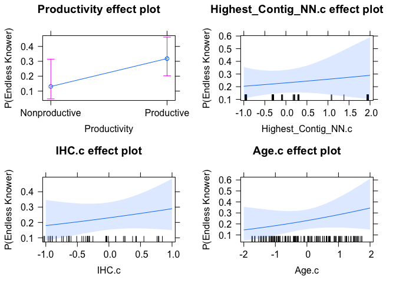<!-- -->

``` r
plot(allEffects(large.endless.full.grad), axes = list(y = list(type = "response", 
    lab = "P(Endless Knower)")))
```

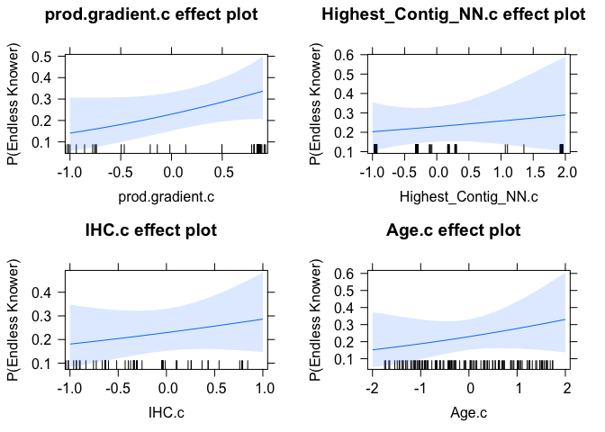<!-- -->

``` r
# Successor ALL THREE TOGETHER
large.successor.full <- glm(SuccessorKnower ~ Productivity + Highest_Contig_NN.c + 
    IHC.c + Age.c, family = "binomial", data = distinct_model.df)
plot(allEffects(large.successor.full), axes = list(y = list(type = "rescale", lab = "P(Successor Knower)")))
```

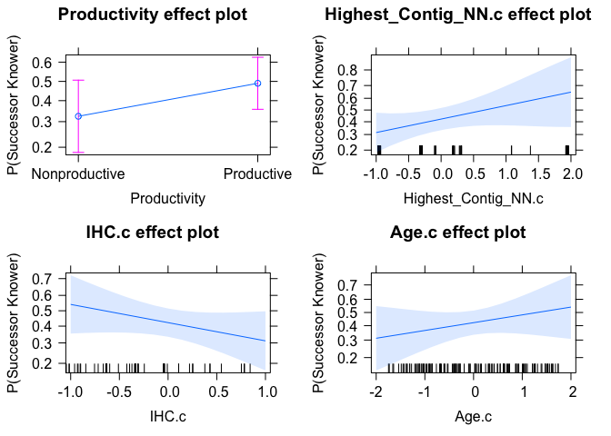<!-- -->

``` r
## ALL THREE (productivity gradient)
large.successor.full.grad <- glm(SuccessorKnower ~ prod.gradient.c + Highest_Contig_NN.c + 
    IHC.c + Age.c, family = "binomial", data = distinct_model.df)
plot(allEffects(large.successor.full.grad), axes = list(y = list(type = "rescale", 
    lab = "P(Successor Knower)")))
```

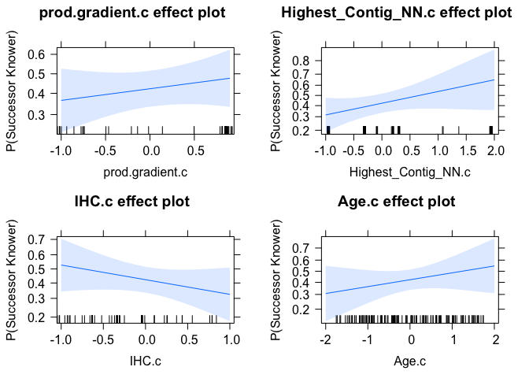<!-- -->

``` r
# full infinity
large.inf.full <- glm(InfinityKnower ~ Productivity + Highest_Contig_NN.c + IHC.c + 
    Age.c, family = "binomial", data = distinct_model.df)
plot(allEffects(large.inf.full), axes = list(y = list(type = "rescale", lab = "P(Full Infinity)")))
```

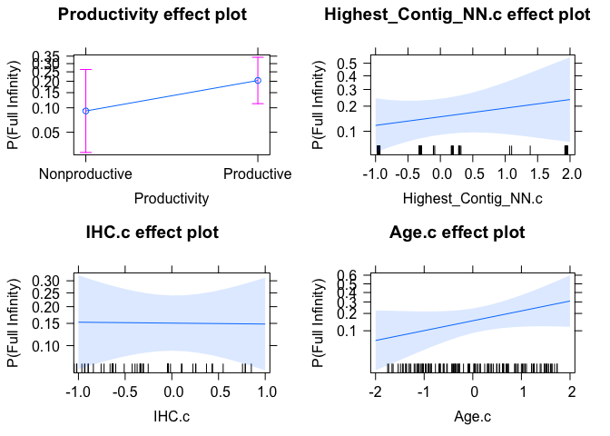<!-- -->

``` r
## ALL THREE (productivity gradient)
large.inf.full.grad <- glm(InfinityKnower ~ prod.gradient.c + Highest_Contig_NN.c + 
    IHC.c + Age.c, family = "binomial", data = distinct_model.df)
plot(allEffects(large.inf.full.grad), axes = list(y = list(type = "rescale", lab = "P(Full Infinity)")))
```

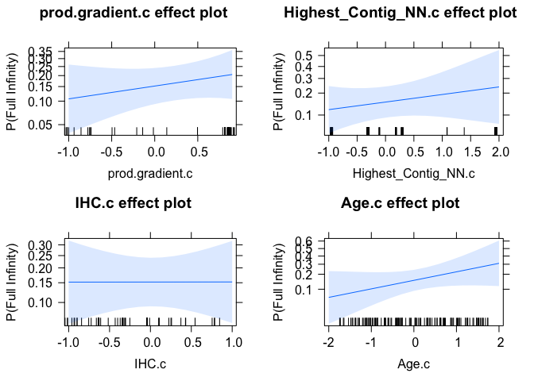<!-- -->

``` r
library(sjPlot)
```

    ## Learn more about sjPlot with 'browseVignettes("sjPlot")'.

``` r
library(sjlabelled)
```

    ## 
    ## Attaching package: 'sjlabelled'

    ## The following object is masked from 'package:forcats':
    ## 
    ##     as_factor

``` r
library(sjmisc)
```

    ## Learn more about sjmisc with 'browseVignettes("sjmisc")'.

    ## 
    ## Attaching package: 'sjmisc'

    ## The following object is masked from 'package:memisc':
    ## 
    ##     %nin%

    ## The following object is masked from 'package:purrr':
    ## 
    ##     is_empty

    ## The following object is masked from 'package:tidyr':
    ## 
    ##     replace_na

    ## The following object is masked from 'package:tibble':
    ## 
    ##     add_case

    ## The following object is masked from 'package:Hmisc':
    ## 
    ##     %nin%

``` r
theme_set(theme_sjplot())

# best endless model
plot_model(large.endless.gain.ihc, type = "std", transform = "plogis", title = "'Numbers do not end'", 
    show.values = TRUE, colors = "blue", value.offset = 0.2, axis.labels = c(Age.c = "Age", 
        Highest_Contig_NN.c = "Next Number accuracy", IHC.c = "Initial Highest Count", 
        prod.gradient.c = "Productivity Gradient", Probabilities = "Endorsement Probability")) + 
    ggplot2::geom_hline(yintercept = 0.5, linetype = "dashed")
```

    ## Package `snakecase` needs to be installed for case-conversion.

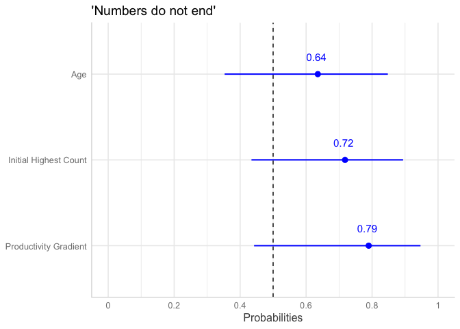<!-- -->

``` r
ggsave("graphs/regression-endless-partial.png", width = 6, height = 3)

# maximal endless model
plot_model(large.endless.full.grad, type = "std", transform = "plogis", title = "'Numbers do not end'", 
    show.values = TRUE, colors = "blue", value.offset = 0.2, axis.labels = c(Age.c = "Age", 
        Highest_Contig_NN.c = "Next Number accuracy", IHC.c = "Initial Highest Count", 
        prod.gradient.c = "Productivity Gradient", Probabilities = "Endorsement Probability")) + 
    ggplot2::geom_hline(yintercept = 0.5, linetype = "dashed")
```

    ## Package `snakecase` needs to be installed for case-conversion.

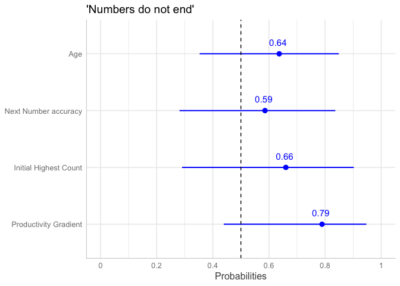<!-- -->

``` r
ggsave("graphs/regression-endless.png", width = 6, height = 3.5)

# maximal successor model
plot_model(large.successor.full.grad, type = "std", transform = "plogis", title = "'Can always add one'", 
    show.values = TRUE, colors = "blue", value.offset = 0.2, axis.labels = c(Age.c = "Age", 
        Highest_Contig_NN.c = "Next Number accuracy", IHC.c = "Initial Highest Count", 
        prod.gradient.c = "Productivity Gradient", Probabilities = "Endorsement Probability")) + 
    ggplot2::geom_hline(yintercept = 0.5, linetype = "dashed")
```

    ## Package `snakecase` needs to be installed for case-conversion.

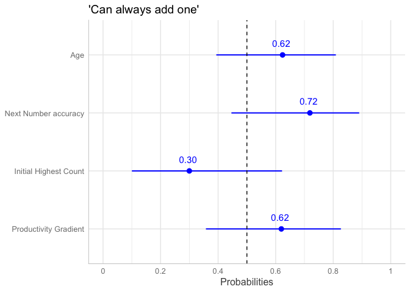<!-- -->

``` r
ggsave("graphs/regression-successor.png", width = 6, height = 3.5)

# maximal infinity model
plot_model(large.inf.full.grad, type = "std", transform = "plogis", title = "Full infinity knowledge", 
    show.values = TRUE, colors = "blue", value.offset = 0.2, axis.labels = c(Age.c = "Age", 
        Highest_Contig_NN.c = "Next Number accuracy", IHC.c = "Initial Highest Count", 
        prod.gradient.c = "Productivity Gradient", Probabilities = "Endorsement Probability")) + 
    ggplot2::geom_hline(yintercept = 0.5, linetype = "dashed")
```

    ## Package `snakecase` needs to be installed for case-conversion.

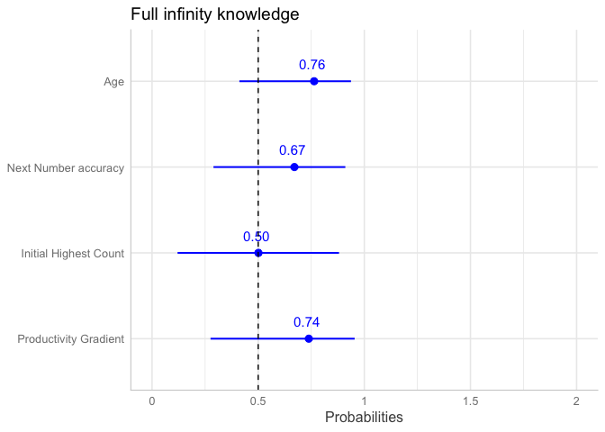<!-- -->

``` r
ggsave("graphs/regression-fullinfinity.png", width = 6, height = 3.5)
```

# Regressions

Use NN accuracy instead of hcnn.

## Successor models

``` r
###MODEL BUILDING AND COMPARISONS###
#base model for successor knower
base.successor2 <- glm(SuccessorKnower ~ Age.c, family = "binomial", 
                        data = distinct_model.df)

##IHC model##
model.ihc.successor2 <- glm(SuccessorKnower ~ IHC.c + Age.c, family = "binomial", 
                             data = distinct_model.df)
##Highest NN Model##
model.nn.successor2 <- glm(SuccessorKnower ~ wcnscore.c + Age.c, family = "binomial", 
                            data = distinct_model.df)
##Productivity model##
model.prod.successor2 <- glm(SuccessorKnower ~ Productivity + Age.c, family = "binomial",
                              data = distinct_model.df)

##EXPLORATORY## - GAIN SCORE
model.gain.successor2 <- glm(SuccessorKnower ~ prod.gradient.c + Age.c, family = "binomial",
                              data = distinct_model.df)

##Regression table for Successor Knower Models (Table 2)
mtable.sf.knowers2 <- mtable('Base' = base.successor2,
            'IHC' = model.ihc.successor2,
            'NN' = model.nn.successor2,
            'Productivity' = model.prod.successor2,
            'Exp. - Prod. gain' = model.gain.successor2,
            #summary.stats = c('R-squared','F','p','N'))
            summary.stats = c('Nagelkerke R-sq.','Log-likelihood','AIC','N'))
mtable.sf.knowers2
```

    ## 
    ## Calls:
    ## Base: glm(formula = SuccessorKnower ~ Age.c, family = "binomial", data = distinct_model.df)
    ## IHC: glm(formula = SuccessorKnower ~ IHC.c + Age.c, family = "binomial", 
    ##     data = distinct_model.df)
    ## NN: glm(formula = SuccessorKnower ~ wcnscore.c + Age.c, family = "binomial", 
    ##     data = distinct_model.df)
    ## Productivity: glm(formula = SuccessorKnower ~ Productivity + Age.c, family = "binomial", 
    ##     data = distinct_model.df)
    ## Exp. - Prod. gain: glm(formula = SuccessorKnower ~ prod.gradient.c + Age.c, family = "binomial", 
    ##     data = distinct_model.df)
    ## 
    ## =========================================================================================================
    ##                                             Base      IHC        NN     Productivity  Exp. - Prod. gain  
    ## ---------------------------------------------------------------------------------------------------------
    ##   (Intercept)                              -0.306    -0.306    -0.307      -0.663          -0.309        
    ##                                            (0.186)   (0.186)   (0.186)     (0.342)         (0.187)       
    ##   Age.c                                     0.342     0.313     0.286       0.193           0.217        
    ##                                            (0.188)   (0.218)   (0.210)     (0.221)         (0.228)       
    ##   IHC.c                                               0.058                                              
    ##                                                      (0.216)                                             
    ##   wcnscore.c                                                    0.126                                    
    ##                                                                (0.209)                                   
    ##   Productivity: Productive/Nonproductive                                    0.579                        
    ##                                                                            (0.456)                       
    ##   prod.gradient.c                                                                           0.221        
    ##                                                                                            (0.230)       
    ## ---------------------------------------------------------------------------------------------------------
    ##   Nagelkerke R-sq.                          0.037     0.038     0.041       0.054           0.047        
    ##   Log-likelihood                          -81.539   -81.503   -81.358     -80.725         -81.072        
    ##   AIC                                     167.077   169.006   168.716     167.450         168.143        
    ##   N                                       122       122       122         122             122            
    ## =========================================================================================================

``` r
write.mtable(mtable.sf.knowers2, file="graphs/table2-v2.txt")

###MODEL COMPARISONS##
#base v. IHC
anova(base.successor2, model.ihc.successor2, test = 'LRT') #IHC not significant
```

    ## Analysis of Deviance Table
    ## 
    ## Model 1: SuccessorKnower ~ Age.c
    ## Model 2: SuccessorKnower ~ IHC.c + Age.c
    ##   Resid. Df Resid. Dev Df Deviance Pr(>Chi)
    ## 1       120     163.08                     
    ## 2       119     163.01  1 0.071147   0.7897

``` r
#Highest contiguous NN v. IHC
anova(base.successor2, model.nn.successor2, test = 'LRT')#NN not significant
```

    ## Analysis of Deviance Table
    ## 
    ## Model 1: SuccessorKnower ~ Age.c
    ## Model 2: SuccessorKnower ~ wcnscore.c + Age.c
    ##   Resid. Df Resid. Dev Df Deviance Pr(>Chi)
    ## 1       120     163.08                     
    ## 2       119     162.72  1  0.36154   0.5477

``` r
#Productivity v. IHC
anova(base.successor2, model.prod.successor2, test = 'LRT')# n.s.
```

    ## Analysis of Deviance Table
    ## 
    ## Model 1: SuccessorKnower ~ Age.c
    ## Model 2: SuccessorKnower ~ Productivity + Age.c
    ##   Resid. Df Resid. Dev Df Deviance Pr(>Chi)
    ## 1       120     163.08                     
    ## 2       119     161.45  1   1.6272   0.2021

``` r
##Exploratory
anova(base.successor2, model.gain.successor2, test = 'LRT')# n.s.
```

    ## Analysis of Deviance Table
    ## 
    ## Model 1: SuccessorKnower ~ Age.c
    ## Model 2: SuccessorKnower ~ prod.gradient.c + Age.c
    ##   Resid. Df Resid. Dev Df Deviance Pr(>Chi)
    ## 1       120     163.08                     
    ## 2       119     162.14  1  0.93365   0.3339

## Endless Models

``` r
# Base model
base.endless2 <- glm(EndlessKnower ~ Age.c, family = "binomial", data = distinct_model.df)

### IHC MODEL###
model.ihc.endless2 <- glm(EndlessKnower ~ IHC.c + Age.c, family = "binomial", data = distinct_model.df)

### HIGHEST CONTIG NN MODEL###
model.nn.endless2 <- glm(EndlessKnower ~ wcnscore.c + Age.c, family = "binomial", 
    data = distinct_model.df)

### PRODUCTIVITY MODEL###
model.prod.endless2 <- glm(EndlessKnower ~ Productivity + Age.c, family = "binomial", 
    data = distinct_model.df)

## EXPLORATORY## - GAIN SCORE
model.gain.endless2 <- glm(EndlessKnower ~ prod.gradient.c + Age.c, family = "binomial", 
    data = distinct_model.df)

## Regression table for Endless Models
mtable.endless.knowers2 <- mtable(Base = base.endless, IHC = model.ihc.endless, NN = model.nn.endless, 
    Productivity = model.prod.endless, `Prod. gradient` = model.gain.endless, summary.stats = c("Nagelkerke R-sq.", 
        "Log-likelihood", "AIC", "F", "p", "N"))

mtable.endless.knowers2
```

    ## 
    ## Calls:
    ## Base: glm(formula = EndlessKnower ~ Age.c, family = "binomial", data = distinct_model.df)
    ## IHC: glm(formula = EndlessKnower ~ IHC.c + Age.c, family = "binomial", 
    ##     data = distinct_model.df)
    ## NN: glm(formula = EndlessKnower ~ Highest_Contig_NN.c + Age.c, family = "binomial", 
    ##     data = distinct_model.df)
    ## Productivity: glm(formula = EndlessKnower ~ Productivity + Age.c, family = "binomial", 
    ##     data = distinct_model.df)
    ## Prod. gradient: glm(formula = EndlessKnower ~ prod.gradient.c + Age.c, family = "binomial", 
    ##     data = distinct_model.df)
    ## 
    ## ============================================================================================================
    ##                                              Base        IHC          NN      Productivity  Prod. gradient  
    ## ------------------------------------------------------------------------------------------------------------
    ##   (Intercept)                              -1.057***   -1.131***   -1.091***    -2.186***      -1.203***    
    ##                                            (0.221)     (0.235)     (0.228)      (0.539)        (0.256)      
    ##   Age.c                                     0.707**     0.407       0.535*       0.360          0.313       
    ##                                            (0.224)     (0.250)     (0.238)      (0.253)        (0.264)      
    ##   IHC.c                                                 0.666**                                             
    ##                                                        (0.242)                                              
    ##   Highest_Contig_NN.c                                               0.504*                                  
    ##                                                                    (0.215)                                  
    ##   Productivity: Productive/Nonproductive                                         1.636**                    
    ##                                                                                 (0.629)                     
    ##   prod.gradient.c                                                                               0.849**     
    ##                                                                                                (0.322)      
    ## ------------------------------------------------------------------------------------------------------------
    ##   Nagelkerke R-sq.                          0.125       0.205       0.183        0.208          0.212       
    ##   Log-likelihood                          -66.655     -62.810     -63.884      -62.688        -62.485       
    ##   AIC                                     137.311     131.619     133.767      131.377        130.971       
    ##   p                                         0.001       0.000       0.000        0.000          0.000       
    ##   N                                       122         122         122          122            122           
    ## ============================================================================================================

``` r
write.mtable(mtable.endless.knowers2, file = "graphs/table3-v2.txt")

## SIMPLE MODEL COMPARISONS## base v. IHC
anova(base.endless2, model.ihc.endless2, test = "LRT")  #IHC significant
```

    ## Analysis of Deviance Table
    ## 
    ## Model 1: EndlessKnower ~ Age.c
    ## Model 2: EndlessKnower ~ IHC.c + Age.c
    ##   Resid. Df Resid. Dev Df Deviance Pr(>Chi)   
    ## 1       120     133.31                        
    ## 2       119     125.62  1   7.6914 0.005549 **
    ## ---
    ## Signif. codes:  0 '***' 0.001 '**' 0.01 '*' 0.05 '.' 0.1 ' ' 1

``` r
# base v. highest contiguous
anova(model.nn.endless2, base.endless2, test = "LRT")  #NN significant
```

    ## Analysis of Deviance Table
    ## 
    ## Model 1: EndlessKnower ~ wcnscore.c + Age.c
    ## Model 2: EndlessKnower ~ Age.c
    ##   Resid. Df Resid. Dev Df Deviance Pr(>Chi)   
    ## 1       119     125.79                        
    ## 2       120     133.31 -1  -7.5249 0.006085 **
    ## ---
    ## Signif. codes:  0 '***' 0.001 '**' 0.01 '*' 0.05 '.' 0.1 ' ' 1

``` r
# base v. productivity
anova(model.prod.endless2, base.endless2, test = "LRT")  #Prod significant
```

    ## Analysis of Deviance Table
    ## 
    ## Model 1: EndlessKnower ~ Productivity + Age.c
    ## Model 2: EndlessKnower ~ Age.c
    ##   Resid. Df Resid. Dev Df Deviance Pr(>Chi)   
    ## 1       119     125.38                        
    ## 2       120     133.31 -1   -7.934 0.004852 **
    ## ---
    ## Signif. codes:  0 '***' 0.001 '**' 0.01 '*' 0.05 '.' 0.1 ' ' 1

``` r
## Exploratory base v. productivity gradient
anova(base.endless2, model.gain.endless2, test = "LRT")  # prod. gradient significant (better than IHC)
```

    ## Analysis of Deviance Table
    ## 
    ## Model 1: EndlessKnower ~ Age.c
    ## Model 2: EndlessKnower ~ prod.gradient.c + Age.c
    ##   Resid. Df Resid. Dev Df Deviance Pr(>Chi)   
    ## 1       120     133.31                        
    ## 2       119     124.97  1     8.34 0.003878 **
    ## ---
    ## Signif. codes:  0 '***' 0.001 '**' 0.01 '*' 0.05 '.' 0.1 ' ' 1

``` r
# #okay with about mean NN model2.endless <- glmer(EndlessKnower ~ mean.NN + Age
# + (1|LadlabID), family = 'binomial', data = distinct_model.df)
# anova(model2.endless, base.endless, test = 'LRT')#mean NN significant
```

### Endless: Large model comparison

Put all significant Endless predictors into large model, run model
comparison

``` r
## BASE MODEL WITH IHC
large.endless.base2 <- glm(EndlessKnower ~ IHC.c + Age.c, family = "binomial", data = distinct_model.df)
## add highest contig
large.endless.nn2 <- glm(EndlessKnower ~ wcnscore.c + IHC.c + Age.c, family = "binomial", 
    data = distinct_model.df)

## Productivity + IHC
large.endless.prod2 <- glm(EndlessKnower ~ Productivity + IHC.c + Age.c, family = "binomial", 
    data = distinct_model.df)

## Prod. Gain + IHC
large.endless.gain.ihc2 <- glm(EndlessKnower ~ IHC.c + prod.gradient.c + Age.c, family = "binomial", 
    data = distinct_model.df)
# summary(large.endless.gain.ihc) #with addition of IHC, prod.gradient is
# marginal, AIC very slightly decreases

## ALL THREE TOGETHER
large.endless.full2 <- glm(EndlessKnower ~ Productivity + wcnscore.c + IHC.c + Age.c, 
    family = "binomial", data = distinct_model.df)

## ALL THREE (productivity gradient)
large.endless.full.grad2 <- glm(EndlessKnower ~ prod.gradient.c + wcnscore.c + IHC.c + 
    Age.c, family = "binomial", data = distinct_model.df)


## MODEL COMPARISONS IHC v. Highest contig.
anova(large.endless.base2, large.endless.nn2, test = "LRT")  #add NN n.s.
```

    ## Analysis of Deviance Table
    ## 
    ## Model 1: EndlessKnower ~ IHC.c + Age.c
    ## Model 2: EndlessKnower ~ wcnscore.c + IHC.c + Age.c
    ##   Resid. Df Resid. Dev Df Deviance Pr(>Chi)
    ## 1       119     125.62                     
    ## 2       118     124.41  1   1.2122   0.2709

``` r
# IHC v. Productivity
anova(large.endless.base2, large.endless.prod2, test = "LRT")  #Productivity NS
```

    ## Analysis of Deviance Table
    ## 
    ## Model 1: EndlessKnower ~ IHC.c + Age.c
    ## Model 2: EndlessKnower ~ Productivity + IHC.c + Age.c
    ##   Resid. Df Resid. Dev Df Deviance Pr(>Chi)  
    ## 1       119     125.62                       
    ## 2       118     122.88  1   2.7361  0.09811 .
    ## ---
    ## Signif. codes:  0 '***' 0.001 '**' 0.01 '*' 0.05 '.' 0.1 ' ' 1

``` r
# IHC v. Prod. Gain
anova(large.endless.base2, large.endless.gain.ihc2, test = "LRT")  #n.s. addition of gradient to ihc
```

    ## Analysis of Deviance Table
    ## 
    ## Model 1: EndlessKnower ~ IHC.c + Age.c
    ## Model 2: EndlessKnower ~ IHC.c + prod.gradient.c + Age.c
    ##   Resid. Df Resid. Dev Df Deviance Pr(>Chi)  
    ## 1       119     125.62                       
    ## 2       118     122.59  1   3.0268   0.0819 .
    ## ---
    ## Signif. codes:  0 '***' 0.001 '**' 0.01 '*' 0.05 '.' 0.1 ' ' 1

``` r
anova(model.gain.endless2, large.endless.gain.ihc2, test = "LRT")  #n.s. addition of ihc to gradient.
```

    ## Analysis of Deviance Table
    ## 
    ## Model 1: EndlessKnower ~ prod.gradient.c + Age.c
    ## Model 2: EndlessKnower ~ IHC.c + prod.gradient.c + Age.c
    ##   Resid. Df Resid. Dev Df Deviance Pr(>Chi)
    ## 1       119     124.97                     
    ## 2       118     122.59  1   2.3782    0.123

### Endless: regression table

``` r
mtable.endless.large2 <- mtable(#'IHC alone' = large.endless.base,
            'HCNN + IHC' = large.endless.nn,
            'Prod.Group + IHC' = large.endless.prod,
#            'Prod.Group + Highest contig. + IHC' = large.endless.full,
#            'Prod.Gradient alone' = model.gain.endless,
            'Prod.Gradient + IHC' = large.endless.gain.ihc,
            #summary.stats = c('R-squared','F','p','N'))
            summary.stats = c('Nagelkerke R-sq.','Log-likelihood','AIC','N'))

mtable.endless.large2
```

    ## 
    ## Calls:
    ## HCNN + IHC: glm(formula = EndlessKnower ~ Highest_Contig_NN.c + IHC.c + Age.c, 
    ##     family = "binomial", data = distinct_model.df)
    ## Prod.Group + IHC: glm(formula = EndlessKnower ~ Productivity + IHC.c + Age.c, family = "binomial", 
    ##     data = distinct_model.df)
    ## Prod.Gradient + IHC: glm(formula = EndlessKnower ~ IHC.c + prod.gradient.c + Age.c, 
    ##     family = "binomial", data = distinct_model.df)
    ## 
    ## =============================================================================================
    ##                                           HCNN + IHC  Prod.Group + IHC  Prod.Gradient + IHC  
    ## ---------------------------------------------------------------------------------------------
    ##   (Intercept)                              -1.129***      -1.901***          -1.213***       
    ##                                            (0.235)        (0.568)            (0.257)         
    ##   Highest_Contig_NN.c                       0.173                                            
    ##                                            (0.299)                                           
    ##   IHC.c                                     0.529          0.431              0.421          
    ##                                            (0.336)        (0.276)            (0.275)         
    ##   Age.c                                     0.411          0.279              0.250          
    ##                                            (0.250)        (0.260)            (0.267)         
    ##   Productivity: Productive/Nonproductive                   1.141                             
    ##                                                           (0.710)                            
    ##   prod.gradient.c                                                             0.596          
    ##                                                                              (0.357)         
    ## ---------------------------------------------------------------------------------------------
    ##   Nagelkerke R-sq.                          0.209          0.233              0.236          
    ##   Log-likelihood                          -62.642        -61.442            -61.296          
    ##   AIC                                     133.284        130.883            130.592          
    ##   N                                       122            122                122              
    ## =============================================================================================

``` r
write.mtable(mtable.endless.large2, file="graphs/table3b-v2.txt")
```

## LM predicting IHC from NN accuracy and age

``` r
lm3 <- lm(IHC ~ wcnscore + Age.c, data = distinct_model.df)
summary(lm3)
```

    ## 
    ## Call:
    ## lm(formula = IHC ~ wcnscore + Age.c, data = distinct_model.df)
    ## 
    ## Residuals:
    ##     Min      1Q  Median      3Q     Max 
    ## -48.413 -12.292   0.919  14.198  58.802 
    ## 
    ## Coefficients:
    ##             Estimate Std. Error t value Pr(>|t|)    
    ## (Intercept)  14.3165     3.8186   3.749 0.000275 ***
    ## wcnscore      8.3893     0.7725  10.860  < 2e-16 ***
    ## Age.c         6.9010     2.1159   3.261 0.001446 ** 
    ## ---
    ## Signif. codes:  0 '***' 0.001 '**' 0.01 '*' 0.05 '.' 0.1 ' ' 1
    ## 
    ## Residual standard error: 20.76 on 119 degrees of freedom
    ## Multiple R-squared:  0.6293, Adjusted R-squared:  0.623 
    ## F-statistic:   101 on 2 and 119 DF,  p-value: < 2.2e-16

## Full Infinity Knowledge models

### build models

``` r
# Add full infinity knowledge classification to data frame
distinct_model.df <- distinct_model.df %>%
  mutate(InfinityKnower = factor(
    case_when(SuccessorKnower==0 | EndlessKnower==0 ~ 0,
              SuccessorKnower==1 & EndlessKnower==1 ~ 1),
    levels=c(0,1))
  )

###MODEL BUILDING AND COMPARISONS###
#base model for successor knower
base.infinity2 <- glm(InfinityKnower ~ Age.c, family = "binomial", 
                        data = distinct_model.df)

##IHC model
model.ihc.infinity2 <- glm(InfinityKnower ~ IHC.c + Age.c, family = "binomial", 
                             data = distinct_model.df)
##Highest NN Model
model.nn.infinity2 <- glm(InfinityKnower ~ wcnscore.c + Age.c, family = "binomial", 
                            data = distinct_model.df)
##Productivity model
model.prod.infinity2 <- glm(InfinityKnower ~ Productivity + Age.c, family = "binomial",
                              data = distinct_model.df)

##Gain Score model
model.gain.infinity2 <- glm(InfinityKnower ~ prod.gradient.c + Age.c, family = "binomial",
                              data = distinct_model.df)

##Regression table for Infinity Knower Models (Table 4)
mtable.inf.knowers2 <- mtable('Base' = base.infinity2,
            'IHC' = model.ihc.infinity2,
            'NN' = model.nn.infinity2,
            'Prod. Group' = model.prod.infinity2,
            'Prod. Gain' = model.gain.infinity2,
            #summary.stats = c('R-squared','F','p','N'))
            summary.stats = c('Nagelkerke R-sq.','Log-likelihood','AIC','N'))
mtable.inf.knowers2
```

    ## 
    ## Calls:
    ## Base: glm(formula = InfinityKnower ~ Age.c, family = "binomial", data = distinct_model.df)
    ## IHC: glm(formula = InfinityKnower ~ IHC.c + Age.c, family = "binomial", 
    ##     data = distinct_model.df)
    ## NN: glm(formula = InfinityKnower ~ wcnscore.c + Age.c, family = "binomial", 
    ##     data = distinct_model.df)
    ## Prod. Group: glm(formula = InfinityKnower ~ Productivity + Age.c, family = "binomial", 
    ##     data = distinct_model.df)
    ## Prod. Gain: glm(formula = InfinityKnower ~ prod.gradient.c + Age.c, family = "binomial", 
    ##     data = distinct_model.df)
    ## 
    ## =======================================================================================================
    ##                                              Base        IHC          NN      Prod. Group  Prod. Gain  
    ## -------------------------------------------------------------------------------------------------------
    ##   (Intercept)                              -1.629***   -1.664***   -1.717***   -2.434***    -1.708***  
    ##                                            (0.266)     (0.273)     (0.286)     (0.612)      (0.289)    
    ##   Age.c                                     0.752**     0.567*      0.532       0.499        0.497     
    ##                                            (0.260)     (0.289)     (0.282)     (0.293)      (0.304)    
    ##   IHC.c                                                 0.385                                          
    ##                                                        (0.273)                                         
    ##   wcnscore.c                                                        0.573                              
    ##                                                                    (0.304)                             
    ##   Productivity: Productive/Nonproductive                                        1.178                  
    ##                                                                                (0.724)                 
    ##   prod.gradient.c                                                                            0.542     
    ##                                                                                             (0.357)    
    ## -------------------------------------------------------------------------------------------------------
    ##   Nagelkerke R-sq.                          0.120       0.143       0.166       0.156        0.151     
    ##   Log-likelihood                          -54.355     -53.375     -52.428     -52.866      -53.064     
    ##   AIC                                     112.711     112.750     110.857     111.732      112.129     
    ##   N                                       122         122         122         122          122         
    ## =======================================================================================================

``` r
# save as txt
write.mtable(mtable.inf.knowers2, file="graphs/table4-v2.txt")
```

### Simple comparison

``` r
# base v. IHC
anova(base.infinity2, model.ihc.infinity2, test = "LRT")  #n.s.
```

    ## Analysis of Deviance Table
    ## 
    ## Model 1: InfinityKnower ~ Age.c
    ## Model 2: InfinityKnower ~ IHC.c + Age.c
    ##   Resid. Df Resid. Dev Df Deviance Pr(>Chi)
    ## 1       120     108.71                     
    ## 2       119     106.75  1   1.9604   0.1615

``` r
# base v. highest contiguous
anova(base.infinity2, model.nn.infinity2, test = "LRT")  # significant.
```

    ## Analysis of Deviance Table
    ## 
    ## Model 1: InfinityKnower ~ Age.c
    ## Model 2: InfinityKnower ~ wcnscore.c + Age.c
    ##   Resid. Df Resid. Dev Df Deviance Pr(>Chi)  
    ## 1       120     108.71                       
    ## 2       119     104.86  1   3.8538  0.04963 *
    ## ---
    ## Signif. codes:  0 '***' 0.001 '**' 0.01 '*' 0.05 '.' 0.1 ' ' 1

``` r
# base v. productivity
anova(base.infinity2, model.prod.infinity2, test = "LRT")  #n.s. 
```

    ## Analysis of Deviance Table
    ## 
    ## Model 1: InfinityKnower ~ Age.c
    ## Model 2: InfinityKnower ~ Productivity + Age.c
    ##   Resid. Df Resid. Dev Df Deviance Pr(>Chi)  
    ## 1       120     108.71                       
    ## 2       119     105.73  1   2.9787  0.08436 .
    ## ---
    ## Signif. codes:  0 '***' 0.001 '**' 0.01 '*' 0.05 '.' 0.1 ' ' 1

``` r
# base v. productivity gradient
anova(base.infinity2, model.gain.infinity2, test = "LRT")  #n.s.
```

    ## Analysis of Deviance Table
    ## 
    ## Model 1: InfinityKnower ~ Age.c
    ## Model 2: InfinityKnower ~ prod.gradient.c + Age.c
    ##   Resid. Df Resid. Dev Df Deviance Pr(>Chi)
    ## 1       120     108.71                     
    ## 2       119     106.13  1   2.5818   0.1081

## Visualizations

``` r
large.successor.full.grad2 <- glm(SuccessorKnower ~ prod.gradient.c + wcnscore.c + 
    IHC.c + Age.c, family = "binomial", data = distinct_model.df)
large.inf.full.grad2 <- glm(InfinityKnower ~ prod.gradient.c + wcnscore.c + IHC.c + 
    Age.c, family = "binomial", data = distinct_model.df)

# maximal endless model
plot_model(large.endless.full.grad2, type = "std", transform = "plogis", title = "'Numbers do not end'", 
    show.values = TRUE, colors = "blue", value.offset = 0.2, axis.labels = c(Age.c = "Age", 
        wcnscore.c = "Next Number accuracy", IHC.c = "Initial Highest Count", prod.gradient.c = "Productivity Gradient", 
        Probabilities = "Endorsement Probability")) + ggplot2::geom_hline(yintercept = 0.5, 
    linetype = "dashed")
```

    ## Package `snakecase` needs to be installed for case-conversion.

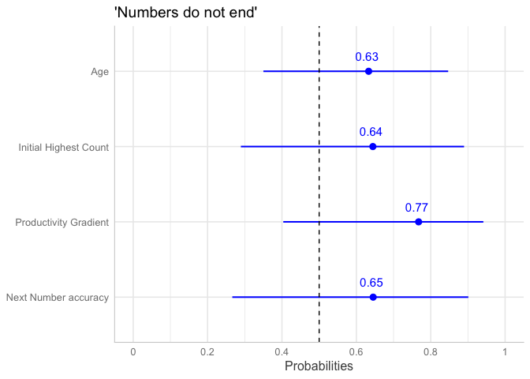<!-- -->

``` r
ggsave("graphs/regression-endless2.png", width = 6, height = 3.5)

# maximal successor model
plot_model(large.successor.full.grad2, type = "std", transform = "plogis", title = "'Can always add one'", 
    show.values = TRUE, colors = "blue", value.offset = 0.2, axis.labels = c(Age.c = "Age", 
        wcnscore.c = "Next Number accuracy", IHC.c = "Initial Highest Count", prod.gradient.c = "Productivity Gradient", 
        Probabilities = "Endorsement Probability")) + ggplot2::geom_hline(yintercept = 0.5, 
    linetype = "dashed")
```

    ## Package `snakecase` needs to be installed for case-conversion.

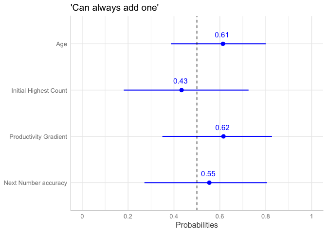<!-- -->

``` r
ggsave("graphs/regression-successor2.png", width = 6, height = 3.5)

# maximal infinity model
plot_model(large.inf.full.grad2, type = "std", transform = "plogis", title = "Full infinity knowledge", 
    show.values = TRUE, colors = "blue", value.offset = 0.2, axis.labels = c(Age.c = "Age", 
        wcnscore.c = "Next Number accuracy", IHC.c = "Initial Highest Count", prod.gradient.c = "Productivity Gradient", 
        Probabilities = "Endorsement Probability")) + ggplot2::geom_hline(yintercept = 0.5, 
    linetype = "dashed")
```

    ## Package `snakecase` needs to be installed for case-conversion.

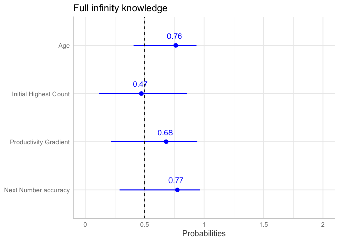<!-- -->

``` r
ggsave("graphs/regression-fullinfinity2.png", width = 6, height = 3.5)
```
