RecursionAnalysis
================
Junyi Chu, Rose M. Schneider, Pierina Cheung
2018-11-20

# Setup

R Version for citation is: R version 3.5.1 (2018-07-02).

## Loading data

``` r
# original data
full.data <- read.csv("data/recursion_full.csv", na.strings = c("", " ", "NA", "NA "))
```

Reasons for exclusion and their
numbers

``` r
full.data %>% dplyr::filter(ExclusionGroup != "include") %>% dplyr::distinct(LadlabID, 
    .keep_all = TRUE) %>% dplyr::group_by(ExclusionGroup) %>% dplyr::summarize(countN = dplyr::n_distinct(LadlabID)) %>% 
    kable()
```

| ExclusionGroup      | countN |
| :------------------ | -----: |
| age                 |      5 |
| dnf infinity        |      4 |
| dnf WCN             |      6 |
| experimenter error  |      3 |
| L1 not english      |      4 |
| parent interference |      1 |
| pilot order         |      3 |

RMS original code for checking who failed practice - do not need to run.
EVAL set to FALSE

``` r
# check how many failed both practice trials
x <- full.data %>% filter(Task == "WCN" & (TaskItem == 1 | TaskItem == 5)) %>% group_by(LadlabID) %>% 
    summarise(sum = sum(Accuracy)) %>% filter(sum != 2)

# just hardcoding kids because it's easier than going back to the full data frame
# These kids got 1 right, 5 wrong:
one.corr <- as.vector(c("012316-BO", "022616-JM", "030216-ED", "030817-ZI", "031516-A", 
    "032216-JH", "032216-RC", "040317-AL", "040317-SL", "041316-AR", "041316-NC", 
    "041316-VN", "062416-MC"))

five.corr <- as.vector("050617-Z1")

zero.corr <- as.vector(c("030216-AD", "040616-K"))
```

Exclude those who failed the practice trials on What Comes Next Task

``` r
# final decision: remove kids who fail 1 trial out of 2 trials, with no
# additional information about whether E reran the failed trial. Removing 8 kids
# in total

# added 022516-ML on 2018-09-03 to the exclusion list. kid had NA data for wcn
# practice trials and 0 correct on test. assume kid failed wcn.

full.data %<>% mutate(ExclusionGroup = ifelse(LadlabID == "022616-JM" | LadlabID == 
    "030216-AD" | LadlabID == "031516-A" | LadlabID == "041316-AR" | LadlabID == 
    "041316-VN" | LadlabID == "032216-RC" | LadlabID == "012316-BO" | LadlabID == 
    "041316-NC" | LadlabID == "022516-ML", "fail wcn", levels(ExclusionGroup)[ExclusionGroup]), 
    ExclusionGroup = as.factor(ExclusionGroup))

# check. good full.data %>% filter(LadlabID == '022616-JM')
```

Let’s remove anyone who should not be included in the final dataset.

``` r
full.data %<>% dplyr::filter(ExclusionGroup == "include")
```

Now, add in the Productivity classification, IHC, and FHC from PC, JC,
and RMS coding

``` r
# productivity, fhc, ihc coding from pc, jc, and rms
hc.data <- read.csv("data/HC-datawide-forcoding - hc.datawide.csv") %>% dplyr::select(LadlabID, 
    prod_tomerge, ihc_tomerge, fhc_tomerge, dce)

full.data <- dplyr::left_join(full.data, hc.data, by = "LadlabID")

full.data %<>% dplyr::rename(Productivity = prod_tomerge, IHC = ihc_tomerge, FHC = fhc_tomerge, 
    DCE = dce) %>% dplyr::mutate(Productivity = factor(Productivity, levels = c("nonprod", 
    "prod"), labels = c("Nonproductive", "Productive")), IHC = ifelse(IHC > 100, 
    100, IHC), FHC = ifelse(FHC > 100, 100, FHC))

# do a quick check to make sure we have the same SIDs in each
unique.full <- as.vector(unique(full.data$LadlabID))
unique.hc <- as.vector(unique(hc.data$LadlabID))

tmp <- hc.data %>% dplyr::filter(LadlabID %!in% unique.full)

# good to go - the only kids who are not included in full data are the ones who
# we excluded
```

Number of kids by age group and average
age

``` r
full.data %>% dplyr::group_by(AgeGroup) %>% dplyr::summarize(sumAge = n_distinct(LadlabID)) %>% 
    kable()
```

| AgeGroup | sumAge |
| :------- | -----: |
| 4-4.5y   |     32 |
| 4.5-5y   |     29 |
| 5-5.5y   |     32 |
| 5.5-6y   |     29 |

``` r
full.data %>% dplyr::distinct(LadlabID, .keep_all = TRUE) %>% dplyr::summarize(minAge = min(Age), 
    maxAge = max(Age), meanAge = mean(Age), sdAge = sd(Age)) %>% kable()
```

| minAge | maxAge |  meanAge |     sdAge |
| -----: | -----: | -------: | --------: |
|      4 |   5.99 | 4.998115 | 0.5713336 |

Number of kids who were classified as decade productive &
nonproductive

``` r
full.data %>% dplyr::distinct(LadlabID, Productivity, Age) %>% dplyr::group_by(Productivity) %>% 
    dplyr::summarise(n = n(), meanage = mean(Age, na.rm = TRUE), sdage = sd(Age, 
        na.rm = TRUE), minage = min(Age, na.rm = TRUE), maxage = max(Age, na.rm = TRUE)) %>% 
    kable()
```

| Productivity  |  n |  meanage |     sdage | minage | maxage |
| :------------ | -: | -------: | --------: | -----: | -----: |
| Nonproductive | 43 | 4.598837 | 0.4192125 |   4.00 |   5.61 |
| Productive    | 79 | 5.215443 | 0.5253760 |   4.05 |   5.99 |

Just for reference, this is the number of kids who switched
classifications from PC, JC, RMS
recode

``` r
full.data %>% dplyr::filter(TaskType == "productivity") %>% droplevels() %>% dplyr::distinct(LadlabID, 
    Response, Productivity) %>% dplyr::mutate(Response = factor(Response, levels = c("nonprod", 
    "prod"), labels = c("Nonproductive", "Productive"))) %>% dplyr::mutate(changed_classification = ifelse((is.na(Response) & 
    Productivity == "Nonproductive"), "NA_toNonprod", ifelse((is.na(Response) & Productivity == 
    "Productive"), "NA_toProd", ifelse((Response == "Nonproductive" & Productivity == 
    "Productive"), "Nonprod_toProd", ifelse((Response == "Productive" & Productivity == 
    "Nonproductive"), "Prod_toNonprod", "no_change"))))) %>% dplyr::group_by(changed_classification) %>% 
    dplyr::summarise(n = n())
```

    ## # A tibble: 4 x 2
    ##   changed_classification     n
    ##   <chr>                  <int>
    ## 1 NA_toNonprod              29
    ## 2 NA_toProd                  7
    ## 3 no_change                 85
    ## 4 Nonprod_toProd             1

## Productivity gradient

``` r
full.data %<>% mutate(delta.hc = FHC - IHC, prod.gradient = delta.hc/(100 - IHC), 
    prod.gradient = ifelse(IHC == 100, 1, as.numeric(prod.gradient)), prod.gradient = ifelse(prod.gradient == 
        0 & IHC == 99, 1, as.numeric(prod.gradient)))
```

-----

# Highest Count Descriptives

Average of IHC, DCE, and FHC for all
kids

``` r
full.data %>% dplyr::distinct(LadlabID, IHC) %>% dplyr::summarise(mean_IHC = mean(IHC), 
    sd_IHC = sd(IHC), min_IHC = min(IHC), max_IHC = max(IHC), median_IHC = median(IHC)) %>% 
    kable()
```

| mean\_IHC |  sd\_IHC | min\_IHC | max\_IHC | median\_IHC |
| --------: | -------: | -------: | -------: | ----------: |
|  50.41803 | 33.80568 |        5 |      100 |        39.5 |

``` r
full.data %>% dplyr::distinct(LadlabID, DCE) %>% dplyr::summarise(mean_DCE = mean(DCE, 
    na.rm = TRUE), sd_DCE = sd(DCE, na.rm = TRUE), min_DCE = min(DCE, na.rm = TRUE), 
    max_DCE = max(DCE, na.rm = TRUE), median_DCE = median(DCE, na.rm = TRUE)) %>% 
    kable()
```

| mean\_DCE |  sd\_DCE | min\_DCE | max\_DCE | median\_DCE |
| --------: | -------: | -------: | -------: | ----------: |
|  43.80769 | 17.54438 |       19 |       99 |          44 |

``` r
full.data %>% dplyr::distinct(LadlabID, FHC) %>% dplyr::summarise(mean_FHC = mean(FHC), 
    sd_FHC = sd(FHC), min_FHC = min(FHC), max_FHC = max(FHC), median_FHC = median(FHC)) %>% 
    kable()
```

| mean\_FHC |  sd\_FHC | min\_FHC | max\_FHC | median\_FHC |
| --------: | -------: | -------: | -------: | ----------: |
|  71.55738 | 34.64532 |        5 |      100 |          99 |

``` r
# productivity gradient
full.data %>% distinct(LadlabID, delta.hc, prod.gradient) %>% summarise(mean_gradient = mean(prod.gradient), 
    sd_gradient = sd(prod.gradient), mean_delta.hc = mean(delta.hc), sd_delta.hc = sd(delta.hc)) %>% 
    kable()
```

| mean\_gradient | sd\_gradient | mean\_delta.hc | sd\_delta.hc |
| -------------: | -----------: | -------------: | -----------: |
|      0.6267619 |      0.44344 |       21.13934 |      25.5331 |

Similar data by decade
productivity

``` r
full.data %>% dplyr::distinct(LadlabID, Productivity, IHC) %>% dplyr::group_by(Productivity) %>% 
    dplyr::summarise(mean_IHC = mean(IHC), sd_IHC = sd(IHC), min_IHC = min(IHC), 
        max_IHC = max(IHC), median_IHC = median(IHC)) %>% kable()
```

| Productivity  | mean\_IHC |  sd\_IHC | min\_IHC | max\_IHC | median\_IHC |
| :------------ | --------: | -------: | -------: | -------: | ----------: |
| Nonproductive |  23.76744 | 15.20156 |        5 |       77 |          18 |
| Productive    |  64.92405 | 32.30693 |       12 |      100 |          59 |

``` r
full.data %>% dplyr::distinct(LadlabID, Productivity, DCE) %>% dplyr::group_by(Productivity) %>% 
    dplyr::summarise(mean_DCE = mean(DCE, na.rm = TRUE), sd_DCE = sd(DCE, na.rm = TRUE), 
        min_DCE = min(DCE, na.rm = TRUE), max_DCE = max(DCE, na.rm = TRUE), median_DCE = median(DCE, 
            na.rm = TRUE)) %>% kable()
```

| Productivity  | mean\_DCE |   sd\_DCE | min\_DCE | max\_DCE | median\_DCE |
| :------------ | --------: | --------: | -------: | -------: | ----------: |
| Nonproductive |  29.62500 |  8.539126 |       19 |       49 |          29 |
| Productive    |  50.11111 | 16.865481 |       19 |       99 |          49 |

``` r
full.data %>% dplyr::distinct(LadlabID, Productivity, FHC) %>% dplyr::group_by(Productivity) %>% 
    dplyr::summarise(mean_FHC = mean(FHC), sd_FHC = sd(FHC), min_FHC = min(FHC), 
        max_FHC = max(FHC), median_FHC = median(FHC)) %>% kable()
```

| Productivity  | mean\_FHC |  sd\_FHC | min\_FHC | max\_FHC | median\_FHC |
| :------------ | --------: | -------: | -------: | -------: | ----------: |
| Nonproductive |  29.13953 | 14.46438 |        5 |       77 |          29 |
| Productive    |  94.64557 | 14.74922 |       38 |      100 |         100 |

``` r
# productivity gradient
full.data %>% distinct(LadlabID, Productivity, delta.hc, prod.gradient) %>% group_by(Productivity) %>% 
    summarise(mean_gradient = mean(prod.gradient), sd_gradient = sd(prod.gradient), 
        mean_delta.hc = mean(delta.hc), sd_delta.hc = sd(delta.hc)) %>% kable()
```

| Productivity  | mean\_gradient | sd\_gradient | mean\_delta.hc | sd\_delta.hc |
| :------------ | -------------: | -----------: | -------------: | -----------: |
| Nonproductive |      0.0651454 |    0.0864379 |       5.372093 |     7.240834 |
| Productive    |      0.9324518 |    0.1802594 |      29.721519 |    27.775167 |

Plotting distribution of IHC, as a function of productivity (\~ junyi’s
graph)

``` r
unique.hc.data <- full.data %>% dplyr::distinct(LadlabID, Gender, Age, AgeGroup, 
    HCReceivedSupport, IHC, DCE, FHC, Productivity)

ggplot(unique.hc.data, aes(x = IHC, color = Productivity)) + geom_dotplot(aes(fill = Productivity), 
    binwidth = 1, stackgroups = TRUE, binpositions = "all", method = "dotdensity", 
    dotsize = 1) + scale_color_brewer(palette = "Set1") + scale_fill_brewer(palette = "Set1") + 
    coord_fixed(ratio = 1) + scale_y_continuous(breaks = seq(0, 40, 10), lim = c(0, 
    35)) + scale_x_continuous(breaks = seq(0, 100, by = 10)) + labs(x = "IHC", y = "Frequency") + 
    theme_bw(base_size = 13) + theme(legend.position = "bottom", legend.title = element_blank(), 
    panel.grid.minor = element_blank())
```

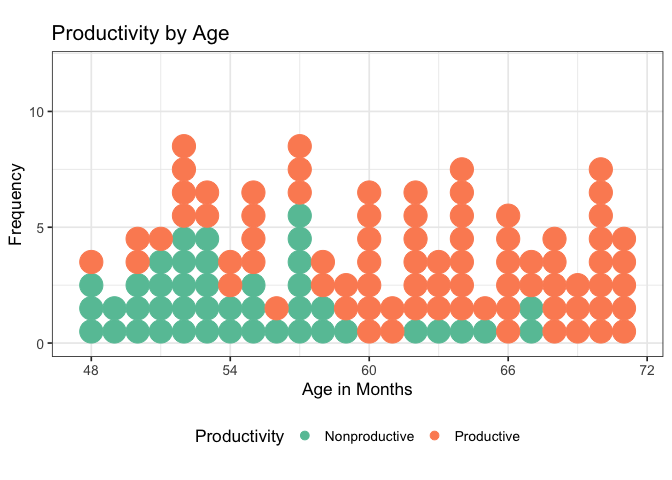<!-- -->

``` r
ggsave("graphs/ihc-by-prod.png")
```

    ## Saving 7 x 5 in image

``` r
# hist(unique.hc.data$IHC)

# trying with bars, doesn't look better ggplot(unique.hc.data, aes(x=IHC,
# fill=Productivity)) + geom_histogram(binwidth = 1, colour = 'black') +
# scale_fill_brewer(palette='Set1') + coord_fixed(ratio=1) + #
# scale_y_continuous(breaks=seq(0,40,10), lim=c(0,35)) +
# scale_x_continuous(breaks=seq(0,100,by=10)) + labs(x='IHC', y='Frequency') +
# theme_bw(base_size = 13) + theme(legend.position='bottom', legend.title =
# element_blank(), panel.grid.minor = element_blank())
# ggsave('graphs/ihc-by-prod.png') # hist(unique.hc.data$IHC)
```

Plotting productivity as a function of age in months

``` r
unique.hc.data$AgeMonths = floor(unique.hc.data$Age * 12)

ggplot(unique.hc.data, aes(x = AgeMonths, colour = Productivity)) + geom_dotplot(aes(fill = Productivity), 
    binwidth = 1, stackgroups = TRUE, binpositions = "all") + coord_fixed(ratio = 1) + 
    scale_y_continuous(breaks = seq(0, 10, 5), lim = c(0, 12)) + scale_x_continuous(breaks = seq(48, 
    72, by = 6)) + scale_color_brewer(palette = "Set1") + scale_fill_brewer(palette = "Set1") + 
    labs(x = "Age in Months", y = "Frequency") + theme_bw(base_size = 13) + theme(legend.position = "bottom")
```

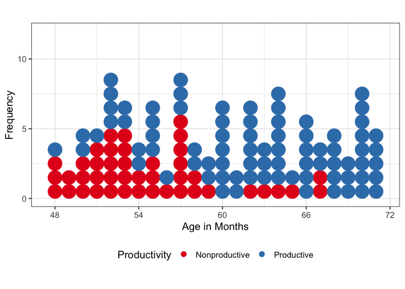<!-- -->

``` r
ggsave("graphs/prod-by-age.png")
```

    ## Saving 7 x 5 in image

## Distance between IHC and FHC

Restructure data to plot distance between IHC, DCE, and
FHC

``` r
hc.dev.data <- full.data %>% dplyr::select(LadlabID, Age, Productivity, IHC, DCE, 
    FHC, prod.gradient) %>% gather(hcprogression, hc, IHC:FHC) %>% mutate(hcprogression = factor(hcprogression, 
    levels = c("IHC", "DCE", "FHC"))) %>% dplyr::rename(`Highest Count Coding` = hcprogression)

# all kids together
ggplot(hc.dev.data, aes(x = LadlabID, y = hc)) + facet_grid(rows = vars(Productivity)) + 
    geom_line(data = hc.dev.data[!is.na(hc.dev.data$hc), ]) + geom_point(aes(shape = `Highest Count Coding`, 
    colour = `Highest Count Coding`), size = 2, stroke = 1.5) + scale_color_brewer(palette = "Dark2") + 
    scale_shape_manual(values = c(4, 5, 20)) + labs(title = "Highest Count Progression by Decade Productivity", 
    x = "Each line = individual participant", y = "Highest Count by Count Type") + 
    theme_bw(base_size = 13) + theme(legend.position = "bottom", axis.text.x = element_text(angle = 270, 
    hjust = 1)) + theme(axis.text.x = element_blank(), axis.ticks.x = element_blank())
```

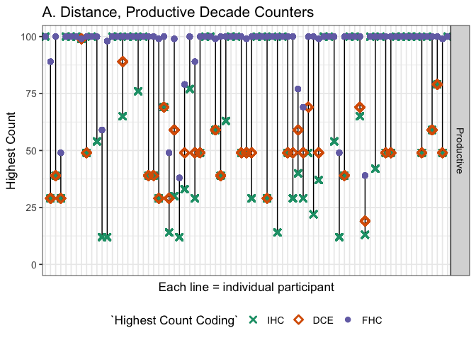<!-- -->

``` r
hc.dev.prod <- subset(hc.dev.data, Productivity == "Productive")
hc.dev.nonprod <- subset(hc.dev.data, Productivity == "Nonproductive")
```

Separate graphs for productivity groups (for easier viewing)

Separate graphs for productivity groups, sorted by ascending IHC

``` r
# productive
ggplot(hc.dev.prod, aes(x = reorder(LadlabID, hc, FUN = min), y = hc)) + facet_grid(rows = vars(Productivity)) + 
    geom_line(data = hc.dev.prod[!is.na(hc.dev.prod$hc), ]) + geom_point(aes(shape = `Highest Count Coding`, 
    colour = `Highest Count Coding`), size = 2, stroke = 1.5) + scale_color_brewer(palette = "Dark2") + 
    scale_shape_manual(values = c(4, 5, 20)) + ylim(0, 100) + labs(x = "Each line = individual participant", 
    y = "Highest Count") + theme_bw(base_size = 13) + theme(legend.position = "bottom", 
    axis.text.x = element_text(angle = 270, hjust = 1)) + theme(axis.text.x = element_blank(), 
    axis.ticks.x = element_blank())
```

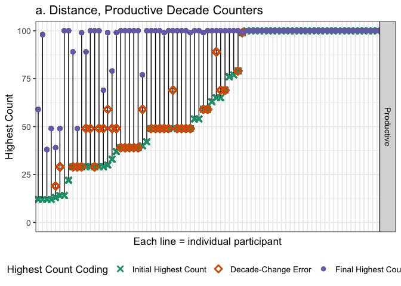<!-- -->

``` r
ggsave("graphs/distance-prod-sorted.png")
```

    ## Saving 7 x 5 in image

``` r
# nonproductive
ggplot(hc.dev.nonprod, aes(x = reorder(LadlabID, hc, FUN = min), y = hc)) + facet_grid(rows = vars(Productivity)) + 
    geom_line(data = hc.dev.nonprod[!is.na(hc.dev.nonprod$hc), ]) + geom_point(aes(shape = `Highest Count Coding`, 
    colour = `Highest Count Coding`), size = 2, stroke = 1.5) + scale_color_brewer(palette = "Dark2") + 
    scale_shape_manual(values = c(4, 5, 20)) + ylim(0, 100) + labs(x = "Each line = individual participant", 
    y = "Highest Count") + theme_bw(base_size = 13) + theme(legend.position = "bottom", 
    axis.text.x = element_text(angle = 270, hjust = 1)) + theme(axis.text.x = element_blank(), 
    axis.ticks.x = element_blank())
```

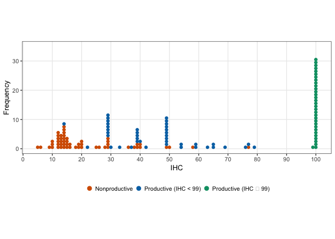<!-- -->

``` r
ggsave("graphs/distance-nonprod-sorted.png")
```

    ## Saving 7 x 5 in image

Number of kids who counted to 99+ spontaneously on IHC plus those whose
FHC = 99+ without prompting

``` r
# full.data %>% filter(IHC > 98) %>% distinct(LadlabID, IHC, FHC,
# HCReceivedSupport) %>% count() #n=32 but some kids made errors past IHC but < 3
# so need to account for that
full.data %>% filter(FHC > 98 & (is.na(HCReceivedSupport) | HCReceivedSupport != 
    1)) %>% distinct(LadlabID, IHC, FHC, HCReceivedSupport) %>% count()  #n =42
```

    ## # A tibble: 1 x 1
    ##       n
    ##   <int>
    ## 1    42

## Decade prompts

Average number of decade prompts provided. Productive counters
first

``` r
full.data %>% filter(TaskItem == "times") %>% filter(Productivity == "Productive") %>% 
    distinct(LadlabID, HCReceivedSupport, TaskItem, Response) %>% mutate(Response = as.numeric(levels(Response)[Response])) %>% 
    group_by(HCReceivedSupport) %>% summarize(mean = mean(Response, na.rm = TRUE), 
    sd = sd(Response, na.rm = TRUE), min = min(Response, na.rm = TRUE), max = max(Response, 
        na.rm = TRUE), count = n())
```

    ## # A tibble: 3 x 6
    ##   HCReceivedSupport   mean     sd   min   max count
    ##   <fct>              <dbl>  <dbl> <dbl> <dbl> <int>
    ## 1 0                   2     NA        2     2    37
    ## 2 1                   3.32   1.73     1     7    37
    ## 3 <NA>              NaN    NaN      Inf  -Inf     5

``` r
# assume 0 = NA error in supported.times coding, should only count to 90 but one
# kid got prompted with 100 and 110 and times should be 0
```

Then nonproductive
counters.

``` r
full.data %>% filter(TaskItem == "times") %>% filter(Productivity == "Nonproductive") %>% 
    distinct(LadlabID, HCReceivedSupport, TaskItem, Response) %>% mutate(Response = as.numeric(levels(Response)[Response])) %>% 
    group_by(HCReceivedSupport) %>% summarize(mean = mean(Response, na.rm = TRUE), 
    sd = sd(Response, na.rm = TRUE), min = min(Response, na.rm = TRUE), max = max(Response, 
        na.rm = TRUE), count = n())
```

    ## # A tibble: 2 x 6
    ##   HCReceivedSupport  mean    sd   min   max count
    ##   <fct>             <dbl> <dbl> <dbl> <dbl> <int>
    ## 1 0                  1.33 0.577     1     2    29
    ## 2 1                  1.29 0.469     1     2    14

``` r
# assume 0 = NA error in supported.times coding, should only count to 90 but one
# kid got prompted with 100 and 110 and times should be 0
```

# What Comes Next Descriptives

<span style="color:red">Note minimum highest contig NN can be 5 (one of
the practice trials). Practice trials are excluded from %corr and within
vs. beyond computation.</span>

First check if Accuracy column in full.data is coded correctly. Good to
go.

``` r
wcn.data <- full.data %>% filter(Task == "WCN")

wcn.data %<>% mutate(Response_num = as.numeric(as.character(Response)), TaskItem_num = as.numeric(as.character(TaskItem)), 
    Accuracy_check = ifelse(Response_num == (TaskItem_num + 1), 1, 0), Accuracy_valid = ifelse(Accuracy == 
        Accuracy_check, TRUE, FALSE))

validate <- function() {
    validation <- wcn.data %>% filter(Accuracy_valid == FALSE)
    if (length(validation$LadlabID) > 0) {
        print("WARNING: CHECK CODING")
    } else {
        print("All coding correct")
    }
}

validate()
```

    ## [1] "All coding correct"

Immediate vs. Momentum trials: Children were provided with momentum
trials if they got wrong on immediate trials. Check %trials where
immediate = wrong, momentum = right

``` r
wcn.wide <- full.data %>%
  filter(ExclusionGroup == "include") %>%
  filter(Task == "WCN") %>%
  filter(TaskType != "practice") %>%
  filter(TaskItem != 3) %>% # a trial on 3 for momentum that doesn't exist for immediate
  droplevels()%>%
  dplyr::select(LadlabID, Age, AgeGroup, TaskType, TaskItem, Accuracy, Productivity, prod.gradient) %>%
  spread(TaskType, Accuracy)

# data check: some kids got 1 for immediate but 0 for momentum or 1 for immediate and 1 for momentum (N = 5).Keeping them. 
## for reference, pulling out these kids below
full.data %>%
  filter(Task == "WCN", 
         TaskType == "momentum" | TaskType == "immediate")%>%
  dplyr::select(LadlabID, Age, AgeGroup, TaskType, TaskItem, Accuracy) %>%
  spread(TaskType, Accuracy)%>%
  mutate(issue_immediate1Momentum0 = ifelse(immediate == 1 & momentum == 0, TRUE, FALSE), 
         issue_immediate1Momentum1 = ifelse(immediate == 1 & momentum == 1, TRUE, FALSE))%>%
  filter(issue_immediate1Momentum0 == TRUE | 
           issue_immediate1Momentum1 == TRUE)
```

    ##    LadlabID  Age AgeGroup TaskItem immediate momentum
    ## 1 011216-WB 4.44   4-4.5y       59         1        1
    ## 2 022616-AG 4.32   4-4.5y       37         1        1
    ## 3 031616-RP 4.84   4.5-5y       23         1        1
    ## 4 041316-CC 4.36   4-4.5y       62         1        0
    ## 5 111117-VK 5.87   5.5-6y       29         1        1
    ##   issue_immediate1Momentum0 issue_immediate1Momentum1
    ## 1                     FALSE                      TRUE
    ## 2                     FALSE                      TRUE
    ## 3                     FALSE                      TRUE
    ## 4                      TRUE                     FALSE
    ## 5                     FALSE                      TRUE

``` r
# how many kids show improved performance
xtabs(~immediate + momentum, data = wcn.wide, na.action = na.pass, exclude = NULL)
```

    ##          momentum
    ## immediate   0   1 <NA>
    ##      0    263 174   13
    ##      1      1   4  520
    ##      <NA>   1   0    0

``` r
# 191 / 1048 trials = ~ 18%. NOTE % not by kids but by trials.
```

Percent Correct on
WCN

``` r
wcn.data %>% dplyr::filter(TaskType == "immediate") %>% dplyr::group_by(LadlabID) %>% 
    dplyr::summarize(avg.wcn = mean(Accuracy, na.rm = TRUE), sd.wcn = sd(Accuracy, 
        na.rm = TRUE)) %>% dplyr::summarize(avg = mean(avg.wcn), sd = sd(sd.wcn))
```

    ## # A tibble: 1 x 2
    ##     avg    sd
    ##   <dbl> <dbl>
    ## 1 0.538 0.215

``` r
wcn.data %>% dplyr::filter(TaskType == "immediate") %>% dplyr::group_by(LadlabID, 
    Productivity) %>% dplyr::summarize(avg.wcn = mean(Accuracy, na.rm = TRUE), sd.wcn = sd(Accuracy, 
    na.rm = TRUE)) %>% dplyr::group_by(Productivity) %>% dplyr::summarize(avg = mean(avg.wcn), 
    sd = sd(sd.wcn))
```

    ## # A tibble: 2 x 3
    ##   Productivity    avg    sd
    ##   <fct>         <dbl> <dbl>
    ## 1 Nonproductive 0.265 0.216
    ## 2 Productive    0.687 0.215

Plotting %corr on WCN as function of
productivity

``` r
wcn.data %>% dplyr::filter(TaskType == "immediate") %>% dplyr::group_by(LadlabID, 
    Productivity, prod.gradient) %>% dplyr::summarize(avg.wcn = mean(Accuracy, na.rm = TRUE), 
    sd.wcn = sd(Accuracy, na.rm = TRUE)) %>% ggplot(aes(x = Productivity, y = avg.wcn, 
    fill = factor(Productivity))) + stat_summary(fun.y = mean, position = position_dodge(width = 0.95), 
    geom = "bar", alpha = 0.8, colour = "black") + geom_violin(alpha = 0.3) + stat_summary(fun.data = mean_se, 
    geom = "errorbar", position = position_dodge(width = 0.9), width = 0.2) + # scale_fill_discrete(name = 'Productivity') +
scale_fill_brewer(name = "Productivity", palette = "Set1", guide = "none") + scale_colour_brewer(palette = "Greys") + 
    ylab("Proportion Correct") + xlab("Productivity") + theme_bw(base_size = 13) + 
    theme(legend.position = "none", panel.grid.major = element_blank(), panel.grid.minor = element_blank()) + 
    theme(text = element_text(size = 12)) + ylim(0, 1)
```

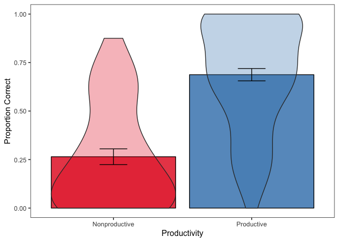<!-- -->

``` r
ggsave("graphs/wcn-percentcorr.png")
```

    ## Saving 7 x 5 in image

Add whether the Task Item was within or outside of the kid’s initial
highest
count.

``` r
# first, get initial highest count for each kiddo Make a lookup table with SID
# and initial highest count
lookup <- full.data %>% distinct(LadlabID, IHC)

wcn.data %<>% dplyr::mutate(TaskItem = as.numeric(as.character(TaskItem)))

# This is a function that, for each trial, checks the number queried. If number
# queried is above the child's initial highest count, marks that trial as beyond
# count range.
determine_count_range <- function(df) {
    tmp <- df
    for (row in 1:nrow(tmp)) {
        sub = as.character(tmp[row, "LadlabID"])
        count_range = as.numeric(as.character(subset(lookup, LadlabID == sub)$IHC))
        tmp[row, "IHC"] = as.numeric(as.character(count_range))
        if (tmp[row, "TaskItem"] > count_range) {
            tmp[row, "WithinOutsideIHC"] = "outside"
        } else {
            tmp[row, "WithinOutsideIHC"] = "within"
        }
    }
    return(tmp)
}

# Run for wcn
wcn.data <- determine_count_range(wcn.data)
```

WCN accuracy, within and outside of
IHC

``` r
wcn.data %>% dplyr::filter(TaskType == "immediate") %>% dplyr::group_by(WithinOutsideIHC) %>% 
    dplyr::summarize(mean = mean(Accuracy, na.rm = TRUE), sd = sd(Accuracy, na.rm = TRUE))
```

    ## # A tibble: 2 x 3
    ##   WithinOutsideIHC  mean    sd
    ##   <chr>            <dbl> <dbl>
    ## 1 outside          0.342 0.475
    ## 2 within           0.764 0.425

Now WCN by within/outside count range and
productivity

``` r
wcn.data %>% dplyr::filter(TaskType == "immediate") %>% dplyr::group_by(Productivity, 
    WithinOutsideIHC) %>% dplyr::summarize(mean = mean(Accuracy, na.rm = TRUE), sd = sd(Accuracy, 
    na.rm = TRUE))
```

    ## # A tibble: 4 x 4
    ## # Groups:   Productivity [?]
    ##   Productivity  WithinOutsideIHC  mean    sd
    ##   <fct>         <chr>            <dbl> <dbl>
    ## 1 Nonproductive outside          0.207 0.406
    ## 2 Nonproductive within           0.612 0.492
    ## 3 Productive    outside          0.518 0.501
    ## 4 Productive    within           0.783 0.413

Plotting WCN as within vs. beyond by productivity

``` r
wcn.data %>%
  mutate(WithinOutsideIHC = factor(WithinOutsideIHC, levels = c("within", "outside"), 
                                   labels = c("Within", "Outside")))%>%
  dplyr::filter(TaskType == "immediate") %>%
  dplyr::group_by(Productivity, WithinOutsideIHC, LadlabID) %>%
  dplyr::summarize(meansubj = mean(Accuracy, na.rm = TRUE)) %>%
  ggplot(aes(x=WithinOutsideIHC, y=meansubj, color=Productivity)) +
  stat_summary(fun.data = mean_cl_boot, geom="pointrange",
               #position = position_dodge(width=0.90), 
               width = 0.2) +
  scale_color_brewer(name = "Productivity", palette="Set1") +
  scale_y_continuous(lim=c(0,1)) +
  labs(y="Proportion Correct", 
       fill="Productivity") +
  theme_bw() +
  theme(text = element_text(size = 12))
```

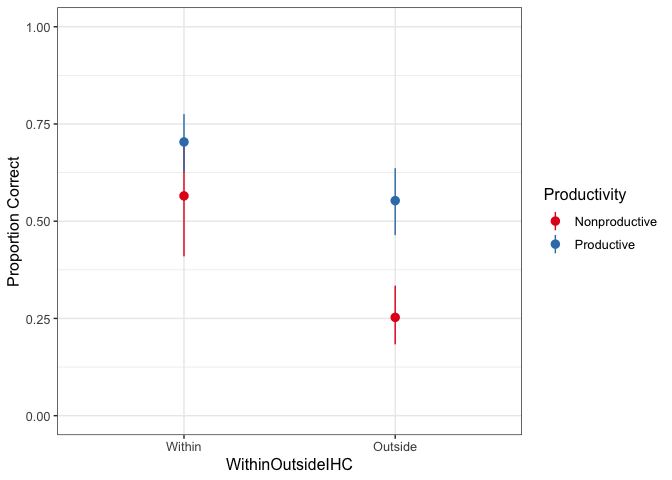<!-- -->

``` r
ggsave('graphs/wcn-within-beyond.png')
```

    ## Saving 7 x 5 in image

``` r
prod.pal.1 <- c("#880f10","#214B6E")

# alternative
wcn.data %>%
  mutate(WithinOutsideIHC = factor(WithinOutsideIHC, levels = c("within", "outside"), 
                                   labels = c("Within", "Outside")))%>%
  dplyr::filter(TaskType == "immediate") %>%
  dplyr::group_by(Productivity, WithinOutsideIHC, LadlabID, prod.gradient) %>%
  dplyr::summarize(meansubj = mean(Accuracy, na.rm = TRUE)) %>%
  ggplot(aes(x=Productivity, y=meansubj, fill=WithinOutsideIHC)) +
  geom_violin(alpha=0.7, scale="count", position=position_dodge(width=0.8)) +
  geom_point(aes(colour = Productivity), position=position_jitterdodge(jitter.width=0.25, 
                                                                       jitter.height = .1, 
                                                                       dodge.width=.9), 
             alpha = .7) +
  stat_summary(fun.y = mean,position = position_dodge(width=0.8), 
               geom="point", shape=23, size=3, colour = "black") +
  stat_summary(fun.data = mean_cl_boot, geom="errorbar",
               position = position_dodge(width=0.8), width = 0.2) +  
  scale_fill_brewer(name = "Trial Type", palette="Dark2",direction=-1) +
  scale_colour_manual(values = prod.pal.1, guide = "none") + 
  scale_y_continuous(limits=c(0,1)) +
  labs(y="Average Proportion Correct", x="",
       fill="Trial Type") +
  theme_bw(base_size = 13) +
  theme(panel.grid.major = element_blank(), 
        panel.grid.minor = element_blank())
```

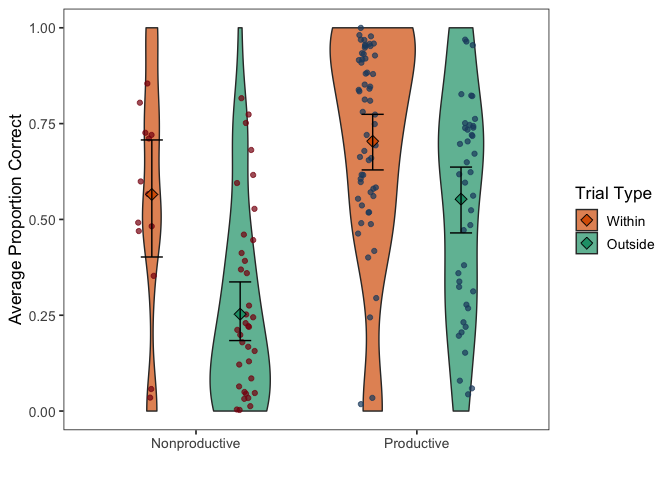<!-- -->

``` r
ggsave('graphs/wcn-within-beyond2.png', width=6, height=4)

# alternative 2
wcn.data %>%
  mutate(WithinOutsideIHC = factor(WithinOutsideIHC, levels = c("within", "outside"), 
                                   labels = c("Within", "Outside")))%>%
  dplyr::filter(TaskType == "immediate") %>%
  dplyr::group_by(Productivity, WithinOutsideIHC, LadlabID, prod.gradient) %>%
  dplyr::summarize(meansubj = mean(Accuracy, na.rm = TRUE)) %>%
  ggplot(aes(x=WithinOutsideIHC, y=meansubj)) +
  geom_violin(alpha=0.7, scale="count", position=position_dodge(width=0.8)) +
  geom_point(aes(colour = Productivity), position=position_jitterdodge(jitter.width=0.25,
                                                                       #jitter.height = .1,
                                                                       dodge.width=.9),
             alpha = .7) +
  facet_grid(.~Productivity) +
  stat_summary(fun.data = mean_cl_boot, geom="crossbar",
               position = position_dodge(width=0.8), width = 0.5, shape=23) +  
  stat_summary(fun.y = mean,position = position_dodge(width=0.8), 
               geom="point", shape=23, size=5, colour = "black") +
#  scale_fill_brewer(name = "Trial Type", palette="Set1", direction=-1) +
  scale_colour_brewer(name = NULL, palette="Set1", direction=-1) + 
  scale_y_continuous(limits=c(0,1)) +
  labs(y="Average Proportion Correct", x="Trial Type",
       fill="Trial Type") +
  theme_bw(base_size = 13) +
  theme(panel.grid.major = element_blank(), 
        panel.grid.minor = element_blank())
```

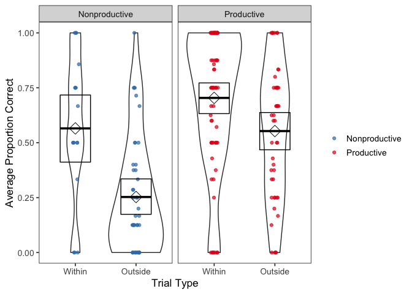<!-- -->

``` r
ggsave('graphs/wcn-within-beyond3.png', width=6, height=4)
```

Analysis of WCN accuracy by productivity and trial type

``` r
# wcn_score.df <- wcn.data %>%
#   dplyr::filter(TaskType == "immediate") %>%
#   dplyr::group_by(LadlabID, Productivity, TrialType=as.factor(WithinOutsideIHC)) %>%
#   dplyr::summarize(correct = sum(Accuracy, na.rm = TRUE), total=n())
# 
wcn_model.df <- wcn.data %>%
  filter(TaskType == "immediate")%>%
  mutate(IHC = as.integer(IHC),
         LadlabID = factor(LadlabID))%>%
  mutate(IHC.c = as.vector(scale(IHC, center = TRUE, scale=TRUE)), #scale and center for model fit
         FHC.c = as.vector(scale(FHC, center = TRUE, scale=TRUE)), 
         age.c = as.vector(scale(Age, center = TRUE, scale=TRUE)))

##WCN model looking at interaction between productivity and trial type in WCN task
wcn.model.base <- glmer(Accuracy ~ age.c + (1|TaskItem) + (1|LadlabID), 
                        family = "binomial", data = wcn_model.df)
wcn.model.ihc <- glmer(Accuracy ~ IHC.c + age.c + (1|TaskItem) + (1|LadlabID), 
                       family = "binomial", data = wcn_model.df)
wcn.model.noint <- glmer(Accuracy ~ Productivity + WithinOutsideIHC + IHC.c + age.c + (1|TaskItem) +
                     (1|LadlabID), family = "binomial", data = wcn_model.df)
wcn.model.int <- glmer(Accuracy ~ Productivity+ WithinOutsideIHC + 
                         Productivity:WithinOutsideIHC + IHC.c + age.c + (1|TaskItem) +
                     (1|LadlabID), family = "binomial", data = wcn_model.df)

#comparison of models
anova(wcn.model.int, wcn.model.noint, wcn.model.ihc, wcn.model.base, test = 'LRT')
```

    ## Data: wcn_model.df
    ## Models:
    ## wcn.model.base: Accuracy ~ age.c + (1 | TaskItem) + (1 | LadlabID)
    ## wcn.model.ihc: Accuracy ~ IHC.c + age.c + (1 | TaskItem) + (1 | LadlabID)
    ## wcn.model.noint: Accuracy ~ Productivity + WithinOutsideIHC + IHC.c + age.c + 
    ## wcn.model.noint:     (1 | TaskItem) + (1 | LadlabID)
    ## wcn.model.int: Accuracy ~ Productivity + WithinOutsideIHC + Productivity:WithinOutsideIHC + 
    ## wcn.model.int:     IHC.c + age.c + (1 | TaskItem) + (1 | LadlabID)
    ##                 Df    AIC     BIC  logLik deviance   Chisq Chi Df
    ## wcn.model.base   4 992.28 1011.81 -492.14   984.28               
    ## wcn.model.ihc    5 910.10  934.51 -450.05   900.10 84.1798      1
    ## wcn.model.noint  7 906.54  940.71 -446.27   892.54  7.5610      2
    ## wcn.model.int    8 903.49  942.55 -443.75   887.49  5.0455      1
    ##                 Pr(>Chisq)    
    ## wcn.model.base                
    ## wcn.model.ihc      < 2e-16 ***
    ## wcn.model.noint    0.02281 *  
    ## wcn.model.int      0.02469 *  
    ## ---
    ## Signif. codes:  0 '***' 0.001 '**' 0.01 '*' 0.05 '.' 0.1 ' ' 1

How many trials do kids have beyond their
IHC?

``` r
wcn.data %>% dplyr::filter(TaskType == "immediate") %>% dplyr::group_by(Productivity, 
    WithinOutsideIHC) %>% dplyr::summarise(n = n())
```

    ## # A tibble: 4 x 3
    ## # Groups:   Productivity [?]
    ##   Productivity  WithinOutsideIHC     n
    ##   <fct>         <chr>            <int>
    ## 1 Nonproductive outside            295
    ## 2 Nonproductive within              49
    ## 3 Productive    outside            227
    ## 4 Productive    within             405

## Highest contiguous NN

``` r
wcn.wide %<>% dplyr::mutate(TaskItem = as.numeric(as.character(TaskItem)))

unique.nn <- as.vector(unique(wcn.wide$LadlabID))
# get the task items from wcn
nextnums <- as.vector(unique(wcn.wide$TaskItem))

# this is a function that pulls out the largest number for which a participant
# had a correct consecutive
get_contiguous <- function() {
    contig <- data.frame()
    for (sub in unique.nn) {
        tmp <- wcn.wide %>% dplyr::select(LadlabID, Age, AgeGroup, TaskItem, immediate) %>% 
            filter(LadlabID == sub, immediate == 0) %>% mutate(TaskItem = sort(TaskItem))
        if (length(tmp$LadlabID) == 0) {
            highest_contig = 86
            sub_contig <- data.frame(sub, highest_contig)
            contig <- bind_rows(contig, sub_contig)
        } else if (length(tmp$TaskItem) > 0 & min(tmp$TaskItem) == 23) {
            # if(sub %in% one.corr){
            highest_contig = 5
            sub_contig <- data.frame(sub, highest_contig)
            contig <- bind_rows(contig, sub_contig)
            # } else if(sub %in% five.corr | sub %in% zero.corr){ highest_contig = 0
            # sub_contig <- data.frame(sub, highest_contig) contig <- bind_rows(contig,
            # sub_contig) } else { highest_contig = 5 sub_contig <- data.frame(sub,
            # highest_contig) contig <- bind_rows(contig, sub_contig) }
        } else {
            min.nn <- min(tmp$TaskItem)
            prev_correct <- nextnums[nextnums < min.nn]
            highest_contig <- max(prev_correct)
            
            sub_contig <- data.frame(sub, highest_contig)
            contig <- bind_rows(contig, sub_contig)
        }
    }
    return(contig)
}

highest_contiguous_nn <- get_contiguous() %>% dplyr::rename(LadlabID = sub) %>% distinct(LadlabID, 
    highest_contig) %>% dplyr::rename(Highest_Contig_NN = highest_contig)

# add highest contiguous to wcn.data
wcn.data <- full_join(wcn.data, highest_contiguous_nn, by = "LadlabID")
```

Code for checking highest contig NN

``` r
full.data %>% # filter(LadlabID == '022316-AB') %>%
filter(TaskType == "immediate" | TaskType == "practice") %>% dplyr::select(LadlabID, 
    TaskType, TaskItem, Accuracy)

# these two kids, for example, had the same contig highest NN but diff profile of
# responses 040317-KK #7 correct out of 10 022316-AB #9 correct out of 10


# wcn.data %<>% dplyr::right_join(highest_contiguous_nn) wcn.data %>%
# filter(LadlabID == '040317-KK')
```

See if highest contiguous next number underestimates kids’ knowledge.
Seems to correspond well with \# correct data.

``` r
wcn.data %>%
  dplyr::filter(TaskType == "immediate"|TaskType == "practice") %>% #added prac for 1&5
  dplyr::group_by(LadlabID, Highest_Contig_NN) %>%
  dplyr::summarize(n_corr = sum(Accuracy, na.rm = TRUE)) %>%
  dplyr::group_by(Highest_Contig_NN, n_corr) %>%
  dplyr::summarize(n_participants = n_distinct(LadlabID)) %>%
  tidyr::spread(n_corr, n_participants) %>%
  kable()
```

| Highest\_Contig\_NN |  1 |  2 |  3 |  4 |  5 |  6 |  7 |  8 |  9 | 10 |
| ------------------: | -: | -: | -: | -: | -: | -: | -: | -: | -: | -: |
|                   5 |  1 | 13 | 11 |  7 | NA |  2 |  2 | NA | NA | NA |
|                  23 | NA |  2 |  2 |  6 |  7 |  4 | 14 |  7 |  1 | NA |
|                  29 | NA | NA | NA | NA | NA | NA |  1 |  3 | NA | NA |
|                  37 | NA | NA | NA | NA | NA |  1 |  1 |  3 |  2 | NA |
|                  40 | NA | NA | NA | NA | NA | NA |  1 |  3 |  4 | NA |
|                  62 | NA | NA | NA | NA | NA | NA | NA | NA |  2 | NA |
|                  70 | NA | NA | NA | NA | NA | NA | NA | NA |  1 | NA |
|                  86 | NA | NA | NA | NA | NA | NA | NA | NA | NA | 21 |

``` r
# 2 kids had NA as n_corr
wcn.data %>%
  dplyr::filter(TaskType == "immediate"|TaskType == "practice") %>% #added prac for 1&5
  dplyr::group_by(LadlabID, Highest_Contig_NN) %>%
  dplyr::summarize(n_corr = sum(Accuracy)) %>%
  dplyr::group_by(Highest_Contig_NN, n_corr) %>%
  filter(is.na(n_corr))
```

    ## # A tibble: 1 x 3
    ## # Groups:   Highest_Contig_NN, n_corr [1]
    ##   LadlabID  Highest_Contig_NN n_corr
    ##   <chr>                 <dbl>  <int>
    ## 1 040317-SL                23     NA

``` r
# 022516-ML
# 040317-SL

# this kid (ML) got 0 for all test and NA for 1 and 5. Not one of the two kids under zero.corr because kid's sum is NA. Now excluded up top.

# commentout
# full.data %>%
#   filter(LadlabID == "022516-ML") %>%
#   filter(TaskType == "immediate"|TaskType == "practice") %>%
#   select(LadlabID, TaskType, TaskItem, Accuracy)

# this kid (SL) has one NA value but otherwise look fine
# now added na.rm=TRUE for sum(accuracy)

# commentout
# full.data %>%
#   filter(LadlabID == "040317-SL") %>%
#   filter(TaskType == "immediate"|TaskType == "practice") %>%
#   select(LadlabID, TaskType, TaskItem, Accuracy)

# overview of highest contiguous coding and by-trial performance
z <- wcn.data %>%
  dplyr::right_join(highest_contiguous_nn) %>%
  filter(TaskType == "immediate") %>%
  dplyr::select(LadlabID, Highest_Contig_NN, TaskItem, Accuracy) %>%
  spread(TaskItem, Accuracy)
```

    ## Joining, by = c("LadlabID", "Highest_Contig_NN")

Median highest contiguous next number by productivity - minus kids who
counted to 99
spontaneously

``` r
wcn.data %>% filter(IHC < 99) %>% dplyr::distinct(LadlabID, Highest_Contig_NN, Productivity) %>% 
    dplyr::group_by(Productivity) %>% dplyr::summarise(n = n(), median_NN = median(Highest_Contig_NN), 
    mean_NN = mean(Highest_Contig_NN)) %>% kable()
```

| Productivity  |  n | median\_NN | mean\_NN |
| :------------ | -: | ---------: | -------: |
| Nonproductive | 43 |          5 | 13.53488 |
| Productive    | 47 |         23 | 24.36170 |

Plotting freq of highest contiguous as a function of
productivity

``` r
full.data %>% dplyr::right_join(highest_contiguous_nn) %>% dplyr::distinct(LadlabID, 
    Highest_Contig_NN, Productivity) %>% ggplot(aes(x = Highest_Contig_NN, color = Productivity)) + 
    geom_dotplot(aes(fill = Productivity), binwidth = 1, stackgroups = TRUE, binpositions = "all", 
        method = "dotdensity") + scale_color_brewer(palette = "Set1") + scale_fill_brewer(palette = "Set1") + 
    coord_fixed(ratio = 1) + scale_y_continuous(breaks = seq(0, 50, 10), lim = c(0, 
    50)) + # scale_x_continuous(breaks=seq(0,100,by=10)) +
scale_x_continuous(breaks = c(0, 1, 5, 23, 29, 37, 40, 62, 70, 86), labels = c("0", 
    "1", "5", "23", "29", "37", "40", "62", "70", "86")) + labs(x = "Highest Contiguous Next Number", 
    y = "Frequency") + theme_bw() + theme(legend.position = "bottom")
```

    ## Joining, by = "LadlabID"

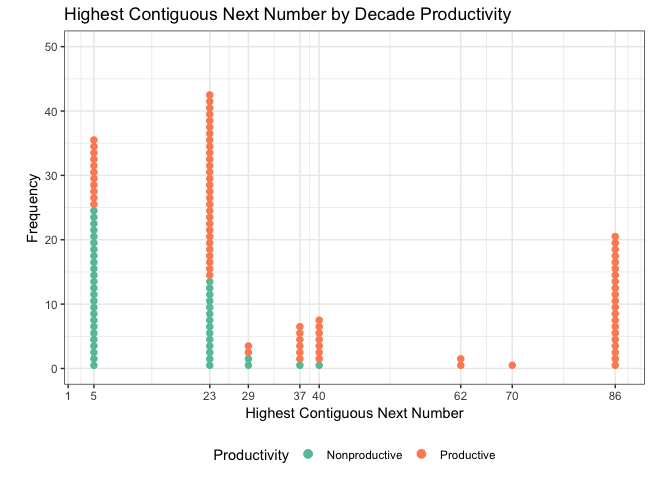<!-- -->

``` r
ggsave("graphs/highestcontig-by-prod.png")
```

    ## Saving 7 x 5 in image

``` r
# side by side
full.data %>% dplyr::right_join(highest_contiguous_nn) %>% dplyr::distinct(LadlabID, 
    Highest_Contig_NN, Productivity) %>% ggplot(aes(x = Highest_Contig_NN, color = Productivity)) + 
    geom_dotplot(aes(fill = Productivity), binwidth = 1, stackdir = "up", position = position_dodge(width = 2), 
        stackgroups = FALSE, binpositions = "all", method = "dotdensity") + scale_color_brewer(palette = "Set1") + 
    scale_fill_brewer(palette = "Set1") + coord_fixed(ratio = 1) + scale_y_continuous(breaks = seq(0, 
    30, 10), lim = c(0, 30)) + # scale_x_continuous(breaks=seq(0,100,by=10)) +
scale_x_continuous(breaks = c(0, 1, 5, 23, 29, 37, 40, 62, 70, 86), labels = c("0", 
    "1", "5", "23", "29", "37", "40", "62", "70", "86")) + labs(x = "Highest Contiguous Next Number", 
    y = "Frequency") + theme_bw() + theme(legend.position = "bottom")
```

    ## Joining, by = "LadlabID"

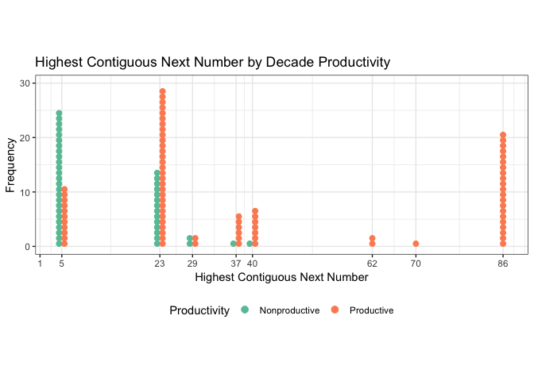<!-- -->

``` r
ggsave("graphs/highestcontig-by-prod-2.png")
```

    ## Saving 7 x 5 in image

Correlations

``` r
corrdf <- full.data %>% dplyr::right_join(highest_contiguous_nn) %>% dplyr::distinct(LadlabID, 
    Highest_Contig_NN, Age, IHC, FHC) %>% dplyr::select(-LadlabID)
```

    ## Joining, by = "LadlabID"

``` r
rcorr(as.matrix(corrdf), type = "pearson")
```

    ##                    Age  IHC  FHC Highest_Contig_NN
    ## Age               1.00 0.51 0.61              0.37
    ## IHC               0.51 1.00 0.72              0.75
    ## FHC               0.61 0.72 1.00              0.54
    ## Highest_Contig_NN 0.37 0.75 0.54              1.00
    ## 
    ## n= 122 
    ## 
    ## 
    ## P
    ##                   Age IHC FHC Highest_Contig_NN
    ## Age                    0   0   0               
    ## IHC                0       0   0               
    ## FHC                0   0       0               
    ## Highest_Contig_NN  0   0   0

# Infinity Descriptives

Number of kids in each infinity
category

``` r
full.data %>% dplyr::distinct(LadlabID, Category) %>% dplyr::group_by(Category) %>% 
    dplyr::summarise(n = n())
```

    ## # A tibble: 4 x 2
    ##   Category             n
    ##   <fct>            <int>
    ## 1 A Non-knower        62
    ## 2 B Endless-only      14
    ## 3 C Successor-only    27
    ## 4 D Full-knower       19

``` r
classification.data <- full.data %>% dplyr::distinct(LadlabID, EndlessKnower, SuccessorKnower, 
    Productivity)

# Successor contingency table
table(classification.data$SuccessorKnower, classification.data$Productivity)
```

    ##    
    ##     Nonproductive Productive
    ##   0            31         39
    ##   1            12         40

``` r
chisq.test(table(classification.data$SuccessorKnower, classification.data$Productivity))
```

    ## 
    ##  Pearson's Chi-squared test with Yates' continuity correction
    ## 
    ## data:  table(classification.data$SuccessorKnower, classification.data$Productivity)
    ## X-squared = 4.9877, df = 1, p-value = 0.02553

``` r
# Endless contingency table
table(classification.data$EndlessKnower, classification.data$Productivity)
```

    ##    
    ##     Nonproductive Productive
    ##   0            39         49
    ##   1             4         30

``` r
chisq.test(table(classification.data$EndlessKnower, classification.data$Productivity))
```

    ## 
    ##  Pearson's Chi-squared test with Yates' continuity correction
    ## 
    ## data:  table(classification.data$EndlessKnower, classification.data$Productivity)
    ## X-squared = 10.006, df = 1, p-value = 0.001561

Average age of kids for Endless and Successor
Knowers

``` r
full.data %>% dplyr::distinct(LadlabID, SuccessorKnower, Age) %>% dplyr::group_by(SuccessorKnower) %>% 
    dplyr::summarise(meanAge = mean(Age), sdAge = sd(Age), meanAgeMonths = mean(Age) * 
        12, sdAgeMonths = sd(Age) * 12)
```

    ## # A tibble: 2 x 5
    ##   SuccessorKnower meanAge sdAge meanAgeMonths sdAgeMonths
    ##             <int>   <dbl> <dbl>         <dbl>       <dbl>
    ## 1               0    4.92 0.577          59.0        6.93
    ## 2               1    5.11 0.550          61.3        6.60

``` r
full.data %>% dplyr::distinct(LadlabID, EndlessKnower, Age) %>% dplyr::group_by(EndlessKnower) %>% 
    dplyr::summarise(meanAge = mean(Age), sdAge = sd(Age), meanAgeMonths = mean(Age) * 
        12, sdAgeMonths = sd(Age) * 12)
```

    ## # A tibble: 2 x 5
    ##   EndlessKnower meanAge sdAge meanAgeMonths sdAgeMonths
    ##           <int>   <dbl> <dbl>         <dbl>       <dbl>
    ## 1             0    4.89 0.560          58.7        6.71
    ## 2             1    5.27 0.516          63.2        6.19

Infinity in relation to highest
count

``` r
full.data %>% dplyr::distinct(LadlabID, EndlessKnower, IHC, FHC) %>% dplyr::group_by(EndlessKnower) %>% 
    dplyr::summarize(mean_IHC = mean(IHC), mean_FHC = mean(FHC))
```

    ## # A tibble: 2 x 3
    ##   EndlessKnower mean_IHC mean_FHC
    ##           <int>    <dbl>    <dbl>
    ## 1             0     42.8     63.8
    ## 2             1     70.1     91.8

``` r
full.data %>% dplyr::distinct(LadlabID, SuccessorKnower, IHC, FHC) %>% dplyr::group_by(SuccessorKnower) %>% 
    dplyr::summarize(mean_IHC = mean(IHC), mean_FHC = mean(FHC))
```

    ## # A tibble: 2 x 3
    ##   SuccessorKnower mean_IHC mean_FHC
    ##             <int>    <dbl>    <dbl>
    ## 1               0     47.4     67.0
    ## 2               1     54.5     77.7

Infinity in relation to
WCN

``` r
full.data %>% dplyr::right_join(highest_contiguous_nn) %>% dplyr::distinct(LadlabID, 
    EndlessKnower, Highest_Contig_NN) %>% dplyr::group_by(EndlessKnower) %>% dplyr::summarize(mean_contig_nn = mean(Highest_Contig_NN), 
    median_contig_nn = median(Highest_Contig_NN))
```

    ## Joining, by = "LadlabID"

    ## # A tibble: 2 x 3
    ##   EndlessKnower mean_contig_nn median_contig_nn
    ##           <int>          <dbl>            <dbl>
    ## 1             0           26.2               23
    ## 2             1           45.7               37

``` r
full.data %>% dplyr::right_join(highest_contiguous_nn) %>% dplyr::distinct(LadlabID, 
    SuccessorKnower, Highest_Contig_NN) %>% dplyr::group_by(SuccessorKnower) %>% 
    dplyr::summarize(mean_contig_nn = mean(Highest_Contig_NN), median_contig_nn = median(Highest_Contig_NN))
```

    ## Joining, by = "LadlabID"

    ## # A tibble: 2 x 3
    ##   SuccessorKnower mean_contig_nn median_contig_nn
    ##             <int>          <dbl>            <dbl>
    ## 1               0           27.4               23
    ## 2               1           37.4               23

\#Correlation between productivity gradient and IHC/FHC

``` r
ms.cor <- full.data %>% distinct(LadlabID, Age, IHC, FHC, prod.gradient)

cor.test(ms.cor$IHC, ms.cor$prod.gradient)  #sig. correlation between IHC and prod. gradient
```

    ## 
    ##  Pearson's product-moment correlation
    ## 
    ## data:  ms.cor$IHC and ms.cor$prod.gradient
    ## t = 9.8276, df = 120, p-value < 2.2e-16
    ## alternative hypothesis: true correlation is not equal to 0
    ## 95 percent confidence interval:
    ##  0.5560260 0.7558237
    ## sample estimates:
    ##       cor 
    ## 0.6677834

``` r
cor.test(ms.cor$FHC, ms.cor$prod.gradient)  #sig. correlation between FHC and prod. gradient
```

    ## 
    ##  Pearson's product-moment correlation
    ## 
    ## data:  ms.cor$FHC and ms.cor$prod.gradient
    ## t = 41.22, df = 120, p-value < 2.2e-16
    ## alternative hypothesis: true correlation is not equal to 0
    ## 95 percent confidence interval:
    ##  0.9522946 0.9764607
    ## sample estimates:
    ##       cor 
    ## 0.9664535

\#Correlation between Productivity classification and
Prod.gradient

``` r
ms.cor <- full.data %>% dplyr::distinct(LadlabID, Productivity, prod.gradient) %>% 
    mutate(Productivity = factor(Productivity, levels = c("Productive", "Nonproductive"), 
        labels = c(1, 0)), Productivity = as.integer(as.character(Productivity)))

cor.test(ms.cor$Productivity, ms.cor$prod.gradient)
```

    ## 
    ##  Pearson's product-moment correlation
    ## 
    ## data:  ms.cor$Productivity and ms.cor$prod.gradient
    ## t = 29.706, df = 120, p-value < 2.2e-16
    ## alternative hypothesis: true correlation is not equal to 0
    ## 95 percent confidence interval:
    ##  0.9126986 0.9564758
    ## sample estimates:
    ##       cor 
    ## 0.9382378

\#Jess graph

``` r
prod.pal <- c("#E41A1C", "#4DAF4A", "#377EB8")

wcn.data %>% mutate(prod.group = ifelse(IHC > 99, "Productive (IHC > 99)", ifelse(Productivity == 
    "Productive", "Productive (IHC < 99)", "Nonproductive"))) %>% filter(TaskType == 
    "immediate") %>% mutate(TaskItem == factor(TaskItem)) %>% group_by(TaskItem, 
    prod.group) %>% summarise(mean = mean(Accuracy, na.rm = TRUE), n = n(), sd = sd(Accuracy, 
    na.rm = TRUE), se = sd/sqrt(n)) %>% ggplot(aes(x = factor(TaskItem), y = mean, 
    colour = prod.group, group = prod.group)) + geom_point(size = 2.5) + geom_line(size = 0.7) + 
    geom_errorbar(aes(ymin = mean - se, ymax = mean + se), width = 0, size = 0.5) + 
    theme_bw(base_size = 13) + scale_colour_manual(values = prod.pal) + theme(legend.position = "right", 
    legend.title = element_blank()) + labs(x = "Task item", y = "Mean performance") + 
    theme(axis.text.x = element_text(angle = 45, hjust = 1))
```

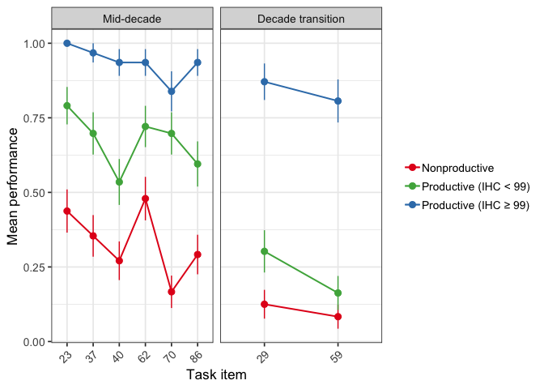<!-- -->

# Analyses

## Counting, Productivity, and Infinity Battery

To identify whether there is connection between counting experience and
Infinity Task performance, we will conduct three initial analyses,
predicting Infinity Task performance from either (1) Initial Highest
Count, (2) Productivity for Decade Rule (defined above), or (3)
performance on the Next Number task.

glm(inf.0/1 \~ (predictor) + age, family = binomial).

-----

First, we need to make a model data frame that readily has all of this
information

``` r
# model base
model.df <- full.data %>% dplyr::select(LadlabID, Age, AgeGroup, Gender, Task, Response, 
    SuccessorKnower, EndlessKnower, IHC, FHC, DCE, Productivity, prod.gradient)
```

Highest Next Number - commented because we’re using highest contiguous

``` r
# lookup <- full.data %>% filter(Task == 'WCN', Accuracy == 1)%>%
# group_by(LadlabID)%>% summarise(max = max(as.numeric(as.character(TaskItem))))
# #Add highest NN to model df add_highest_num <- function() { tmp <- model.df for
# (row in 1:nrow(tmp)) { sub = as.character(tmp[row, 'LadlabID']) highest_num =
# subset(lookup, LadlabID == sub)$max tmp[row, 'Highest_NN'] = highest_num }
# return(tmp) } #run this function on model df model.df <- add_highest_num()
```

Add highest contiguous next number to model.df

``` r
model.df <- right_join(model.df, highest_contiguous_nn, by = "LadlabID")

# hc.datawide <- right_join(hc.datawide, highest_contiguous_nn, by = 'LadlabID')

# hc.datawide %>% dplyr::select(LadlabID, Age, AgeGroup, productivity, max,
# HCReceivedSupport, ihc, dce, sup.noerror) %>% group_by(productivity) %>%
# summarize(median = median(max, na.rm=TRUE), count = n()) #median is 86 for all
# groups
```

Get mean WCN for everyone <span style="color:red">Not using this anymore
- RMS</span>

``` r
# lookup <- wcn.wide %>% group_by(LadlabID)%>% summarise(mean.NN =
# mean(immediate, na.rm = TRUE))
```

## Successor models

``` r
#each participant only needs one row here, because we only need to know whether they are a Successor Knower or Endless Knower
distinct_model.df <- model.df %>%
  distinct(LadlabID, Age, AgeGroup, Gender, SuccessorKnower, EndlessKnower, 
           IHC, Highest_Contig_NN, FHC, DCE, Productivity, prod.gradient)%>%
  mutate(SuccessorKnower = factor(SuccessorKnower, levels = c(0,1)), 
         EndlessKnower = factor(EndlessKnower, levels = c(0,1)),
         IHC = as.integer(IHC), 
         Highest_Contig_NN = as.integer(Highest_Contig_NN), 
         LadlabID = factor(LadlabID), 
         IHC.c = as.vector(scale(IHC, center = TRUE, scale=TRUE)), #scale and center for model fit
         FHC.c = as.vector(scale(FHC, center = TRUE, scale=TRUE)),
         Highest_Contig_NN.c = as.vector(scale(Highest_Contig_NN, center = TRUE, scale=TRUE)), 
         Age.c = as.vector(scale(Age, center = TRUE, scale=TRUE)))

# #add mean_nn to model df
# distinct_model.df <- right_join(distinct_model.df, lookup, by = "LadlabID")

###MODEL BUILDING AND COMPARISONS###
#base model for successor knower
base.successor <- glm(SuccessorKnower ~ Age.c, family = "binomial", 
                        data = distinct_model.df)

##IHC model##
model.ihc.successor <- glm(SuccessorKnower ~ IHC.c + Age.c, family = "binomial", 
                             data = distinct_model.df)
##Highest NN Model##
model.nn.successor <- glm(SuccessorKnower ~ Highest_Contig_NN.c + Age.c, family = "binomial", 
                            data = distinct_model.df)
##Productivity model##
model.prod.successor <- glm(SuccessorKnower ~ Productivity + Age.c, family = "binomial",
                              data = distinct_model.df)

##EXPLORATORY## - GAIN SCORE
model.gain.successor <- glm(SuccessorKnower ~ prod.gradient + Age.c, family = "binomial",
                              data = distinct_model.df)
summary(model.gain.successor)
```

    ## 
    ## Call:
    ## glm(formula = SuccessorKnower ~ prod.gradient + Age.c, family = "binomial", 
    ##     data = distinct_model.df)
    ## 
    ## Deviance Residuals: 
    ##     Min       1Q   Median       3Q      Max  
    ## -1.2860  -1.0552  -0.8403   1.1953   1.6239  
    ## 
    ## Coefficients:
    ##               Estimate Std. Error z value Pr(>|z|)  
    ## (Intercept)    -0.6407     0.3816  -1.679   0.0932 .
    ## prod.gradient   0.5282     0.5187   1.018   0.3085  
    ## Age.c           0.2098     0.2284   0.918   0.3584  
    ## ---
    ## Signif. codes:  0 '***' 0.001 '**' 0.01 '*' 0.05 '.' 0.1 ' ' 1
    ## 
    ## (Dispersion parameter for binomial family taken to be 1)
    ## 
    ##     Null deviance: 166.46  on 121  degrees of freedom
    ## Residual deviance: 162.03  on 119  degrees of freedom
    ## AIC: 168.03
    ## 
    ## Number of Fisher Scoring iterations: 4

``` r
##Regression table for Successor Knower Models (Table 2)
mtable.sf.knowers <- mtable('Base' = base.successor,
            'IHC' = model.ihc.successor,
            'Highest Contig.' = model.nn.successor,
            'Productivity' = model.prod.successor,
            'Exp. - Prod. gain' = model.gain.successor,
            #summary.stats = c('R-squared','F','p','N'))
            summary.stats = c('Nagelkerke R-sq.','Log-likelihood','AIC','N'))
mtable.sf.knowers
```

    ## 
    ## Calls:
    ## Base: glm(formula = SuccessorKnower ~ Age.c, family = "binomial", data = distinct_model.df)
    ## IHC: glm(formula = SuccessorKnower ~ IHC.c + Age.c, family = "binomial", 
    ##     data = distinct_model.df)
    ## Highest Contig.: glm(formula = SuccessorKnower ~ Highest_Contig_NN.c + Age.c, 
    ##     family = "binomial", data = distinct_model.df)
    ## Productivity: glm(formula = SuccessorKnower ~ Productivity + Age.c, family = "binomial", 
    ##     data = distinct_model.df)
    ## Exp. - Prod. gain: glm(formula = SuccessorKnower ~ prod.gradient + Age.c, family = "binomial", 
    ##     data = distinct_model.df)
    ## 
    ## ================================================================================================================
    ##                                             Base      IHC     Highest Contig.  Productivity  Exp. - Prod. gain  
    ## ----------------------------------------------------------------------------------------------------------------
    ##   (Intercept)                              -0.306    -0.306       -0.307          -0.847*         -0.641        
    ##                                            (0.186)   (0.186)      (0.187)         (0.370)         (0.382)       
    ##   Age.c                                     0.342     0.313        0.245           0.149           0.210        
    ##                                            (0.188)   (0.218)      (0.202)         (0.218)         (0.228)       
    ##   IHC.c                                               0.058                                                     
    ##                                                      (0.216)                                                    
    ##   Highest_Contig_NN.c                                              0.271                                        
    ##                                                                   (0.200)                                       
    ##   Productivity: Productive/Nonproductive                                           0.816                        
    ##                                                                                   (0.468)                       
    ##   prod.gradient                                                                                    0.528        
    ##                                                                                                   (0.519)       
    ## ----------------------------------------------------------------------------------------------------------------
    ##   Nagelkerke R-sq.                          0.037     0.038        0.056           0.070           0.048        
    ##   Log-likelihood                          -81.539   -81.503      -80.610         -79.977         -81.016        
    ##   AIC                                     167.077   169.006      167.221         165.954         168.033        
    ##   N                                       122       122          122             122             122            
    ## ================================================================================================================

``` r
write.mtable(mtable.sf.knowers, file="graphs/table2.txt")

###MODEL COMPARISONS##
#base v. IHC
anova(base.successor, model.ihc.successor, test = 'LRT') #IHC not significant
```

    ## Analysis of Deviance Table
    ## 
    ## Model 1: SuccessorKnower ~ Age.c
    ## Model 2: SuccessorKnower ~ IHC.c + Age.c
    ##   Resid. Df Resid. Dev Df Deviance Pr(>Chi)
    ## 1       120     163.08                     
    ## 2       119     163.01  1 0.071147   0.7897

``` r
#Highest contiguous NN v. IHC
anova(base.successor, model.nn.successor, test = 'LRT')#highest contiguous NN not significant
```

    ## Analysis of Deviance Table
    ## 
    ## Model 1: SuccessorKnower ~ Age.c
    ## Model 2: SuccessorKnower ~ Highest_Contig_NN.c + Age.c
    ##   Resid. Df Resid. Dev Df Deviance Pr(>Chi)
    ## 1       120     163.08                     
    ## 2       119     161.22  1   1.8565    0.173

``` r
#Productivity v. IHC
anova(base.successor, model.prod.successor, test = 'LRT')#Productivity trending
```

    ## Analysis of Deviance Table
    ## 
    ## Model 1: SuccessorKnower ~ Age.c
    ## Model 2: SuccessorKnower ~ Productivity + Age.c
    ##   Resid. Df Resid. Dev Df Deviance Pr(>Chi)  
    ## 1       120     163.08                       
    ## 2       119     159.95  1   3.1234  0.07718 .
    ## ---
    ## Signif. codes:  0 '***' 0.001 '**' 0.01 '*' 0.05 '.' 0.1 ' ' 1

``` r
##Exploratory
anova(base.successor, model.gain.successor, test = 'LRT')
```

    ## Analysis of Deviance Table
    ## 
    ## Model 1: SuccessorKnower ~ Age.c
    ## Model 2: SuccessorKnower ~ prod.gradient + Age.c
    ##   Resid. Df Resid. Dev Df Deviance Pr(>Chi)
    ## 1       120     163.08                     
    ## 2       119     162.03  1   1.0444   0.3068

## Endless Models

``` r
#Base model
base.endless <- glm(EndlessKnower ~ Age.c, family = "binomial", 
                      data = distinct_model.df)

###IHC MODEL###
model.ihc.endless <- glm(EndlessKnower ~ IHC.c + Age.c, family = "binomial", 
                           data = distinct_model.df)

###HIGHEST CONTIG NN MODEL###
model.nn.endless <- glm(EndlessKnower ~ Highest_Contig_NN.c + Age.c, family = "binomial", 
                          data = distinct_model.df) 

###PRODUCTIVITY MODEL###
model.prod.endless <- glm(EndlessKnower ~ Productivity + Age.c, family = "binomial", 
                            data = distinct_model.df)

##EXPLORATORY## - GAIN SCORE
model.gain.endless <- glm(EndlessKnower ~ prod.gradient + Age.c, family = "binomial", 
                          data = distinct_model.df)

##Regression table for Endless Models
mtable.endless.knowers <- mtable('Base' = base.endless,
            'IHC' = model.ihc.endless,
            'Highest Contig.' = model.nn.endless,
            'Productivity' = model.prod.endless,
            'Prod. gradient' = model.gain.endless,
            #summary.stats = c('R-squared','F','p','N'))
            summary.stats = c('Nagelkerke R-sq.','Log-likelihood','AIC','N'))

mtable.endless.knowers
```

    ## 
    ## Calls:
    ## Base: glm(formula = EndlessKnower ~ Age.c, family = "binomial", data = distinct_model.df)
    ## IHC: glm(formula = EndlessKnower ~ IHC.c + Age.c, family = "binomial", 
    ##     data = distinct_model.df)
    ## Highest Contig.: glm(formula = EndlessKnower ~ Highest_Contig_NN.c + Age.c, family = "binomial", 
    ##     data = distinct_model.df)
    ## Productivity: glm(formula = EndlessKnower ~ Productivity + Age.c, family = "binomial", 
    ##     data = distinct_model.df)
    ## Prod. gradient: glm(formula = EndlessKnower ~ prod.gradient + Age.c, family = "binomial", 
    ##     data = distinct_model.df)
    ## 
    ## =================================================================================================================
    ##                                              Base        IHC      Highest Contig.  Productivity  Prod. gradient  
    ## -----------------------------------------------------------------------------------------------------------------
    ##   (Intercept)                              -1.057***   -1.131***     -1.091***       -2.010***      -2.440***    
    ##                                            (0.221)     (0.235)       (0.228)         (0.542)        (0.615)      
    ##   Age.c                                     0.707**     0.407         0.535*          0.446          0.305       
    ##                                            (0.224)     (0.250)       (0.238)         (0.249)        (0.264)      
    ##   IHC.c                                                 0.666**                                                  
    ##                                                        (0.242)                                                   
    ##   Highest_Contig_NN.c                                                 0.504*                                     
    ##                                                                      (0.215)                                     
    ##   Productivity: Productive/Nonproductive                                              1.329*                     
    ##                                                                                      (0.627)                     
    ##   prod.gradient                                                                                      1.962**     
    ##                                                                                                     (0.731)      
    ## -----------------------------------------------------------------------------------------------------------------
    ##   Nagelkerke R-sq.                          0.125       0.205         0.183           0.179          0.215       
    ##   Log-likelihood                          -66.655     -62.810       -63.884         -64.095        -62.312       
    ##   AIC                                     137.311     131.619       133.767         134.190        130.624       
    ##   N                                       122         122           122             122            122           
    ## =================================================================================================================

``` r
write.mtable(mtable.endless.knowers, file="graphs/table3.txt")

##SIMPLE MODEL COMPARISONS##
#base v. IHC
anova(base.endless, model.ihc.endless, test = 'LRT') #IHC significant
```

    ## Analysis of Deviance Table
    ## 
    ## Model 1: EndlessKnower ~ Age.c
    ## Model 2: EndlessKnower ~ IHC.c + Age.c
    ##   Resid. Df Resid. Dev Df Deviance Pr(>Chi)   
    ## 1       120     133.31                        
    ## 2       119     125.62  1   7.6914 0.005549 **
    ## ---
    ## Signif. codes:  0 '***' 0.001 '**' 0.01 '*' 0.05 '.' 0.1 ' ' 1

``` r
#base v. highest contiguous
anova(model.nn.endless, base.endless, test = 'LRT')#Highest contig NN significant
```

    ## Analysis of Deviance Table
    ## 
    ## Model 1: EndlessKnower ~ Highest_Contig_NN.c + Age.c
    ## Model 2: EndlessKnower ~ Age.c
    ##   Resid. Df Resid. Dev Df Deviance Pr(>Chi)  
    ## 1       119     127.77                       
    ## 2       120     133.31 -1  -5.5433  0.01855 *
    ## ---
    ## Signif. codes:  0 '***' 0.001 '**' 0.01 '*' 0.05 '.' 0.1 ' ' 1

``` r
#base v. productivity
anova(model.prod.endless, base.endless, test = 'LRT')#Prod significant
```

    ## Analysis of Deviance Table
    ## 
    ## Model 1: EndlessKnower ~ Productivity + Age.c
    ## Model 2: EndlessKnower ~ Age.c
    ##   Resid. Df Resid. Dev Df Deviance Pr(>Chi)  
    ## 1       119     128.19                       
    ## 2       120     133.31 -1   -5.121  0.02364 *
    ## ---
    ## Signif. codes:  0 '***' 0.001 '**' 0.01 '*' 0.05 '.' 0.1 ' ' 1

``` r
# #okay with about mean NN
# model2.endless <- glmer(EndlessKnower ~ mean.NN + Age + (1|LadlabID), family = "binomial", 
#                         data = distinct_model.df)
# anova(model2.endless, base.endless, test = 'LRT')#mean NN significant
```

### Endless: Large model comparison

Put all significant Endless predictors into large model, run model
comparison

``` r
##BASE MODEL WITH IHC
large.endless.base <- glm(EndlessKnower ~ IHC.c + Age.c, 
                            family = "binomial", data = distinct_model.df)
##add highest contig
large.endless.nn <- glm(EndlessKnower ~ Highest_Contig_NN.c + IHC.c + Age.c, 
                          family = "binomial", data = distinct_model.df)

##Productivity v. IHC##
large.endless.prod <- glm(EndlessKnower ~ Productivity + IHC.c + Age.c, 
                            family = "binomial", data = distinct_model.df)

##ALL THREE TOGETHER
large.endless.full <- glm(EndlessKnower ~ Productivity + Highest_Contig_NN.c + 
                              IHC.c + Age.c, 
                            family = "binomial", data = distinct_model.df)

#regression table
mtable.endless.large <- mtable('IHC alone' = large.endless.base,
            'Highest contiguous NN + IHC' = large.endless.nn,
            'Productivity + IHC' = large.endless.prod,
            'Prod. + Highest contig. + IHC' = large.endless.full,
            #summary.stats = c('R-squared','F','p','N'))
            summary.stats = c('Nagelkerke R-sq.','Log-likelihood','AIC','N'))

mtable.endless.large
```

    ## 
    ## Calls:
    ## IHC alone: glm(formula = EndlessKnower ~ IHC.c + Age.c, family = "binomial", 
    ##     data = distinct_model.df)
    ## Highest contiguous NN + IHC: glm(formula = EndlessKnower ~ Highest_Contig_NN.c + IHC.c + Age.c, 
    ##     family = "binomial", data = distinct_model.df)
    ## Productivity + IHC: glm(formula = EndlessKnower ~ Productivity + IHC.c + Age.c, family = "binomial", 
    ##     data = distinct_model.df)
    ## Prod. + Highest contig. + IHC: glm(formula = EndlessKnower ~ Productivity + Highest_Contig_NN.c + 
    ##     IHC.c + Age.c, family = "binomial", data = distinct_model.df)
    ## 
    ## ======================================================================================================================================
    ##                                           IHC alone   Highest contiguous NN + IHC  Productivity + IHC  Prod. + Highest contig. + IHC  
    ## --------------------------------------------------------------------------------------------------------------------------------------
    ##   (Intercept)                              -1.131***           -1.129***                -1.710**                  -1.694**            
    ##                                            (0.235)             (0.235)                  (0.563)                   (0.565)             
    ##   IHC.c                                     0.666**             0.529                    0.523*                    0.411              
    ##                                            (0.242)             (0.336)                  (0.263)                   (0.345)             
    ##   Age.c                                     0.407               0.411                    0.315                     0.320              
    ##                                            (0.250)             (0.250)                  (0.260)                   (0.260)             
    ##   Highest_Contig_NN.c                                           0.173                                              0.148              
    ##                                                                (0.299)                                            (0.297)             
    ##   Productivity: Productive/Nonproductive                                                 0.823                     0.802              
    ##                                                                                         (0.687)                   (0.689)             
    ## --------------------------------------------------------------------------------------------------------------------------------------
    ##   Nagelkerke R-sq.                          0.205               0.209                    0.221                     0.223              
    ##   Log-likelihood                          -62.810             -62.642                  -62.059                   -61.934              
    ##   AIC                                     131.619             133.284                  132.118                   133.868              
    ##   N                                       122                 122                      122                       122                  
    ## ======================================================================================================================================

``` r
##MODEL COMPARISONS
#IHC v. Highest contig.
anova(large.endless.base, large.endless.nn, test = 'LRT')#Highest contig. NS
```

    ## Analysis of Deviance Table
    ## 
    ## Model 1: EndlessKnower ~ IHC.c + Age.c
    ## Model 2: EndlessKnower ~ Highest_Contig_NN.c + IHC.c + Age.c
    ##   Resid. Df Resid. Dev Df Deviance Pr(>Chi)
    ## 1       119     125.62                     
    ## 2       118     125.28  1   0.3351   0.5627

``` r
#IHC v. Productivity
anova(large.endless.base, large.endless.prod, test = 'LRT')##Productivity NS
```

    ## Analysis of Deviance Table
    ## 
    ## Model 1: EndlessKnower ~ IHC.c + Age.c
    ## Model 2: EndlessKnower ~ Productivity + IHC.c + Age.c
    ##   Resid. Df Resid. Dev Df Deviance Pr(>Chi)
    ## 1       119     125.62                     
    ## 2       118     124.12  1   1.5013   0.2205

``` r
###########
##Exploratory - productivity gradient comparison
large.endless.gain <- glm(EndlessKnower ~ prod.gradient + Age.c, 
                          family = "binomial", data = distinct_model.df)
summary(large.endless.gain) #lower AIC than IHC, significant predictor
```

    ## 
    ## Call:
    ## glm(formula = EndlessKnower ~ prod.gradient + Age.c, family = "binomial", 
    ##     data = distinct_model.df)
    ## 
    ## Deviance Residuals: 
    ##     Min       1Q   Median       3Q      Max  
    ## -1.1996  -0.9643  -0.4202   1.1769   2.3054  
    ## 
    ## Coefficients:
    ##               Estimate Std. Error z value Pr(>|z|)    
    ## (Intercept)    -2.4398     0.6153  -3.965 7.33e-05 ***
    ## prod.gradient   1.9624     0.7314   2.683   0.0073 ** 
    ## Age.c           0.3050     0.2644   1.154   0.2486    
    ## ---
    ## Signif. codes:  0 '***' 0.001 '**' 0.01 '*' 0.05 '.' 0.1 ' ' 1
    ## 
    ## (Dispersion parameter for binomial family taken to be 1)
    ## 
    ##     Null deviance: 144.38  on 121  degrees of freedom
    ## Residual deviance: 124.62  on 119  degrees of freedom
    ## AIC: 130.62
    ## 
    ## Number of Fisher Scoring iterations: 5

``` r
#add IHC to model
large.endless.gain.ihc <- glm(EndlessKnower ~ IHC.c + prod.gradient + Age.c, 
                              family = "binomial", data = distinct_model.df)
summary(large.endless.gain.ihc) #with addition of IHC, prod.gradient is marginal, AIC very slightly decreases, but addition of IHC does not significantly improve the fit of the model
```

    ## 
    ## Call:
    ## glm(formula = EndlessKnower ~ IHC.c + prod.gradient + Age.c, 
    ##     family = "binomial", data = distinct_model.df)
    ## 
    ## Deviance Residuals: 
    ##     Min       1Q   Median       3Q      Max  
    ## -1.3195  -0.9178  -0.4104   1.0633   2.3337  
    ## 
    ## Coefficients:
    ##               Estimate Std. Error z value Pr(>|z|)   
    ## (Intercept)    -2.0857     0.6456  -3.231  0.00124 **
    ## IHC.c           0.4047     0.2782   1.455  0.14570   
    ## prod.gradient   1.3878     0.8177   1.697  0.08964 . 
    ## Age.c           0.2490     0.2666   0.934  0.35027   
    ## ---
    ## Signif. codes:  0 '***' 0.001 '**' 0.01 '*' 0.05 '.' 0.1 ' ' 1
    ## 
    ## (Dispersion parameter for binomial family taken to be 1)
    ## 
    ##     Null deviance: 144.38  on 121  degrees of freedom
    ## Residual deviance: 122.47  on 118  degrees of freedom
    ## AIC: 130.47
    ## 
    ## Number of Fisher Scoring iterations: 5

``` r
anova(large.endless.gain, large.endless.gain.ihc, test = 'LRT')
```

    ## Analysis of Deviance Table
    ## 
    ## Model 1: EndlessKnower ~ prod.gradient + Age.c
    ## Model 2: EndlessKnower ~ IHC.c + prod.gradient + Age.c
    ##   Resid. Df Resid. Dev Df Deviance Pr(>Chi)
    ## 1       119     124.62                     
    ## 2       118     122.47  1   2.1545   0.1422

\#LM predicting IHC from productivity and age, HCNN and
age

``` r
lm.prod <- full.data %>% distinct(LadlabID, Productivity, Age, IHC) %>% mutate(Age.c = as.vector(scale(Age, 
    center = TRUE, scale = TRUE)))

lm1 <- lm(IHC ~ Productivity + Age.c, data = lm.prod)
summary(lm1)
```

    ## 
    ## Call:
    ## lm(formula = IHC ~ Productivity + Age.c, data = lm.prod)
    ## 
    ## Residuals:
    ##     Min      1Q  Median      3Q     Max 
    ## -52.524 -17.340  -5.718  23.332  52.599 
    ## 
    ## Coefficients:
    ##                        Estimate Std. Error t value Pr(>|t|)    
    ## (Intercept)              30.524      4.475   6.821 4.01e-10 ***
    ## ProductivityProductive   30.722      5.844   5.257 6.54e-07 ***
    ## Age.c                     9.669      2.804   3.449  0.00078 ***
    ## ---
    ## Signif. codes:  0 '***' 0.001 '**' 0.01 '*' 0.05 '.' 0.1 ' ' 1
    ## 
    ## Residual standard error: 26.38 on 119 degrees of freedom
    ## Multiple R-squared:  0.4009, Adjusted R-squared:  0.3909 
    ## F-statistic: 39.82 on 2 and 119 DF,  p-value: 5.742e-14

``` r
lm2 <- lm(IHC ~ Highest_Contig_NN + Age.c, data = distinct_model.df)
summary(lm2)
```

    ## 
    ## Call:
    ## lm(formula = IHC ~ Highest_Contig_NN + Age.c, data = distinct_model.df)
    ## 
    ## Residuals:
    ##     Min      1Q  Median      3Q     Max 
    ## -60.998 -10.895  -3.356   9.613  60.317 
    ## 
    ## Coefficients:
    ##                   Estimate Std. Error t value Pr(>|t|)    
    ## (Intercept)       25.41749    2.96537   8.571 4.39e-14 ***
    ## Highest_Contig_NN  0.78935    0.07249  10.889  < 2e-16 ***
    ## Age.c              9.06772    2.03035   4.466 1.82e-05 ***
    ## ---
    ## Signif. codes:  0 '***' 0.001 '**' 0.01 '*' 0.05 '.' 0.1 ' ' 1
    ## 
    ## Residual standard error: 20.73 on 119 degrees of freedom
    ## Multiple R-squared:  0.6302, Adjusted R-squared:  0.624 
    ## F-statistic: 101.4 on 2 and 119 DF,  p-value: < 2.2e-16

\#Exploratory - what about with participants who did not reach 99?

``` r
explore.dat <- distinct_model.df %>% filter(IHC < 99)

end.base <- glm(EndlessKnower ~ Age.c, family = "binomial", data = explore.dat)

# IHC
end.ihc <- glm(EndlessKnower ~ IHC.c + Age.c, family = "binomial", data = explore.dat)
end.prod <- glm(EndlessKnower ~ Productivity + Age.c, family = "binomial", data = explore.dat)
end.nn <- glm(EndlessKnower ~ Highest_Contig_NN + Age.c, family = "binomial", data = explore.dat)
```

\#Exploratory - trying to account for distance between IHC and
FHC

``` r
tmp <- distinct_model.df %>% mutate(delta.hc = FHC - IHC) %>% mutate(prop.hc = delta.hc/(100 - 
    IHC), prop.hc = ifelse(prop.hc == "NaN", 1, as.numeric(prop.hc)), prop.hc = ifelse(prop.hc == 
    0 & IHC == 99, 1, as.numeric(prop.hc)))  #one kid with IHC and FHC as 99

# plot by IHC
ggplot(full.data, aes(x = prod.gradient, y = IHC, colour = Productivity)) + geom_point(size = 3, 
    alpha = 0.1) + geom_jitter() + theme_bw(base_size = 13) + theme(legend.position = "bottom") + 
    scale_y_continuous(breaks = seq(0, 100, 10)) + scale_colour_brewer(palette = "Set1") + 
    labs(x = "Productivity Gradient", y = "IHC")
```

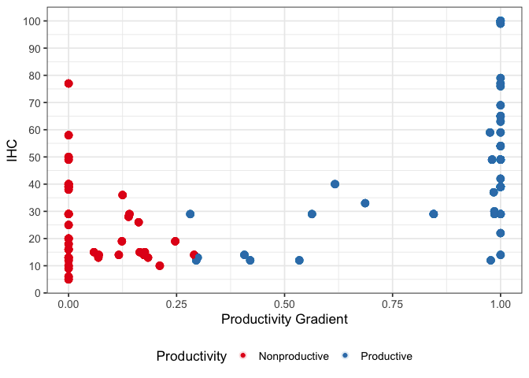<!-- -->

``` r
end.gain.ihc <- glm(EndlessKnower ~ IHC.c + Age.c, family = "binomial", data = distinct_model.df)
end.gain.Prod <- glm(EndlessKnower ~ Productivity + Age.c, family = "binomial", data = distinct_model.df)
end.gain.gain <- glm(EndlessKnower ~ prod.gradient + Age.c, family = "binomial", 
    data = distinct_model.df)
end.gain.nn <- glm(EndlessKnower ~ Highest_Contig_NN + Age.c, family = "binomial", 
    data = distinct_model.df)
summary(end.gain.ihc)
```

    ## 
    ## Call:
    ## glm(formula = EndlessKnower ~ IHC.c + Age.c, family = "binomial", 
    ##     data = distinct_model.df)
    ## 
    ## Deviance Residuals: 
    ##     Min       1Q   Median       3Q      Max  
    ## -1.4191  -0.7919  -0.5063   0.9874   2.1580  
    ## 
    ## Coefficients:
    ##             Estimate Std. Error z value Pr(>|z|)    
    ## (Intercept)  -1.1309     0.2353  -4.805 1.54e-06 ***
    ## IHC.c         0.6657     0.2419   2.752  0.00592 ** 
    ## Age.c         0.4071     0.2498   1.630  0.10320    
    ## ---
    ## Signif. codes:  0 '***' 0.001 '**' 0.01 '*' 0.05 '.' 0.1 ' ' 1
    ## 
    ## (Dispersion parameter for binomial family taken to be 1)
    ## 
    ##     Null deviance: 144.38  on 121  degrees of freedom
    ## Residual deviance: 125.62  on 119  degrees of freedom
    ## AIC: 131.62
    ## 
    ## Number of Fisher Scoring iterations: 4

``` r
summary(end.gain.Prod)
```

    ## 
    ## Call:
    ## glm(formula = EndlessKnower ~ Productivity + Age.c, family = "binomial", 
    ##     data = distinct_model.df)
    ## 
    ## Deviance Residuals: 
    ##     Min       1Q   Median       3Q      Max  
    ## -1.2171  -0.9112  -0.4585   1.1695   2.2490  
    ## 
    ## Coefficients:
    ##                        Estimate Std. Error z value Pr(>|z|)    
    ## (Intercept)             -2.0101     0.5422  -3.707 0.000209 ***
    ## ProductivityProductive   1.3286     0.6272   2.118 0.034152 *  
    ## Age.c                    0.4461     0.2494   1.789 0.073693 .  
    ## ---
    ## Signif. codes:  0 '***' 0.001 '**' 0.01 '*' 0.05 '.' 0.1 ' ' 1
    ## 
    ## (Dispersion parameter for binomial family taken to be 1)
    ## 
    ##     Null deviance: 144.38  on 121  degrees of freedom
    ## Residual deviance: 128.19  on 119  degrees of freedom
    ## AIC: 134.19
    ## 
    ## Number of Fisher Scoring iterations: 5

``` r
summary(end.gain.gain)
```

    ## 
    ## Call:
    ## glm(formula = EndlessKnower ~ prod.gradient + Age.c, family = "binomial", 
    ##     data = distinct_model.df)
    ## 
    ## Deviance Residuals: 
    ##     Min       1Q   Median       3Q      Max  
    ## -1.1996  -0.9643  -0.4202   1.1769   2.3054  
    ## 
    ## Coefficients:
    ##               Estimate Std. Error z value Pr(>|z|)    
    ## (Intercept)    -2.4398     0.6153  -3.965 7.33e-05 ***
    ## prod.gradient   1.9624     0.7314   2.683   0.0073 ** 
    ## Age.c           0.3050     0.2644   1.154   0.2486    
    ## ---
    ## Signif. codes:  0 '***' 0.001 '**' 0.01 '*' 0.05 '.' 0.1 ' ' 1
    ## 
    ## (Dispersion parameter for binomial family taken to be 1)
    ## 
    ##     Null deviance: 144.38  on 121  degrees of freedom
    ## Residual deviance: 124.62  on 119  degrees of freedom
    ## AIC: 130.62
    ## 
    ## Number of Fisher Scoring iterations: 5

``` r
summary(end.gain.nn)
```

    ## 
    ## Call:
    ## glm(formula = EndlessKnower ~ Highest_Contig_NN + Age.c, family = "binomial", 
    ##     data = distinct_model.df)
    ## 
    ## Deviance Residuals: 
    ##     Min       1Q   Median       3Q      Max  
    ## -1.5377  -0.7802  -0.5512   0.9176   2.1025  
    ## 
    ## Coefficients:
    ##                    Estimate Std. Error z value Pr(>|z|)    
    ## (Intercept)       -1.661111   0.353485  -4.699 2.61e-06 ***
    ## Highest_Contig_NN  0.017996   0.007671   2.346   0.0190 *  
    ## Age.c              0.535431   0.237536   2.254   0.0242 *  
    ## ---
    ## Signif. codes:  0 '***' 0.001 '**' 0.01 '*' 0.05 '.' 0.1 ' ' 1
    ## 
    ## (Dispersion parameter for binomial family taken to be 1)
    ## 
    ##     Null deviance: 144.38  on 121  degrees of freedom
    ## Residual deviance: 127.77  on 119  degrees of freedom
    ## AIC: 133.77
    ## 
    ## Number of Fisher Scoring iterations: 4

``` r
# add IHC to model with gain score
end.gain.ihcgain <- glm(EndlessKnower ~ IHC.c + prod.gradient + Age.c, family = "binomial", 
    data = distinct_model.df)
anova(end.gain.ihcgain, end.gain.gain, test = "LRT")
```

    ## Analysis of Deviance Table
    ## 
    ## Model 1: EndlessKnower ~ IHC.c + prod.gradient + Age.c
    ## Model 2: EndlessKnower ~ prod.gradient + Age.c
    ##   Resid. Df Resid. Dev Df Deviance Pr(>Chi)
    ## 1       118     122.47                     
    ## 2       119     124.62 -1  -2.1545   0.1422

``` r
# correlation between productivity and gain score
tmp %<>% mutate(Prod.num = ifelse(Productivity == "Productive", 1, 0))

cor.test(tmp$Prod.num, tmp$prop.hc)
```

    ## 
    ##  Pearson's product-moment correlation
    ## 
    ## data:  tmp$Prod.num and tmp$prop.hc
    ## t = 29.706, df = 120, p-value < 2.2e-16
    ## alternative hypothesis: true correlation is not equal to 0
    ## 95 percent confidence interval:
    ##  0.9126986 0.9564758
    ## sample estimates:
    ##       cor 
    ## 0.9382378

\#Plot of prod. gain with IHC - WIP

``` r
# pg.ms <- full.data %>% distinct(LadlabID, IHC, FHC, prod.gradient,
# Productivity) ggplot(pg.ms, aes(x=IHC, y = prod.gradient, colour =
# Productivity)) + geom_point(size = 2) + scale_x_continuous(breaks = seq(0, 100,
# 10)) + scale_colour_brewer(palette = 'Set1') + theme_bw(base_size = 13) +
# theme(panel.grid.minor = element_blank(), legend.position = 'bottom',
# legend.title = element_blank())

ms <- hc.dev.data %>% filter(Productivity == "Productive")


hc.dev.data %>% filter(Productivity == "Productive") %>% filter(`Highest Count Coding` != 
    "DCE") %>% ggplot(aes(x = reorder(LadlabID, hc, FUN = min), y = hc, colour = prod.gradient)) + 
    geom_point(aes(shape = `Highest Count Coding`), size = 1.2, stroke = 1.2) + geom_line() + 
    # scale_color_brewer(palette='Dark2') +
scale_shape_manual(values = c(5, 20)) + scale_y_continuous(breaks = seq(0, 140, 10)) + 
    labs(x = "Each line = individual participant", y = "Highest Count") + theme_bw() + 
    theme(legend.position = "bottom", axis.text.x = element_text(angle = 270, hjust = 1)) + 
    theme(axis.text.x = element_blank(), axis.ticks.x = element_blank(), panel.grid.minor = element_blank(), 
        panel.grid.major = element_blank()) + # scale_colour_gradient(low = '#666666', high = '#00b8e6') +
labs(shape = "Highest Count Type", colour = "Productivity Gradient")
```

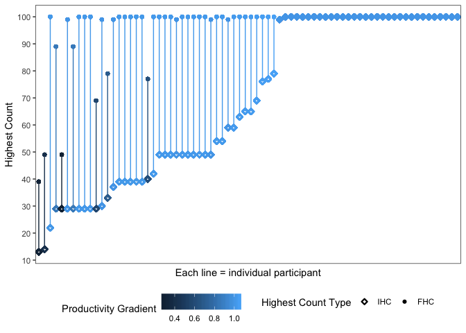<!-- -->

``` r
ggplot(ms, aes(x = reorder(LadlabID, hc, FUN = min), y = hc)) + facet_grid(rows = vars(Productivity)) + 
    geom_line(data = hc.dev.prod[!is.na(hc.dev.prod$hc), ]) + geom_point(aes(shape = `Highest Count Coding`, 
    colour = `Highest Count Coding`), size = 2, stroke = 1.5) + scale_color_brewer(palette = "Dark2") + 
    scale_shape_manual(values = c(4, 5, 20)) + ylim(0, 100) + labs(x = "Each line = individual participant", 
    y = "Highest Count") + theme_bw(base_size = 13) + theme(legend.position = "bottom", 
    axis.text.x = element_text(angle = 270, hjust = 1)) + theme(axis.text.x = element_blank(), 
    axis.ticks.x = element_blank())
```

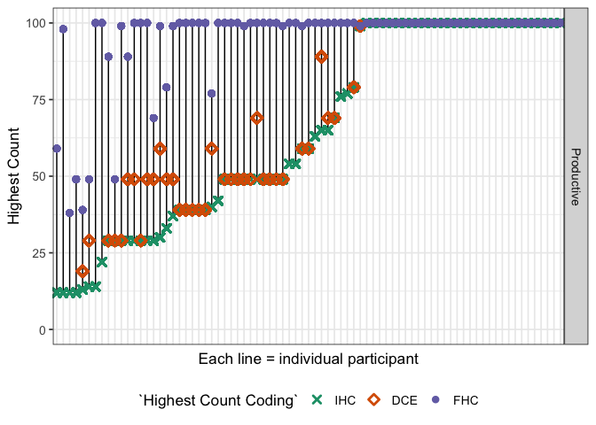<!-- -->

``` r
ggsave("graphs/distance-prod-sorted.png")
```

    ## Saving 7 x 5 in image

``` r
# nonproductive
ggplot(hc.dev.nonprod, aes(x = reorder(LadlabID, hc, FUN = min), y = hc)) + facet_grid(rows = vars(Productivity)) + 
    geom_line(data = hc.dev.nonprod[!is.na(hc.dev.nonprod$hc), ]) + geom_point(aes(shape = `Highest Count Coding`, 
    colour = `Highest Count Coding`), size = 2, stroke = 1.5) + scale_color_brewer(palette = "Dark2") + 
    scale_shape_manual(values = c(4, 5, 20)) + ylim(0, 100) + labs(x = "Each line = individual participant", 
    y = "Highest Count") + theme_bw(base_size = 13) + theme(legend.position = "bottom", 
    axis.text.x = element_text(angle = 270, hjust = 1)) + theme(axis.text.x = element_blank(), 
    axis.ticks.x = element_blank())
```

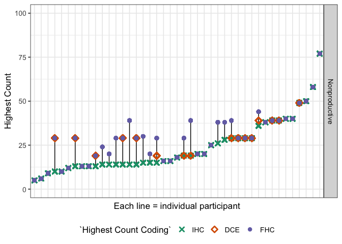<!-- -->

``` r
ggsave("graphs/distance-nonprod-sorted.png")
```

    ## Saving 7 x 5 in image

\#\#Visualizing the regressions

``` r
# Successor knowledge
fullmodel.sf.prod <- glm(SuccessorKnower ~ Productivity + Highest_Contig_NN.c + IHC.c + 
    Age.c, family = "binomial", data = distinct_model.df)
summary(fullmodel.sf.prod)
```

    ## 
    ## Call:
    ## glm(formula = SuccessorKnower ~ Productivity + Highest_Contig_NN.c + 
    ##     IHC.c + Age.c, family = "binomial", data = distinct_model.df)
    ## 
    ## Deviance Residuals: 
    ##     Min       1Q   Median       3Q      Max  
    ## -1.6865  -1.0290  -0.7573   1.1313   1.6882  
    ## 
    ## Coefficients:
    ##                        Estimate Std. Error z value Pr(>|z|)  
    ## (Intercept)             -0.8866     0.3998  -2.217   0.0266 *
    ## ProductivityProductive   0.8750     0.5212   1.679   0.0932 .
    ## Highest_Contig_NN.c      0.4378     0.2929   1.495   0.1350  
    ## IHC.c                   -0.4561     0.3295  -1.384   0.1663  
    ## Age.c                    0.2094     0.2330   0.899   0.3688  
    ## ---
    ## Signif. codes:  0 '***' 0.001 '**' 0.01 '*' 0.05 '.' 0.1 ' ' 1
    ## 
    ## (Dispersion parameter for binomial family taken to be 1)
    ## 
    ##     Null deviance: 166.46  on 121  degrees of freedom
    ## Residual deviance: 157.34  on 117  degrees of freedom
    ## AIC: 167.34
    ## 
    ## Number of Fisher Scoring iterations: 4

``` r
fullmodel.sf.gain <- glm(SuccessorKnower ~ prod.gradient + Highest_Contig_NN.c + 
    IHC.c + Age.c, family = "binomial", data = distinct_model.df)
summary(fullmodel.sf.gain)
```

    ## 
    ## Call:
    ## glm(formula = SuccessorKnower ~ prod.gradient + Highest_Contig_NN.c + 
    ##     IHC.c + Age.c, family = "binomial", data = distinct_model.df)
    ## 
    ## Deviance Residuals: 
    ##    Min      1Q  Median      3Q     Max  
    ## -1.682  -1.014  -0.812   1.207   1.643  
    ## 
    ## Coefficients:
    ##                     Estimate Std. Error z value Pr(>|z|)
    ## (Intercept)          -0.6795     0.4387  -1.549    0.121
    ## prod.gradient         0.5879     0.6201   0.948    0.343
    ## Highest_Contig_NN.c   0.4636     0.2927   1.584    0.113
    ## IHC.c                -0.4306     0.3422  -1.258    0.208
    ## Age.c                 0.2473     0.2376   1.041    0.298
    ## 
    ## (Dispersion parameter for binomial family taken to be 1)
    ## 
    ##     Null deviance: 166.46  on 121  degrees of freedom
    ## Residual deviance: 159.32  on 117  degrees of freedom
    ## AIC: 169.32
    ## 
    ## Number of Fisher Scoring iterations: 4

``` r
# Endless knowledge
fullmodel.end.prod <- glm(EndlessKnower ~ Productivity + Highest_Contig_NN.c + IHC.c + 
    Age.c, family = "binomial", data = distinct_model.df)
summary(fullmodel.end.prod)
```

    ## 
    ## Call:
    ## glm(formula = EndlessKnower ~ Productivity + Highest_Contig_NN.c + 
    ##     IHC.c + Age.c, family = "binomial", data = distinct_model.df)
    ## 
    ## Deviance Residuals: 
    ##     Min       1Q   Median       3Q      Max  
    ## -1.4198  -0.8387  -0.4635   0.9921   2.3030  
    ## 
    ## Coefficients:
    ##                        Estimate Std. Error z value Pr(>|z|)   
    ## (Intercept)             -1.6942     0.5647  -3.000   0.0027 **
    ## ProductivityProductive   0.8017     0.6894   1.163   0.2448   
    ## Highest_Contig_NN.c      0.1483     0.2966   0.500   0.6171   
    ## IHC.c                    0.4109     0.3451   1.191   0.2338   
    ## Age.c                    0.3203     0.2604   1.230   0.2187   
    ## ---
    ## Signif. codes:  0 '***' 0.001 '**' 0.01 '*' 0.05 '.' 0.1 ' ' 1
    ## 
    ## (Dispersion parameter for binomial family taken to be 1)
    ## 
    ##     Null deviance: 144.38  on 121  degrees of freedom
    ## Residual deviance: 123.87  on 117  degrees of freedom
    ## AIC: 133.87
    ## 
    ## Number of Fisher Scoring iterations: 5

``` r
fullmodel.end.gain <- glm(EndlessKnower ~ prod.gradient + Highest_Contig_NN.c + IHC.c + 
    Age.c, family = "binomial", data = distinct_model.df)
summary(fullmodel.end.gain)
```

    ## 
    ## Call:
    ## glm(formula = EndlessKnower ~ prod.gradient + Highest_Contig_NN.c + 
    ##     IHC.c + Age.c, family = "binomial", data = distinct_model.df)
    ## 
    ## Deviance Residuals: 
    ##     Min       1Q   Median       3Q      Max  
    ## -1.3747  -0.9027  -0.4164   1.0235   2.3396  
    ## 
    ## Coefficients:
    ##                     Estimate Std. Error z value Pr(>|z|)   
    ## (Intercept)          -2.0796     0.6486  -3.206  0.00134 **
    ## prod.gradient         1.3800     0.8220   1.679  0.09318 . 
    ## Highest_Contig_NN.c   0.1513     0.2951   0.512  0.60831   
    ## IHC.c                 0.2877     0.3591   0.801  0.42311   
    ## Age.c                 0.2516     0.2674   0.941  0.34671   
    ## ---
    ## Signif. codes:  0 '***' 0.001 '**' 0.01 '*' 0.05 '.' 0.1 ' ' 1
    ## 
    ## (Dispersion parameter for binomial family taken to be 1)
    ## 
    ##     Null deviance: 144.38  on 121  degrees of freedom
    ## Residual deviance: 122.21  on 117  degrees of freedom
    ## AIC: 132.21
    ## 
    ## Number of Fisher Scoring iterations: 5
